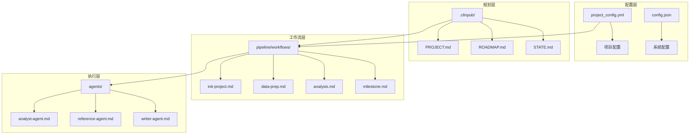
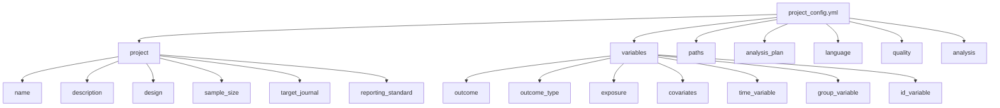
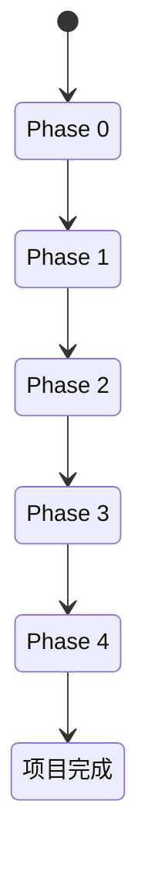
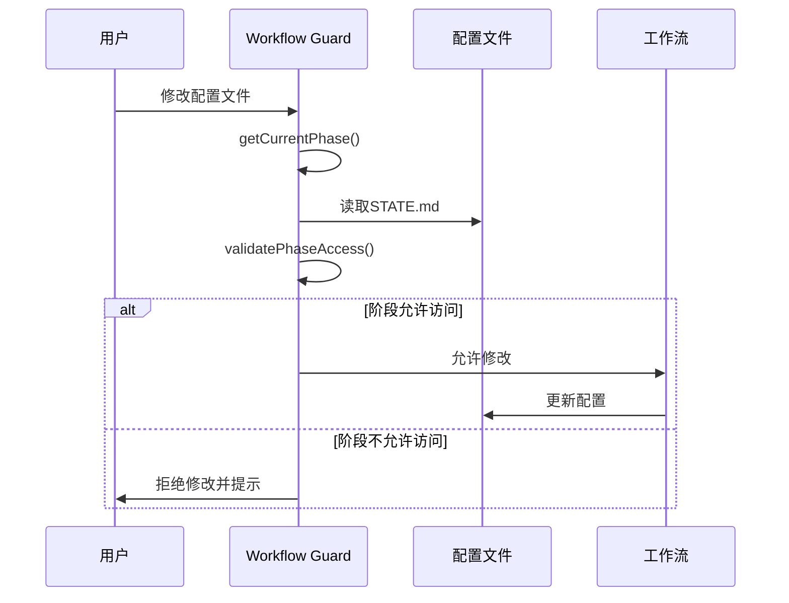
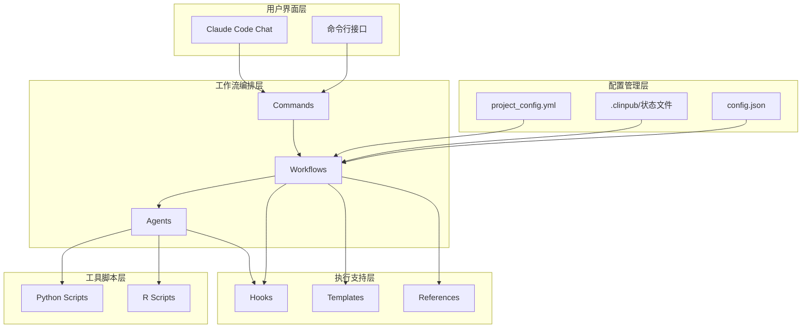
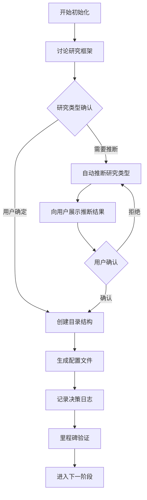
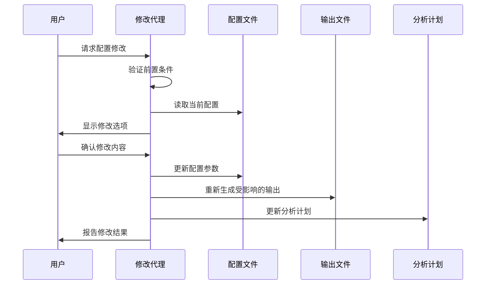
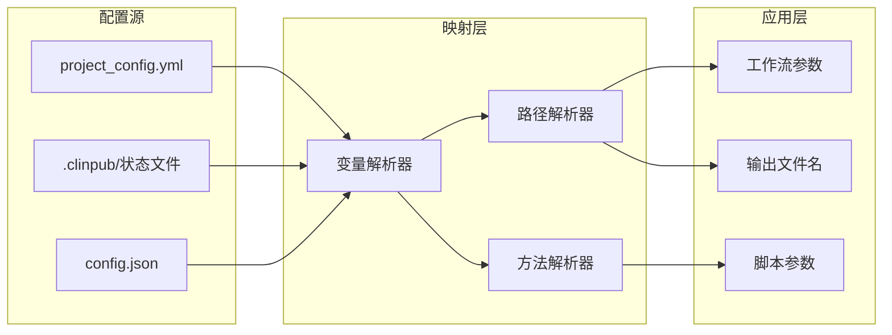
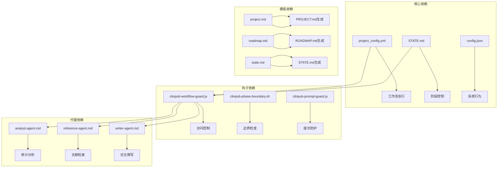

# 配置管理系统

<cite>
**本文档引用的文件**
- [project_config.example.yml](file://examples/project_config.example.yml)
- [project_config.yml](file://pipeline/templates/project_config.yml)
- [CONFIGURATION.md](file://docs/CONFIGURATION.md)
- [ROADMAP.md](file://.clinpub/ROADMAP.md)
- [STATE.md](file://.clinpub/STATE.md)
- [config.json](file://.clinpub/config.json)
- [init-project.md](file://commands/clinpub/init-project.md)
- [init-project.md](file://pipeline/workflows/init-project.md)
- [milestone.md](file://pipeline/workflows/milestone.md)
- [project.md](file://pipeline/templates/project.md)
- [roadmap.md](file://pipeline/templates/roadmap.md)
- [state.md](file://pipeline/templates/state.md)
- [clinpub-workflow-guard.js](file://hooks/clinpub-workflow-guard.js)
- [modify-agent.md](file://docs/superpowers/plans/2026-06-02-modify-agent.md)
</cite>

## 目录
1. [简介](#简介)
2. [项目结构](#项目结构)
3. [核心组件](#核心组件)
4. [架构概览](#架构概览)
5. [详细组件分析](#详细组件分析)
6. [依赖关系分析](#依赖关系分析)
7. [性能考虑](#性能考虑)
8. [故障排除指南](#故障排除指南)
9. [结论](#结论)

## 简介

clinpub配置管理系统是一个基于Markdown和YAML的科学管道配置框架，专为临床研究项目设计。该系统通过结构化的配置文件和工作流管理，实现了从项目初始化到论文发表的完整生命周期管理。

系统的核心特点包括：
- **多层配置管理**：通过project_config.yml、.clinpub/状态文件和工作流配置实现分层控制
- **动态状态跟踪**：实时跟踪项目进度、阶段状态和变更历史
- **严格的访问控制**：通过Hooks机制确保工作流的有序执行
- **灵活的配置模板**：支持多种研究类型的标准配置模板

## 项目结构

clinpub采用清晰的分层架构，将配置管理、工作流执行和状态跟踪分离：

**图表来源**
- [STRUCTURE.md:5-285](file://.clinpub/codebase/STRUCTURE.md#L5-L285)
- [CONFIGURATION.md:187-211](file://docs/CONFIGURATION.md#L187-L211)

**章节来源**
- [STRUCTURE.md:5-285](file://.clinpub/codebase/STRUCTURE.md#L5-L285)
- [CONFIGURATION.md:187-211](file://docs/CONFIGURATION.md#L187-L211)

## 核心组件

### 项目配置系统

项目配置系统是整个clinpub管道的核心，通过project_config.yml文件定义研究参数和变量映射。

#### 配置文件结构

项目配置文件采用分层结构，包含以下主要部分：

**图表来源**
- [project_config.yml:6-78](file://pipeline/templates/project_config.yml#L6-L78)
- [project_config.example.yml:8-68](file://examples/project_config.example.yml#L8-L68)

#### 配置选项详解

**项目基本信息 (project)**
- `name`：项目名称，用于标识和报告
- `description`：项目详细描述，包含研究目的和假设
- `design`：研究设计类型（RCT、队列研究、病例对照等）
- `sample_size`：预期样本量
- `target_journal`：目标期刊
- `reporting_standard`：报告标准（CONSORT、STROBE、PRISMA）

**变量定义 (variables)**
- `outcome`：主要结局变量
- `outcome_type`：结局变量类型（binary、continuous、survival）
- `exposure`：暴露/预测变量数组
- `covariates`：协变量列表
- `time_variable`：生存分析的时间变量
- `event_variable`：生存分析的事件变量
- `group_variable`：分组变量
- `id_variable`：患者标识符

**路径配置 (paths)**
- `raw_data`：原始数据目录
- `preprocessed`：预处理数据目录
- `methods`：分析方法目录
- `outputs`：输出结果目录
- `reference`：文献引用目录
- `manuscript`：论文草稿目录
- `progress`：进度报告目录
- `global`：全局共享资源目录

**分析配置 (analysis)**
- `missing_threshold_low`：低缺失率阈值
- `missing_threshold_mid`：中缺失率阈值
- `missing_threshold_high`：高缺失率阈值
- `significance_level`：显著性水平
- `multiple_comparison`：多重比较校正方法

**章节来源**
- [project_config.yml:6-78](file://pipeline/templates/project_config.yml#L6-L78)
- [project_config.example.yml:8-68](file://examples/project_config.example.yml#L8-L68)

### 状态管理系统

状态管理系统通过多个文件实现项目的完整跟踪：

**图表来源**
- [ROADMAP.md:112-119](file://.clinpub/ROADMAP.md#L112-L119)

**章节来源**
- [STATE.md:1-63](file://.clinpub/STATE.md#L1-L63)
- [ROADMAP.md:1-123](file://.clinpub/ROADMAP.md#L1-L123)

### 工作流控制系统

工作流控制系统通过Hooks机制确保配置变更的安全性和一致性：

**图表来源**
- [clinpub-workflow-guard.js:84-133](file://hooks/clinpub-workflow-guard.js#L84-L133)

**章节来源**
- [clinpub-workflow-guard.js:45-77](file://hooks/clinpub-workflow-guard.js#L45-L77)

## 架构概览

clinpub采用分层架构设计，确保配置管理的模块化和可维护性：

**图表来源**
- [ARCHITECTURE.md:6-54](file://.clinpub/codebase/ARCHITECTURE.md#L6-L54)

**章节来源**
- [ARCHITECTURE.md:6-54](file://.clinpub/codebase/ARCHITECTURE.md#L6-L54)

## 详细组件分析

### 项目初始化流程

项目初始化是整个配置管理流程的起点，通过交互式对话确定研究框架和配置参数：

**图表来源**
- [init-project.md:20-37](file://pipeline/workflows/init-project.md#L20-L37)

**章节来源**
- [init-project.md:18-97](file://pipeline/workflows/init-project.md#L18-L97)

### 配置模板系统

配置模板系统提供了标准化的配置结构，支持不同研究类型的快速配置：

#### 研究类型模板

系统支持五种主要研究类型，每种都有对应的配置模板：

| 研究类型 | 模板文件 | 特殊配置 |
|---------|----------|----------|
| 随机对照试验 (RCT) | `study_types/rct.md` | CONSORT清单、随机化方法 |
| 队列研究 | `study_types/cohort.md` | 随访时间、截尾变量 |
| 病例对照研究 | `study_types/case_control.md` | 匹配变量、匹配比例 |
| 横断面研究 | `study_types/cross_sectional.md` | 抽样方法 |
| 描述性研究 | `study_types/descriptive.md` | 无特殊配置 |

**章节来源**
- [project_config.yml:1-97](file://pipeline/templates/project_config.yml#L1-L97)

### 动态配置更新机制

动态配置更新机制允许在项目执行过程中安全地修改配置参数：

**图表来源**
- [modify-agent.md:107-141](file://docs/superpowers/plans/2026-06-02-modify-agent.md#L107-L141)

**章节来源**
- [modify-agent.md:41-204](file://docs/superpowers/plans/2026-06-02-modify-agent.md#L41-L204)

### 变量映射和继承机制

变量映射系统确保配置参数在整个工作流中的正确传递和应用：

**图表来源**
- [CONFIGURATION.md:187-211](file://docs/CONFIGURATION.md#L187-L211)

**章节来源**
- [CONFIGURATION.md:187-211](file://docs/CONFIGURATION.md#L187-L211)

## 依赖关系分析

配置管理系统中的组件依赖关系如下：

**图表来源**
- [STRUCTURE.md:5-285](file://.clinpub/codebase/STRUCTURE.md#L5-L285)

**章节来源**
- [STRUCTURE.md:5-285](file://.clinpub/codebase/STRUCTURE.md#L5-L285)

## 性能考虑

配置管理系统在设计时充分考虑了性能优化：

### 配置加载优化
- **延迟加载**：仅在需要时加载配置文件
- **缓存机制**：对频繁访问的配置进行内存缓存
- **增量更新**：只更新变更的配置部分

### 工作流执行优化
- **并行处理**：支持多个独立分析的并行执行
- **资源管理**：合理分配CPU和内存资源
- **输出复用**：避免重复计算相同的结果

### 状态跟踪优化
- **增量更新**：只记录状态变更而非完整快照
- **压缩存储**：对历史记录进行压缩存储
- **异步更新**：状态更新不影响主要工作流执行

## 故障排除指南

### 常见配置问题

**问题1：配置文件格式错误**
- 症状：工作流启动失败，报错提示YAML格式错误
- 解决方案：使用在线YAML验证器检查配置文件格式
- 预防措施：定期备份配置文件，使用模板生成配置

**问题2：变量映射不匹配**
- 症状：分析结果与预期不符，变量类型错误
- 解决方案：检查变量定义与数据实际结构的一致性
- 预防措施：在数据预处理阶段验证变量映射

**问题3：路径配置错误**
- 症状：文件找不到，工作流中断
- 解决方案：检查路径配置是否与实际目录结构一致
- 预防措施：使用相对路径而非绝对路径

### 状态管理问题

**问题4：阶段状态不一致**
- 症状：STATE.md显示的阶段与实际不符
- 解决方案：重新生成STATE.md或手动修正状态
- 预防措施：定期备份状态文件

**问题5：工作流访问控制失效**
- 症状：可以访问未来阶段的文件
- 解决方案：检查Hooks配置和权限设置
- 预防措施：定期验证Hooks的有效性

**章节来源**
- [clinpub-workflow-guard.js:203-219](file://hooks/clinpub-workflow-guard.js#L203-L219)

## 结论

clinpub配置管理系统通过其精心设计的架构和完善的配置管理机制，为临床研究项目提供了强大的支持。系统的主要优势包括：

1. **模块化设计**：清晰的分层架构确保了系统的可维护性和扩展性
2. **严格控制**：通过Hooks机制和状态管理确保工作流的有序执行
3. **灵活性**：支持多种研究类型和自定义配置选项
4. **安全性**：完善的访问控制和错误处理机制保障了数据安全

未来的发展方向包括：
- 增强配置验证和错误处理能力
- 扩展对更多研究类型的支持
- 优化性能和资源利用率
- 提供更丰富的可视化和报告功能

该系统为临床研究的标准化和自动化提供了坚实的基础，有助于提高研究质量和效率。