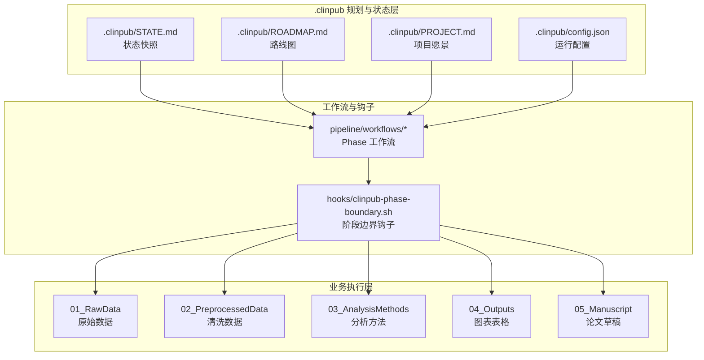
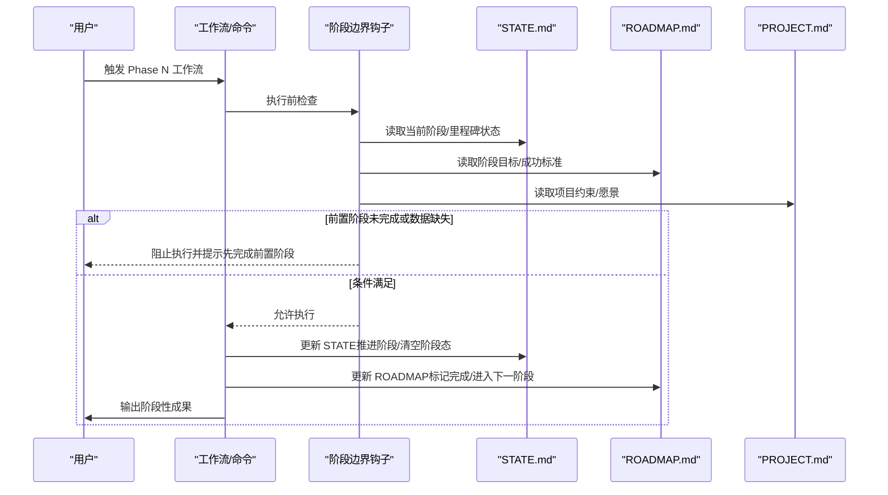
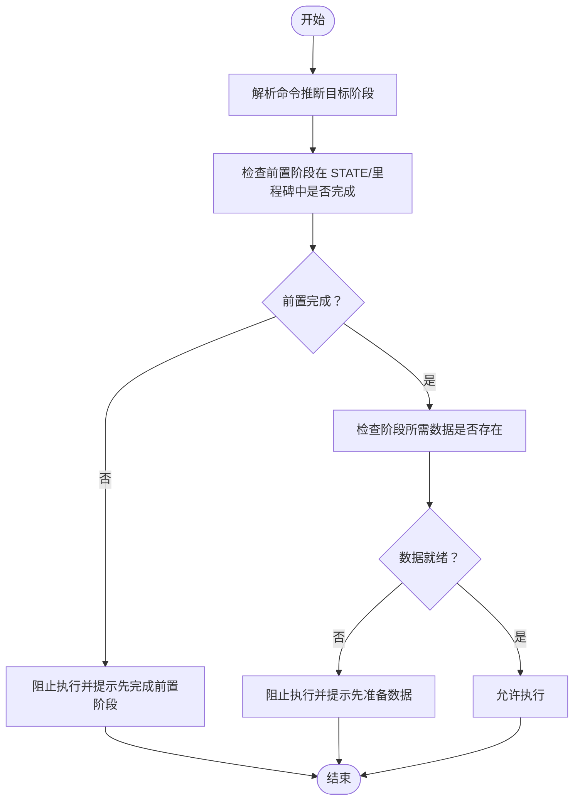
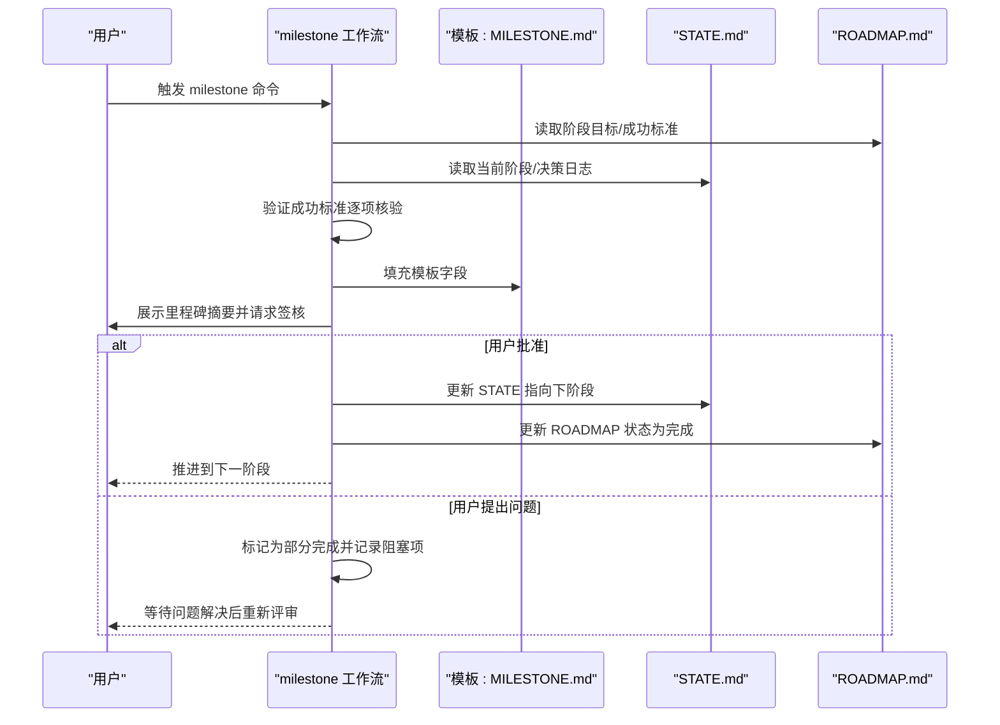
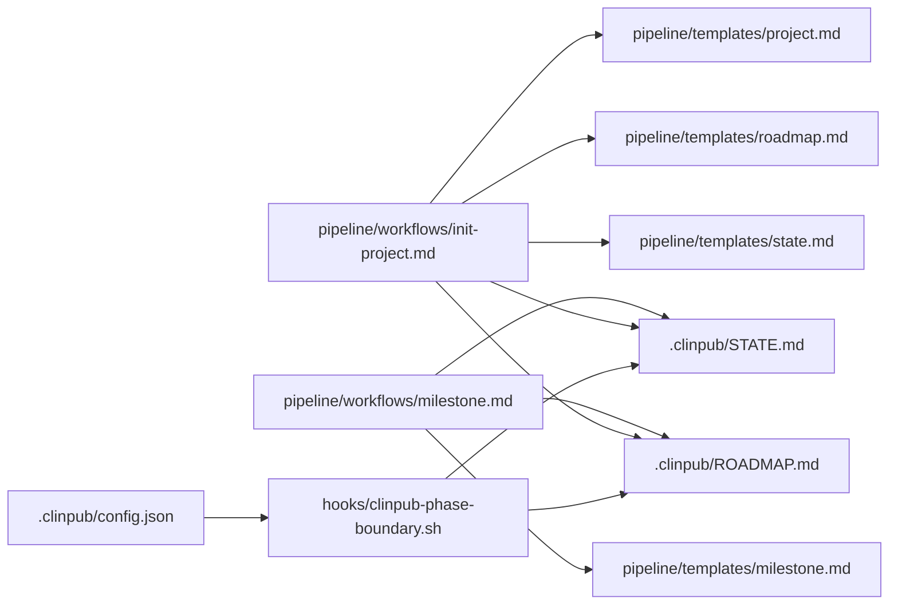

# 项目状态管理

<cite>
**本文引用的文件**
- [.clinpub/STATE.md](file://.clinpub/STATE.md)
- [.clinpub/ROADMAP.md](file://.clinpub/ROADMAP.md)
- [.clinpub/config.json](file://.clinpub/config.json)
- [pipeline/templates/state.md](file://pipeline/templates/state.md)
- [pipeline/templates/roadmap.md](file://pipeline/templates/roadmap.md)
- [hooks/clinpub-phase-boundary.sh](file://hooks/clinpub-phase-boundary.sh)
- [commands/clinpub/init-project.md](file://commands/clinpub/init-project.md)
- [commands/clinpub/milestone.md](file://commands/clinpub/milestone.md)
- [pipeline/workflows/init-project.md](file://pipeline/workflows/init-project.md)
- [pipeline/workflows/milestone.md](file://pipeline/workflows/milestone.md)
- [pipeline/references/checkpoints.md](file://pipeline/references/checkpoints.md)
- [pipeline/templates/milestone.md](file://pipeline/templates/milestone.md)
- [pipeline/templates/project.md](file://pipeline/templates/project.md)
- [pipeline/templates/project_config.yml](file://pipeline/templates/project_config.yml)
</cite>

## 目录
1. [简介](#简介)
2. [项目结构](#项目结构)
3. [核心组件](#核心组件)
4. [架构总览](#架构总览)
5. [详细组件分析](#详细组件分析)
6. [依赖关系分析](#依赖关系分析)
7. [性能考量](#性能考量)
8. [故障排查指南](#故障排查指南)
9. [结论](#结论)
10. [附录](#附录)

## 简介
本文件系统性阐述 clinpub 项目状态管理系统，重点围绕三个核心状态文件：.clinpub/STATE.md（状态快照）、.clinpub/ROADMAP.md（路线图）、以及 .clinpub/PROJECT.md（项目愿景）。文档覆盖项目生命周期中的状态转换规则、阶段边界检查、进度跟踪方法，并给出状态文件的自动生成机制、手动更新流程与冲突解决策略；同时提供状态同步、备份恢复与版本控制的最佳实践。

## 项目结构
clinpub 将“计划与状态”置于 .clinpub 层，形成与业务目录（01_RawData、02_PreprocessedData、03_AnalysisMethods、04_Outputs、05_Manuscript 等）解耦的治理层。STATE.md 与 ROADMAP.md 作为跨阶段的权威状态源，贯穿 Phase 0 至 Phase n 的推进过程；PROJECT.md 记录项目愿景与约束，为状态判断提供上下文依据。

**图示来源**
- [.clinpub/STATE.md:1-63](file://.clinpub/STATE.md#L1-L63)
- [.clinpub/ROADMAP.md:1-123](file://.clinpub/ROADMAP.md#L1-L123)
- [.clinpub/config.json:1-15](file://.clinpub/config.json#L1-L15)
- [hooks/clinpub-phase-boundary.sh:1-153](file://hooks/clinpub-phase-boundary.sh#L1-L153)
- [pipeline/workflows/init-project.md:1-124](file://pipeline/workflows/init-project.md#L1-L124)
- [pipeline/workflows/milestone.md:1-163](file://pipeline/workflows/milestone.md#L1-L163)

**章节来源**
- [.clinpub/STATE.md:1-63](file://.clinpub/STATE.md#L1-L63)
- [.clinpub/ROADMAP.md:1-123](file://.clinpub/ROADMAP.md#L1-L123)
- [.clinpub/config.json:1-15](file://.clinpub/config.json#L1-L15)
- [hooks/clinpub-phase-boundary.sh:1-153](file://hooks/clinpub-phase-boundary.sh#L1-L153)
- [pipeline/workflows/init-project.md:1-124](file://pipeline/workflows/init-project.md#L1-L124)
- [pipeline/workflows/milestone.md:1-163](file://pipeline/workflows/milestone.md#L1-L163)

## 核心组件
- STATE.md：项目当前阶段、里程碑、进度百分比、已完成/计划的 Phase/Plan 概览与变更记录，是“当前所处位置”的权威快照。
- ROADMAP.md：阶段目标、成功标准、计划列表与映射校验，提供阶段推进的“路线图”与“验收清单”。
- PROJECT.md：项目愿景、研究类型、核心变量、需求与约束，为状态判断提供上下文与边界条件。
- hooks/clinpub-phase-boundary.sh：在执行分析类工具前强制检查前置阶段是否完成、数据是否就绪，防止越界执行。
- commands/clinpub/milestone.md 与 pipeline/workflows/milestone.md：阶段关卡评审的自动化流程，负责生成 MILESTONE.md、更新 ROADMAP 与 STATE，并获得用户签核。
- pipeline/templates/*：STATE/ROADMAP/PROJECT/MILESTONE 的模板，驱动初始化与里程碑生成时的结构化产出。

**章节来源**
- [.clinpub/STATE.md:1-63](file://.clinpub/STATE.md#L1-L63)
- [.clinpub/ROADMAP.md:1-123](file://.clinpub/ROADMAP.md#L1-L123)
- [hooks/clinpub-phase-boundary.sh:1-153](file://hooks/clinpub-phase-boundary.sh#L1-L153)
- [commands/clinpub/milestone.md:1-39](file://commands/clinpub/milestone.md#L1-L39)
- [pipeline/workflows/milestone.md:1-163](file://pipeline/workflows/milestone.md#L1-L163)
- [pipeline/templates/state.md:1-19](file://pipeline/templates/state.md#L1-L19)
- [pipeline/templates/roadmap.md:1-19](file://pipeline/templates/roadmap.md#L1-L19)
- [pipeline/templates/project.md:1-30](file://pipeline/templates/project.md#L1-L30)
- [pipeline/templates/milestone.md:1-46](file://pipeline/templates/milestone.md#L1-L46)

## 架构总览
状态管理系统通过“模板生成 + 钩子校验 + 工作流评审”的闭环，确保阶段推进的确定性与可审计性。初始化阶段生成 PROJECT/ROADMAP/STATE；每个 Phase 结束后触发里程碑评审，生成 MILESTONE.md 并更新 ROADMAP 与 STATE；执行前钩子根据 STATE/ROADMAP/里程碑文件校验前置条件。

**图示来源**
- [hooks/clinpub-phase-boundary.sh:34-71](file://hooks/clinpub-phase-boundary.sh#L34-L71)
- [pipeline/workflows/milestone.md:112-126](file://pipeline/workflows/milestone.md#L112-L126)
- [.clinpub/STATE.md:1-63](file://.clinpub/STATE.md#L1-L63)
- [.clinpub/ROADMAP.md:1-123](file://.clinpub/ROADMAP.md#L1-L123)
- [pipeline/templates/project.md:1-30](file://pipeline/templates/project.md#L1-L30)

## 详细组件分析

### STATE.md：状态快照与进度跟踪
- 结构要点
  - 版本字段：用于状态文件演进与兼容性管理
  - 里程碑信息：当前里程碑、名称、状态与最后更新时间
  - 进度指标：总 Phase/Plan 数、已完成数量与百分比
  - 文档正文：当前阶段状态、已完成内容摘要、变更记录、下一步建议
- 作用机制
  - 作为阶段边界钩子与工作流的权威输入，决定是否允许进入下一阶段
  - 作为里程碑评审后的输出，反映阶段完成情况与进度
  - 作为项目总结与回顾的进度依据
- 维护要点
  - 自动生成：初始化与里程碑评审后自动更新
  - 手动更新：在里程碑评审未触发或外部变更时，需人工同步
  - 冲突解决：若 STATE 与 ROADMAP/里程碑不一致，以里程碑评审为准，随后回写 STATE

**章节来源**
- [.clinpub/STATE.md:1-63](file://.clinpub/STATE.md#L1-L63)
- [pipeline/workflows/milestone.md:142-151](file://pipeline/workflows/milestone.md#L142-L151)
- [hooks/clinpub-phase-boundary.sh:43-51](file://hooks/clinpub-phase-boundary.sh#L43-L51)

### ROADMAP.md：阶段目标与成功标准
- 结构要点
  - 阶段概览：序号、名称、目标、成功标准、工作量
  - 详细说明：每个 Phase 的目标、需求、成功标准与计划清单
  - 映射校验：需求到 Phase 的映射统计，确保覆盖完整性
  - 流程图：阶段间的线性依赖关系
- 作用机制
  - 作为阶段推进的“路线图”，指导各阶段目标与交付
  - 作为里程碑评审的“验收清单”，逐条核验完成度
  - 作为状态文件更新的输入，驱动 STATE 的阶段推进
- 维护要点
  - 初始化：基于模板生成，后续由里程碑评审更新状态
  - 变更：需求变更或阶段合并/拆分时，需同步更新映射与流程图
  - 对齐：与 STATE/里程碑保持一致，避免“文字完成但未推进”的假象

**章节来源**
- [.clinpub/ROADMAP.md:1-123](file://.clinpub/ROADMAP.md#L1-L123)
- [pipeline/workflows/milestone.md:112-126](file://pipeline/workflows/milestone.md#L112-L126)
- [pipeline/templates/roadmap.md:1-19](file://pipeline/templates/roadmap.md#L1-L19)

### PROJECT.md：项目愿景与约束
- 结构要点
  - 愿景与研究类型
  - 核心变量定义
  - 需求与约束（语言、统计主语言、目标期刊等）
  - 决策记录
- 作用机制
  - 为 STATE/ROADMAP 提供上下文边界，确保阶段目标与项目目标一致
  - 为里程碑评审提供“是否偏离目标”的判断依据
- 维护要点
  - 初始化：由初始化工作流生成
  - 变更：需求或变量定义变更时，需在里程碑评审中记录并同步

**章节来源**
- [pipeline/workflows/init-project.md:39-87](file://pipeline/workflows/init-project.md#L39-L87)
- [pipeline/templates/project.md:1-30](file://pipeline/templates/project.md#L1-L30)
- [pipeline/templates/project_config.yml:1-97](file://pipeline/templates/project_config.yml#L1-L97)

### 阶段边界检查：hooks/clinpub-phase-boundary.sh
- 核心逻辑
  - 解析命令，推断目标阶段
  - 检查前置阶段是否在 STATE/里程碑中被标记为完成
  - 检查阶段所需数据是否存在（原始数据、清洗数据、分析输出、论文草稿）
  - 若前置未完成或数据缺失，阻止执行并返回原因
- 与工作流的集成
  - 在 Phase 执行前调用，保证“先完成再进入”的顺序
  - 与里程碑评审配合，确保“完成即推进”的确定性

**图示来源**
- [hooks/clinpub-phase-boundary.sh:106-150](file://hooks/clinpub-phase-boundary.sh#L106-L150)

**章节来源**
- [hooks/clinpub-phase-boundary.sh:34-104](file://hooks/clinpub-phase-boundary.sh#L34-L104)
- [hooks/clinpub-phase-boundary.sh:120-128](file://hooks/clinpub-phase-boundary.sh#L120-L128)

### 里程碑评审：commands/clinpub/milestone.md 与 pipeline/workflows/milestone.md
- 流程要点
  - 加载当前阶段与项目上下文（ROADMAP/STATE/PROJECT）
  - 逐条验证成功标准（不同 Phase 的核查清单）
  - 汇总关键决策与产出文件
  - 生成 MILESTONE.md，更新 ROADMAP 状态为“完成/部分完成”
  - 等待用户签核；签核通过后更新 STATE 指向下阶段
- 与钩子的关系
  - 钩子保障“先完成再进入”，里程碑保障“完成即推进”
  - 两者共同确保阶段推进的确定性与可审计性

**图示来源**
- [commands/clinpub/milestone.md:1-39](file://commands/clinpub/milestone.md#L1-L39)
- [pipeline/workflows/milestone.md:17-152](file://pipeline/workflows/milestone.md#L17-L152)
- [pipeline/templates/milestone.md:1-46](file://pipeline/templates/milestone.md#L1-L46)

**章节来源**
- [commands/clinpub/milestone.md:1-39](file://commands/clinpub/milestone.md#L1-L39)
- [pipeline/workflows/milestone.md:1-163](file://pipeline/workflows/milestone.md#L1-L163)
- [pipeline/references/checkpoints.md:1-120](file://pipeline/references/checkpoints.md#L1-L120)

### 初始化与状态生成：commands/clinpub/init-project.md 与 pipeline/workflows/init-project.md
- 流程要点
  - 与用户讨论研究框架，生成 project_config.yml
  - 创建 .clinpub 层及 PROJECT/ROADMAP/STATE 的初始内容
  - 仅创建用户确认的分析方法目录，避免过早生成
  - 在里程碑评审后正式进入 Phase 1
- 与模板的关系
  - 使用 pipeline/templates/project.md、pipeline/templates/roadmap.md、pipeline/templates/state.md 作为生成模板

**章节来源**
- [commands/clinpub/init-project.md:1-34](file://commands/clinpub/init-project.md#L1-L34)
- [pipeline/workflows/init-project.md:1-124](file://pipeline/workflows/init-project.md#L1-L124)
- [pipeline/templates/project.md:1-30](file://pipeline/templates/project.md#L1-L30)
- [pipeline/templates/roadmap.md:1-19](file://pipeline/templates/roadmap.md#L1-L19)
- [pipeline/templates/state.md:1-19](file://pipeline/templates/state.md#L1-L19)

## 依赖关系分析
- 钩子对状态文件的依赖
  - 阶段边界钩子依赖 STATE/ROADMAP/里程碑文件判断前置条件
- 工作流对模板与状态文件的依赖
  - 初始化工作流依赖 PROJECT/ROADMAP/STATE 模板生成初始状态
  - 里程碑工作流依赖 MILESTONE 模板生成里程碑记录，并更新 ROADMAP/STATE
- 配置对行为的影响
  - .clinpub/config.json 控制自动推进、验证器开关、提交策略等，间接影响状态推进节奏

**图示来源**
- [.clinpub/config.json:1-15](file://.clinpub/config.json#L1-L15)
- [hooks/clinpub-phase-boundary.sh:1-153](file://hooks/clinpub-phase-boundary.sh#L1-L153)
- [pipeline/workflows/init-project.md:10-16](file://pipeline/workflows/init-project.md#L10-L16)
- [pipeline/workflows/milestone.md:10-13](file://pipeline/workflows/milestone.md#L10-L13)
- [pipeline/templates/project.md:1-30](file://pipeline/templates/project.md#L1-L30)
- [pipeline/templates/roadmap.md:1-19](file://pipeline/templates/roadmap.md#L1-L19)
- [pipeline/templates/state.md:1-19](file://pipeline/templates/state.md#L1-L19)
- [pipeline/templates/milestone.md:1-46](file://pipeline/templates/milestone.md#L1-L46)

**章节来源**
- [.clinpub/config.json:1-15](file://.clinpub/config.json#L1-L15)
- [hooks/clinpub-phase-boundary.sh:1-153](file://hooks/clinpub-phase-boundary.sh#L1-L153)
- [pipeline/workflows/init-project.md:10-16](file://pipeline/workflows/init-project.md#L10-L16)
- [pipeline/workflows/milestone.md:10-13](file://pipeline/workflows/milestone.md#L10-L13)

## 性能考量
- 钩子检查开销低：仅进行文本匹配与文件存在性检查，对执行速度影响可忽略
- 状态文件体量小：STATE/ROADMAP/PROJECT 为纯文本，读写与渲染成本极低
- 自动化推进：配置项可开启自动推进与验证器，减少人工干预，提升整体效率
- 建议
  - 将状态文件与业务数据分离，避免大文件干扰状态读写
  - 在 CI 中缓存 .clinpub 层，加速钩子与工作流启动

[本节为通用建议，不直接分析具体文件]

## 故障排查指南
- 症状：执行 Phase N 命令被阻止
  - 检查 .clinpub/STATE.md 是否显示前置阶段已完成
  - 检查 .clinpub/phases/*/MILESTONE.md 是否标记完成
  - 检查对应阶段的数据目录是否存在
  - 参考钩子输出的原因提示，按提示完成前置阶段或补齐数据
- 症状：里程碑评审后 STATE 未推进
  - 确认里程碑评审是否通过签核
  - 检查里程碑生成的 MILESTONE.md 是否包含“用户签字”确认
  - 如未自动推进，手动更新 STATE 的当前阶段并提交
- 症状：ROADMAP 与 STATE 不一致
  - 以里程碑评审结果为准，回写 STATE 与 ROADMAP
  - 在里程碑评审中补充缺失的验证项与决策记录
- 症状：初始化后无法进入 Phase 1
  - 确认初始化工作流是否生成了 .clinpub/ROADMAP.md 与 .clinpub/STATE.md
  - 确认里程碑评审是否完成并更新状态

**章节来源**
- [hooks/clinpub-phase-boundary.sh:43-70](file://hooks/clinpub-phase-boundary.sh#L43-L70)
- [pipeline/workflows/milestone.md:142-151](file://pipeline/workflows/milestone.md#L142-L151)
- [pipeline/references/checkpoints.md:77-108](file://pipeline/references/checkpoints.md#L77-L108)

## 结论
clinpub 的状态管理系统通过“模板生成 + 钩子校验 + 里程碑评审”的闭环，实现了阶段推进的确定性与可审计性。STATE/ROADMAP/PROJECT 三者协同，既保证了项目目标一致性，又提供了清晰的进度跟踪与风险控制手段。遵循本文提供的维护与排错流程，可有效降低状态漂移与阶段越界的风险，提升项目交付质量与效率。

[本节为总结，不直接分析具体文件]

## 附录

### 状态文件自动生成机制
- 初始化：使用 pipeline/templates/project.md、pipeline/templates/roadmap.md、pipeline/templates/state.md 生成 .clinpub/PROJECT.md、.clinpub/ROADMAP.md、.clinpub/STATE.md
- 里程碑：使用 pipeline/templates/milestone.md 生成 .clinpub/phases/*/MILESTONE.md，并更新 .clinpub/ROADMAP.md 与 .clinpub/STATE.md
- 配置：.clinpub/config.json 控制自动推进、验证器与提交策略

**章节来源**
- [pipeline/workflows/init-project.md:39-87](file://pipeline/workflows/init-project.md#L39-L87)
- [pipeline/workflows/milestone.md:96-126](file://pipeline/workflows/milestone.md#L96-L126)
- [.clinpub/config.json:1-15](file://.clinpub/config.json#L1-L15)

### 手动更新流程
- 修改 STATE：在里程碑评审未触发或外部变更时，人工更新 .clinpub/STATE.md 的当前阶段、进度与变更记录
- 修改 ROADMAP：在需求变更或阶段合并/拆分时，更新 .clinpub/ROADMAP.md 的阶段目标、成功标准与映射校验
- 修改 PROJECT：在研究框架或变量定义变更时，更新 .clinpub/PROJECT.md 并在里程碑评审中记录

**章节来源**
- [.clinpub/STATE.md:1-63](file://.clinpub/STATE.md#L1-L63)
- [.clinpub/ROADMAP.md:1-123](file://.clinpub/ROADMAP.md#L1-L123)
- [pipeline/workflows/milestone.md:83-94](file://pipeline/workflows/milestone.md#L83-L94)

### 冲突解决策略
- 优先级：里程碑评审结果 > STATE/ROADMAP/PROJECT
- 处理流程：以里程碑评审为准，回写 STATE/ROADMAP/PROJECT，补充缺失的验证项与决策记录
- 风险控制：在里程碑评审中明确标注“部分完成”与阻塞项，直至问题解决后重新签核

**章节来源**
- [pipeline/workflows/milestone.md:147-151](file://pipeline/workflows/milestone.md#L147-L151)
- [pipeline/references/checkpoints.md:77-108](file://pipeline/references/checkpoints.md#L77-L108)

### 状态同步、备份与版本控制最佳实践
- 同步：在里程碑评审后立即提交 .clinpub/ROADMAP.md、.clinpub/STATE.md 与 .clinpub/phases/*/MILESTONE.md
- 备份：定期导出 .clinpub 层为归档包，包含 ROADMAP/STATE/PROJECT 与里程碑记录
- 版本控制：将 .clinpub 层纳入 Git 管理，使用分支隔离重大变更；为里程碑评审生成的 MILESTONE.md 添加注释说明评审背景
- 回滚：若误操作导致状态错误，可基于提交历史回滚至上一里程碑评审的提交

**章节来源**
- [pipeline/references/checkpoints.md:1-120](file://pipeline/references/checkpoints.md#L1-L120)
- [.clinpub/STATE.md:1-63](file://.clinpub/STATE.md#L1-L63)
- [.clinpub/ROADMAP.md:1-123](file://.clinpub/ROADMAP.md#L1-L123)