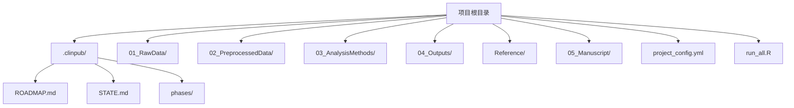
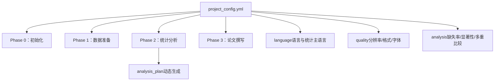
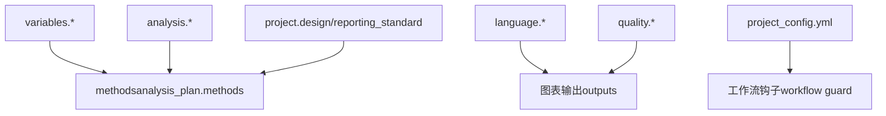

# 项目配置

<cite>
**本文引用的文件**
- [examples/project_config.example.yml](file://examples/project_config.example.yml)
- [pipeline/templates/project_config.yml](file://pipeline/templates/project_config.yml)
- [docs/CONFIGURATION.md](file://docs/CONFIGURATION.md)
- [README.md](file://README.md)
- [hooks/clinpub-workflow-guard.js](file://hooks/clinpub-workflow-guard.js)
</cite>

## 目录
1. [简介](#简介)
2. [项目结构](#项目结构)
3. [核心组件](#核心组件)
4. [架构总览](#架构总览)
5. [详细组件分析](#详细组件分析)
6. [依赖关系分析](#依赖关系分析)
7. [性能考虑](#性能考虑)
8. [故障排查指南](#故障排查指南)
9. [结论](#结论)
10. [附录](#附录)

## 简介
本文件面向 clinpub 项目的“配置系统”，聚焦于 project_config.yml 的完整结构与使用规范。内容涵盖：
- 项目基本信息（name、description、design 等）
- 变量定义（outcome、exposure、covariates、time_variable、event_variable、group_variable、id_variable 等）
- 路径配置（paths）
- 分析计划（analysis_plan）
- 语言与质量控制（language、quality）
- 分析参数（analysis）
- 不同研究类型（RCT、队列研究、病例对照、横断面、描述性）的标准配置要点与自定义指南
- 配置项之间的依赖关系与验证规则
- 与工作流钩子的协作与约束

## 项目结构
clinpub 项目以 project_config.yml 为核心配置文件，配合标准化目录结构与阶段化工作流运行。下图展示项目根目录与关键子目录的关系，以及配置文件在其中的位置。

**图表来源**
- [README.md:82-94](file://README.md#L82-L94)

**章节来源**
- [README.md:82-94](file://README.md#L82-L94)

## 核心组件
本节对 project_config.yml 的主要分区进行逐项说明，并给出取值范围、最佳实践与注意事项。

- 项目分区（project）
  - name：项目中文名称，建议简洁明确，便于识别与归档。
  - description：项目背景与目标的简要描述，用于生成报告与索引。
  - design：研究设计类型，支持“RCT”、“队列研究”、“病例对照”、“横断面”、“描述性”等；与报告标准（如 CONSORT、STROBE）相关。
  - sample_size：预估样本量，用于质量门控与资源规划。
  - target_journal：目标期刊级别（如 Q1/Q2），影响图表分辨率与引用策略。
  - reporting_standard：报告标准（如 CONSORT、STROBE、PRISMA），决定方法学遵循与模板选择。

- 变量分区（variables）
  - outcome：主要结局变量名，需与数据列一致。
  - outcome_type：结局类型，支持 binary、continuous、survival 等；直接影响分析方法选择。
  - exposure：暴露/预测变量（可为单变量或多变量），通常对应分组变量。
  - covariates：协变量列表，建议包含基线特征与潜在混杂因素。
  - time_variable：生存分析用随访时间变量（若适用）。
  - event_variable：生存分析用事件发生变量（若适用）。
  - group_variable：分组变量（如 Treatment/Sham），用于组间比较。
  - id_variable：受试者标识符，保证每行一个受试者且唯一。

- 路径分区（paths）
  - raw_data、preprocessed、methods、outputs、reference、manuscript：分别指向原始数据、预处理产物、分析方法、图表输出、参考文献与论文草稿目录。
  - progress、global：扩展路径（如进度报告、全局共享资源），按需启用。

- 分析计划（analysis_plan）
  - waves：波次集合，键为波次序号，值包含 label（波次标签）与 methods（方法清单）。
  - methods：每个方法包含 id、type、data、timepoint 等字段；type 决定分析类别（如 baseline、comparison 等）。
  - 注意：analysis_plan 由 Phase 2 的诊断→提议→确认流程动态生成，非手动填写。

- 语言与质量（language、quality）
  - language：manuscript（论文语言）、figures_tables（图表语言）、statistics（统计主语言，如 R）。
  - quality：journal_level（期刊级别）、figure_dpi（分辨率）、figure_format（格式）、figure_font（字体）、figure_font_size（字号）。

- 分析参数（analysis）
  - missing_threshold_low、missing_threshold_mid、missing_threshold_high：缺失率阈值，指导数据处理策略。
  - significance_level：显著性水平（默认 0.05）。
  - multiple_comparison：多重比较校正方法（如 fdr、bonferroni、none）。

**章节来源**
- [examples/project_config.example.yml:8-68](file://examples/project_config.example.yml#L8-L68)
- [pipeline/templates/project_config.yml:6-97](file://pipeline/templates/project_config.yml#L6-L97)
- [docs/CONFIGURATION.md:37-43](file://docs/CONFIGURATION.md#L37-L43)

## 架构总览
project_config.yml 在项目生命周期中的作用如下：
- 初始化阶段（Phase 0）：作为项目框架与目录结构的基础输入。
- 数据准备阶段（Phase 1）：驱动数据清洗与质量评估，确保变量映射正确。
- 统计分析阶段（Phase 2）：依据 analysis_plan 与 analysis 参数执行动态分析流程。
- 论文撰写阶段（Phase 3）：根据语言与质量配置生成符合目标期刊标准的图表与文本。

**图表来源**
- [docs/CONFIGURATION.md:59-78](file://docs/CONFIGURATION.md#L59-L78)
- [README.md:59-70](file://README.md#L59-L70)

## 详细组件分析

### 项目分区（project）
- 设计类型与报告标准
  - RCT：建议采用 CONSORT 报告标准，关注随机化方法与盲法实施。
  - 队列研究：建议采用 STROBE，关注随访时间与删失变量。
  - 病例对照：建议采用 STROBE，关注匹配变量与匹配比。
  - 横断面与描述性：建议采用 STROBE，关注抽样方法与代表性。
- 最佳实践
  - 明确 sample_size 与 target_journal，有助于后续质量门控与图表标准设定。
  - reporting_standard 与 design 保持一致，避免方法学模板错配。

**章节来源**
- [docs/CONFIGURATION.md:212-249](file://docs/CONFIGURATION.md#L212-L249)
- [README.md:123-129](file://README.md#L123-L129)

### 变量分区（variables）
- 变量类型与映射
  - outcome 与 outcome_type：决定分析模型与效应量估计方式。
  - exposure 与 group_variable：用于组间比较与分层分析。
  - covariates：控制混杂因素，提升因果推断稳健性。
  - time_variable 与 event_variable：生存分析必备，需与数据结构一致。
  - id_variable：确保每行一个受试者，避免重复或缺失。
- 最佳实践
  - 变量名大小写与数据一致，避免空格与特殊字符。
  - covariates 优先包含人口学与临床基线特征。
  - 生存分析必须同时提供 time_variable 与 event_variable。

**章节来源**
- [examples/project_config.example.yml:16-33](file://examples/project_config.example.yml#L16-L33)
- [pipeline/templates/project_config.yml:14-22](file://pipeline/templates/project_config.yml#L14-L22)

### 路径分区（paths）
- 路径约定
  - raw_data、preprocessed、methods、outputs、reference、manuscript：标准输出目录。
  - progress、global：扩展路径，便于跨阶段共享与追踪。
- 最佳实践
  - 路径层级清晰，避免嵌套过深。
  - 与工作流钩子限制保持一致，确保阶段间文件访问合规。

**章节来源**
- [examples/project_config.example.yml:35-41](file://examples/project_config.example.yml#L35-L41)
- [pipeline/templates/project_config.yml:24-32](file://pipeline/templates/project_config.yml#L24-L32)

### 分析计划（analysis_plan）
- 结构与生成机制
  - waves：波次集合，键为序号，值含 label 与 methods。
  - methods：包含 id、type、data、timepoint 等字段，type 决定分析类别。
  - 生成来源：Phase 2 的诊断→提议→确认流程，由 Claude 基于项目需求动态填充。
- 最佳实践
  - 波次数量灵活，依据研究复杂度与数据特征确定。
  - methods 清单应与数据文件名与分析类型匹配。

**章节来源**
- [examples/project_config.example.yml:47-48](file://examples/project_config.example.yml#L47-L48)
- [pipeline/templates/project_config.yml:41-58](file://pipeline/templates/project_config.yml#L41-L58)

### 语言与质量（language、quality）
- language
  - manuscript：论文语言（如 zh-CN）。
  - figures_tables：图表语言（如 en）。
  - statistics：统计主语言（如 R）。
- quality
  - journal_level：期刊级别（如 Q1），影响图表分辨率与格式。
  - figure_dpi：分辨率（≥300）。
  - figure_format：输出格式（png/pdf/tiff）。
  - figure_font 与 figure_font_size：字体与字号，确保可读性。
- 最佳实践
  - 与目标期刊标准一致，确保图表满足分辨率与格式要求。
  - 字体与字号统一，避免跨图表不一致。

**章节来源**
- [examples/project_config.example.yml:50-61](file://examples/project_config.example.yml#L50-L61)
- [pipeline/templates/project_config.yml:60-71](file://pipeline/templates/project_config.yml#L60-L71)
- [README.md:158-167](file://README.md#L158-L167)

### 分析参数（analysis）
- 缺失率阈值
  - low：低缺失率阈值，建议删除或简单插补。
  - mid：中缺失率阈值，建议谨慎插补或敏感性分析。
  - high：高缺失率阈值，建议讨论是否保留变量。
- 显著性水平与多重比较
  - significance_level：默认 0.05。
  - multiple_comparison：fdr（推荐）、bonferroni、none。
- 最佳实践
  - 根据变量缺失比例与研究目的调整阈值。
  - 多重比较校正结合分析类型与假设数量综合选择。

**章节来源**
- [examples/project_config.example.yml:62-67](file://examples/project_config.example.yml#L62-L67)
- [pipeline/templates/project_config.yml:72-78](file://pipeline/templates/project_config.yml#L72-L78)

### 不同研究类型的标准配置模板与自定义指南
- RCT（随机对照试验）
  - 关注随机化方法（block、stratified、adaptive）与 CONSORT 报告标准。
  - 建议在 project.design 中明确 RCT，并在 analysis_plan 中体现基线描述与组间比较。
- 队列研究
  - 关注随访时间单位与删失变量，确保 time_variable 与 event_variable 完整。
  - 建议在 analysis_plan 中加入生存分析与多变量校正。
- 病例对照研究
  - 关注匹配变量与匹配比，确保协变量覆盖年龄、性别等。
  - 建议在 analysis_plan 中包含分层分析与倾向性评分。
- 横断面与描述性研究
  - 关注抽样方法与代表性，确保 covariates 能反映总体特征。
  - 建议在 analysis_plan 中加入描述性统计与关联性分析。

**章节来源**
- [docs/CONFIGURATION.md:214-249](file://docs/CONFIGURATION.md#L214-L249)
- [README.md:123-129](file://README.md#L123-L129)

## 依赖关系分析
- 配置项之间的依赖
  - outcome 与 outcome_type：共同决定分析模型与效应量估计。
  - exposure 与 group_variable：共同决定组间比较与分层分析。
  - time_variable 与 event_variable：共同决定生存分析。
  - analysis_plan 依赖 variables 与 analysis 参数，动态生成方法清单。
  - language 与 quality 影响最终图表输出与论文语言一致性。
- 与工作流钩子的协作
  - 工作流钩子限制了阶段间的文件写入与访问，project_config.yml 作为根级配置文件，其存在与结构直接影响阶段边界检查与权限控制。

**图表来源**
- [hooks/clinpub-workflow-guard.js:17](file://hooks/clinpub-workflow-guard.js#L17)
- [pipeline/templates/project_config.yml:41-58](file://pipeline/templates/project_config.yml#L41-L58)

**章节来源**
- [hooks/clinpub-workflow-guard.js:17](file://hooks/clinpub-workflow-guard.js#L17)

## 性能考虑
- 配置准确性优先：变量映射错误会导致分析失败或结果不可信，应尽早通过数据预览与变量检查发现并修正。
- analysis_plan 动态生成：减少手工维护成本，提高方法与数据的匹配度。
- 质量配置标准化：统一分辨率与格式，降低后期排版与导出成本。
- 路径组织清晰：避免深层嵌套与跨目录引用，提升脚本执行效率。

## 故障排查指南
- 常见问题
  - 变量名不一致：outcome/exposure/group_variable 等与数据列名大小写或拼写不一致。
  - 生存分析变量缺失：未提供 time_variable 或 event_variable。
  - analysis_plan 为空：Phase 2 未完成诊断→提议→确认流程。
  - 路径访问受限：违反工作流钩子的阶段边界限制。
- 排查步骤
  - 核对 variables 与数据列名，确保一一对应。
  - 检查 analysis_plan 是否由 Phase 2 自动生成。
  - 确认 paths 与工作流钩子允许的目录一致。
  - 检查 language 与 quality 是否与目标期刊标准一致。

**章节来源**
- [hooks/clinpub-workflow-guard.js:17](file://hooks/clinpub-workflow-guard.js#L17)

## 结论
project_config.yml 是 clinpub 项目的核心输入，贯穿初始化、数据准备、统计分析与论文撰写四个阶段。通过规范的变量映射、路径组织、分析参数与质量标准，可显著提升分析效率与成果质量。建议在项目启动时即明确研究设计与报告标准，确保 analysis_plan 与语言/质量配置与目标期刊要求一致。

## 附录
- 配置文件模板与示例
  - 模板：[pipeline/templates/project_config.yml](file://pipeline/templates/project_config.yml)
  - 示例：[examples/project_config.example.yml](file://examples/project_config.example.yml)
- 相关文档
  - 配置指南：[docs/CONFIGURATION.md](file://docs/CONFIGURATION.md)
  - 项目概览与阶段说明：[README.md](file://README.md)