# AI代理系统

<cite>
**本文档引用的文件**
- [AGENTS.md](file://AGENTS.md)
- [ARCHITECTURE.md](file://docs/ARCHITECTURE.md)
- [analyst-agent.md](file://agents/analyst-agent.md)
- [clinpub-executor.md](file://agents/clinpub-executor.md)
- [clinpub-planner.md](file://agents/clinpub-planner.md)
- [clinpub-verifier.md](file://agents/clinpub-verifier.md)
- [modify-agent.md](file://agents/modify-agent.md)
- [reference-agent.md](file://agents/reference-agent.md)
- [topic-miner-agent.md](file://agents/topic-miner-agent.md)
- [writer-agent.md](file://agents/writer-agent.md)
- [CONFIGURATION.md](file://docs/CONFIGURATION.md)
- [DEVELOPMENT.md](file://docs/DEVELOPMENT.md)
- [getting-started.md](file://docs/getting-started.md)
- [agent-contracts.md](file://pipeline/references/agent-contracts.md)
- [verification-patterns.md](file://pipeline/references/verification-patterns.md)
- [gates.md](file://pipeline/references/gates.md)
</cite>

## 目录
1. [简介](#简介)
2. [项目结构](#项目结构)
3. [核心组件](#核心组件)
4. [架构总览](#架构总览)
5. [详细组件分析](#详细组件分析)
6. [依赖分析](#依赖分析)
7. [性能考虑](#性能考虑)
8. [故障排除指南](#故障排除指南)
9. [结论](#结论)
10. [附录](#附录)

## 简介
本文件面向研究人员与开发者，系统化介绍 clinpub 项目的AI代理体系。该系统以“Commands → Workflows → Agents”三层架构组织，围绕8个专业化AI代理构建端到端的临床研究自动化流水线，覆盖从数据准备、统计分析、论文撰写到审稿修订的全流程。每个代理均具备独立上下文、严格的文件系统通信协议与标准化产物清单（MANIFEST.yaml），并通过质量门控与验证模式保障结果的可重现性与可接受性。

## 项目结构
- 命令层（Commands）：通过 Claude Code 技能入口触发，定义阶段命令与路由。
- 工作流层（Workflows）：定义阶段编排逻辑与依赖关系，协调代理执行。
- 代理层（Agents）：7个专业化角色卡片，负责具体分析任务与产出。
- 脚本与钩子：R/Python分析工具与Claude Code Hooks，保障流程约束与安全。
- 参考与模板：分析方法库、验证模式、质量门控、模板与契约文件。

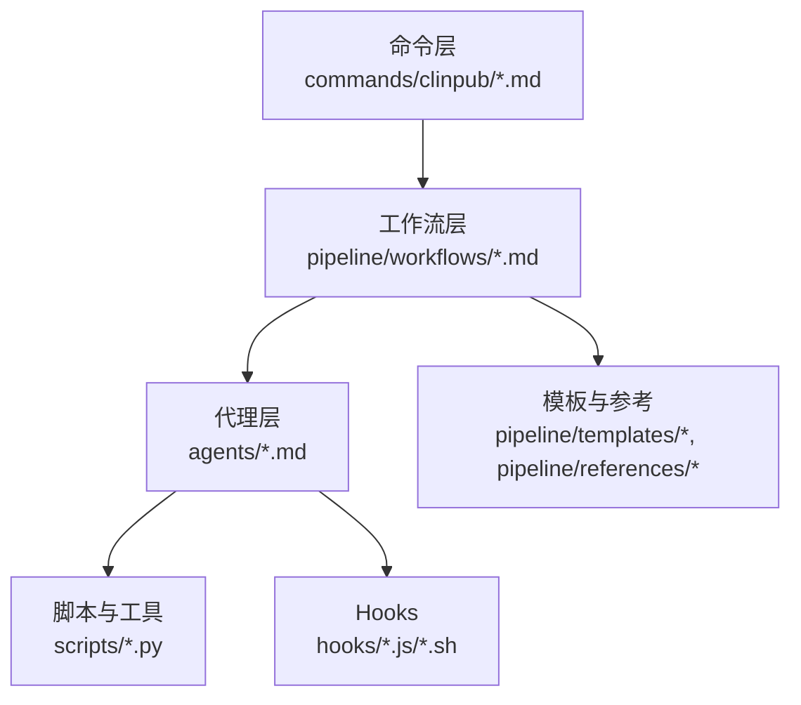

**图表来源**
- [ARCHITECTURE.md: 9-43:9-43](file://docs/ARCHITECTURE.md#L9-L43)
- [AGENTS.md: 11-20:11-20](file://AGENTS.md#L11-L20)

**章节来源**
- [ARCHITECTURE.md: 9-43:9-43](file://docs/ARCHITECTURE.md#L9-L43)
- [AGENTS.md: 11-20:11-20](file://AGENTS.md#L11-L20)

## 核心组件
- 选题挖掘代理（Topic Miner Agent）：从原始数据生成变量画像，扫描文献，提出3-5个候选研究主题，输出可直接用于初始化项目的配置。
- 统计分析代理（Analyst Agent）：执行数据清洗与统计分析，生成出版级图表与表格，遵循标准化方法说明模板。
- 文献检索代理（Reference Agent）：使用外部技能进行PubMed检索，输出结构化引文清单与引用映射，强制要求每个条目具备DOI。
- 论文撰写代理（Writer Agent）：依据研究类型模板与上游分析结果撰写IMRAD稿，执行反AI模板检查（Humanizer）。
- 研究规划代理（Clinpub Planner）：基于项目配置与分析方法库生成可执行计划（PLAN.md），分解为多波次任务并建立依赖图。
- 分析执行代理（Clinpub Executor）：原子化执行PLAN.md，逐任务提交，记录摘要（SUMMARY.md），处理决策检查点。
- 统计验证代理（Clinpub Verifier）：以“假设错误直到被证明正确”的对抗心态，按阶段应用验证模式，输出VERIFICATION.md。
- 输出修改代理（Modify Agent）：在不破坏下游产物的前提下，对分析输出进行样式与方法层面的修改，追加修改历史到PLAN.md。

**章节来源**
- [topic-miner-agent.md: 1-17:1-17](file://agents/topic-miner-agent.md#L1-L17)
- [analyst-agent.md: 1-15:1-15](file://agents/analyst-agent.md#L1-L15)
- [reference-agent.md: 1-12:1-12](file://agents/reference-agent.md#L1-L12)
- [writer-agent.md: 1-13:1-13](file://agents/writer-agent.md#L1-L13)
- [clinpub-planner.md: 1-20:1-20](file://agents/clinpub-planner.md#L1-L20)
- [clinpub-executor.md: 1-15:1-15](file://agents/clinpub-executor.md#L1-L15)
- [clinpub-verifier.md: 1-15:1-15](file://agents/clinpub-verifier.md#L1-L15)
- [modify-agent.md: 1-17:1-17](file://agents/modify-agent.md#L1-L17)

## 架构总览
三层架构与代理协作关系如下：

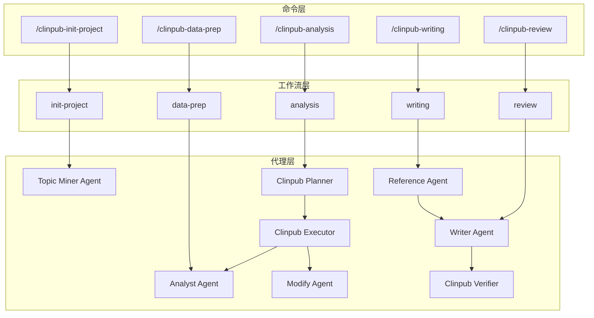

**图表来源**
- [ARCHITECTURE.md: 57-82:57-82](file://docs/ARCHITECTURE.md#L57-L82)
- [AGENTS.md: 72-83:72-83](file://AGENTS.md#L72-L83)

## 详细组件分析

### 选题挖掘代理（Topic Miner Agent）
- 专业技能
  - 数据画像：变量类型、缺失率、分布、相关性矩阵。
  - 文献扫描：并行子代理搜索PubMed，识别研究空白与复合新颖性。
  - 主题生成：结合可行性评分、变量映射与目标期刊建议，生成候选主题。
- 工作流程
  - 第一阶段：读取CSV/XLSX，生成数据画像与研究类型预测。
  - 第二阶段：并行派发子代理，汇总文献扫描结果，交叉变量缺口分析。
  - 第三阶段：合成候选主题报告，输出可直接用于初始化的配置文件。
- 产物与契约
  - 输出：数据画像、文献扫描、主题报告、待确认配置。
  - MANIFEST.yaml：声明idea/目录下的产物与消费者。

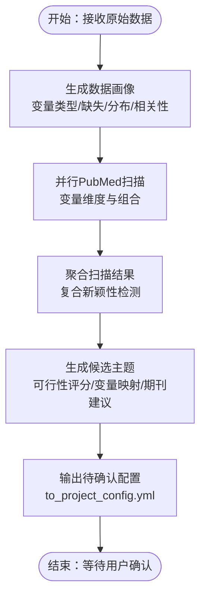

**图表来源**
- [topic-miner-agent.md: 21-183:21-183](file://agents/topic-miner-agent.md#L21-L183)

**章节来源**
- [topic-miner-agent.md: 19-183:19-183](file://agents/topic-miner-agent.md#L19-L183)
- [agent-contracts.md: 65-77:65-77](file://pipeline/references/agent-contracts.md#L65-L77)

### 统计分析代理（Analyst Agent）
- 专业技能
  - 数据准备：缺失值分级处理、异常值检测、衍生变量与编码、训练/验证分割。
  - 统计分析：基线表、组间比较、回归、生存分析、ROC/LASSO面板等。
- 工作流程
  - 加载配置与清洗数据，执行Tiered策略，生成cleaned.csv与质量报告。
  - 按计划波次执行分析，生成figure/table/README，遵循出版级标准。
- 产物与契约
  - 输出：cleaned.csv、质量报告、方法目录（含README）、输出目录（figure/table）。
  - MANIFEST.yaml：声明方法输出与下游消费者（Writer Agent）。

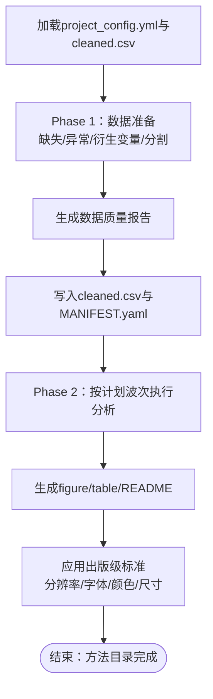

**图表来源**
- [analyst-agent.md: 19-75:19-75](file://agents/analyst-agent.md#L19-L75)

**章节来源**
- [analyst-agent.md: 17-141:17-141](file://agents/analyst-agent.md#L17-L141)
- [agent-contracts.md: 20-31:20-31](file://pipeline/references/agent-contracts.md#L20-L31)

### 文献检索代理（Reference Agent）
- 专业技能
  - PubMed检索：基于关键词与策略过滤，优先综述与SCI源，控制年份与IF偏好。
  - 方法搜索：针对未知统计方法提供摘要与深入教程，双轨输出。
  - 技术调研：为后续Phase提供领域与技术背景，统一使用外部技能。
- 工作流程
  - 检查技能可用性与API密钥，按阶段策略执行搜索。
  - 生成citation_map.md与references.bib（Vancouver格式，每条含DOI）。
- 产物与契约
  - 输出：引用清单、引用映射、文献笔记。
  - MANIFEST.yaml：声明Reference/目录产物与消费者（Writer Agent）。

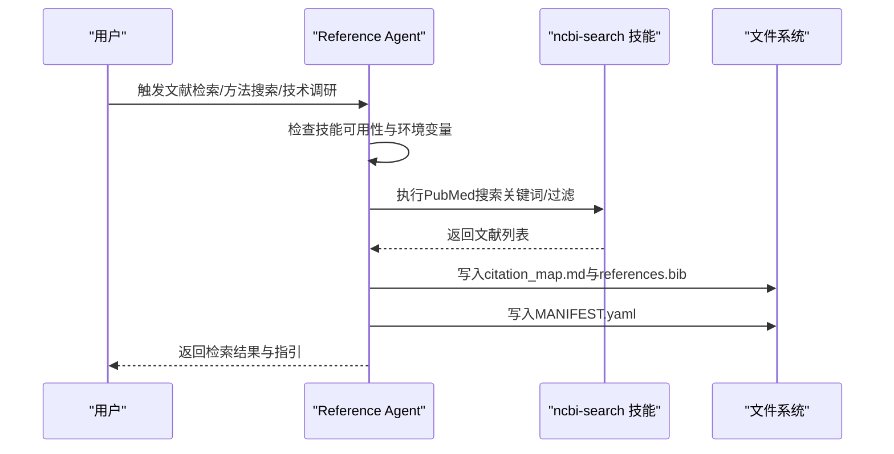

**图表来源**
- [reference-agent.md: 16-91:16-91](file://agents/reference-agent.md#L16-L91)

**章节来源**
- [reference-agent.md: 14-321:14-321](file://agents/reference-agent.md#L14-L321)
- [agent-contracts.md: 35-47:35-47](file://pipeline/references/agent-contracts.md#L35-L47)

### 论文撰写代理（Writer Agent）
- 专业技能
  - IMRAD撰写：依据研究类型模板，按Methods→Results→Introduction→Discussion→Abstract顺序。
  - 反AI模板检查（Humanizer）：避免序列化句式、重复过渡词、空洞结论等。
  - 审稿模拟：生成评审意见与逐条回复信。
- 工作流程
  - 加载配置与上游MANIFEST.yaml，校验必要产物。
  - 按章节顺序撰写，每章执行Humanizer检查。
  - 产出完整稿件与最终版本，写入MANIFEST.yaml。
- 产物与契约
  - 输出：各章节草稿、完整编译稿、评审与回复。
  - MANIFEST.yaml：声明05_Manuscript/产物与消费者（Clinpub Verifier）。

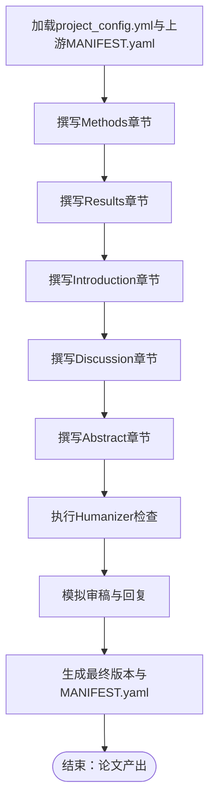

**图表来源**
- [writer-agent.md: 17-106:17-106](file://agents/writer-agent.md#L17-L106)

**章节来源**
- [writer-agent.md: 15-166:15-166](file://agents/writer-agent.md#L15-L166)
- [agent-contracts.md: 50-62:50-62](file://pipeline/references/agent-contracts.md#L50-L62)

### 研究规划代理（Clinpub Planner）
- 专业技能
  - 目标倒推：从分析目标出发，分解必须产出与关键链接。
  - 依赖建模：基于分析方法库与波次结构，构建并行优化的依赖图。
  - 任务拆解：每项计划拆分为输入准备、核心分析、文档校验三个任务。
- 工作流程
  - 读取ROADMAP与项目配置，确定规划阶段。
  - 构建依赖图，生成PLAN.md，包含前端元数据、目标、上下文、任务与验证标准。
- 产物与契约
  - 输出：PLAN.md（可执行计划）。
  - MANIFEST.yaml：声明计划文件与消费者（Clinpub Executor）。

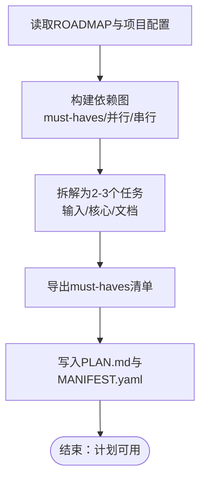

**图表来源**
- [clinpub-planner.md: 24-111:24-111](file://agents/clinpub-planner.md#L24-L111)

**章节来源**
- [clinpub-planner.md: 22-131:22-131](file://agents/clinpub-planner.md#L22-L131)
- [agent-contracts.md: 80-92:80-92](file://pipeline/references/agent-contracts.md#L80-L92)

### 分析执行代理（Clinpub Executor）
- 专业技能
  - 原子化执行：逐任务执行，严格验证输出，创建git提交。
  - 决策检查点：遇到歧义或需要用户决策时停止并返回结构化消息。
  - 自动纠错：对代码错误、数据问题与缺失输出进行有限次数自动修复。
- 工作流程
  - 加载状态与计划，解析依赖关系。
  - 按类型执行任务（自动/决策/人工验证），逐项提交并记录摘要。
- 产物与契约
  - 输出：SUMMARY.md（计划摘要）、更新STATE.md。
  - MANIFEST.yaml：声明输出与消费者（Clinpub Verifier）。

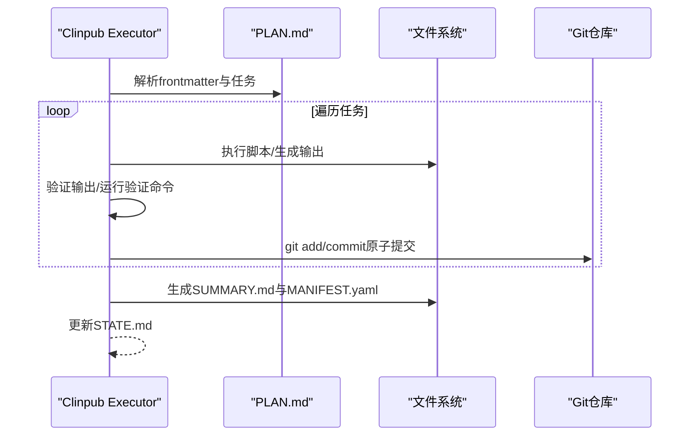

**图表来源**
- [clinpub-executor.md: 19-107:19-107](file://agents/clinpub-executor.md#L19-L107)

**章节来源**
- [clinpub-executor.md: 17-128:17-128](file://agents/clinpub-executor.md#L17-L128)
- [agent-contracts.md: 95-107:95-107](file://pipeline/references/agent-contracts.md#L95-L107)

### 统计验证代理（Clinpub Verifier）
- 专业技能
  - 对抗性验证：假设分析错误，逐一验证输出文件而非仅信任SUMMARY。
  - 阶段感知：按阶段自动路由到相应验证模式（数据质量/统计/论文）。
  - 多维检查：统计一致性、可重现性、图表一致性、人机化检查。
- 工作流程
  - 检测当前阶段，加载PLAN/SUMMARY与项目配置。
  - 应用相应验证模式，生成VERIFICATION.md，给出通过/问题/需要人工复核的结论。
- 产物与契约
  - 输出：VERIFICATION.md（结构化报告）。
  - MANIFEST.yaml：声明报告与消费者（后续阶段代理）。

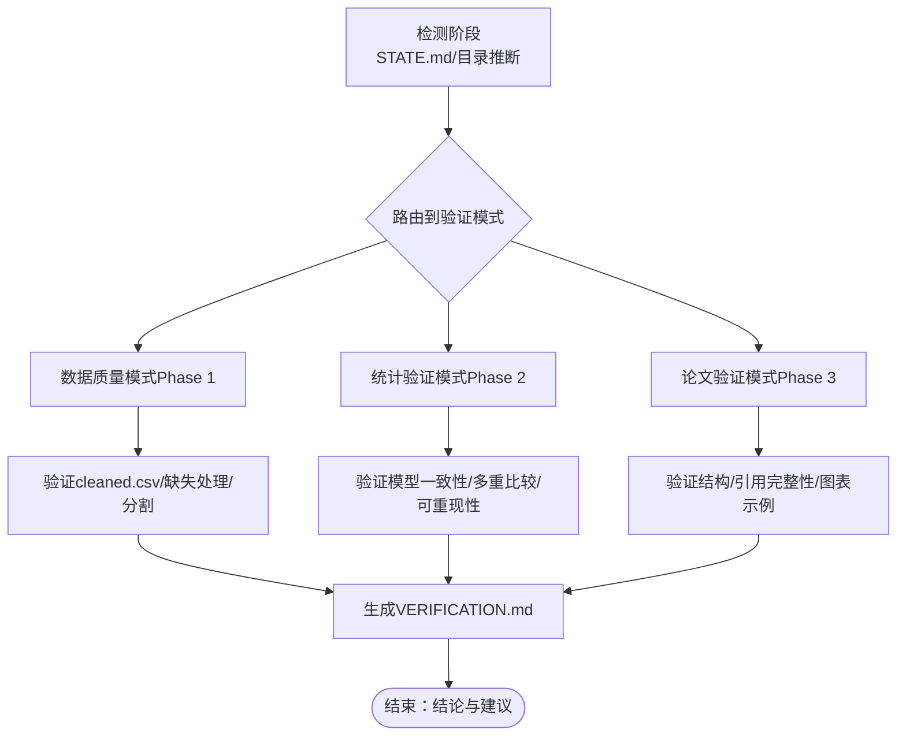

**图表来源**
- [clinpub-verifier.md: 35-311:35-311](file://agents/clinpub-verifier.md#L35-L311)

**章节来源**
- [clinpub-verifier.md: 17-439:17-439](file://agents/clinpub-verifier.md#L17-L439)
- [agent-contracts.md: 110-122:110-122](file://pipeline/references/agent-contracts.md#L110-L122)

### 输出修改代理（Modify Agent）
- 专业技能
  - 修改范围澄清：与用户确认修改目标（样式/变量/方法/新增）。
  - 执行修改：重写脚本并重新运行，确保输出覆盖原产物。
  - 历史记录：将每次修改追加到PLAN.md，形成可追溯的历史。
- 工作流程
  - 加载现有计划与数据，构建方法清单。
  - 用户确认修改后，逐项执行修改、验证与历史追加。
- 产物与契约
  - 输出：更新后的figure/table/README，PLAN.md修改历史。
  - MANIFEST.yaml：声明修改后的产物。

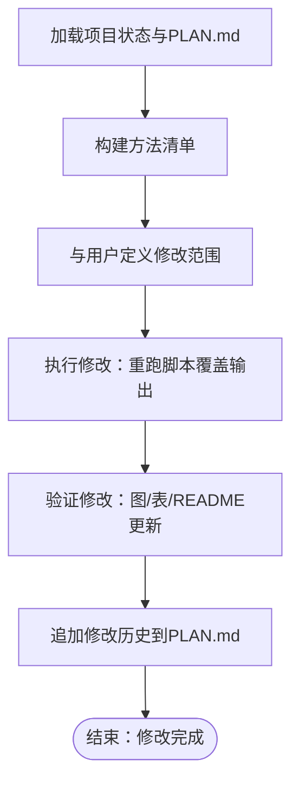

**图表来源**
- [modify-agent.md: 21-152:21-152](file://agents/modify-agent.md#L21-L152)

**章节来源**
- [modify-agent.md: 19-176:19-176](file://agents/modify-agent.md#L19-L176)
- [agent-contracts.md: 125-133:125-133](file://pipeline/references/agent-contracts.md#L125-L133)

## 依赖分析
- 代理间通信
  - 文件系统为唯一通信介质，避免直接消息传递。
  - 每个输出目录仅允许单一作者代理写入，多代理读取project_config.yml。
  - MANIFEST.yaml作为契约，下游代理在消费前必须验证。
- 目录访问矩阵
  - 各代理对目录的读写权限明确，避免循环依赖与竞态。
  - 特殊：Phase 1与Phase 2的数据目录由同一代理（Analyst Agent）在不同阶段使用。

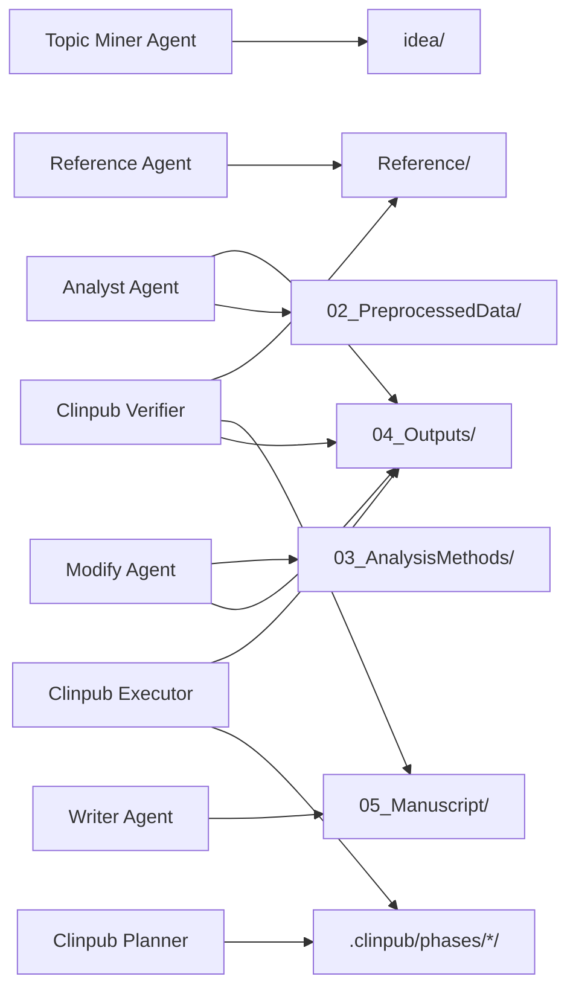

**图表来源**
- [agent-contracts.md: 140-156:140-156](file://pipeline/references/agent-contracts.md#L140-L156)

**章节来源**
- [agent-contracts.md: 125-156:125-156](file://pipeline/references/agent-contracts.md#L125-L156)

## 性能考虑
- 代码独立性
  - 每个R/Python脚本自包含，无全局状态与跨文件隐式依赖，便于并行执行与独立调试。
- 执行模式
  - Analyst/Executor采用原子化提交与阶段性checkpoint，降低失败回滚成本。
  - Reference Agent使用外部技能并行搜索，缩短等待时间。
- 资源与环境
  - R/Python依赖集中管理，建议使用虚拟环境与版本锁定。
  - 图表输出遵循统一分辨率与格式，减少后期处理开销。

**章节来源**
- [DEVELOPMENT.md: 5-28:5-28](file://docs/DEVELOPMENT.md#L5-L28)
- [DEVELOPMENT.md: 154-188:154-188](file://docs/DEVELOPMENT.md#L154-L188)

## 故障排除指南
- 常见问题与对策
  - R包安装失败：逐个安装定位失败包，必要时使用Bioconductor安装。
  - PubMed搜索无结果：检查网络、设置NCBI_API_KEY、尝试更宽泛关键词。
  - 图表中文乱码：在R中安装并启用中文字体。
  - cleaned.csv生成失败：确认原始数据存在、变量映射正确、编码为UTF-8。
- 质量门控
  - 四道门控分别覆盖伦理合规、数据质量、分析有效性与投稿准备，任一不通过需回退修正。
- 验证模式
  - 统计验证涵盖描述性交叉检查、模型一致性、生存分析、ROC/AUC、多重比较、可重现性、数据链完整性与图表一致性。
  - 论文验证涵盖结构完整性、引用完整性、图表示例与人机化检查。

**章节来源**
- [getting-started.md: 225-260:225-260](file://docs/getting-started.md#L225-L260)
- [gates.md: 9-112:9-112](file://pipeline/references/gates.md#L9-L112)
- [verification-patterns.md: 7-358:7-358](file://pipeline/references/verification-patterns.md#L7-L358)

## 结论
clinpub的AI代理系统通过严格的文件系统契约、标准化产物清单与多阶段验证，实现了从数据到论文的自动化与可审计化。八个代理各司其职，既保持独立性又紧密协作，既能满足初学者的易用性需求，也为高级用户提供充分的可扩展空间。建议在实践中遵循代码独立性原则、严格执行MANIFEST契约与质量门控，并利用验证模式持续改进产出质量。

## 附录

### 代理协作机制与任务分配
- 任务分配策略
  - Planner生成PLAN.md，Executor原子化执行并提交，Verifier跨阶段验证，Writer在下游消费产物。
  - Modify Agent仅在Phase 2后对输出进行增量修改，不改变论文与参考目录。
- 上下文传递
  - 通过project_config.yml、MANIFEST.yaml与阶段目录结构传递上下文，避免内存共享与状态耦合。

**章节来源**
- [clinpub-planner.md: 101-111:101-111](file://agents/clinpub-planner.md#L101-L111)
- [clinpub-executor.md: 48-66:48-66](file://agents/clinpub-executor.md#L48-L66)
- [writer-agent.md: 27-51:27-51](file://agents/writer-agent.md#L27-L51)
- [modify-agent.md: 79-113:79-113](file://agents/modify-agent.md#L79-L113)

### 可扩展性设计
- 新增研究类型
  - 在templates/study_types/添加模板，更新analysis_methods.md并在analyst-agent.md中扩展方法。
- 新增Agent
  - 在agents/创建角色卡片，更新Workflow引用并在agent-contracts.md中定义契约。
- 钩子与安全
  - Hooks在写/读/Bash事件上执行，防止越阶写入、检查前置里程碑、扫描prompt注入。

**章节来源**
- [ARCHITECTURE.md: 140-153:140-153](file://docs/ARCHITECTURE.md#L140-L153)
- [CONFIGURATION.md: 158-185:158-185](file://docs/CONFIGURATION.md#L158-L185)

### 性能监控、错误处理与调试
- 性能监控
  - 通过SUMMARY.md记录任务执行与偏差，通过VERIFICATION.md记录验证得分与问题。
- 错误处理
  - Executor对脚本错误、数据问题与缺失输出进行有限次自动修复；Verifier以对抗性思维验证SUMMARY声明。
- 调试方法
  - R使用recover与browser，Python使用pdb与logging；每个脚本应可独立运行并内置测试数据。

**章节来源**
- [clinpub-executor.md: 70-86:70-86](file://agents/clinpub-executor.md#L70-L86)
- [clinpub-verifier.md: 17-32:17-32](file://agents/clinpub-verifier.md#L17-L32)
- [DEVELOPMENT.md: 270-320:270-320](file://docs/DEVELOPMENT.md#L270-L320)