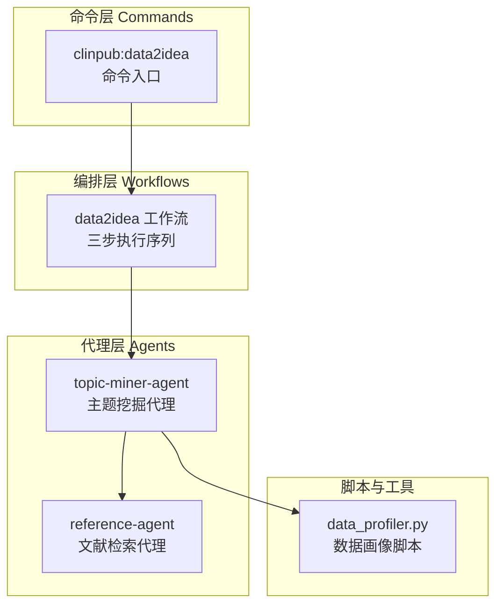
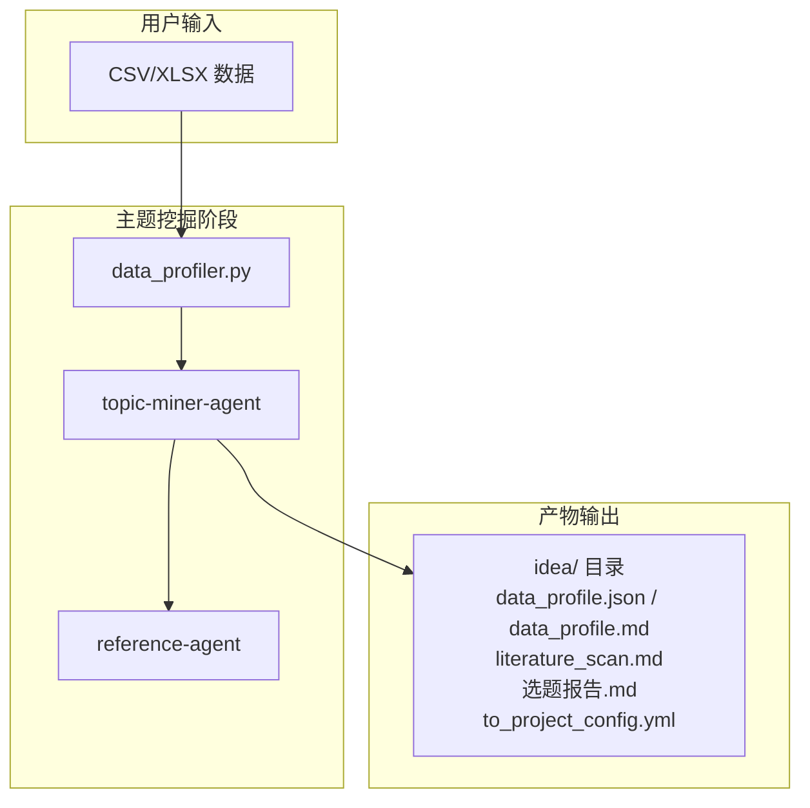
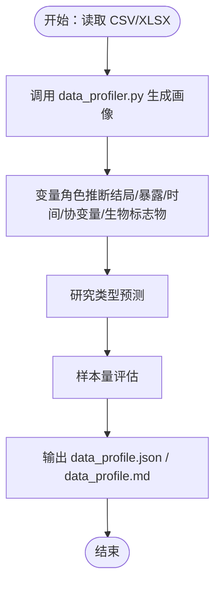
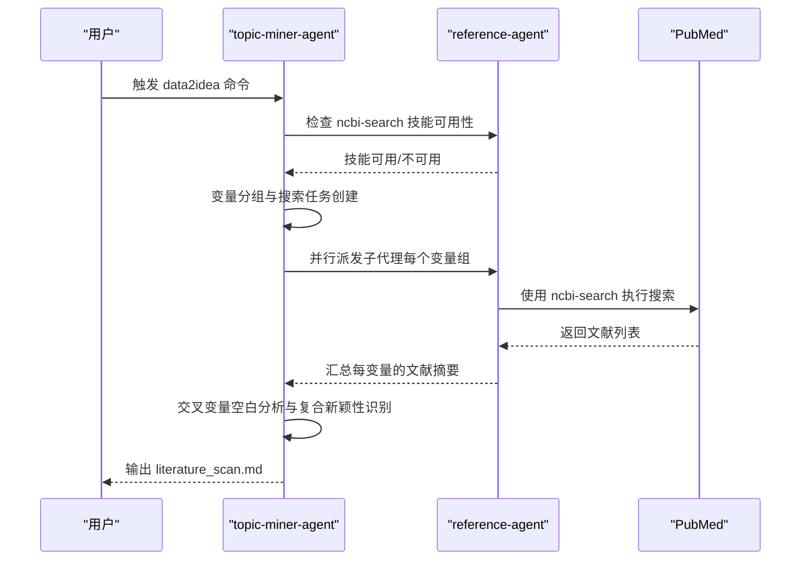
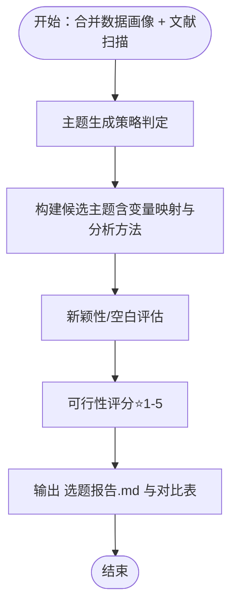
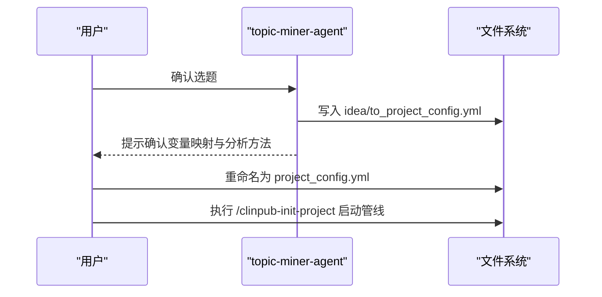
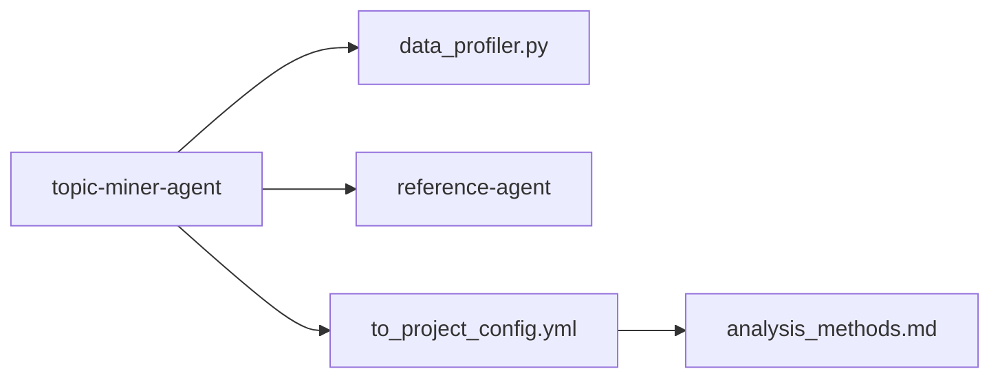

# 主题挖掘代理 (Topic-Miner-Agent)

<cite>
**本文档引用的文件**
- [topic-miner-agent.md](file://agents/topic-miner-agent.md)
- [data2idea.md](file://pipeline/workflows/data2idea.md)
- [data2idea.md](file://commands/clinpub/data2idea.md)
- [ARCHITECTURE.md](file://docs/ARCHITECTURE.md)
- [analysis_methods.md](file://pipeline/references/analysis_methods.md)
- [project_config.example.yml](file://examples/project_config.example.yml)
- [data_profiler.py](file://scripts/data_profiler.py)
- [reference-agent.md](file://agents/reference-agent.md)
- [modify-agent-design.md](file://docs/SUPERPOWERS/SPECS/2026-06-02-modify-agent-design.md)
</cite>

## 目录
1. [简介](#简介)
2. [项目结构](#项目结构)
3. [核心组件](#核心组件)
4. [架构总览](#架构总览)
5. [详细组件分析](#详细组件分析)
6. [依赖关系分析](#依赖关系分析)
7. [性能考量](#性能考量)
8. [故障排查指南](#故障排查指南)
9. [结论](#结论)
10. [附录](#附录)

## 简介
主题挖掘代理（Topic-Miner-Agent）是 clinpub 科研管线中的专用智能体，专注于从临床数据中发现可执行的研究主题，并结合文献检索识别研究空白与前沿趋势。其核心职责包括：
- 数据画像与变量角色推断
- 文献并行扫描与研究空白识别
- 基于可行性与新颖性的候选主题生成
- 支持研究方向选择与论文选题

该代理严格遵循“数据驱动、文献验证、可行性优先”的原则，不进行统计分析或撰写论文，仅提供结构化主题建议与配置文件以衔接后续分析流程。

## 项目结构
clinpub 采用三层架构：Commands → Workflows → Agents。主题挖掘代理位于 Agent 层，配合 data2idea 工作流与命令入口协同完成端到端的主题发现流程。

**图表来源**
- [ARCHITECTURE.md: 45-83:45-83](file://docs/ARCHITECTURE.md#L45-L83)
- [data2idea.md: 17-52:17-52](file://pipeline/workflows/data2idea.md#L17-L52)
- [topic-miner-agent.md: 19-320:19-320](file://agents/topic-miner-agent.md#L19-L320)

**章节来源**
- [ARCHITECTURE.md: 1-160:1-160](file://docs/ARCHITECTURE.md#L1-L160)
- [data2idea.md: 1-154:1-154](file://pipeline/workflows/data2idea.md#L1-L154)
- [data2idea.md: 1-43:1-43](file://commands/clinpub/data2idea.md#L1-L43)

## 核心组件
- 主题挖掘代理（topic-miner-agent）：负责数据画像、文献并行扫描、主题生成与配置文件生成。
- data2idea 工作流：定义三步执行序列（数据画像 → 文献扫描 → 主题生成）。
- data_profiler.py：生成变量清单、分布摘要、缺失模式与相关性矩阵。
- reference-agent：提供 ncbi-search 技能封装，用于 PubMed 文献检索与引用管理。
- 分析方法参考库：为后续分析阶段提供方法选择与执行顺序的参考。

**章节来源**
- [topic-miner-agent.md: 19-320:19-320](file://agents/topic-miner-agent.md#L19-L320)
- [data2idea.md: 17-143:17-143](file://pipeline/workflows/data2idea.md#L17-L143)
- [data_profiler.py: 1-352:1-352](file://scripts/data_profiler.py#L1-L352)
- [reference-agent.md: 14-91:14-91](file://agents/reference-agent.md#L14-L91)
- [analysis_methods.md: 18-104:18-104](file://pipeline/references/analysis_methods.md#L18-L104)

## 架构总览
主题挖掘代理在 clinpub 管线中的位置与协作关系如下：

**图表来源**
- [topic-miner-agent.md: 19-320:19-320](file://agents/topic-miner-agent.md#L19-L320)
- [data2idea.md: 17-143:17-143](file://pipeline/workflows/data2idea.md#L17-L143)
- [reference-agent.md: 14-91:14-91](file://agents/reference-agent.md#L14-L91)

## 详细组件分析

### 数据画像与变量角色推断
- 输入：CSV/XLSX 文件
- 输出：data_profile.json（结构化画像）、data_profile.md（变量清单、缺失报告、研究类型预测）
- 关键功能：
  - 变量清单与缺失率统计
  - 连续变量五数概括、分类变量频数统计
  - 相关性矩阵（Spearman，>30列给出警告）
  - 变量角色自动推断（结局、暴露/分组、时间、协变量、生物标志物）
  - 研究类型预测（RCT、队列、病例对照、横断面、描述性、生物标志物面板）
  - 样本量评估（<50、50-200、200-500、500-2000、>2000）

**图表来源**
- [data2idea.md: 19-52:19-52](file://pipeline/workflows/data2idea.md#L19-L52)
- [topic-miner-agent.md: 21-69:21-69](file://agents/topic-miner-agent.md#L21-L69)
- [data_profiler.py: 27-325:27-325](file://scripts/data_profiler.py#L27-L325)

**章节来源**
- [data2idea.md: 19-52:19-52](file://pipeline/workflows/data2idea.md#L19-L52)
- [topic-miner-agent.md: 21-69:21-69](file://agents/topic-miner-agent.md#L21-L69)
- [data_profiler.py: 27-325:27-325](file://scripts/data_profiler.py#L27-L325)

### 文献并行扫描与研究空白识别
- 前置条件：ncbi-search 技能可用，可选设置 NCBI_API_KEY 提升速率限制
- 变量分组策略：
  - 疾病上下文关键词（来自用户描述 + 变量名）
  - 生物标志物/暴露变量（每个变量独立搜索）
  - 结局变量（结局相关搜索）
  - 组合搜索（Top 2-3 变量对的交叉参考）
- 跳过规则：预后<5%、纯描述性（ID、日期）、已知协变量（年龄、性别）
- 子代理并行调度：每个变量组派发一个探索型子代理，统一使用 ncbi-search 技能
- 结果聚合：收集各变量的文献摘要，进行交叉变量空白分析与复合新颖性识别，标注“🟢/🔶/✅”新颖性等级

**图表来源**
- [topic-miner-agent.md: 71-138:71-138](file://agents/topic-miner-agent.md#L71-L138)
- [data2idea.md: 54-119:54-119](file://pipeline/workflows/data2idea.md#L54-L119)
- [reference-agent.md: 16-45:16-45](file://agents/reference-agent.md#L16-L45)

**章节来源**
- [topic-miner-agent.md: 71-138:71-138](file://agents/topic-miner-agent.md#L71-L138)
- [data2idea.md: 54-119:54-119](file://pipeline/workflows/data2idea.md#L54-L119)
- [reference-agent.md: 16-45:16-45](file://agents/reference-agent.md#L16-L45)

### 候选主题生成与可行性评估
- 主题生成策略：
  - 大样本（>5000 行）：优先队列或 RCT
  - 多生物标志物（>10）：优先标志物面板或 LASSO
  - 无分组/结局变量：描述性研究
  - 用户指定方向：优先匹配
- 每个主题包含：
  - 工作标题、可行性评分（⭐1-5）、研究类型
  - 核心研究问题与假设
  - 变量映射（结局、暴露/分组、协变量、亚组）
  - 拟定分析方法、图表/表格清单
  - 新颖性/研究空白说明
  - 目标期刊建议
  - 风险与注意事项
- 输出：idea/选题报告.md，末尾包含主题对比表

**图表来源**
- [topic-miner-agent.md: 140-183:140-183](file://agents/topic-miner-agent.md#L140-L183)
- [data2idea.md: 121-143:121-143](file://pipeline/workflows/data2idea.md#L121-L143)

**章节来源**
- [topic-miner-agent.md: 140-183:140-183](file://agents/topic-miner-agent.md#L140-L183)
- [data2idea.md: 121-143:121-143](file://pipeline/workflows/data2idea.md#L121-L143)

### 项目配置生成与后续流程衔接
- 触发条件：用户确认选题（如“选第 N 个”）
- 映射规则：将主题字段映射到 project_config.yml 的 project、variables、paths、methods_to_run、quality、analysis 等字段
- 默认方法列表按研究类型生成（队列、RCT、病例对照、横断面、描述性、诊断/生物标志物）
- 输出：idea/to_project_config.yml，提示用户确认后重命名为 project_config.yml 并启动 clinpub 管线

**图表来源**
- [topic-miner-agent.md: 185-292:185-292](file://agents/topic-miner-agent.md#L185-L292)
- [data2idea.md: 25-35:25-35](file://commands/clinpub/data2idea.md#L25-L35)

**章节来源**
- [topic-miner-agent.md: 185-292:185-292](file://agents/topic-miner-agent.md#L185-L292)
- [data2idea.md: 25-35:25-35](file://commands/clinpub/data2idea.md#L25-L35)
- [project_config.example.yml: 8-68:8-68](file://examples/project_config.example.yml#L8-L68)

### 分析方法参考与后续验证
- 分析方法参考库提供按数据特征动态推荐分析方法的决策树，确保主题生成与后续分析阶段的衔接。
- modify-agent 设计文档展示了分析产出修改的职责分离与修改记录机制，便于在主题选定后对方法进行微调与验证。

**章节来源**
- [analysis_methods.md: 18-104:18-104](file://pipeline/references/analysis_methods.md#L18-L104)
- [modify-agent-design.md: 109-209:109-209](file://docs/SUPERPOWERS/SPECS/2026-06-02-modify-agent-design.md#L109-L209)

## 依赖关系分析
- 主题挖掘代理依赖 data_profiler.py 生成数据画像
- 文献扫描依赖 reference-agent 的 ncbi-search 技能
- 项目配置生成依赖主题报告与变量映射规则
- 后续分析阶段依赖 analysis_methods.md 的方法选择与执行顺序

**图表来源**
- [topic-miner-agent.md: 19-320:19-320](file://agents/topic-miner-agent.md#L19-L320)
- [data2idea.md: 17-143:17-143](file://pipeline/workflows/data2idea.md#L17-L143)
- [reference-agent.md: 14-91:14-91](file://agents/reference-agent.md#L14-L91)
- [analysis_methods.md: 18-104:18-104](file://pipeline/references/analysis_methods.md#L18-L104)

**章节来源**
- [topic-miner-agent.md: 19-320:19-320](file://agents/topic-miner-agent.md#L19-L320)
- [data2idea.md: 17-143:17-143](file://pipeline/workflows/data2idea.md#L17-L143)
- [reference-agent.md: 14-91:14-91](file://agents/reference-agent.md#L14-L91)
- [analysis_methods.md: 18-104:18-104](file://pipeline/references/analysis_methods.md#L18-L104)

## 性能考量
- 文献搜索并行化：按变量组并行派发子代理，提升覆盖率与复合新颖性检测效率
- 速率限制优化：设置 NCBI_API_KEY 可将 PubMed 请求速率从 3req/s 提升至 10req/s
- 相关性矩阵警告：当数值变量 >30 时提示潜在性能与解释复杂性问题
- 变量筛选：跳过低流行度与纯描述性变量，减少无效搜索与噪声

**章节来源**
- [topic-miner-agent.md: 71-138:71-138](file://agents/topic-miner-agent.md#L71-L138)
- [data2idea.md: 66-118:66-118](file://pipeline/workflows/data2idea.md#L66-L118)
- [data_profiler.py: 31-35:31-35](file://scripts/data_profiler.py#L31-L35)

## 故障排查指南
- ncbi-search 技能缺失：在执行文献扫描前检查技能可用性，若缺失需安装后再继续
- API 密钥未设置：未设置 NCBI_API_KEY 时搜索速率受限，建议设置以提升并行搜索效率
- 变量角色误判：自动推断仅作参考，用户需确认变量角色后再继续
- 配置文件覆盖保护：始终写入 idea/to_project_config.yml，避免覆盖现有 project_config.yml
- 缺失模式与相关性：关注 data_profile.md 中的缺失报告与相关性矩阵警告，必要时调整变量或样本

**章节来源**
- [topic-miner-agent.md: 296-308:296-308](file://agents/topic-miner-agent.md#L296-L308)
- [reference-agent.md: 16-45:16-45](file://agents/reference-agent.md#L16-L45)
- [data2idea.md: 111-118:111-118](file://pipeline/workflows/data2idea.md#L111-L118)

## 结论
主题挖掘代理通过数据画像、文献并行扫描与主题生成，为研究者提供了从数据到选题再到配置落地的一体化解决方案。其“数据驱动、文献验证、可行性优先”的原则确保了主题的可执行性与前沿性。配合后续分析方法参考库与配置生成机制，代理有效衔接了主题发现与统计分析阶段，支撑研究方向选择与论文选题。

## 附录

### 主题挖掘示例与结果解读
- 示例场景：某研究包含多个生物标志物与结局变量，样本量较大
- 数据画像：识别出多组暴露变量、多个连续/二分类结局变量、缺失模式与相关性矩阵
- 文献扫描：针对每个生物标志物与结局变量进行并行搜索，识别研究空白与趋势
- 主题生成：基于样本量与变量特征，优先生成队列或生物标志物面板主题，标注可行性评分与目标期刊
- 结果解读：选题报告中的对比表帮助用户快速比较不同主题的创新性、可行性与方法复杂度

**章节来源**
- [topic-miner-agent.md: 140-183:140-183](file://agents/topic-miner-agent.md#L140-L183)
- [data2idea.md: 121-143:121-143](file://pipeline/workflows/data2idea.md#L121-L143)

### 主题分析参数配置与结果验证方法
- 参数配置：
  - 变量映射：结局、暴露/分组、协变量、亚组
  - 研究类型：队列、RCT、病例对照、横断面、描述性、诊断/生物标志物
  - 分析方法：按研究类型生成默认方法列表，用户可调整
  - 质量与分析阈值：期刊级别、图像分辨率、显著性水平、多重比较校正
- 结果验证：
  - 变量映射核对：确保结局与暴露变量与数据一致
  - 方法列表合理性：结合 outcome_type 与样本量评估方法可行性
  - 文献验证：核对 literature_scan.md 中的空白识别与新颖性标注

**章节来源**
- [topic-miner-agent.md: 185-292:185-292](file://agents/topic-miner-agent.md#L185-L292)
- [analysis_methods.md: 207-217:207-217](file://pipeline/references/analysis_methods.md#L207-L217)
- [project_config.example.yml: 8-68:8-68](file://examples/project_config.example.yml#L8-L68)

### 主题挖掘最佳实践与局限性
- 最佳实践：
  - 明确变量角色后再进行文献扫描
  - 设置 NCBI_API_KEY 以提升并行搜索效率
  - 关注 data_profile.md 中的缺失报告与相关性矩阵警告
  - 使用选题报告对比表辅助决策
- 局限性：
  - 自动变量角色推断仅作参考，需人工确认
  - 文献扫描结果依赖 ncbi-search 技能可用性
  - 主题生成基于数据与文献现状，不代表最终研究可行性

**章节来源**
- [topic-miner-agent.md: 296-308:296-308](file://agents/topic-miner-agent.md#L296-L308)
- [data2idea.md: 111-118:111-118](file://pipeline/workflows/data2idea.md#L111-L118)