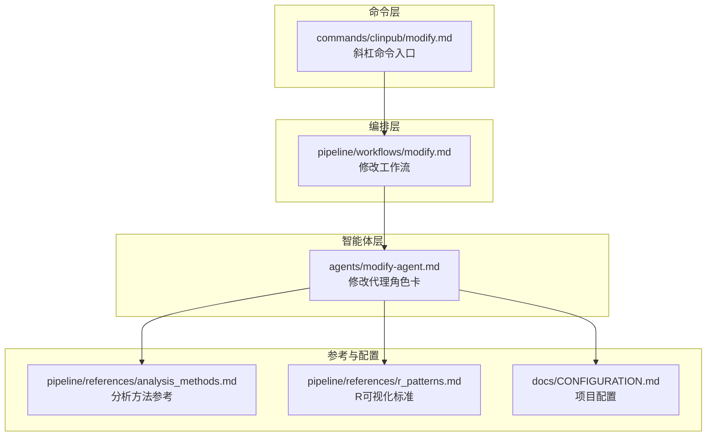
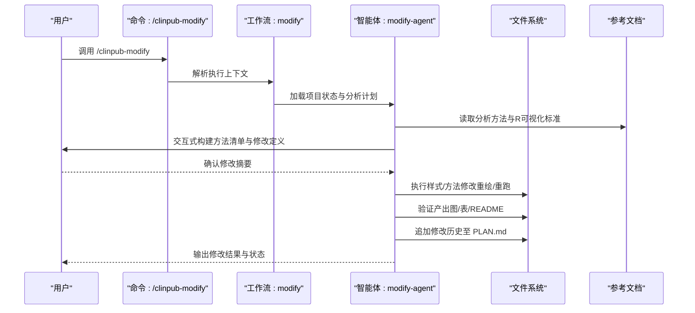
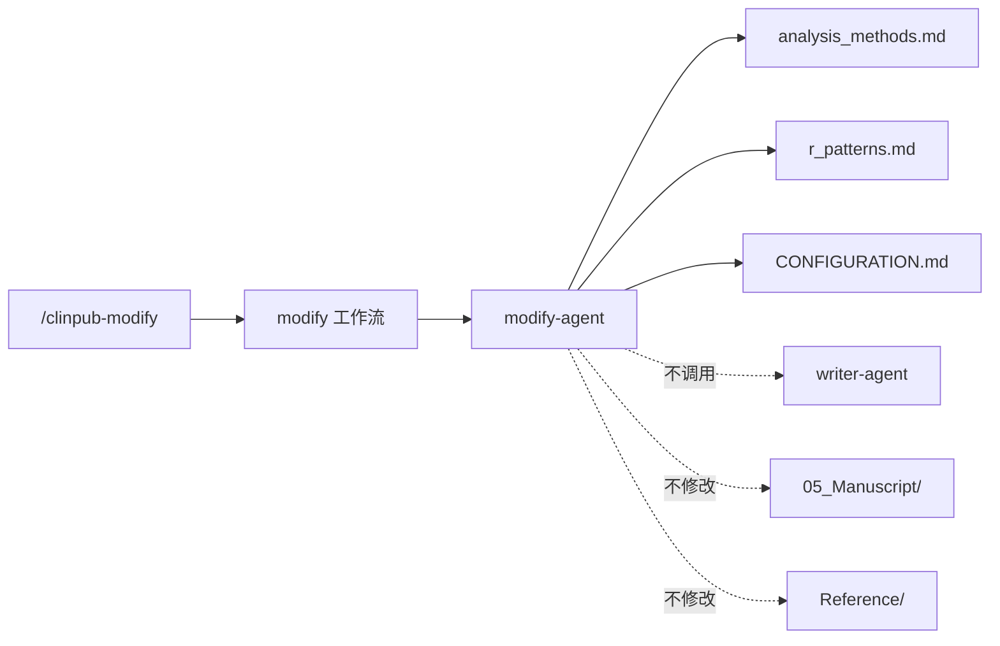

# 修改代理 (Modify-Agent)

<cite>
**本文引用的文件**
- [agents/modify-agent.md](file://agents/modify-agent.md)
- [commands/clinpub/modify.md](file://commands/clinpub/modify.md)
- [pipeline/workflows/modify.md](file://pipeline/workflows/modify.md)
- [docs/superpowers/specs/2026-06-02-modify-agent-design.md](file://docs/superpowers/specs/2026-06-02-modify-agent-design.md)
- [docs/superpowers/plans/2026-06-02-modify-agent.md](file://docs/superpowers/plans/2026-06-02-modify-agent.md)
- [pipeline/references/analysis_methods.md](file://pipeline/references/analysis_methods.md)
- [pipeline/references/r_patterns.md](file://pipeline/references/r_patterns.md)
- [docs/CONFIGURATION.md](file://docs/CONFIGURATION.md)
- [README.md](file://README.md)
</cite>

## 目录
1. [简介](#简介)
2. [项目结构](#项目结构)
3. [核心组件](#核心组件)
4. [架构总览](#架构总览)
5. [详细组件分析](#详细组件分析)
6. [依赖关系分析](#依赖关系分析)
7. [性能考量](#性能考量)
8. [故障排查指南](#故障排查指南)
9. [结论](#结论)
10. [附录](#附录)

## 简介
修改代理（Modify-Agent）是面向“分析阶段产出”的专用智能体，负责在完成 Phase 2 分析后，对分析方法（统计模型/变量）与图表样式（配色、字体、图表类型、布局）进行定向修改。其核心目标包括：
- 明确修改范围与策略，与用户交互确认修改定义
- 执行样式调整（重绘图表）与方法变更（重跑分析）
- 验证产出质量（≥300 DPI、英文标签、theme_pub()、效应量+95%CI+精确p值）
- 将修改历史追加至 PLAN.md，并提示手稿更新需求

修改代理遵循“定义→执行→验证→记录”的闭环流程，确保修改过程可追溯、可回滚、可复现。

**章节来源**
- [agents/modify-agent.md:1-176](file://agents/modify-agent.md#L1-L176)
- [commands/clinpub/modify.md:1-39](file://commands/clinpub/modify.md#L1-L39)
- [pipeline/workflows/modify.md:1-136](file://pipeline/workflows/modify.md#L1-L136)

## 项目结构
修改代理由三层文件构成：命令入口、工作流编排与智能体角色卡，配合参考文档与配置规范协同工作。

**图表来源**
- [commands/clinpub/modify.md:1-39](file://commands/clinpub/modify.md#L1-L39)
- [pipeline/workflows/modify.md:1-136](file://pipeline/workflows/modify.md#L1-L136)
- [agents/modify-agent.md:1-176](file://agents/modify-agent.md#L1-L176)
- [pipeline/references/analysis_methods.md:1-311](file://pipeline/references/analysis_methods.md#L1-L311)
- [pipeline/references/r_patterns.md:1-532](file://pipeline/references/r_patterns.md#L1-L532)
- [docs/CONFIGURATION.md:1-270](file://docs/CONFIGURATION.md#L1-L270)

**章节来源**
- [README.md:1-172](file://README.md#L1-L172)
- [docs/superpowers/specs/2026-06-02-modify-agent-design.md:1-316](file://docs/superpowers/specs/2026-06-02-modify-agent-design.md#L1-L316)

## 核心组件
- 命令入口（/clinpub-modify）
  - 用途：在任意阶段调用，支持交互式选择方法与修改类型
  - 工具集：Read、Write、Edit、Glob、Grep、Bash、AskUserQuestion
- 工作流（modify）
  - 用途：加载上下文→定义修改→执行修改→验证→更新PLAN.md
  - 关键步骤：前置校验、修改定义确认、逐条执行、验证、记录历史
- 智能体角色卡（modify-agent）
  - 用途：明确修改范围、执行样式与方法修改、验证与记录
  - 范围：仅限 03_AnalysisMethods/ 与 04_Outputs/，禁止修改 05_Manuscript/ 与 Reference/

**章节来源**
- [commands/clinpub/modify.md:1-39](file://commands/clinpub/modify.md#L1-L39)
- [pipeline/workflows/modify.md:1-136](file://pipeline/workflows/modify.md#L1-L136)
- [agents/modify-agent.md:1-176](file://agents/modify-agent.md#L1-L176)

## 架构总览
修改代理采用“命令→工作流→智能体”的三层协作模式，结合参考文档与配置规范，形成可追溯、可验证的修改闭环。

**图表来源**
- [commands/clinpub/modify.md:20-39](file://commands/clinpub/modify.md#L20-L39)
- [pipeline/workflows/modify.md:16-125](file://pipeline/workflows/modify.md#L16-L125)
- [agents/modify-agent.md:41-182](file://agents/modify-agent.md#L41-L182)

## 详细组件分析

### 命令入口（/clinpub-modify）
- 目标：支持两类修改：样式调整（重绘图表）与方法变更（重跑分析）
- 工具集：Read、Write、Edit、Glob、Grep、Bash、AskUserQuestion
- 执行上下文：引用工作流、分析方法参考、R可视化标准与智能体角色卡
- 成功标准：修改范围明确、执行与验证通过、历史记录追加、提示手稿更新

**章节来源**
- [commands/clinpub/modify.md:1-39](file://commands/clinpub/modify.md#L1-L39)

### 工作流（modify）
- 前置校验：确保分析计划、清理数据与分析输出存在
- 修改定义：与用户交互，构建方法清单与修改摘要，checkpoint确认
- 执行顺序：样式修改（低风险）→变量替换→方法变更→新增方法，降低级联失败
- 验证标准：≥300 DPI、英文标签、theme_pub()、效应量+95%CI+精确p值
- 历史记录：追加修改记录至 PLAN.md，更新 STATE.md 最后活动

**章节来源**
- [pipeline/workflows/modify.md:18-125](file://pipeline/workflows/modify.md#L18-L125)

### 智能体角色卡（modify-agent）
- 修改范围：仅 03_AnalysisMethods/ 与 04_Outputs/，禁止修改 05_Manuscript/ 与 Reference/
- 执行策略：
  - 样式修改：读取现有 R 脚本，按 r_patterns.md 调整 ggplot2 参数，重绘覆盖
  - 方法修改：重写统计部分，更新 README，重跑生成新产出
  - 变量修改：修改脚本变量引用，重跑覆盖
  - 新增方法：创建目录、编写自包含脚本、运行生成图/表/README，并追加至 PLAN.md
- 质量与安全：
  - 读取 cleaned.csv，禁止使用原始/中间文件
  - 图表 ≥300 DPI、英文标签、theme_pub()、效应量+95%CI+精确p值
  - 每次会话最多 5 个修改项，脚本自包含、设置随机种子、失败回退（git stash）

**章节来源**
- [agents/modify-agent.md:14-176](file://agents/modify-agent.md#L14-L176)

### 分析方法参考（analysis_methods.md）
- 通用要求：统一读取 cleaned.csv、应用 theme_pub()、生成方法说明、报告效应量+95%CI+精确p值
- 方法选择决策树：基于数据特征（分组、结局类型、时间点）推荐分析方向
- 场景参考：基线/描述性、组间比较、回归/关联、生存分析、亚组与敏感性分析、相关性、诊断/预测等
- 依赖顺序：波次划分与执行顺序，确保前序结果可用于后续分析

**章节来源**
- [pipeline/references/analysis_methods.md:8-311](file://pipeline/references/analysis_methods.md#L8-L311)

### R 可视化标准（r_patterns.md）
- 色彩规范：色盲友好配色、按分组数推荐方案、一致性规则
- 出版级主题：theme_pub() 统一风格
- 图表保存：≥300 DPI、格式与尺寸标准、字体族说明
- 显著性标注：p 值格式化、动态标注位置、标注规则
- 目录先行：输出前确保目录存在，避免路径错误

**章节来源**
- [pipeline/references/r_patterns.md:13-532](file://pipeline/references/r_patterns.md#L13-L532)

### 项目配置（CONFIGURATION.md）
- 项目配置：study、variables、paths、analysis、figures 等
- R/Python 环境：必需包、版本要求、虚拟环境建议
- 目录结构：标准项目目录与文件命名规范
- 输出配置：图表分辨率、格式、字体、配色、宽度与命名规范

**章节来源**
- [docs/CONFIGURATION.md:5-270](file://docs/CONFIGURATION.md#L5-L270)

## 依赖关系分析
修改代理与现有智能体及工作流的耦合度低，职责清晰，避免污染现有流程。

**图表来源**
- [commands/clinpub/modify.md:20-39](file://commands/clinpub/modify.md#L20-L39)
- [pipeline/workflows/modify.md:16-125](file://pipeline/workflows/modify.md#L16-L125)
- [agents/modify-agent.md:103-108](file://agents/modify-agent.md#L103-L108)

**章节来源**
- [docs/superpowers/specs/2026-06-02-modify-agent-design.md:103-108](file://docs/superpowers/specs/2026-06-02-modify-agent-design.md#L103-L108)

## 性能考量
- 修改会话上限：每次最多 5 个修改项，防止上下文溢出
- 执行顺序：样式修改优先，降低失败传播风险
- 失败处理：脚本失败最多尝试 3 次，不可修复则回退并继续下一项
- 输出质量：强制 ≥300 DPI、英文标签、theme_pub()，减少返工
- 脚本自包含：避免跨文件隐式依赖，提升可移植性

**章节来源**
- [agents/modify-agent.md:156-166](file://agents/modify-agent.md#L156-L166)
- [pipeline/workflows/modify.md:304-307](file://pipeline/workflows/modify.md#L304-L307)

## 故障排查指南
- 前置条件缺失
  - 现象：提示未找到分析计划/清理数据/分析输出
  - 处理：先运行相应 Phase 命令（/clinpub-analysis、/clinpub-data-prep）
- 修改未生效
  - 现象：修改摘要确认后未执行
  - 处理：检查用户确认 checkpoint；若拒绝，则停止修改
- 图表不符合标准
  - 现象：分辨率不足、标签非英文、未应用 theme_pub()
  - 处理：按 r_patterns.md 规范调整；必要时设置字体与 DPI
- 统计报告不完整
  - 现象：缺少效应量、95%CI 或精确 p 值
  - 处理：按 analysis_methods.md 要求完善报告字段
- 新增方法失败
  - 现象：新增方法未生成图/表/README
  - 处理：检查脚本自包含性与 cleaned.csv 读取；确认方法说明已更新
- 历史记录未更新
  - 现象：PLAN.md 未追加修改记录
  - 处理：确认修改流程结束；检查 YAML 格式与追加位置

**章节来源**
- [pipeline/workflows/modify.md:28-34](file://pipeline/workflows/modify.md#L28-L34)
- [agents/modify-agent.md:115-124](file://agents/modify-agent.md#L115-L124)
- [pipeline/references/r_patterns.md:106-152](file://pipeline/references/r_patterns.md#L106-L152)
- [pipeline/references/analysis_methods.md:8-15](file://pipeline/references/analysis_methods.md#L8-L15)

## 结论
修改代理通过清晰的范围界定、严格的执行与验证标准以及完整的记录机制，为分析阶段产出提供了可控、可追溯的修改能力。其与现有工作流解耦，避免对下游手稿与参考文献的意外影响，同时通过交互式定义与分步执行降低修改风险，提升整体研发效率与质量稳定性。

## 附录

### 修改策略与技术要点
- 样式修改
  - 读取现有 R 脚本，按 r_patterns.md 调整 ggplot2 参数（geom、scale、theme）
  - 重绘覆盖原图，确保 ≥300 DPI、英文标签、theme_pub()
- 方法修改
  - 重写统计部分，更新 README（方法说明）
  - 重跑生成新图/表，报告效应量+95%CI+精确p值
- 变量修改
  - 修改脚本中的变量引用，重跑覆盖
- 新增方法
  - 创建 03_AnalysisMethods/{new_id}/ 与 04_Outputs/{new_id}/
  - 编写自包含脚本（读 cleaned.csv），运行生成图/表/README
  - 追加新方法至 PLAN.md 下的现有波次结构

**章节来源**
- [agents/modify-agent.md:79-131](file://agents/modify-agent.md#L79-L131)
- [pipeline/workflows/modify.md:289-307](file://pipeline/workflows/modify.md#L289-L307)

### 修改参数与质量控制
- 参数
  - cleaned.csv：统一数据来源
  - FIGURE_DPI：≥300（来自 r_patterns.md）
  - theme_pub()：统一主题
  - 效应量+95%CI+精确p值：统计报告必备
- 质量控制
  - 图表非空、尺寸与分辨率达标
  - README 更新、脚本自包含
  - 每次会话最多 5 项修改，失败回退（git stash）

**章节来源**
- [agents/modify-agent.md:156-166](file://agents/modify-agent.md#L156-L166)
- [pipeline/references/r_patterns.md:106-152](file://pipeline/references/r_patterns.md#L106-L152)
- [pipeline/references/analysis_methods.md:8-15](file://pipeline/references/analysis_methods.md#L8-L15)

### 常见修改场景与最佳实践
- 场景一：箱线图→小提琴图+散点叠加
  - 策略：三层绘图法（见 r_patterns.md），适用于样本量较小或需展示个体变异
  - 注意：样本量较大时优先小提琴图，避免散点冗余
- 场景二：t检验→Wilcoxon（偏态分布）
  - 策略：按 analysis_methods.md 决策树选择非参数检验
  - 注意：报告效应量与 p 值，保持一致性
- 场景三：lme4→GEE（考虑组内相关性）
  - 策略：重复测量模型中引入随机效应处理相关性
  - 注意：包安装与参数设定，失败回退并记录
- 场景四：新增诊断/预测方法（ROC/LASSO）
  - 策略：按 analysis_methods.md 场景参考组织流程
  - 注意：训练/验证集分割、随机种子、方法说明完善

**章节来源**
- [pipeline/references/r_patterns.md:267-292](file://pipeline/references/r_patterns.md#L267-L292)
- [pipeline/references/analysis_methods.md:125-170](file://pipeline/references/analysis_methods.md#L125-L170)
- [pipeline/references/analysis_methods.md:220-240](file://pipeline/references/analysis_methods.md#L220-L240)