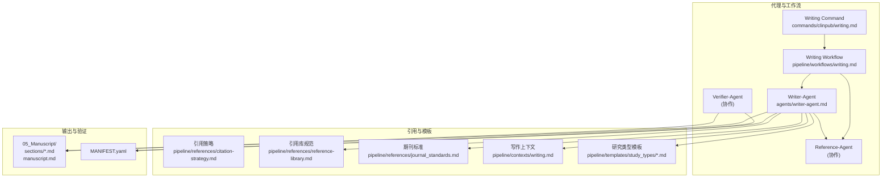
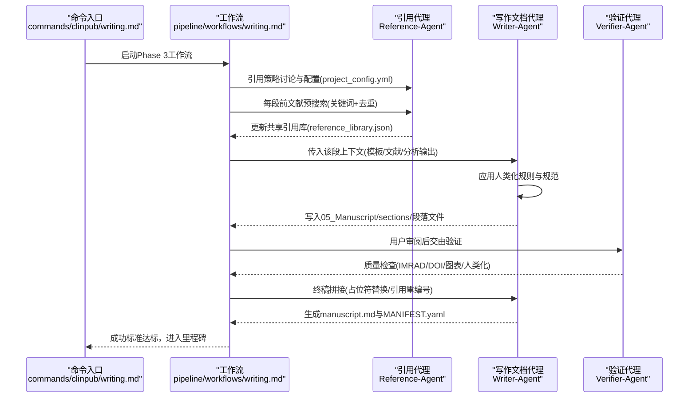
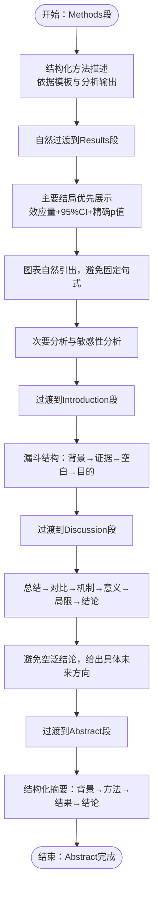
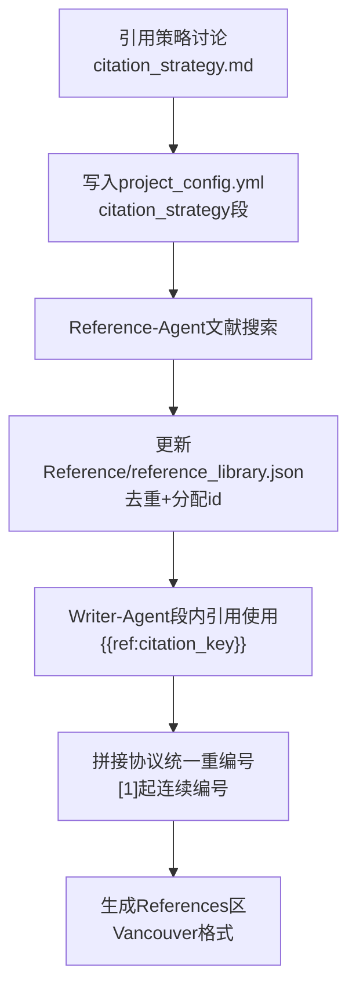
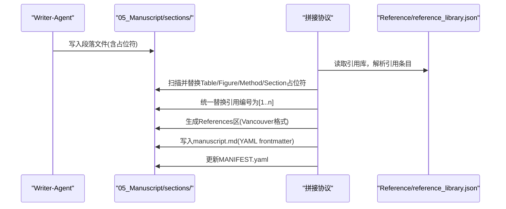
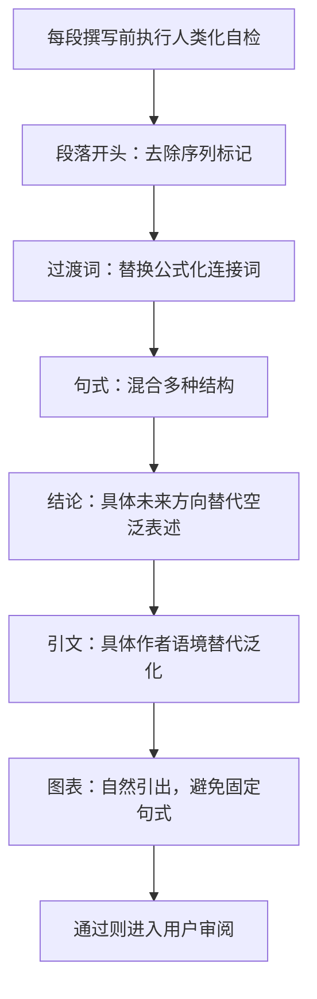
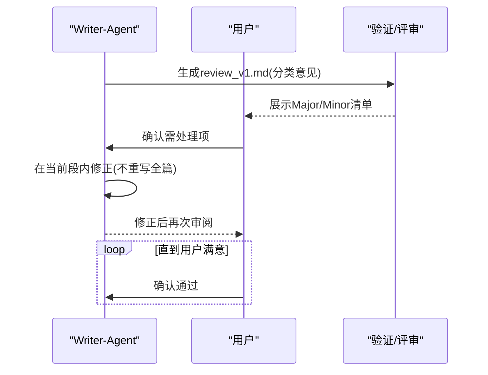
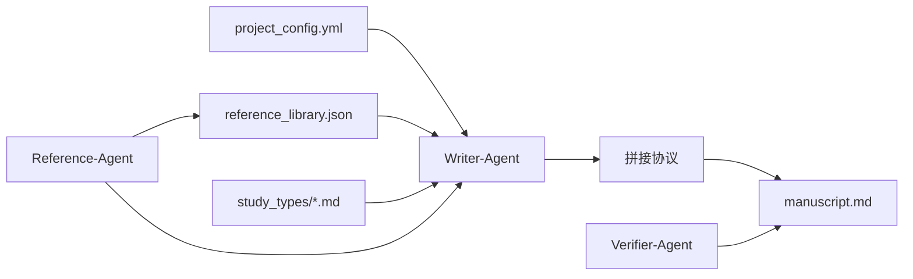

# 写作文档代理 (Writer-Agent)

<cite>
**本文档引用的文件**
- [agents/writer-agent.md](file://agents/writer-agent.md)
- [pipeline/workflows/writing.md](file://pipeline/workflows/writing.md)
- [commands/clinpub/writing.md](file://commands/clinpub/writing.md)
- [pipeline/contexts/writing.md](file://pipeline/contexts/writing.md)
- [pipeline/references/citation-strategy.md](file://pipeline/references/citation-strategy.md)
- [pipeline/references/reference-library.md](file://pipeline/references/reference-library.md)
- [pipeline/references/journal_standards.md](file://pipeline/references/journal_standards.md)
- [pipeline/references/concatenation-protocol.md](file://pipeline/references/concatenation-protocol.md)
- [examples/project_config.example.yml](file://examples/project_config.example.yml)
</cite>

## 目录
1. [简介](#简介)
2. [项目结构](#项目结构)
3. [核心组件](#核心组件)
4. [架构总览](#架构总览)
5. [详细组件分析](#详细组件分析)
6. [依赖关系分析](#依赖关系分析)
7. [性能考虑](#性能考虑)
8. [故障排查指南](#故障排查指南)
9. [结论](#结论)
10. [附录](#附录)

## 简介
写作文档代理（Writer-Agent）是面向SCI Q1/Q2期刊发表的IMRAD结构化论文撰写专家，专注于中文正文、英文图表表格的学术写作。其核心能力包括：
- IMRAD结构化写作：按Introduction → Methods → Results → Discussion → Abstract顺序产出完整草稿
- 模板驱动与规范约束：依据研究类型模板（RCT/队列/病例对照/横断面/描述性）与STROBE/CONSORT报告规范
- 引用与交叉引用管理：基于共享引用库实现去重、统一编号与段间交叉引用占位符替换
- 语言风格与逻辑连贯性：内置Anti-AI模板“人类化”规则，确保自然、学术、非AI痕迹的表达
- 多学科适配：支持广泛研究类型与术语规范，结合目标期刊标准（效应量、精确p值、多重比较校正、软件版本等）

## 项目结构
写作文档代理位于agents目录，与引用代理、分析代理、验证代理协同工作，贯穿管线的Phase 3“手稿撰写”。关键路径与职责：
- agents/writer-agent.md：定义Writer-Agent的角色、执行流程、人类化规则、评审模拟与关键约束
- pipeline/workflows/writing.md：Phase 3工作流，规定逐段顺序、引用策略讨论、文献预搜索、分段撰写与用户审阅、最终拼接
- pipeline/contexts/writing.md：语言政策、章节顺序、研究类型模板、目标期刊标准
- pipeline/references/*：引用策略、引用库规范、拼接协议、期刊标准
- commands/clinpub/writing.md：命令入口，串联工作流与成功标准
- examples/project_config.example.yml：示例项目配置，包含研究设计、变量、目标期刊等

**图表来源**
- [agents/writer-agent.md:1-166](file://agents/writer-agent.md#L1-L166)
- [pipeline/workflows/writing.md:1-330](file://pipeline/workflows/writing.md#L1-L330)
- [pipeline/contexts/writing.md:1-49](file://pipeline/contexts/writing.md#L1-L49)
- [pipeline/references/reference-library.md:1-214](file://pipeline/references/reference-library.md#L1-L214)
- [pipeline/references/journal_standards.md:1-78](file://pipeline/references/journal_standards.md#L1-L78)

**章节来源**
- [agents/writer-agent.md:1-166](file://agents/writer-agent.md#L1-L166)
- [pipeline/workflows/writing.md:1-330](file://pipeline/workflows/writing.md#L1-L330)
- [commands/clinpub/writing.md:1-56](file://commands/clinpub/writing.md#L1-L56)
- [pipeline/contexts/writing.md:1-49](file://pipeline/contexts/writing.md#L1-L49)

## 核心组件
- 角色与职责：高级学术写作顾问，负责IMRAD结构化中文正文与英文图表表格的撰写，遵循研究类型模板与人类化规则
- 执行流程：按顺序完成Methods → Results → Introduction → Discussion → Abstract；每段前由Reference-Agent进行文献预搜索，撰写后用户审阅
- 引用与交叉引用：共享引用库（JSON）统一去重与编号；段内使用占位符（{{Table:N}}、{{Figure:N}}、{{Method:name}}、{{Section:name}}）；终稿拼接时统一替换与重编号
- 人类化规则：禁止AI模板化表达，强调自然段落、多样句式、具体作者语境、自然图表集成
- 关键约束：IMRAD结构、每处引用必须有DOI、图表/表格必须存在于分析输出、应用STROBE/CONSORT清单、中文正文+英文图表表格、禁止伪造数据/引用

**章节来源**
- [agents/writer-agent.md:7-166](file://agents/writer-agent.md#L7-L166)
- [pipeline/workflows/writing.md:82-161](file://pipeline/workflows/writing.md#L82-L161)
- [pipeline/references/reference-library.md:104-151](file://pipeline/references/reference-library.md#L104-L151)
- [pipeline/references/journal_standards.md:28-36](file://pipeline/references/journal_standards.md#L28-L36)

## 架构总览
Writer-Agent在Phase 3工作流中承担“分段撰写”的核心角色，与Reference-Agent、Verifier-Agent形成协作闭环。整体流程：
- 引用策略讨论：确定各段引用数量、时间范围、IF偏好，并写入项目配置
- 文献预搜索：Reference-Agent按段落关键词搜索并更新共享引用库
- 分段撰写：Writer-Agent按模板与规范撰写，使用占位符进行交叉引用
- 用户审阅：每段完成后暂停，用户确认后进入下一段
- 终稿拼接：按IMRAD顺序合并段落，统一替换占位符与引用编号，生成manuscript.md与YAML frontmatter

**图表来源**
- [commands/clinpub/writing.md:14-56](file://commands/clinpub/writing.md#L14-L56)
- [pipeline/workflows/writing.md:25-330](file://pipeline/workflows/writing.md#L25-L330)
- [agents/writer-agent.md:15-108](file://agents/writer-agent.md#L15-L108)
- [pipeline/references/concatenation-protocol.md:28-291](file://pipeline/references/concatenation-protocol.md#L28-L291)

## 详细组件分析

### 组件A：IMRAD结构化写作与章节顺序
- 章节顺序：Methods → Results → Introduction → Discussion → Abstract（按顺序独立撰写，用户审阅暂停）
- 每段职责：
  - Methods：结构化、严谨，依据研究类型模板与分析方法输出生成初稿
  - Results：以主要结局优先，自然引出图表，报告效应量+95%CI+精确p值
  - Introduction：漏斗结构（背景→已知证据→研究空白→研究目的）
  - Discussion：总结→对比→机制→临床意义→局限→结论与未来方向
  - Abstract：结构化摘要（背景→方法→结果→结论），关键词3-6个
- 语言政策：中文正文，英文图表表格；图表分辨率≥300 DPI，矢量格式优先

**图表来源**
- [pipeline/contexts/writing.md:11-17](file://pipeline/contexts/writing.md#L11-L17)
- [agents/writer-agent.md:53-102](file://agents/writer-agent.md#L53-L102)

**章节来源**
- [pipeline/contexts/writing.md:11-17](file://pipeline/contexts/writing.md#L11-L17)
- [agents/writer-agent.md:53-102](file://agents/writer-agent.md#L53-L102)

### 组件B：引用策略与共享引用库
- 引用总量：30-55篇（硬约束），各段弹性±20%，优先缩减Discussion段
- 各段建议量：Introduction(10-15)、Methods(3-5)、Results(0-3)、Discussion(15-25)
- 文献年限：默认近5年，landmark经典文献可例外
- IF偏好：与用户讨论后写入项目配置，影响搜索筛选
- 引用格式：Vancouver编号制，正文[1][2]，末尾统一References区
- 共享引用库：JSON结构，按citation_key去重，分配全局唯一id，sections_used记录使用段落

**图表来源**
- [pipeline/references/citation-strategy.md:8-88](file://pipeline/references/citation-strategy.md#L8-L88)
- [pipeline/references/reference-library.md:13-101](file://pipeline/references/reference-library.md#L13-L101)
- [pipeline/references/concatenation-protocol.md:116-177](file://pipeline/references/concatenation-protocol.md#L116-L177)

**章节来源**
- [pipeline/references/citation-strategy.md:8-88](file://pipeline/references/citation-strategy.md#L8-L88)
- [pipeline/references/reference-library.md:13-101](file://pipeline/references/reference-library.md#L13-L101)
- [pipeline/references/concatenation-protocol.md:116-177](file://pipeline/references/concatenation-protocol.md#L116-L177)

### 组件C：交叉引用占位符与终稿拼接
- 占位符体系：
  - Table/Figure：段内主观编号，拼接时按IMRAD顺序全局重编号
  - Supplementary Table/Figure：独立编号
  - Method：拼接时替换为“the {name} analysis”
  - Section：跨段引用（如“详见Methods”）
- 拼接协议：
  - 段落合并：IMRAD顺序读取各段文件
  - 占位符替换：扫描并替换所有占位符
  - 引用重编号：按正文出现顺序分配[1]起连续编号，自然去重
  - YAML Frontmatter：自动生成title、target_journal、word_count、reference_count
  - MANIFEST.yaml：声明manuscript.md与sections/下所有文件，consumer为Verifier-Agent

**图表来源**
- [pipeline/references/reference-library.md:104-151](file://pipeline/references/reference-library.md#L104-L151)
- [pipeline/references/concatenation-protocol.md:28-291](file://pipeline/references/concatenation-protocol.md#L28-L291)

**章节来源**
- [pipeline/references/reference-library.md:104-151](file://pipeline/references/reference-library.md#L104-L151)
- [pipeline/references/concatenation-protocol.md:28-291](file://pipeline/references/concatenation-protocol.md#L28-L291)

### 组件D：人类化规则与语言风格控制
- 段落流畅性：避免“首先/其次/最后”序列式开头，强调因果/对比/递进的自然过渡
- 句式多样性：避免3句以上相同结构，混合短句、带插入语的句子、破折号/冒号结构
- 术语使用：技术术语自然嵌入，无需对每个术语进行括号解释
- 引文整合：避免“如图X所示”句式开头，具体作者语境替代“研究表明”
- 自检清单：覆盖段落开头、过渡词、句式、结论、引文、方法解释等常见AI痕迹

**图表来源**
- [agents/writer-agent.md:110-136](file://agents/writer-agent.md#L110-L136)

**章节来源**
- [agents/writer-agent.md:110-136](file://agents/writer-agent.md#L110-L136)

### 组件E：评审模拟与修订流程
- 评审模拟：生成v1评审意见，分类Major/Minor
- 评审范围：统计方法、样本量、混杂因素、结果解释（Major）；语言、引文格式、图表质量（Minor）
- 修订与回复：用户确认需处理项，Writer-Agent在当前段内修正，不重写全篇
- 循环直至满意，进入最终阶段

**图表来源**
- [agents/writer-agent.md:138-147](file://agents/writer-agent.md#L138-L147)

**章节来源**
- [agents/writer-agent.md:138-147](file://agents/writer-agent.md#L138-L147)

### 组件F：多学科与术语规范
- 研究类型模板：RCT（CONSORT）、队列/病例对照/横断面（STROBE）、描述性研究（STROBE观测）
- 期刊标准：效应量+95%CI、精确p值、多重比较校正（FDR/Bonferroni）、软件版本、图表分辨率≥300 DPI、矢量格式
- 术语规范：依据目标期刊与研究类型，采用同行可理解的术语，避免过度解释

**章节来源**
- [pipeline/contexts/writing.md:19-30](file://pipeline/contexts/writing.md#L19-L30)
- [pipeline/references/journal_standards.md:28-68](file://pipeline/references/journal_standards.md#L28-L68)

## 依赖关系分析
- Writer-Agent依赖：
  - 项目配置：project_config.yml（研究设计、变量、目标期刊、语言设置）
  - 引用库：Reference/reference_library.json（共享引用库，去重与编号）
  - 模板：pipeline/templates/study_types/*.md（研究类型模板）
  - 上游Agent：Reference-Agent（文献预搜索与引用库更新）
  - 下游Agent：Verifier-Agent（最终质量检查）
- 关键耦合点：
  - 引用策略与引用库：工作流在每段前更新引用库，Writer-Agent在段内使用占位符引用
  - 拼接协议：统一替换占位符与引用编号，生成manuscript.md
  - 人类化规则：内嵌在Writer-Agent流程中，每段自检

**图表来源**
- [pipeline/workflows/writing.md:117-161](file://pipeline/workflows/writing.md#L117-L161)
- [pipeline/references/reference-library.md:154-193](file://pipeline/references/reference-library.md#L154-L193)
- [pipeline/references/concatenation-protocol.md:235-273](file://pipeline/references/concatenation-protocol.md#L235-L273)

**章节来源**
- [pipeline/workflows/writing.md:117-161](file://pipeline/workflows/writing.md#L117-L161)
- [pipeline/references/reference-library.md:154-193](file://pipeline/references/reference-library.md#L154-L193)
- [pipeline/references/concatenation-protocol.md:235-273](file://pipeline/references/concatenation-protocol.md#L235-L273)

## 性能考虑
- 引用库读写：每段前读取与更新引用库，建议在本地磁盘快速存储，减少I/O延迟
- 占位符替换：拼接阶段一次性扫描替换，复杂度与全文长度线性相关，建议分段处理与缓存中间结果
- 人类化自检：每段执行轻量规则检查，可在内存中完成，不影响整体性能
- 并发策略：分段撰写阶段可并行（不同段落），但需确保引用库更新的串行一致性

## 故障排查指南
- 引用缺失或重复：
  - 检查Reference/reference_library.json是否存在，引用是否按citation_key去重
  - 确认拼接后References区与正文引用编号一致
- 占位符残留：
  - 拼接后使用正则扫描确认无{{Table/N}}、{{Figure/N}}、{{Method/name}}等残留
- 语言风格问题：
  - 若人类化自检未通过，按清单逐项修正（段落开头、过渡词、句式、结论、引文、方法解释）
- 图表/表格缺失：
  - 确保文中引用的图表均存在于04_Outputs/，并在拼接时正确替换为全局编号
- 评审意见未处理：
  - 检查review_v1.md的分类与处理状态，逐项修正后重新审阅

**章节来源**
- [pipeline/references/reference-library.md:177-187](file://pipeline/references/reference-library.md#L177-L187)
- [pipeline/references/concatenation-protocol.md:276-291](file://pipeline/references/concatenation-protocol.md#L276-L291)
- [agents/writer-agent.md:110-136](file://agents/writer-agent.md#L110-L136)

## 结论
写作文档代理通过严格的IMRAD结构、模板驱动、共享引用库与人类化规则，实现了高质量、可复现的学术论文草稿生成。其分段撰写与用户审阅流程确保内容可控，拼接协议保障引用与交叉引用的一致性与规范性。结合目标期刊标准与研究类型模板，Writer-Agent能够高效满足SCI Q1/Q2期刊的发表要求。

## 附录

### 写作参数配置与质量控制
- 项目配置示例：包含研究设计、变量、目标期刊、语言设置、质量参数等
- 引用策略：总量约束、段落配比、年限策略、IF偏好
- 引用库：JSON结构、去重键、Vancouver格式、段落引用量指南
- 拼接协议：段落合并、占位符替换、引用重编号、YAML Frontmatter生成

**章节来源**
- [examples/project_config.example.yml:8-68](file://examples/project_config.example.yml#L8-L68)
- [pipeline/references/citation-strategy.md:8-88](file://pipeline/references/citation-strategy.md#L8-L88)
- [pipeline/references/reference-library.md:13-101](file://pipeline/references/reference-library.md#L13-L101)
- [pipeline/references/concatenation-protocol.md:28-291](file://pipeline/references/concatenation-protocol.md#L28-L291)