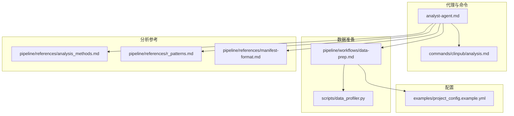
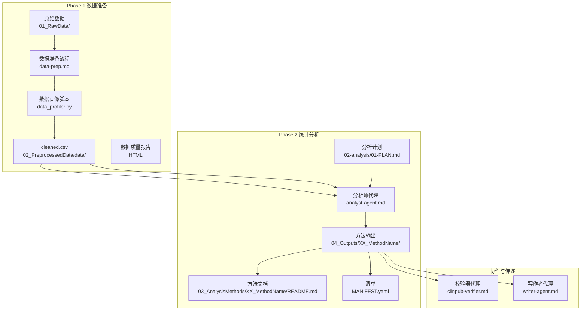
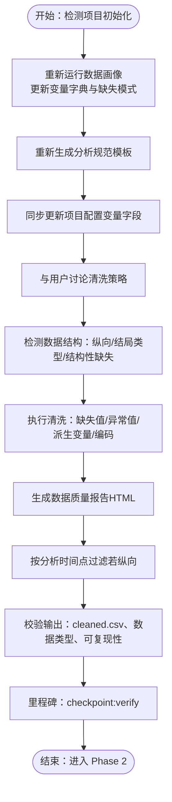
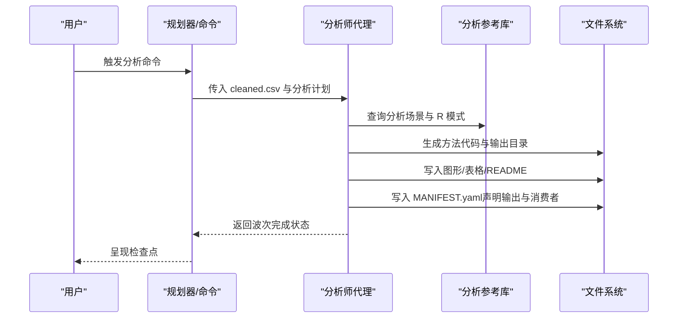
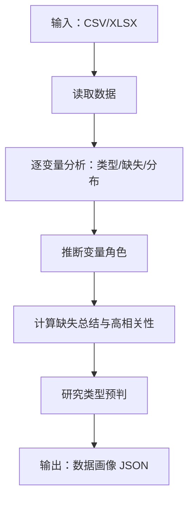
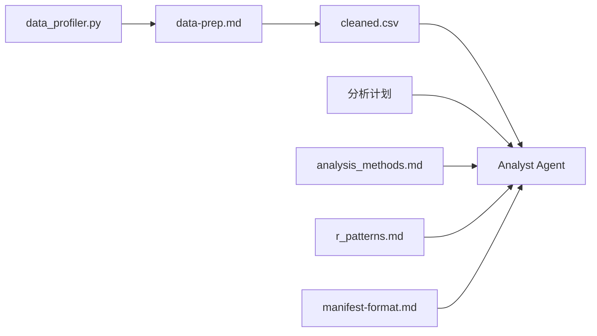

# 分析师代理 (Analyst-Agent)

<cite>
**本文引用的文件**
- [analyst-agent.md](file://agents/analyst-agent.md)
- [analysis.md](file://commands/clinpub/analysis.md)
- [data-prep.md](file://pipeline/workflows/data-prep.md)
- [data_profiler.py](file://scripts/data_profiler.py)
- [analysis_methods.md](file://pipeline/references/analysis_methods.md)
- [r_patterns.md](file://pipeline/references/r_patterns.md)
- [manifest-format.md](file://pipeline/references/manifest-format.md)
- [project_config.example.yml](file://examples/project_config.example.yml)
</cite>

## 目录
1. [简介](#简介)
2. [项目结构](#项目结构)
3. [核心组件](#核心组件)
4. [架构总览](#架构总览)
5. [详细组件分析](#详细组件分析)
6. [依赖分析](#依赖分析)
7. [性能考虑](#性能考虑)
8. [故障排查指南](#故障排查指南)
9. [结论](#结论)
10. [附录](#附录)

## 简介
分析师代理是“类科学管道”中的核心分析引擎，负责两阶段工作流：
- 数据准备阶段（Phase 1）：清洗与质量评估，生成 clean 数据与数据质量报告，并产出清单（MANIFEST）以驱动后续流程。
- 统计分析阶段（Phase 2）：按波次（wave）顺序执行用户确认的定制化分析计划，生成出版级图形与表格，并输出方法文档。

该代理强调“先诊断、再建议、后执行”的闭环：在数据准备阶段通过数据画像与结构检测辅助诊断；在统计分析阶段依据动态生成的分析计划，结合参考库与标准模板，生成可复现、可审计的分析产物。

## 项目结构
与分析师代理直接相关的目录与文件包括：
- agents/analyst-agent.md：代理职责、执行流程、发布标准与关键规则
- pipeline/workflows/data-prep.md：数据准备阶段的端到端流程与里程碑
- commands/clinpub/analysis.md：分析命令的执行上下文与成功标准
- scripts/data_profiler.py：数据画像工具，用于变量角色识别、缺失模式、相关性与研究类型预判
- pipeline/references/analysis_methods.md：分析场景参考（含常见方法与参数）
- pipeline/references/r_patterns.md：R 实现模式与出版级绘图标准
- pipeline/references/manifest-format.md：清单格式与下游消费者声明
- examples/project_config.example.yml：项目配置示例（变量与路径）

**图表来源**
- [analyst-agent.md:1-141](file://agents/analyst-agent.md#L1-L141)
- [analysis.md:1-37](file://commands/clinpub/analysis.md#L1-L37)
- [data-prep.md:1-184](file://pipeline/workflows/data-prep.md#L1-L184)
- [data_profiler.py:1-353](file://scripts/data_profiler.py#L1-L353)
- [analysis_methods.md](file://pipeline/references/analysis_methods.md)
- [r_patterns.md](file://pipeline/references/r_patterns.md)
- [manifest-format.md](file://pipeline/references/manifest-format.md)
- [project_config.example.yml](file://examples/project_config.example.yml)

**章节来源**
- [analyst-agent.md:1-141](file://agents/analyst-agent.md#L1-L141)
- [analysis.md:1-37](file://commands/clinpub/analysis.md#L1-L37)
- [data-prep.md:1-184](file://pipeline/workflows/data-prep.md#L1-L184)
- [data_profiler.py:1-353](file://scripts/data_profiler.py#L1-L353)

## 核心组件
- 代理职责与流程
  - 职责：R 主、Python 次，承担数据清洗、统计分析、出版级图形与表格生成；处理基线表、组间比较、回归、生存、ROC、LASSO 面板与机器学习等任务。
  - 流程：加载项目配置与清洗后的数据，执行 Tiered 缺失值处理、异常值检测、派生变量与编码、训练/验证划分（如适用）、生成数据质量报告；随后按波次执行用户确认的分析计划，生成图形、表格与方法文档，并在每个输出目录写入清单。
- 关键规则与发布标准
  - 每个方法必须同时输出图形、表格与 README。
  - 严格从 clean 数据源读取，确保独立可复现。
  - 报告效应量、95% 置信区间与精确 p 值。
  - 多重比较采用 FDR 或 Bonferroni 校正。
  - 图形分辨率≥300 DPI，字体、色彩、尺寸、网格等遵循出版级主题。
- 输入输出约定
  - 输入：项目配置、cleaned.csv。
  - 输出：04_Outputs/XX_MethodName/（图形、表格、清单）、03_AnalysisMethods/XX_MethodName/README.md。

**章节来源**
- [analyst-agent.md:7-141](file://agents/analyst-agent.md#L7-L141)

## 架构总览
分析师代理贯穿“数据准备—统计分析—写作”三阶段，其与相关 Agent 的协作关系如下：

**图表来源**
- [analyst-agent.md:10-141](file://agents/analyst-agent.md#L10-L141)
- [data-prep.md:100-171](file://pipeline/workflows/data-prep.md#L100-L171)
- [analysis.md:14-37](file://commands/clinpub/analysis.md#L14-L37)

## 详细组件分析

### 数据准备阶段（Phase 1）
- 目标：将原始患者水平数据转换为分析就绪的 cleaned.csv，包含完整的质量文档；在歧义点与用户确认后执行清洗策略。
- 关键步骤
  - 重新运行数据画像以更新变量字典与缺失模式。
  - 重新生成分析规范模板（spec.md）。
  - 同步更新项目配置中的变量字段。
  - 讨论清洗策略：缺失值分级处理、异常值处理、变量编码、派生变量、训练/验证划分。
  - 检测数据结构：纵向数据识别、结局类型判断、结构性缺失标注。
  - 执行清洗：导入数据、缺失值处理、异常值检测、派生变量与编码、生成数据质量报告、必要时按分析时间点过滤。
  - 校验输出：验证 cleaned.csv、数据类型、清洗代码可复现性。
  - 里程碑：正式关闭 Phase 1 并进入 Phase 2。
- 与分析师代理的衔接
  - Analyst 从 cleaned.csv 读取数据，确保单一数据源。
  - 数据质量报告与结构注解为 Phase 2 方法选择与实现提供依据。

**图表来源**
- [data-prep.md:19-171](file://pipeline/workflows/data-prep.md#L19-L171)

**章节来源**
- [data-prep.md:6-184](file://pipeline/workflows/data-prep.md#L6-L184)

### 统计分析阶段（Phase 2）
- 目标：按波次顺序执行用户确认的分析计划，生成出版级图形与表格，并输出方法文档。
- 关键步骤
  - 加载项目配置与 cleaned.csv。
  - 读取分析计划（按波次组织），逐方法执行：
    - 解析方法规格（变量、公式、方法类型）。
    - 查阅分析场景参考与 R 模式库，生成符合出版级标准的 R/Python 代码。
    - 运行代码、验证输出、生成 README。
  - 每个波次完成后，在 04_Outputs/ 目录写入清单，声明所有方法输出并标注写作者代理为下游消费者。
  - 波次结束后呈现检查点。
- 常见分析模式（示例）
  - 基线表、两组比较、重复测量、线性/逻辑回归、生存分析、相关性分析、ROC 分析等。
- 发布标准
  - 图形分辨率≥300 DPI，字体、色彩、尺寸、网格遵循出版级主题。
  - 报告效应量、95% 置信区间与精确 p 值。
  - 多重比较校正、假设检验（正态性、方差齐性、比例风险）。

**图表来源**
- [analyst-agent.md:17-107](file://agents/analyst-agent.md#L17-L107)
- [analysis.md:14-37](file://commands/clinpub/analysis.md#L14-L37)

**章节来源**
- [analyst-agent.md:17-141](file://agents/analyst-agent.md#L17-L141)
- [analysis.md:14-37](file://commands/clinpub/analysis.md#L14-L37)

### 数据画像与研究类型预判（辅助诊断）
- 功能概述
  - 读取 CSV/XLSX，输出结构化数据画像：变量字典、分布摘要、缺失模式、相关性、研究类型预判。
  - 自动识别变量角色（结局、暴露、时间、协变量、标志物、匹配、ID 等）。
  - 基于变量角色与取值推断研究设计类型（如 RCT、队列研究、横断面、病例对照、标志物面板、诊断性研究、描述性研究）。
- 使用场景
  - 在数据准备阶段为清洗策略与分析计划提供依据。
  - 作为项目配置同步与 spec 模板生成的数据基础。

**图表来源**
- [data_profiler.py:201-325](file://scripts/data_profiler.py#L201-L325)

**章节来源**
- [data_profiler.py:1-353](file://scripts/data_profiler.py#L1-L353)

### 分析算法与决策逻辑
- 缺失值处理（Tiered 策略）
  - <5%：删除或填补（均值/中位数/众数）。
  - 5%-20%：MICE 插补（需记录插补模型）。
  - >20%：提示用户讨论后再决定。
- 异常值检测
  - 连续变量：IQR 或 Z-score（|Z|>3）。
  - 分类变量：检查意外取值。
- 派生变量与编码
  - 创建计算变量、设置因子水平与参考类别、应用变换（对数、Box-Cox 等）。
- 方法选择与实现
  - 标准方法：t 检验、Wilcoxon 秩和检验、线性/广义线性模型、混合模型。
  - 复杂方法：参考 R 模式库（主题、绘图、目录规则）。
- 多重比较校正与假设检验
  - 效应量、95% CI、精确 p 值。
  - 正态性、方差齐性、比例风险假设。

**章节来源**
- [analyst-agent.md:30-75](file://agents/analyst-agent.md#L30-L75)
- [data-prep.md:100-130](file://pipeline/workflows/data-prep.md#L100-L130)

### 输出格式与清单管理
- 输出目录与命名
  - 04_Outputs/XX_MethodName/：图形、表格、清单。
  - 03_AnalysisMethods/XX_MethodName/README.md：方法目的、统计方法、输入变量、输出文件、解读要点。
- 清单（MANIFEST.yaml）
  - 声明所有方法输出与下游消费者（如写作者代理），遵循清单格式规范。
- 发布标准
  - 图形分辨率≥300 DPI，字体、色彩、尺寸、网格遵循出版级主题；英文标签与标题。

**章节来源**
- [analyst-agent.md:14-141](file://agents/analyst-agent.md#L14-L141)
- [manifest-format.md](file://pipeline/references/manifest-format.md)

## 依赖分析
- 组件耦合
  - Analyst 依赖 cleaned.csv 与分析计划；依赖分析场景参考与 R 模式库；依赖清单格式规范。
  - 数据准备阶段为 Analyst 提供单一可信数据源与质量报告。
- 外部依赖
  - R/Python 生态（ggplot2、gtsummary、survival、pROC、lme4 等）。
  - Pandas/Numpy（数据画像脚本）。
- 潜在循环依赖
  - 通过“单一数据源”与“波次顺序”避免循环；清单声明下游消费者，形成单向数据流。

**图表来源**
- [analyst-agent.md:17-107](file://agents/analyst-agent.md#L17-L107)
- [data-prep.md:100-171](file://pipeline/workflows/data-prep.md#L100-L171)
- [data_profiler.py:1-353](file://scripts/data_profiler.py#L1-353)

**章节来源**
- [analyst-agent.md:17-141](file://agents/analyst-agent.md#L17-L141)
- [data-prep.md:100-171](file://pipeline/workflows/data-prep.md#L100-L171)

## 性能考虑
- 数据规模与相关性计算
  - 当数值变量超过一定阈值时，跳过完整相关性矩阵以降低计算开销。
- 代码可复现性
  - 严格从 cleaned.csv 读取，确保分析代码可独立运行。
- 图形输出
  - 统一分辨率与主题，减少后期调整成本。
- 并行与波次
  - 按波次顺序执行，避免资源争用；波次内方法可并行（视具体实现而定）。

**章节来源**
- [data_profiler.py:279-298](file://scripts/data_profiler.py#L279-L298)
- [analyst-agent.md:129-141](file://agents/analyst-agent.md#L129-L141)

## 故障排查指南
- 常见问题
  - cleaned.csv 不存在或数据类型错误：检查数据准备阶段是否完成，确认结构注解与分析时间点过滤。
  - 缺失值处理分歧：依据 Tiered 策略与用户确认记录，必要时回退到 MICE 或人工干预。
  - 图形不符合发布标准：核对分辨率、主题、字体与颜色；确保英文标签与标题。
  - 多重比较未校正：在分析计划中明确校正方法，并在 README 中记录。
- 调试技巧
  - 在方法输出目录写入清单，便于追踪输出与消费者。
  - 使用数据质量报告定位异常值与缺失模式。
  - 将分析代码与 README 一起提交，确保可复现性。

**章节来源**
- [analyst-agent.md:122-141](file://agents/analyst-agent.md#L122-L141)
- [data-prep.md:132-145](file://pipeline/workflows/data-prep.md#L132-L145)

## 结论
分析师代理通过“诊断—建议—执行”的闭环，将数据准备与统计分析有机衔接，确保分析过程可审计、可复现、可扩展。其关键在于：
- 严格的单一数据源与发布标准；
- 基于数据画像与分析场景参考的方法选择；
- 清晰的波次顺序与清单管理；
- 与校验器与写作者代理的协作，保障质量与交付。

## 附录

### 使用示例：调用分析师代理进行数据分析与方法选择
- 准备阶段
  - 确保 02_PreprocessedData/data/cleaned.csv 存在。
  - 生成分析计划（由诊断与提议流程生成，经用户确认）。
- 执行阶段
  - 触发分析命令，代理按波次顺序执行方法，生成图形、表格与 README。
  - 每个方法输出目录写入清单，声明下游消费者（如写作者代理）。
- 验证阶段
  - 校验图形分辨率与主题、效应量与 p 值、多重比较校正与假设检验。
  - 通过清单与 README 确认输出完整性与可复现性。

**章节来源**
- [analysis.md:14-37](file://commands/clinpub/analysis.md#L14-L37)
- [analyst-agent.md:17-107](file://agents/analyst-agent.md#L17-L107)

### 配置选项说明
- 项目配置（示例）
  - 变量字段：结局、协变量、分组变量等由数据画像与 spec 模板自动填充。
  - 路径字段：原始数据路径、输出目录等由命令与工作流解析。
- 分析参考
  - 分析场景参考与 R 模式库用于指导方法实现与绘图标准化。
- 清单格式
  - 清单声明输出文件与下游消费者，确保任务分配与结果传递清晰。

**章节来源**
- [project_config.example.yml](file://examples/project_config.example.yml)
- [analysis_methods.md](file://pipeline/references/analysis_methods.md)
- [r_patterns.md](file://pipeline/references/r_patterns.md)
- [manifest-format.md](file://pipeline/references/manifest-format.md)