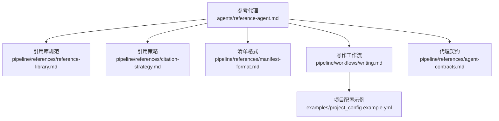
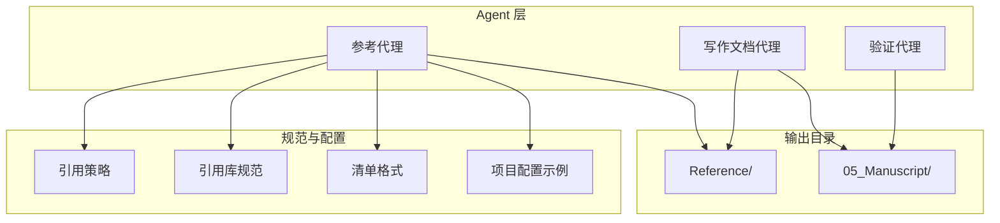
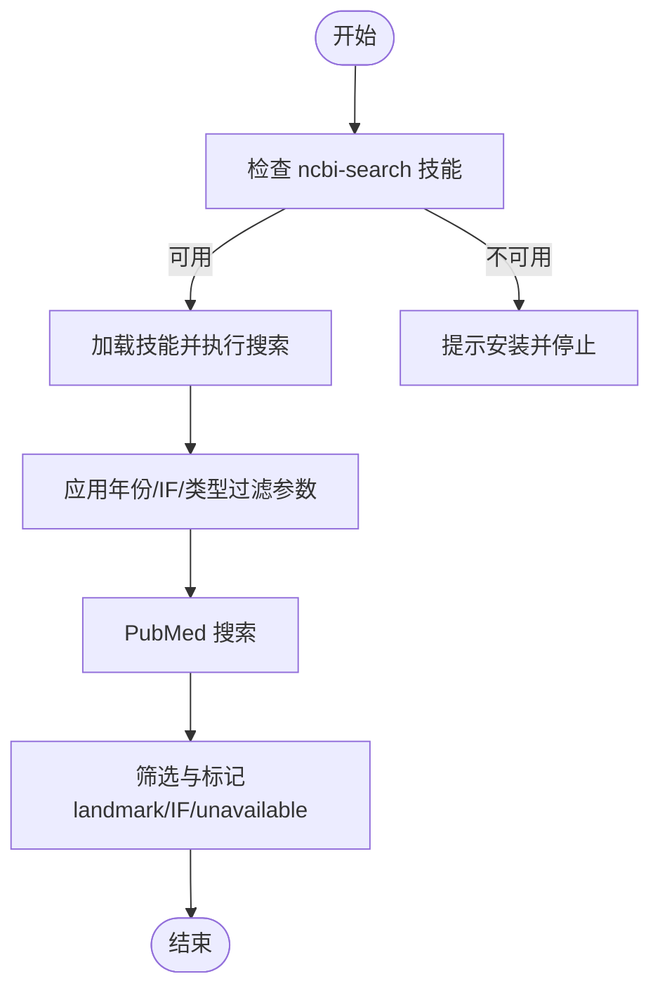
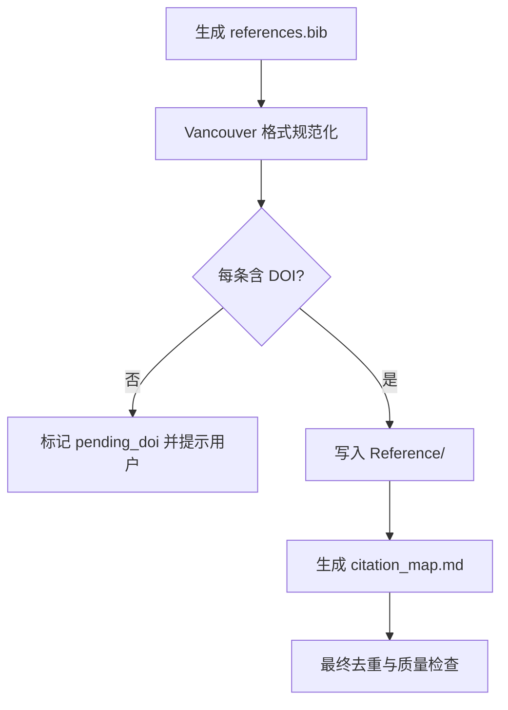
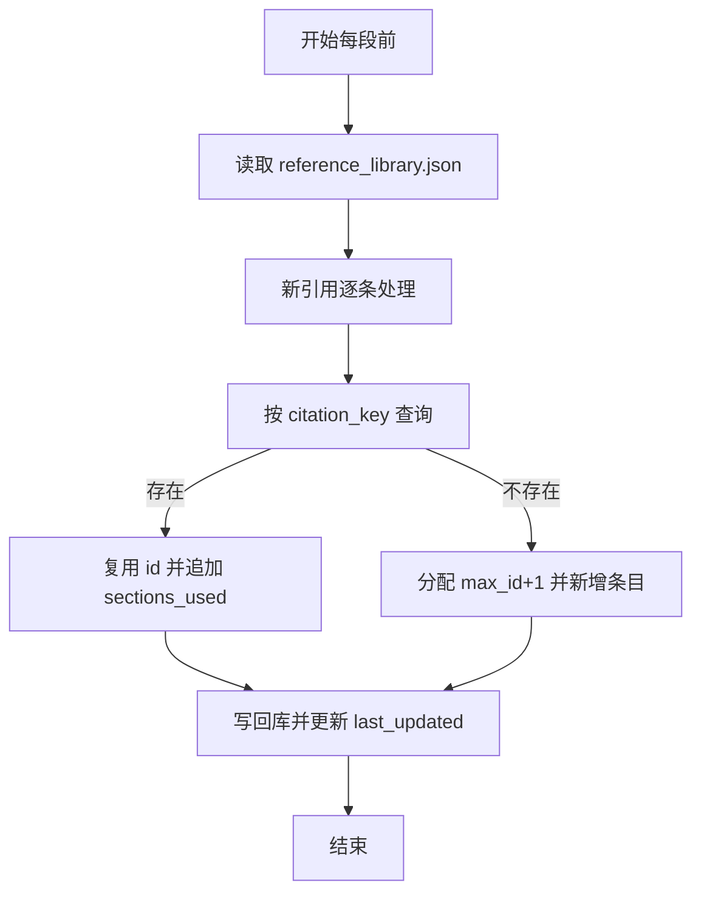
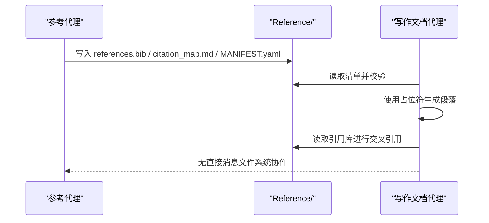
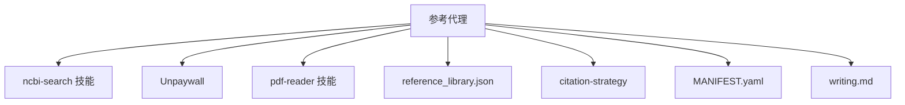

# 参考代理 (Reference-Agent)

<cite>
**本文引用的文件**
- [agents/reference-agent.md](file://agents/reference-agent.md)
- [pipeline/references/reference-library.md](file://pipeline/references/reference-library.md)
- [pipeline/references/citation-strategy.md](file://pipeline/references/citation-strategy.md)
- [pipeline/references/manifest-format.md](file://pipeline/references/manifest-format.md)
- [pipeline/workflows/writing.md](file://pipeline/workflows/writing.md)
- [pipeline/references/agent-contracts.md](file://pipeline/references/agent-contracts.md)
- [examples/project_config.example.yml](file://examples/project_config.example.yml)
- [docs/ARCHITECTURE.md](file://docs/ARCHITECTURE.md)
- [docs/getting-started.md](file://docs/getting-started.md)
- [commands/clinpub/writing.md](file://commands/clinpub/writing.md)
- [CHANGELOG.md](file://CHANGELOG.md)
- [INSTALL.md](file://INSTALL.md)
- [AGENTS.md](file://AGENTS.md)
</cite>

## 目录
1. [简介](#简介)
2. [项目结构](#项目结构)
3. [核心组件](#核心组件)
4. [架构总览](#架构总览)
5. [详细组件分析](#详细组件分析)
6. [依赖关系分析](#依赖关系分析)
7. [性能考量](#性能考量)
8. [故障排查指南](#故障排查指南)
9. [结论](#结论)
10. [附录](#附录)

## 简介
参考代理（Reference Agent）是“Clinpub”科学写作流水线中的文献检索与引用管理专家，负责：
- 文献检索：基于 PubMed 的系统性搜索，支持 MeSH 扩展、年份过滤、文章类型过滤与 IF 偏好
- 引用生成：输出 Vancouver 格式的 references.bib 与 citation_map.md
- 库管理：维护共享引用库 reference_library.json，实现跨段落去重与统一编号
- 协作集成：与写作文档系统协作，通过占位符与清单文件（MANIFEST.yaml）实现端到端引用闭环

代理严格遵循“每条引用必须有 DOI”的原则，并在搜索策略、去重与质量评估方面提供清晰的流程与规范。

## 项目结构
参考代理位于“agents/reference-agent.md”，并与以下规范文件协同工作：
- 引用库规范：pipeline/references/reference-library.md
- 引用策略：pipeline/references/citation-strategy.md
- 清单格式：pipeline/references/manifest-format.md
- 写作工作流：pipeline/workflows/writing.md
- 代理契约：pipeline/references/agent-contracts.md
- 示例配置：examples/project_config.example.yml

**图示来源**
- [agents/reference-agent.md:1-321](file://agents/reference-agent.md#L1-L321)
- [pipeline/references/reference-library.md:1-214](file://pipeline/references/reference-library.md#L1-L214)
- [pipeline/references/citation-strategy.md:1-88](file://pipeline/references/citation-strategy.md#L1-L88)
- [pipeline/references/manifest-format.md:1-187](file://pipeline/references/manifest-format.md#L1-L187)
- [pipeline/workflows/writing.md:1-330](file://pipeline/workflows/writing.md#L1-L330)
- [pipeline/references/agent-contracts.md:1-156](file://pipeline/references/agent-contracts.md#L1-L156)
- [examples/project_config.example.yml:1-68](file://examples/project_config.example.yml#L1-L68)

**章节来源**
- [agents/reference-agent.md:1-321](file://agents/reference-agent.md#L1-L321)
- [pipeline/references/reference-library.md:1-214](file://pipeline/references/reference-library.md#L1-L214)
- [pipeline/references/citation-strategy.md:1-88](file://pipeline/references/citation-strategy.md#L1-L88)
- [pipeline/references/manifest-format.md:1-187](file://pipeline/references/manifest-format.md#L1-L187)
- [pipeline/workflows/writing.md:1-330](file://pipeline/workflows/writing.md#L1-L330)
- [pipeline/references/agent-contracts.md:1-156](file://pipeline/references/agent-contracts.md#L1-L156)
- [examples/project_config.example.yml:1-68](file://examples/project_config.example.yml#L1-L68)

## 核心组件
- 文献检索与过滤
  - 使用 ncbi-search 技能访问 NCBI E-Utilities（PubMed/基因/蛋白质等），支持 MeSH 扩展、年份过滤、文章类型过滤
  - 支持 IF 偏好（min_if）与年限策略（max_years_ago），并允许 landmark 经典文献例外
- 引用生成与格式化
  - 输出 references.bib（Vancouver 编号制，每条含 DOI）
  - 输出 citation_map.md（PMID、DOI、引用位置、引用理由、支撑论点）
- 引用库管理
  - 维护 reference_library.json（共享引用库），以 citation_key（AuthorYear）为主键进行去重
  - 自动分配全局唯一 id，记录首次添加段落与引用原因，支持跨段落复用
- 与写作文档系统协作
  - 通过占位符（如 {{Table:N}}, {{Method:name}}, {{Section:name}}）实现跨段落交叉引用
  - 通过 MANIFEST.yaml 声明输出与消费者，保障下游（Writer Agent）正确消费

**章节来源**
- [agents/reference-agent.md:47-91](file://agents/reference-agent.md#L47-L91)
- [agents/reference-agent.md:249-272](file://agents/reference-agent.md#L249-L272)
- [pipeline/references/reference-library.md:154-193](file://pipeline/references/reference-library.md#L154-L193)
- [pipeline/references/manifest-format.md:102-123](file://pipeline/references/manifest-format.md#L102-L123)

## 架构总览
参考代理在“Clinpub”流水线中的职责边界与协作关系如下：
- 职责边界：专注文献检索、引用管理与清单输出，不参与统计分析与文本撰写
- 输入：project_config.yml（含 citation_strategy）、用户提供的种子文献
- 输出：Reference/ 目录下的 references.bib、citation_map.md、MANIFEST.yaml
- 协作：Writer Agent 从 Reference/ 读取引用与清单；Verifier 在终稿阶段校验引用完整性

**图示来源**
- [pipeline/references/agent-contracts.md:35-61](file://pipeline/references/agent-contracts.md#L35-L61)
- [pipeline/workflows/writing.md:69-80](file://pipeline/workflows/writing.md#L69-L80)
- [pipeline/references/manifest-format.md:102-123](file://pipeline/references/manifest-format.md#L102-L123)
- [pipeline/references/reference-library.md:154-193](file://pipeline/references/reference-library.md#L154-L193)

**章节来源**
- [pipeline/references/agent-contracts.md:35-61](file://pipeline/references/agent-contracts.md#L35-L61)
- [pipeline/workflows/writing.md:69-80](file://pipeline/workflows/writing.md#L69-L80)
- [pipeline/references/manifest-format.md:102-123](file://pipeline/references/manifest-format.md#L102-L123)
- [pipeline/references/reference-library.md:154-193](file://pipeline/references/reference-library.md#L154-L193)

## 详细组件分析

### 组件A：文献检索与过滤
- 检索前置检查
  - 校验 ncbi-search 技能可用性；若缺失，提示安装并停止执行
  - 可选检查 NCBI_API_KEY 环境变量，提升 PubMed 请求速率
- 搜索参数与策略
  - 默认近 5 年文献；支持 landmark 经典文献例外
  - 支持 min_if（影响因子偏好）；无 IF 的文献标记为“IF unavailable”
  - 文章类型过滤：排除 case reports、editorials、errata
- 触发阶段
  - Phase 0：确认研究空白
  - Phase 3：全量预搜索（疾病、暴露/生物标志物、结局、人群）
  - 写作期间：按章节主题进行补充搜索
  - Phase 4：针对审稿人提出的问题进行定向补充搜索

**图示来源**
- [agents/reference-agent.md:16-45](file://agents/reference-agent.md#L16-L45)
- [agents/reference-agent.md:47-91](file://agents/reference-agent.md#L47-L91)
- [pipeline/references/citation-strategy.md:28-47](file://pipeline/references/citation-strategy.md#L28-L47)

**章节来源**
- [agents/reference-agent.md:16-45](file://agents/reference-agent.md#L16-L45)
- [agents/reference-agent.md:47-91](file://agents/reference-agent.md#L47-L91)
- [pipeline/references/citation-strategy.md:28-47](file://pipeline/references/citation-strategy.md#L28-L47)

### 组件B：引用生成与格式标准化
- 输出规范
  - references.bib：Vancouver 编号制，正文使用上标或方括号编号，末尾统一 References 区
  - citation_map.md：包含 PMID、DOI、引用位置、引用理由、支撑论点
- 引用格式要点
  - 正文内引用：单篇[1]、连续[1-3]、不连续[1,4,7]、作者融入正文
  - References 区：作者、标题、期刊、年份、卷期、页码、DOI
- 质量保证
  - 每条引用必须有 DOI；无 DOI 的引用标记为 pending_doi 并在段落末尾标注⚠️
  - 最终阶段去重，禁止重复引用

**图示来源**
- [agents/reference-agent.md:249-272](file://agents/reference-agent.md#L249-L272)
- [pipeline/references/reference-library.md:71-101](file://pipeline/references/reference-library.md#L71-L101)

**章节来源**
- [agents/reference-agent.md:249-272](file://agents/reference-agent.md#L249-L272)
- [pipeline/references/reference-library.md:71-101](file://pipeline/references/reference-library.md#L71-L101)

### 组件C：引用库构建与维护
- JSON 结构与字段
  - 全局唯一 id、citation_key（AuthorYear）、title、authors、journal、year、volume、issue、pages、doi、pmid、sections_used、added_by_section、citation_reason
- 写入规则（D-09）
  - 查询 citation_key 去重；已存在则复用 id 并追加 sections_used；不存在则分配 max_id+1
  - 去重键策略：citation_key；同 AuthorYear 的不同论文加后缀区分
  - DOI 必填；无 DOI 标记为 pending_doi
- 读写流程
  - 每段前：读取现有库 → 检查去重 → 分配 id → 写回库 → 更新 last_updated
  - 撰写时：使用 {{ref:citation_key}} 标记引用，正文以 [id] 使用
  - 终稿拼接：扫描 [id] → 重编号 → 生成 References 区 → 更新 sections_used

**图示来源**
- [pipeline/references/reference-library.md:154-166](file://pipeline/references/reference-library.md#L154-L166)
- [pipeline/references/reference-library.md:42-67](file://pipeline/references/reference-library.md#L42-L67)

**章节来源**
- [pipeline/references/reference-library.md:154-166](file://pipeline/references/reference-library.md#L154-L166)
- [pipeline/references/reference-library.md:42-67](file://pipeline/references/reference-library.md#L42-L67)

### 组件D：与写作文档系统的协作
- 占位符与交叉引用
  - Table/Figure：{{Table:N}}, {{Figure:N}}, {{SupplementaryTable:N}}, {{SupplementaryFigure:N}}
  - 方法引用：{{Method:name}}
  - 段间引用：{{Section:name}}
  - 全局重编号：按 IMRAD 顺序（Methods → Results → Discussion → Intro）统一编号
- MANIFEST.yaml
  - Reference Agent 在 Reference/ 写入清单，声明 outputs 与 handoffs（Writer Agent）
  - Writer Agent 在消费前读取并验证清单，确保所需文件存在与质量达标

**图示来源**
- [pipeline/references/manifest-format.md:102-123](file://pipeline/references/manifest-format.md#L102-L123)
- [pipeline/workflows/writing.md:120-137](file://pipeline/workflows/writing.md#L120-L137)
- [pipeline/references/reference-library.md:104-150](file://pipeline/references/reference-library.md#L104-L150)

**章节来源**
- [pipeline/references/manifest-format.md:102-123](file://pipeline/references/manifest-format.md#L102-L123)
- [pipeline/workflows/writing.md:120-137](file://pipeline/workflows/writing.md#L120-L137)
- [pipeline/references/reference-library.md:104-150](file://pipeline/references/reference-library.md#L104-L150)

### 组件E：方法搜索与阶段调研（可选增强）
- 方法搜索（method_search）
  - 触发条件：用户明确提及未知统计方法
  - 搜索策略：PubMed 搜索“{method_name} statistical method”，优先 review，罕见方法搜索 clinical_trial
  - 输出：摘要轨（默认）+ 附件轨（深入层，含原理、R 代码、示例与注意事项）
- 阶段调研（phase_research）
  - 触发条件：在 GSD 计划阶段前为后续 Phase 提供领域/技术背景
  - 轨道选择：Track A（领域）/ Track B（技术）/ 双轨
  - 输出：RESEARCH.md，写入对应 Phase 目录，不覆盖既有文件

**章节来源**
- [agents/reference-agent.md:93-166](file://agents/reference-agent.md#L93-L166)
- [agents/reference-agent.md:168-238](file://agents/reference-agent.md#L168-L238)

## 依赖关系分析
- 外部依赖
  - ncbi-search 技能：PubMed 搜索入口，提供 E-Utilities API 访问
  - Unpaywall：开放获取状态检查与 PDF 下载（可选）
  - pdf-reader 技能：PDF 全文抽取（可选）
- 内部依赖
  - 引用库（reference_library.json）：跨段落去重与统一编号
  - 引用策略（citation-strategy）：总量、段配比、年限、IF 偏好
  - 清单格式（MANIFEST.yaml）：跨代理协作契约
  - 写作工作流（writing.md）：逐段顺序撰写与用户审阅暂停

**图示来源**
- [agents/reference-agent.md:16-45](file://agents/reference-agent.md#L16-L45)
- [agents/reference-agent.md:240-247](file://agents/reference-agent.md#L240-L247)
- [pipeline/references/reference-library.md:154-193](file://pipeline/references/reference-library.md#L154-L193)
- [pipeline/references/citation-strategy.md:1-88](file://pipeline/references/citation-strategy.md#L1-L88)
- [pipeline/references/manifest-format.md:102-123](file://pipeline/references/manifest-format.md#L102-L123)
- [pipeline/workflows/writing.md:69-80](file://pipeline/workflows/writing.md#L69-L80)

**章节来源**
- [agents/reference-agent.md:16-45](file://agents/reference-agent.md#L16-L45)
- [agents/reference-agent.md:240-247](file://agents/reference-agent.md#L240-L247)
- [pipeline/references/reference-library.md:154-193](file://pipeline/references/reference-library.md#L154-L193)
- [pipeline/references/citation-strategy.md:1-88](file://pipeline/references/citation-strategy.md#L1-L88)
- [pipeline/references/manifest-format.md:102-123](file://pipeline/references/manifest-format.md#L102-L123)
- [pipeline/workflows/writing.md:69-80](file://pipeline/workflows/writing.md#L69-L80)

## 性能考量
- 请求速率与限流
  - ncbi-search 技能内置速率控制：无 NCBI_API_KEY 时 3 req/s，设置 NCBI_API_KEY 后可达 10 req/s
  - 建议在环境变量中配置 NCBI_API_KEY 以提升搜索吞吐
- 搜索策略优化
  - 合理设置 max_years_ago 与 min_if，减少无关文献，缩短筛选时间
  - 使用 landmark 例外清单，避免无效搜索
- 输出与去重
  - 在最终阶段进行去重与编号重排，减少引用库写入次数
  - 使用 MANIFEST.yaml 提前校验下游消费条件，避免无效重试

**章节来源**
- [agents/reference-agent.md:44](file://agents/reference-agent.md#L44)
- [INSTALL.md:87](file://INSTALL.md#L87)
- [INSTALL.md:112](file://INSTALL.md#L112)

## 故障排查指南
- ncbi-search 技能缺失
  - 现象：执行前检查失败，提示未安装
  - 处理：安装技能文件至 skills 目录后重试
- PubMed 搜索失败
  - 现象：搜索无结果或速率受限
  - 处理：配置 NCBI_API_KEY；检查网络与 API 配额；必要时降低并发
- 引用无 DOI
  - 现象：引用库中标记为 pending_doi
  - 处理：手动补充 DOI 或提供 PDF；确保每条引用有真实 DOI
- MANIFEST.yaml 校验失败
  - 现象：下游代理无法消费或质量条件不满足
  - 处理：核对 outputs 与 required_files；确保 required_quality 条件达成（如“>=20 references”）

**章节来源**
- [agents/reference-agent.md:28-42](file://agents/reference-agent.md#L28-L42)
- [agents/reference-agent.md:276-299](file://agents/reference-agent.md#L276-L299)
- [pipeline/references/manifest-format.md:159-187](file://pipeline/references/manifest-format.md#L159-L187)

## 结论
参考代理通过标准化的检索策略、严格的 DOI 要求与共享引用库，实现了高质量、可追溯的文献管理与引用生成。结合写作工作流的逐段协作与清单契约，代理有效支撑了从文献检索到终稿拼接的全流程自动化与质量控制。

## 附录

### 引用格式规范与示例
- Vancouver 编号制
  - 正文引用：[1], [1-3], [1,4,7]，或作者融入正文
  - References 区：作者、标题、期刊、年份、卷期、页码、DOI
- 示例（路径）
  - [Vancouver 示例:257-267](file://agents/reference-agent.md#L257-L267)

**章节来源**
- [agents/reference-agent.md:257-267](file://agents/reference-agent.md#L257-L267)

### 文献数据库配置与搜索策略指南
- 项目配置
  - 引用策略写入 project_config.yml 的 citation_strategy 段，包含各段目标、总量范围、年份范围与 IF 偏好
  - 示例配置文件：[project_config.example.yml:38-52](file://examples/project_config.example.yml#L38-L52)
- 搜索策略
  - 默认近 5 年；landmark 例外需用户确认
  - IF 偏好影响筛选优先级，无 IF 的文献标记为“IF unavailable”

**章节来源**
- [pipeline/workflows/writing.md:36-56](file://pipeline/workflows/writing.md#L36-L56)
- [examples/project_config.example.yml:38-52](file://examples/project_config.example.yml#L38-L52)
- [pipeline/references/citation-strategy.md:28-47](file://pipeline/references/citation-strategy.md#L28-L47)

### 常见问题与解决方案
- 问：为什么必须每条引用都有 DOI？
  - 答：确保可追溯性与真实性，避免编造引用
- 问：如何处理无 DOI 的文献？
  - 答：标记为 pending_doi，等待用户提供或补充
- 问：如何避免重复引用？
  - 答：使用共享引用库与 citation_key 去重，最终阶段统一编号

**章节来源**
- [agents/reference-agent.md:276-282](file://agents/reference-agent.md#L276-L282)
- [pipeline/references/reference-library.md:61-67](file://pipeline/references/reference-library.md#L61-L67)