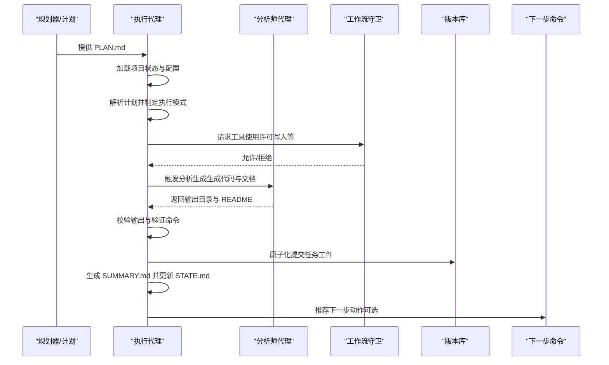
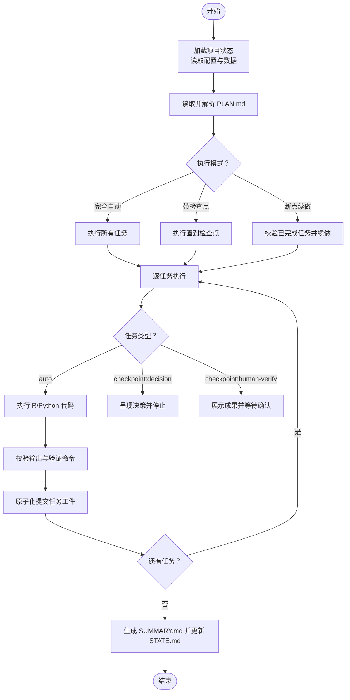
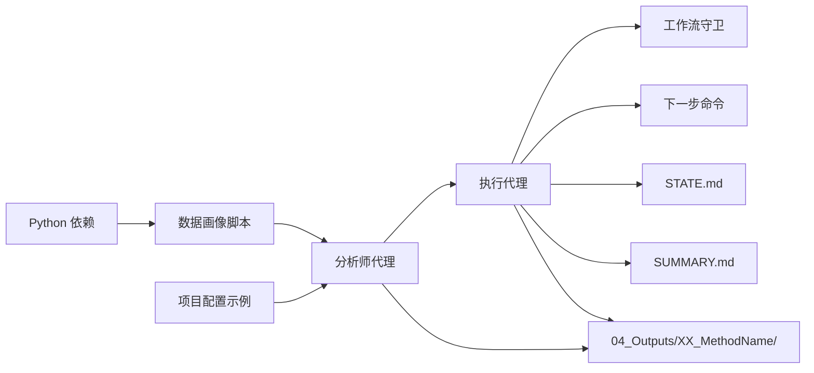

# 执行代理（Executor-Agent）

<cite>
**本文引用的文件**
- [clinpub-executor.md](file://agents/clinpub-executor.md)
- [DEVELOPMENT.md](file://docs/DEVELOPMENT.md)
- [analyst-agent.md](file://agents/analyst-agent.md)
- [install.js](file://bin/install.js)
- [workflow-guard.js](file://hooks/clinpub-workflow-guard.js)
- [next-step.md](file://commands/clinpub/next-step.md)
- [next-step.md（工作流）](file://pipeline/workflows/next-step.md)
- [data_profiler.py](file://scripts/data_profiler.py)
- [requirements.txt](file://requirements.txt)
- [project_config.example.yml](file://examples/project_config.example.yml)
- [02-01-PLAN.md](file://.clinpub/phases/02-断点续做/02-01-PLAN.md)
- [02-01-SUMMARY.md](file://.clinpub/phases/02-断点续做/02-01-SUMMARY.md)
- [02-RESEARCH.md](file://.clinpub/phases/02-断点续做/02-RESEARCH.md)
</cite>

## 目录
1. [简介](#简介)
2. [项目结构](#项目结构)
3. [核心组件](#核心组件)
4. [架构总览](#架构总览)
5. [详细组件分析](#详细组件分析)
6. [依赖关系分析](#依赖关系分析)
7. [性能考虑](#性能考虑)
8. [故障排除指南](#故障排除指南)
9. [结论](#结论)
10. [附录](#附录)

## 简介
执行代理（Executor-Agent）负责在临床分析流水线中“原子化提交地”执行分析计划（PLAN.md）。其职责包括：
- 读取并解析计划文件，确定执行模式（完全自动、带检查点、断点续做）
- 逐任务执行 R/Python 统计分析代码，产出符合出版标准的图形、表格与文档
- 对每个任务进行工件校验与验证，按约定提交到版本库，并生成阶段性总结（SUMMARY.md）
- 与数据准备、分析生成、写作等上游/下游代理协同，确保端到端自动化与可追溯性

执行代理强调“最小化人工干预”的自动化执行，同时保留必要的检查点与人类确认环节，以保证结果质量与可解释性。

## 项目结构
执行代理位于 agents 目录下，配合 hooks、commands、pipeline、scripts 等目录共同构成端到端的分析执行与管理工作流。关键位置如下：
- agents/clinpub-executor.md：执行代理的角色、执行流程、偏差规则、提交协议与成功标准
- hooks/clinpub-workflow-guard.js：对工具调用（尤其是文件写入）进行阶段访问控制
- commands/clinpub/next-step.md：阶段推进与里程碑生成的命令入口
- pipeline/workflows/next-step.md：工作流层面的阶段推进规范
- docs/DEVELOPMENT.md：开发环境与系统要求
- scripts/data_profiler.py：数据画像脚本（Python）
- requirements.txt：Python 依赖清单
- bin/install.js：环境检查与提示
- examples/project_config.example.yml：项目配置示例
- .clinpub/phases/...：阶段与计划、总结、研究笔记等中间产物

```mermaid
graph TB
subgraph "代理层"
EX["执行代理<br/>agents/clinpub-executor.md"]
AN["分析师代理<br/>agents/analyst-agent.md"]
end
subgraph "工具与钩子"
WG["工作流守卫<br/>hooks/clinpub-workflow-guard.js"]
INST["环境检查<br/>bin/install.js"]
end
subgraph "命令与工作流"
NS_CMD["下一步命令<br/>commands/clinpub/next-step.md"]
NS_WFL["下一步工作流<br/>pipeline/workflows/next-step.md"]
end
subgraph "脚本与配置"
DP["数据画像脚本<br/>scripts/data_profiler.py"]
RT["Python 依赖<br/>requirements.txt"]
PC["项目配置示例<br/>examples/project_config.example.yml"]
end
EX --> WG
EX --> NS_CMD
EX --> NS_WFL
AN --> EX
INST --> EX
DP --> AN
RT --> DP
PC --> AN
```

图表来源
- [clinpub-executor.md](file://agents/clinpub-executor.md)
- [analyst-agent.md](file://agents/analyst-agent.md)
- [workflow-guard.js](file://hooks/clinpub-workflow-guard.js)
- [next-step.md](file://commands/clinpub/next-step.md)
- [next-step.md（工作流）](file://pipeline/workflows/next-step.md)
- [data_profiler.py](file://scripts/data_profiler.py)
- [requirements.txt](file://requirements.txt)
- [project_config.example.yml](file://examples/project_config.example.yml)

章节来源
- [clinpub-executor.md](file://agents/clinpub-executor.md)
- [DEVELOPMENT.md](file://docs/DEVELOPMENT.md)
- [analyst-agent.md](file://agents/analyst-agent.md)
- [install.js](file://bin/install.js)
- [workflow-guard.js](file://hooks/clinpub-workflow-guard.js)
- [next-step.md](file://commands/clinpub/next-step.md)
- [next-step.md（工作流）](file://pipeline/workflows/next-step.md)
- [data_profiler.py](file://scripts/data_profiler.py)
- [requirements.txt](file://requirements.txt)
- [project_config.example.yml](file://examples/project_config.example.yml)

## 核心组件
- 执行代理角色与职责
  - 读取项目上下文（项目根目录、配置、已清洗数据）
  - 解析 PLAN.md 并决定执行模式（完全自动、带检查点、断点续做）
  - 逐任务执行 R/Python 代码，产出图形、表格与 README
  - 原子化提交每个任务工件，记录摘要与偏差
  - 生成阶段总结（SUMMARY.md），更新 STATE.md
- 偏差规则与容错
  - 自动修复代码错误（语法、包缺失、路径问题）
  - 自动处理数据异常（因子水平不在配置中等）
  - 自动补齐缺失输出
  - 方法变更需经决策检查点
- 提交协议与成功标准
  - 每任务单独提交，提交信息包含 phase-plan 与任务描述
  - 成功标准涵盖：所有任务执行与提交、完整输出目录、SUMMARY.md、STATE.md 更新、无未跟踪输出、图形满足出版标准

章节来源
- [clinpub-executor.md](file://agents/clinpub-executor.md)

## 架构总览
执行代理在流水线中的位置与交互如下：

图表来源
- [clinpub-executor.md](file://agents/clinpub-executor.md)
- [analyst-agent.md](file://agents/analyst-agent.md)
- [workflow-guard.js](file://hooks/clinpub-workflow-guard.js)
- [next-step.md](file://commands/clinpub/next-step.md)

## 详细组件分析

### 执行流程与模式
- 加载项目状态：读取项目根目录、配置文件与已清洗数据，确保数据可用
- 加载计划：解析 frontmatter（phase、plan、type、wave、depends_on）、目标与任务列表，校验前置计划的 SUMMARY.md
- 执行模式判定：
  - 完全自动：一次性执行所有任务并生成 SUMMARY
  - 带检查点：执行到检查点停止，返回结构化消息等待决策
  - 断点续做：根据提示中的已完成任务列表校验提交，从指定任务继续
- 逐任务执行：
  - auto 类型：执行 R/Python 代码，校验输出非空，运行验证命令，原子化提交
  - checkpoint:decision：呈现决策上下文与选项，停止等待用户选择
  - checkpoint:human-verify：展示构建成果与验证步骤，等待人工确认

图表来源
- [clinpub-executor.md](file://agents/clinpub-executor.md)

章节来源
- [clinpub-executor.md](file://agents/clinpub-executor.md)

### 代码生成与执行环境
- 代码生成来源：分析师代理负责生成 R/Python 代码，遵循分析方法参考与核心规范，输出图形、表格与 README
- 执行环境：
  - R：通过 Rscript 执行，要求在脚本末尾输出 session 信息
  - Python：通过 python 执行，要求记录包版本
  - 输出目录：统一写入 04_Outputs/XX_MethodName/
- 数据来源：所有分析均从已清洗数据（cleaned.csv）读取，避免直接使用原始数据

章节来源
- [analyst-agent.md](file://agents/analyst-agent.md)
- [clinpub-executor.md](file://agents/clinpub-executor.md)

### 偏差规则与错误处理
- 自动修复代码错误：语法、包缺失、路径错误等，最多尝试若干次，超过限制则记录偏差并继续或返回检查点
- 自动处理数据问题：若出现因子水平不在配置中等异常，按既定策略处理；若不确定则创建决策检查点
- 自动补齐缺失输出：若预期输出未生成，检查并修正代码，确保工件齐全
- 方法变更检查点：若分析需要超出计划的方法变更（不同检验或模型），停止并创建决策检查点

章节来源
- [clinpub-executor.md](file://agents/clinpub-executor.md)

### 提交协议与总结生成
- 提交协议：
  - 每任务完成后检查修改文件，仅对任务相关文件进行暂存与提交
  - 提交信息格式：analysis({phase}-{plan}): {任务简述}
  - 记录提交哈希以便 SUMMARY.md 汇总
- 总结生成：
  - 在阶段结束后创建 SUMMARY.md，包含 frontmatter（phase、plan、指标）、简要描述、任务完成情况与提交哈希、偏差记录、输出文件清单、已知问题或延期事项
  - 更新 STATE.md，确保状态与进度一致

章节来源
- [clinpub-executor.md](file://agents/clinpub-executor.md)

### 与数据处理管道的集成与数据传递
- 数据传递机制：
  - 分析阶段读取 02_PreprocessedData/data/cleaned.csv
  - 输出写入 04_Outputs/XX_MethodName/，并在方法输出目录生成 MANIFEST.yaml（声明 writer-agent 为消费者）
- 与下一步命令的衔接：
  - 执行代理在 PLAN 完成后可建议下一步动作（如生成里程碑、推进阶段）
  - 阶段推进需先生成 MILESTONE.md，再更新 STATE.md 与 ROADMAP.md

章节来源
- [analyst-agent.md](file://agents/analyst-agent.md)
- [next-step.md](file://commands/clinpub/next-step.md)
- [next-step.md（工作流）](file://pipeline/workflows/next-step.md)

### 执行环境配置指南
- 系统要求与工具链：
  - Node.js >= 22.0.0（用于钩子与安装脚本）
  - R >= 4.2（用于统计分析）
  - Python >= 3.9（用于数据画像与检索）
- R 包安装：使用官方 CRAN 安装所需包集合
- Python 环境：创建虚拟环境并安装 requirements.txt 中的依赖
- 环境检查：安装脚本会检测 Node.js、R、Python 是否在 PATH 中并给出提示

章节来源
- [DEVELOPMENT.md](file://docs/DEVELOPMENT.md)
- [requirements.txt](file://requirements.txt)
- [install.js](file://bin/install.js)

## 依赖关系分析
执行代理与系统其他组件的耦合与协作如下：

图表来源
- [clinpub-executor.md](file://agents/clinpub-executor.md)
- [analyst-agent.md](file://agents/analyst-agent.md)
- [workflow-guard.js](file://hooks/clinpub-workflow-guard.js)
- [next-step.md](file://commands/clinpub/next-step.md)
- [data_profiler.py](file://scripts/data_profiler.py)
- [requirements.txt](file://requirements.txt)
- [project_config.example.yml](file://examples/project_config.example.yml)

章节来源
- [clinpub-executor.md](file://agents/clinpub-executor.md)
- [analyst-agent.md](file://agents/analyst-agent.md)
- [workflow-guard.js](file://hooks/clinpub-workflow-guard.js)
- [next-step.md](file://commands/clinpub/next-step.md)
- [data_profiler.py](file://scripts/data_profiler.py)
- [requirements.txt](file://requirements.txt)
- [project_config.example.yml](file://examples/project_config.example.yml)

## 性能考虑
- 代码独立性：每段 R/Python 代码需自包含，避免跨文件隐式依赖，便于并行与重用
- 测试独立性：测试数据与环境在脚本内定义，确保可重复执行
- 调试与性能优化：提供 R 与 Python 的调试与性能优化实践（如 recover、pdb、data.table、并行处理、chunking、multiprocessing）

章节来源
- [DEVELOPMENT.md](file://docs/DEVELOPMENT.md)

## 故障排除指南
- 环境问题
  - R 或 Python 未在 PATH 中：安装脚本会提示下载地址，请按要求安装并重新检查
  - R 包缺失：根据官方 CRAN 安装所需包集合
  - Python 依赖缺失：在虚拟环境中安装 requirements.txt
- 执行问题
  - 代码错误：执行代理会自动尝试修复并重试，超过限制则记录偏差并返回检查点
  - 数据异常：若因子水平不在配置中，按策略处理；不确定时创建决策检查点
  - 输出缺失：检查代码并自动补齐，确保工件齐全
- 阶段推进问题
  - 生成 MILESTONE.md 是推进到新阶段的前提，否则 phase-boundary.sh 会阻断
  - 若 STATE.md 与 ROADMAP.md 状态不一致，以 ROADMAP.md 的勾选状态为准

章节来源
- [install.js](file://bin/install.js)
- [DEVELOPMENT.md](file://docs/DEVELOPMENT.md)
- [clinpub-executor.md](file://agents/clinpub-executor.md)
- [next-step.md](file://commands/clinpub/next-step.md)
- [02-RESEARCH.md](file://.clinpub/phases/02-断点续做/02-RESEARCH.md)

## 结论
执行代理通过明确的执行模式、严格的偏差规则与原子化提交协议，实现了 R/Python 临床分析的自动化与可追溯性。它与分析师代理、工作流守卫、下一步命令等组件紧密协作，确保从计划到输出再到阶段推进的全流程闭环。遵循出版标准与环境配置指南，可获得高质量、可复现的分析结果。

## 附录
- 示例与参考
  - 项目配置示例：examples/project_config.example.yml
  - 数据画像脚本：scripts/data_profiler.py
  - 分析方法参考与核心规范：由分析师代理在生成代码时遵循
  - 断点续做计划与总结：.clinpub/phases/02-断点续做/02-01-PLAN.md、02-01-SUMMARY.md

章节来源
- [project_config.example.yml](file://examples/project_config.example.yml)
- [data_profiler.py](file://scripts/data_profiler.py)
- [analyst-agent.md](file://agents/analyst-agent.md)
- [02-01-PLAN.md](file://.clinpub/phases/02-断点续做/02-01-PLAN.md)
- [02-01-SUMMARY.md](file://.clinpub/phases/02-断点续做/02-01-SUMMARY.md)