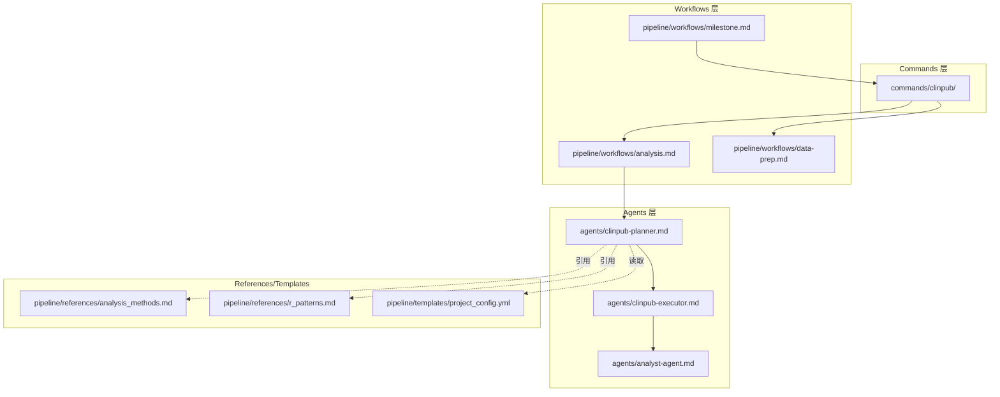
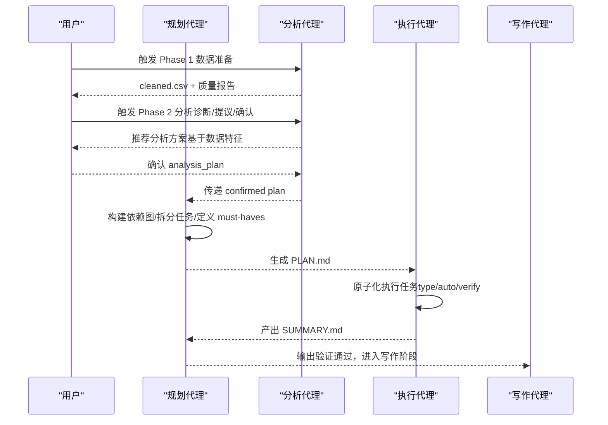
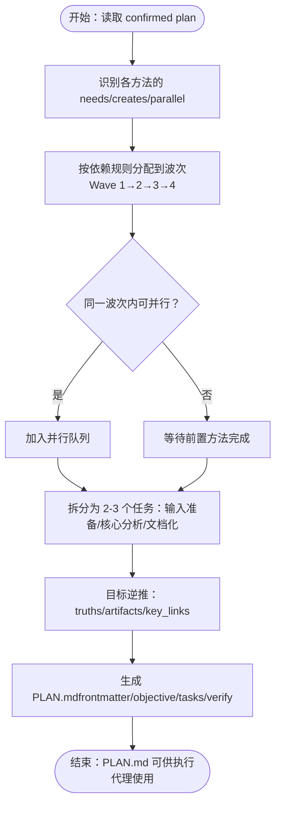
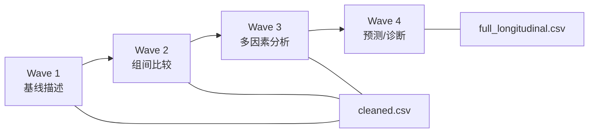
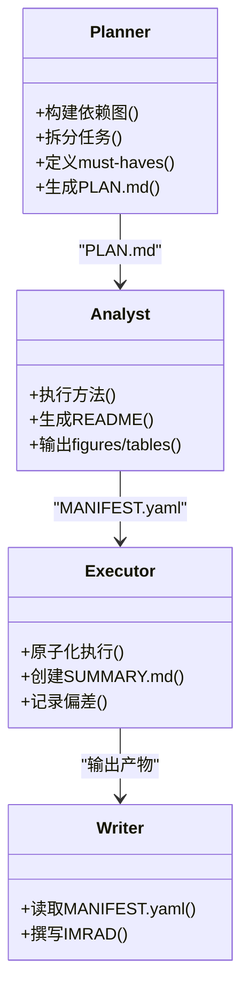
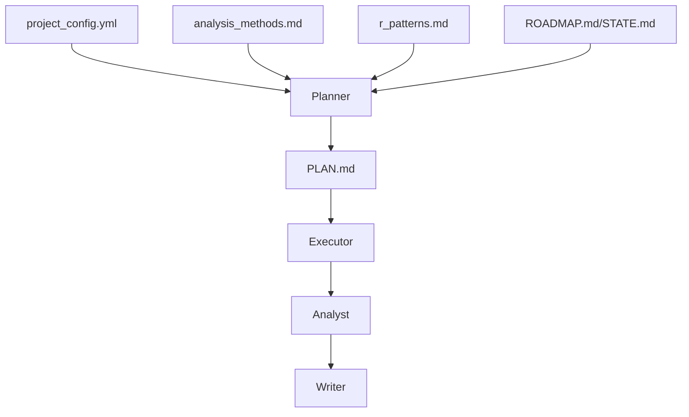

# 规划代理 (Planner-Agent)

<cite>
**本文档引用的文件**
- [agents/clinpub-planner.md](file://agents/clinpub-planner.md)
- [pipeline/workflows/analysis.md](file://pipeline/workflows/analysis.md)
- [pipeline/workflows/data-prep.md](file://pipeline/workflows/data-prep.md)
- [pipeline/workflows/milestone.md](file://pipeline/workflows/milestone.md)
- [pipeline/references/analysis_methods.md](file://pipeline/references/analysis_methods.md)
- [pipeline/references/r_patterns.md](file://pipeline/references/r_patterns.md)
- [pipeline/templates/project_config.yml](file://pipeline/templates/project_config.yml)
- [agents/analyst-agent.md](file://agents/analyst-agent.md)
- [agents/clinpub-executor.md](file://agents/clinpub-executor.md)
- [docs/ARCHITECTURE.md](file://docs/ARCHITECTURE.md)
- [pipeline/references/checkpoints.md](file://pipeline/references/checkpoints.md)
- [docs/SUPERPOWERS/PLANS/2026-06-02-MODIFY-AGENT.md](file://docs/SUPERPOWERS/PLANS/2026-06-02-MODIFY-AGENT.md)
</cite>

## 目录
1. [简介](#简介)
2. [项目结构](#项目结构)
3. [核心组件](#核心组件)
4. [架构总览](#架构总览)
5. [详细组件分析](#详细组件分析)
6. [依赖关系分析](#依赖关系分析)
7. [性能考量](#性能考量)
8. [故障排查指南](#故障排查指南)
9. [结论](#结论)
10. [附录](#附录)

## 简介
规划代理（Clinpub Planner）是临床研究分析工作流中的“计划引擎”，负责将研究设计与数据特征转化为可执行的分析计划。其核心职责包括：
- 基于数据诊断与用户确认，构建“波次（wave）”化的分析方案
- 识别方法间的依赖关系，形成可并行执行的依赖图
- 将每个分析方法拆分为“输入准备 → 核心分析 → 文档化”的原子任务
- 通过“目标逆推（goal-backward）”确定必须产出的成果（must-haves）
- 生成符合 GSD 约定的 PLAN.md，供执行代理（Executor）原子化执行

规划代理贯穿 Phase 2（分析）的“诊断 → 提议 → 确认 → 执行 → 验证 → 关卡评审”的闭环，确保分析流程与出版标准一致。

## 项目结构
clinpub 采用三层架构：Commands → Workflows → Agents。规划代理位于 Agents 层，与 Analyst、Executor、Verifier 等 Agent 协同，配合 Workflows 的阶段编排，形成端到端的临床分析流水线。

**图表来源**
- [docs/ARCHITECTURE.md:1-160](file://docs/ARCHITECTURE.md#L1-L160)
- [agents/clinpub-planner.md:1-131](file://agents/clinpub-planner.md#L1-L131)
- [agents/clinpub-executor.md:1-128](file://agents/clinpub-executor.md#L1-L128)
- [agents/analyst-agent.md:1-141](file://agents/analyst-agent.md#L1-L141)
- [pipeline/workflows/analysis.md:1-289](file://pipeline/workflows/analysis.md#L1-L289)
- [pipeline/workflows/data-prep.md:1-184](file://pipeline/workflows/data-prep.md#L1-L184)
- [pipeline/workflows/milestone.md:1-163](file://pipeline/workflows/milestone.md#L1-L163)
- [pipeline/references/analysis_methods.md:1-311](file://pipeline/references/analysis_methods.md#L1-L311)
- [pipeline/references/r_patterns.md:1-532](file://pipeline/references/r_patterns.md#L1-L532)
- [pipeline/templates/project_config.yml:1-97](file://pipeline/templates/project_config.yml#L1-L97)

**章节来源**
- [docs/ARCHITECTURE.md:1-160](file://docs/ARCHITECTURE.md#L1-L160)

## 核心组件
- 角色与工具
  - 角色：临床研究分析规划师，面向 R/Python 的临床分析工作流
  - 工具：Read、Write、Bash、Glob、Grep
- 关键职责
  - 从 ROADMAP.md 识别当前 Phase，加载 project_config.yml、STATE.md、ROADMAP.md
  - 基于 analysis_methods.md 的决策树与波次规则，构建依赖图
  - 将每个方法拆分为 2-3 个任务，明确文件、动作、验证与完成标准
  - 使用目标逆推法定义 must-haves（truths/artifacts/key_links）
  - 生成 PLAN.md（frontmatter + objective + context + tasks + verification + success criteria）

**章节来源**
- [agents/clinpub-planner.md:1-131](file://agents/clinpub-planner.md#L1-L131)

## 架构总览
规划代理在 Phase 2 的“诊断 → 提议 → 确认 → 执行 → 验证 → 关卡评审”流程中扮演中枢角色：
- 诊断阶段：由 Analyst Agent 与 data-prep 流程产出数据诊断与结构信息
- 提议阶段：基于 analysis_methods.md 的决策树生成推荐方案
- 确认阶段：与用户讨论并固化 analysis_plan
- 执行阶段：规划代理生成 PLAN.md，Executor 逐任务原子化执行
- 验证阶段：执行完成后进行输出验证与里程碑评审

**图表来源**
- [pipeline/workflows/analysis.md:1-289](file://pipeline/workflows/analysis.md#L1-L289)
- [agents/clinpub-planner.md:1-131](file://agents/clinpub-planner.md#L1-L131)
- [agents/clinpub-executor.md:1-128](file://agents/clinpub-executor.md#L1-L128)
- [agents/analyst-agent.md:1-141](file://agents/analyst-agent.md#L1-L141)

## 详细组件分析

### 规划算法与约束处理
- 数据驱动的动态波次（wave）组织
  - 基线描述（Wave 1，无依赖）
  - 单变量比较（Wave 2，依赖基线）
  - 多变量模型（Wave 3，依赖单变量筛选）
  - 预测/诊断（Wave 4，依赖训练/验证划分）
- 依赖规则
  - 方法 A 的输出是方法 B 的输入 → B 在 A 之后
  - 波次顺序由 analysis_methods.md 的“动态波次规则”与“波次数量完全由方案决定”共同决定
- 并行化策略
  - 同一波次内方法可并行执行，跨波次严格串行
  - 每个波次完成后进行用户确认，再进入下一波次

**图表来源**
- [agents/clinpub-planner.md:46-131](file://agents/clinpub-planner.md#L46-L131)
- [pipeline/references/analysis_methods.md:242-276](file://pipeline/references/analysis_methods.md#L242-L276)

**章节来源**
- [agents/clinpub-planner.md:46-131](file://agents/clinpub-planner.md#L46-L131)
- [pipeline/references/analysis_methods.md:242-276](file://pipeline/references/analysis_methods.md#L242-L276)

### 任务序列组织与资源调度
- 任务拆分原则
  - 输入准备：加载数据、校验列、检查假设
  - 核心分析：执行统计方法、生成输出
  - 文档化：生成 README、验证输出
- 资源调度
  - 每个任务明确“文件、动作、验证、完成标准”
  - 执行代理（Executor）按任务类型执行（auto/decision/verify），并进行原子化提交
  - 严格遵循 cleaned.csv 作为唯一输入源，避免中间文件耦合

**章节来源**
- [agents/clinpub-planner.md:61-73](file://agents/clinpub-planner.md#L61-L73)
- [agents/clinpub-executor.md:48-66](file://agents/clinpub-executor.md#L48-L66)

### 规划参数配置与动态调整
- 关键配置来源
  - project_config.yml：study_type、variables、analysis_methods、paths、quality、analysis 等
  - analysis_methods.md：方法选择决策树、波次规则、场景参考
  - r_patterns.md：可视化与分析模式标准（色彩、主题、保存规范、显著性标注等）
- 动态调整机制
  - 用户可在“提议 → 确认”阶段调整方法、参数、变量选择、颜色偏好、多重比较校正、显著性水平等
  - 审稿阶段可追加新波次（phase enhancement），规划代理据此更新 PLAN.md

**章节来源**
- [pipeline/templates/project_config.yml:1-97](file://pipeline/templates/project_config.yml#L1-L97)
- [pipeline/workflows/analysis.md:119-222](file://pipeline/workflows/analysis.md#L119-L222)
- [pipeline/references/analysis_methods.md:18-104](file://pipeline/references/analysis_methods.md#L18-L104)
- [pipeline/references/r_patterns.md:1-532](file://pipeline/references/r_patterns.md#L1-L532)

### 规划示例与流程图解
- 示例场景：RCT（2 组、纵向、连续结局）
  - Wave 1：基线特征表、描述统计
  - Wave 2：组间比较（Wilcoxon）、重复测量混合模型
  - Wave 3：多因素回归（调整协变量）
  - Wave 4：预测/诊断（ROC、LASSO）
- 执行顺序与依赖
  - 基线表 → 组间比较 → 多因素回归 → 预测/诊断
  - 纵向分析使用 full_longitudinal.csv，基线分析使用 cleaned.csv

**图表来源**
- [pipeline/workflows/analysis.md:187-222](file://pipeline/workflows/analysis.md#L187-L222)
- [pipeline/references/analysis_methods.md:242-276](file://pipeline/references/analysis_methods.md#L242-L276)

**章节来源**
- [pipeline/workflows/analysis.md:86-117](file://pipeline/workflows/analysis.md#L86-L117)
- [pipeline/references/analysis_methods.md:67-77](file://pipeline/references/analysis_methods.md#L67-L77)

### 与其他 Agent 的协作与依赖关系
- 与 Analyst Agent 的协作
  - Planner 生成 PLAN.md，Analyst 依据 plan 执行方法（Phase 2）
  - Analyst 的 success criteria 与 Planner 的 must-haves 对齐
- 与 Executor 的协作
  - Executor 严格按 PLAN.md 的 frontmatter 与 tasks 执行，支持自动修复与偏差记录
- 与 Writer Agent 的衔接
  - 验证通过后，Writer 读取 MANIFEST.yaml 获取输出并进行 IMRAD 撰写

**图表来源**
- [agents/clinpub-planner.md:101-111](file://agents/clinpub-planner.md#L101-L111)
- [agents/analyst-agent.md:45-75](file://agents/analyst-agent.md#L45-L75)
- [agents/clinpub-executor.md:17-68](file://agents/clinpub-executor.md#L17-L68)
- [agents/analyst-agent.md:77-105](file://agents/analyst-agent.md#L77-L105)

**章节来源**
- [agents/analyst-agent.md:10-15](file://agents/analyst-agent.md#L10-L15)
- [agents/clinpub-executor.md:17-68](file://agents/clinpub-executor.md#L17-L68)

### 规划冲突解决与异常处理策略
- 冲突解决
  - 方法依赖冲突：依据 analysis_methods.md 的波次规则自动排序
  - 用户偏好与标准冲突：优先遵循 publication standards（如 theme_pub、300 DPI、效应量+CI+p 值）
- 异常处理
  - 执行期错误：Executor 自动修复（语法、包缺失、路径错误），最多尝试 3 次
  - 数据异常：自动应用已记录的策略；若仍不确定，创建 decision checkpoint 等待用户决策
  - 输出缺失：自动检查并补齐，确保 figure/table/README 三件套齐全

**章节来源**
- [agents/clinpub-executor.md:70-86](file://agents/clinpub-executor.md#L70-L86)
- [agents/clinpub-executor.md:88-118](file://agents/clinpub-executor.md#L88-L118)
- [agents/analyst-agent.md:109-141](file://agents/analyst-agent.md#L109-L141)

## 依赖关系分析
- Planner 依赖
  - analysis_methods.md：方法选择决策树、波次规则、场景参考
  - r_patterns.md：可视化与分析模式标准
  - project_config.yml：study_type、variables、paths、quality、analysis 等
  - ROADMAP.md/STATE.md：阶段状态与上下文
- Planner 产出
  - PLAN.md：包含 frontmatter、objective、tasks、verification、success criteria
- Planner 与执行链路
  - Executor 读取 PLAN.md，按任务类型执行并生成 SUMMARY.md
  - Analyst 依据 PLAN.md 的方法规范生成 README 与输出

**图表来源**
- [agents/clinpub-planner.md:22-59](file://agents/clinpub-planner.md#L22-L59)
- [pipeline/templates/project_config.yml:1-97](file://pipeline/templates/project_config.yml#L1-L97)
- [pipeline/references/analysis_methods.md:18-104](file://pipeline/references/analysis_methods.md#L18-L104)
- [pipeline/references/r_patterns.md:1-532](file://pipeline/references/r_patterns.md#L1-L532)

**章节来源**
- [agents/clinpub-planner.md:22-59](file://agents/clinpub-planner.md#L22-L59)

## 性能考量
- 并行优化
  - 同一波次内最大化并行执行，减少总时延
  - 严格依赖检查，避免无效重试
- 上下文预算控制
  - 成功标准包含“Plans fit within ~50% context budget”，避免过度冗长
- 输出质量前置
  - 通过 must-haves 与 verification criteria 提前发现偏差，降低返工成本

## 故障排查指南
- 常见问题与对策
  - PLAN.md 缺失或不完整：检查 Planner 的 success criteria（frontmatter、tasks、verification、must-haves）
  - 依赖顺序错误：核对 analysis_methods.md 的波次规则与 must-haves 的 key_links
  - 输出不符合出版标准：检查 r_patterns.md 的主题、分辨率、字体、显著性标注
  - 执行失败：查看 Executor 的 SUMMARY.md，定位偏差与修复记录
- 关卡评审与里程碑
  - milestone 流程提供结构化验证清单，逐项核对 deliverables 与 decisions
  - checkpoint 协议提供 decision/verify/milestone 三种信号，确保可恢复与可审计

**章节来源**
- [agents/clinpub-planner.md:124-131](file://agents/clinpub-planner.md#L124-L131)
- [agents/clinpub-executor.md:120-128](file://agents/clinpub-executor.md#L120-L128)
- [pipeline/workflows/milestone.md:42-81](file://pipeline/workflows/milestone.md#L42-L81)
- [pipeline/references/checkpoints.md:10-76](file://pipeline/references/checkpoints.md#L10-L76)

## 结论
规划代理（Planner-Agent）通过“数据驱动的动态波次组织 + 目标逆推的 must-haves + 严格的任务拆分与验证”，将研究设计与数据特征转化为可执行、可并行、可追溯的分析计划。其与 Analyst、Executor、Verifier 的协同，以及与 milestone/checkpoint 协议的集成，确保了 Phase 2 分析的质量与效率，并为后续写作与审稿阶段奠定坚实基础。

## 附录
- 相关参考
  - 分析方法参考库：methods 选择、波次规则、场景参考
  - R 可视化核心标准：色彩、主题、保存、显著性标注、拼图布局等
  - 项目配置模板：study_type、variables、paths、quality、analysis 等
  - 里程碑与检查点协议：验证清单、决策记录、里程碑格式

**章节来源**
- [pipeline/references/analysis_methods.md:1-311](file://pipeline/references/analysis_methods.md#L1-L311)
- [pipeline/references/r_patterns.md:1-532](file://pipeline/references/r_patterns.md#L1-L532)
- [pipeline/templates/project_config.yml:1-97](file://pipeline/templates/project_config.yml#L1-L97)
- [pipeline/workflows/milestone.md:154-163](file://pipeline/workflows/milestone.md#L154-L163)
- [pipeline/references/checkpoints.md:77-120](file://pipeline/references/checkpoints.md#L77-L120)