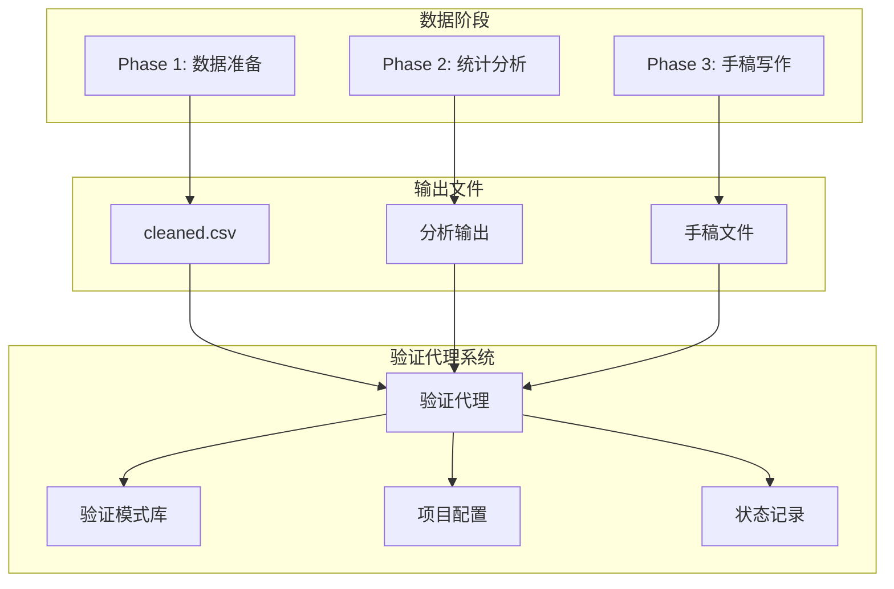
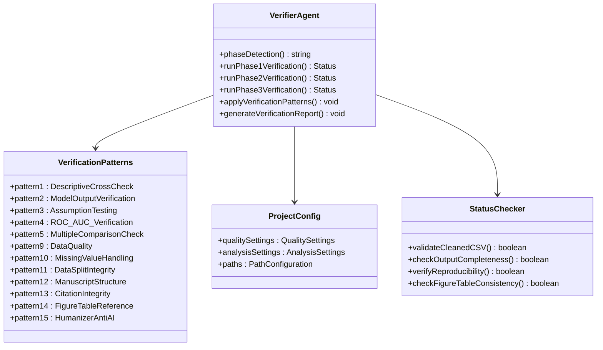
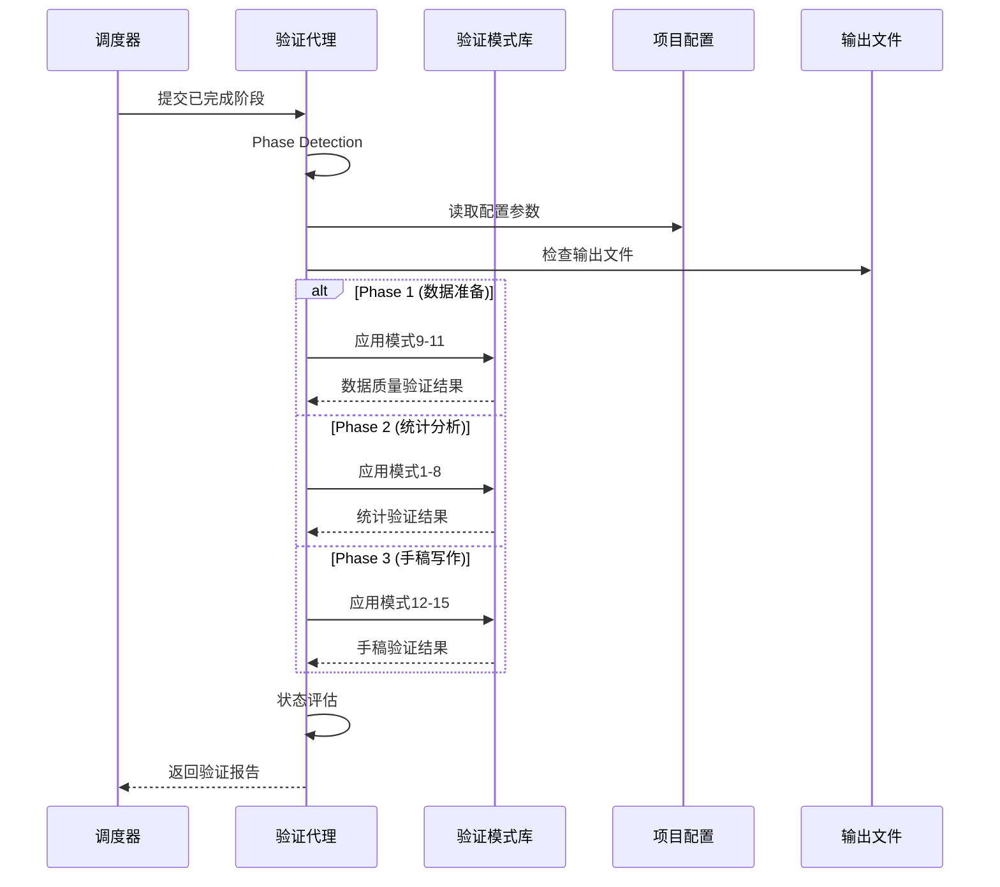
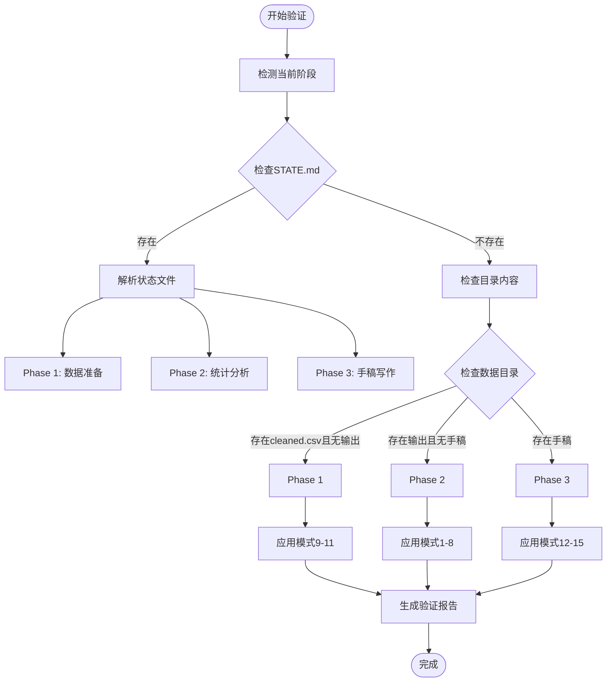
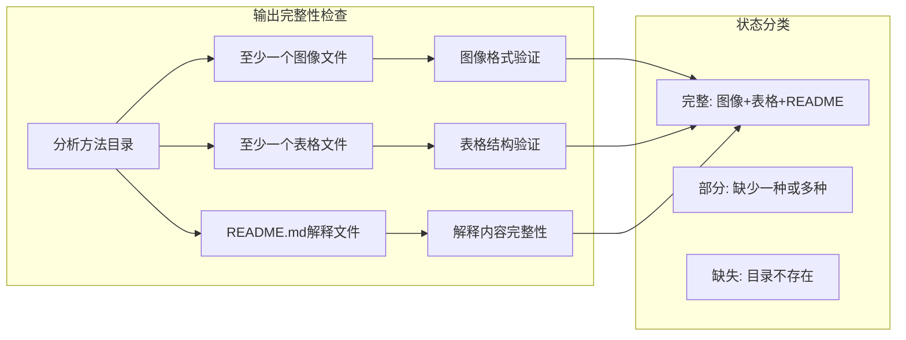
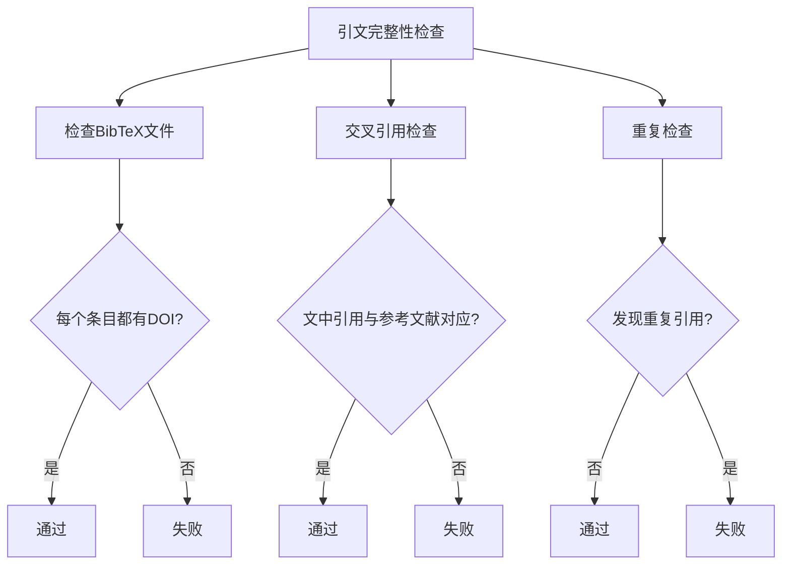
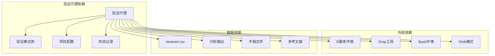

# 验证代理 (Verifier-Agent) 技术文档

<cite>
**本文档中引用的文件**
- [clinpub-verifier.md](file://agents/clinpub-verifier.md)
- [verification-patterns.md](file://pipeline/references/verification-patterns.md)
- [project_config.yml](file://pipeline/templates/project_config.yml)
- [project_config.example.yml](file://examples/project_config.example.yml)
- [package.json](file://package.json)
</cite>

## 目录
1. [简介](#简介)
2. [项目结构](#项目结构)
3. [核心组件](#核心组件)
4. [架构概览](#架构概览)
5. [详细组件分析](#详细组件分析)
6. [依赖关系分析](#依赖关系分析)
7. [性能考虑](#性能考虑)
8. [故障排除指南](#故障排除指南)
9. [结论](#结论)
10. [附录](#附录)

## 简介

验证代理（Verifier-Agent）是临床研究出版流水线中的关键质量控制组件，采用反向思维方法，在每个阶段对数据质量、统计分析和手稿完整性进行全面验证。该代理通过自动路由机制选择适用的验证模式，确保分析结果的准确性、可重现性和内部一致性。

验证代理的核心特点包括：
- **跨阶段验证能力**：支持数据准备（Phase 1）、统计分析（Phase 2）和手稿写作（Phase 3）三个阶段的验证
- **对抗性思维模式**：假设分析结果错误，直到有证据证明其正确性
- **自动化路由系统**：根据当前阶段自动选择相应的验证模式
- **严格的质量标准**：基于预定义的验证模式和阈值进行质量控制

## 项目结构

验证代理位于项目的 agents 目录下，与流水线的其他组件协同工作：



**图表来源**
- [clinpub-verifier.md:35-56](file://agents/clinpub-verifier.md#L35-L56)
- [clinpub-verifier.md:49-56](file://agents/clinpub-verifier.md#L49-L56)

**章节来源**
- [clinpub-verifier.md:1-56](file://agents/clinpub-verifier.md#L1-L56)

## 核心组件

### 验证代理架构

验证代理采用模块化设计，包含以下核心组件：



**图表来源**
- [clinpub-verifier.md:33-311](file://agents/clinpub-verifier.md#L33-L311)
- [verification-patterns.md:64-231](file://pipeline/references/verification-patterns.md#L64-L231)

### 验证流程分类

验证代理使用三种严重性级别的分类系统：

| 分类级别 | 严重程度 | 处理要求 | 说明 |
|---------|---------|---------|------|
| **BLOCKER** | 最高 | 必须阻止继续 | 统计错误导致结果无效；必须立即修复 |
| **WARNING** | 中等 | 需要用户确认 | 潜在问题需要人工审查和确认 |
| **INFO** | 低 | 仅需注意 | 观察性信息，不影响继续流程 |

**章节来源**
- [clinpub-verifier.md:27-31](file://agents/clinpub-verifier.md#L27-L31)

## 架构概览

验证代理的架构设计体现了层次化和模块化的原则：



**图表来源**
- [clinpub-verifier.md:35-56](file://agents/clinpub-verifier.md#L35-L56)
- [clinpub-verifier.md:291-311](file://agents/clinpub-verifier.md#L291-L311)

### 阶段路由机制

验证代理通过智能路由系统自动选择适用的验证模式：



**图表来源**
- [clinpub-verifier.md:35-56](file://agents/clinpub-verifier.md#L35-L56)
- [clinpub-verifier.md:49-56](file://agents/clinpub-verifier.md#L49-L56)

**章节来源**
- [clinpub-verifier.md:35-56](file://agents/clinpub-verifier.md#L35-L56)

## 详细组件分析

### Phase 1: 数据质量验证

Phase 1 验证专注于确保预处理数据的质量和完整性：

#### 数据完整性检查

验证代理执行以下关键检查：

1. **文件存在性验证**
   - 确认 cleaned.csv 文件存在且非空
   - 验证原始数据文件的存在性
   - 检查报告目录的完整性

2. **行数和列数验证**
   ```mermaid
flowchart TD
DataCheck[数据完整性检查] --> RowCount[计算行数]
DataCheck --> ColCount[计算列数]
DataCheck --> RawCompare[与原始数据比较]
RowCount --> RowValid{行数有效?}
ColCount --> ColValid{列数有效?}
RawCompare --> CompareValid{符合预期?}
RowValid --> |是| RowPass[通过]
RowValid --> |否| RowFail[失败]
ColValid --> |是| ColPass[通过]
ColValid --> |否| ColFail[失败]
CompareValid --> |是| ComparePass[通过]
CompareValid --> |否| CompareFail[失败]
```

**图表来源**
- [clinpub-verifier.md:73-94](file://agents/clinpub-verifier.md#L73-L94)

3. **数据类型验证**
   - 数值列必须包含数字而非字符串
   - 变量类型与项目配置一致
   - 无完全空白的行列

#### 验证模式应用

应用验证模式 9-11：

| 模式编号 | 模式名称 | 检查重点 | 失败指标 |
|---------|---------|---------|---------|
| 模式9 | 数据质量 | 变量类型交叉检查、派生变量验证、异常值文档 | 类型不匹配、异常值处理不当 |
| 模式10 | 缺失值处理 | 分层策略、MICE插补、用户确认 | >20%缺失变量无确认、插补参数未记录 |
| 模式11 | 数据分割完整性 | 分层、无重叠、种子设置 | 分层比例偏差>1%、数据重叠、种子未设置 |

**章节来源**
- [clinpub-verifier.md:95-120](file://agents/clinpub-verifier.md#L95-L120)
- [verification-patterns.md:183-225](file://pipeline/references/verification-patterns.md#L183-L225)

### Phase 2: 统计分析验证

Phase 2 验证确保统计分析的有效性和可重现性：

#### 输出完整性验证

验证代理检查每个分析方法的输出完整性：



**图表来源**
- [clinpub-verifier.md:138-155](file://agents/clinpub-verifier.md#L138-L155)

#### 统计有效性验证

应用验证模式 1-8 进行统计验证：

**模式1: 描述性交叉检查**
- 计算样本量和变量数量
- 与表1输出进行交叉验证
- 验证基本统计描述的一致性

**模式2: 模型输出验证**
- 检查OR/HR方向与系数符号一致
- 验证95% CI = 估计值 ± 1.96 × SE
- 确认p值与CI的一致性
- 检查VIF值（如报告）

**模式4: ROC/AUC验证**
- 验证AUC在[0,1]范围内
- 检查CI边界有序性
- 确认Youden阈值下的敏感性和特异性

**模式5: 多重比较检查**
- 计算每项分析中的测试数量
- 当测试>3时验证校正应用
- 检查FDR或Bonferroni校正的正确性

**章节来源**
- [clinpub-verifier.md:156-231](file://agents/clinpub-verifier.md#L156-L231)
- [verification-patterns.md:64-98](file://pipeline/references/verification-patterns.md#L64-L98)

### Phase 3: 手稿完整性验证

Phase 3 验证确保手稿符合目标期刊的标准和学术规范：

#### 手稿结构验证

应用模式12进行手稿结构验证：

1. **IMRAD结构完整性**
   - 引言部分：背景→已知→缺口→目标
   - 方法部分：完整的方法描述
   - 结果部分：清晰的结果呈现
   - 讨论部分：总结→比较→机制→影响→局限→结论

2. **目标期刊标准符合性**
   - 检查STROBE/CONSORT清单覆盖
   - 验证字数限制符合目标期刊要求
   - 确认报告标准的完整性

#### 引文完整性验证

应用模式13进行引文验证：



**图表来源**
- [clinpub-verifier.md:256-264](file://agents/clinpub-verifier.md#L256-L264)

#### 图表引用验证

应用模式14进行图表引用验证：

1. **图表存在性检查**
   - 从手稿文本提取所有图表引用
   - 验证相应文件存在于输出目录
   - 检查图表编号的连续性

2. **技术规格验证**
   - 验证所有图表分辨率≥300 DPI
   - 检查图表格式符合要求
   - 确认图表命名规范

#### 人类化反AI检查

应用模式15进行人类化验证：

1. **段落结构分析**
   - 检查段落开头的序列标记
   - 分析过渡词的多样性
   - 评估句子结构的变化

2. **结论质量评估**
   - 验证结论包含具体未来方向
   - 检查引用整合风格
   - 评估整体写作流畅性

**章节来源**
- [clinpub-verifier.md:233-290](file://agents/clinpub-verifier.md#L233-L290)

## 依赖关系分析

验证代理与系统其他组件的依赖关系：



**图表来源**
- [clinpub-verifier.md:4](file://agents/clinpub-verifier.md#L4)
- [package.json:15-17](file://package.json#L15-L17)

### 关键依赖组件

1. **验证模式库**：提供标准化的验证算法和判断逻辑
2. **项目配置**：定义质量标准、阈值和参数设置
3. **状态记录**：跟踪项目进度和验证状态
4. **外部工具**：提供文件操作和数据处理能力

**章节来源**
- [clinpub-verifier.md:10-12](file://agents/clinpub-verifier.md#L10-L12)
- [package.json:15-17](file://package.json#L15-L17)

## 性能考虑

验证代理的设计注重效率和可扩展性：

### 验证效率优化

1. **快速文件检查**：使用 grep 和文件系统操作避免重新运行分析
2. **并行处理**：多个验证任务可以并行执行
3. **增量验证**：只验证必要的文件和内容
4. **缓存机制**：重复使用的验证结果可以缓存

### 内存和存储优化

1. **流式处理**：大文件的处理采用流式方式
2. **分块验证**：大数据集分块验证以减少内存占用
3. **临时文件管理**：及时清理临时文件避免存储空间浪费

## 故障排除指南

### 常见验证失败案例

#### 数据准备阶段失败

| 失败原因 | 识别特征 | 修复建议 |
|---------|---------|---------|
| cleaned.csv为空 | 行数为0或文件不存在 | 检查数据预处理流程，确认数据导入正确 |
| 列数不匹配 | 与项目配置定义不符 | 更新项目配置或修正数据预处理代码 |
| 缺失值处理不当 | >20%缺失变量无用户确认 | 实施用户确认流程或调整缺失值处理策略 |
| 数据分割问题 | 分层比例偏差>1% | 检查分层变量和随机种子设置 |

#### 统计分析阶段失败

| 失败原因 | 识别特征 | 修复建议 |
|---------|---------|---------|
| 输出文件缺失 | 图像或表格文件不存在 | 检查分析脚本执行和输出路径配置 |
| 统计结果不一致 | OR/HR与系数符号不匹配 | 验证统计模型设置和参数配置 |
| 多重比较未校正 | 测试>3但无校正 | 实施FDR或Bonferroni校正 |
| 可重现性问题 | 缺少随机种子或硬编码路径 | 添加随机种子设置和相对路径引用 |

#### 手稿阶段失败

| 失败原因 | 识别特征 | 修复建议 |
|---------|---------|---------|
| 引文缺少DOI | 参考文献条目无DOI | 补充完整的参考文献信息 |
| 图表引用不匹配 | 文中引用与实际文件不符 | 修正图表引用或更新图表文件 |
| 图表分辨率不足 | <300 DPI | 重新导出高分辨率图表 |
| 人类化检查失败 | 检测到AI写作模式 | 人工润色和修改写作风格 |

### 诊断和调试步骤

1. **检查验证日志**：查看详细的验证过程和失败原因
2. **验证文件完整性**：确认所有必需文件都存在且完整
3. **检查配置参数**：验证项目配置中的阈值和设置
4. **运行独立测试**：单独运行失败的验证步骤以精确定位问题

**章节来源**
- [clinpub-verifier.md:415-428](file://agents/clinpub-verifier.md#L415-L428)

## 结论

验证代理（Verifier-Agent）为临床研究出版流水线提供了全面的质量控制保障。通过其对抗性思维模式、智能路由机制和标准化验证流程，确保了分析结果的准确性、可重现性和手稿的完整性。

### 主要优势

1. **全面覆盖**：支持三个阶段的完整验证流程
2. **智能路由**：自动选择适用的验证模式
3. **标准化流程**：基于预定义的验证模式和阈值
4. **高效执行**：使用文件检查而非重新分析的方式
5. **严格标准**：采用BLOCKER/WARNING/INFO的分级标准

### 应用价值

验证代理不仅提高了研究质量，还：
- 减少了人工审核的工作量
- 提高了验证的一致性和客观性
- 为研究团队提供了明确的质量标准
- 支持了学术出版的规范化要求

## 附录

### 验证参数设置指南

#### 项目配置参数

| 参数类别 | 参数名称 | 默认值 | 用途 | 配置建议 |
|---------|---------|--------|------|---------|
| 质量标准 | figure_dpi | 300 | 图表分辨率要求 | 根据目标期刊要求调整 |
| 分析设置 | missing_threshold_low | 0.05 | 缺失率低阈值 | 通常保持默认 |
| 分析设置 | missing_threshold_mid | 0.20 | 缺失率中阈值 | 根据数据特点调整 |
| 分析设置 | significance_level | 0.05 | 显著性水平 | 通常保持默认 |
| 分析设置 | multiple_comparison | "fdr" | 多重比较校正 | 根据研究设计选择 |

#### 验证阈值配置

| 验证类型 | 阈值 | 说明 | 设置建议 |
|---------|------|------|---------|
| 数据分割 | 分层比例偏差 | ≤1% | 严格控制分层质量 |
| 图表分辨率 | ≥300 DPI | 最低要求 | 确保高质量输出 |
| 缺失值处理 | >20%变量需用户确认 | 质量控制阈值 | 严格执行 |
| 多重比较 | 测试数量>3 | 需要校正 | 自动检测和验证 |

### 验证检查清单

#### Phase 1 数据准备检查清单
- [ ] cleaned.csv文件存在且非空
- [ ] 行数与原始数据预期一致
- [ ] 列数与项目配置定义匹配
- [ ] 无完全空白的行列
- [ ] 数据类型正确
- [ ] 模式9-11验证通过
- [ ] 数据质量报告完整

#### Phase 2 统计分析检查清单
- [ ] 所有分析方法输出完整
- [ ] 图像、表格、README齐全
- [ ] 统计结果验证通过
- [ ] 可重现性检查通过
- [ ] 图表-表格一致性验证

#### Phase 3 手稿检查清单
- [ ] IMRAD结构完整
- [ ] 引文DOI完整
- [ ] 图表引用匹配
- [ ] 图表分辨率达标
- [ ] 人类化检查通过

**章节来源**
- [project_config.yml:55-78](file://pipeline/templates/project_config.yml#L55-L78)
- [project_config.example.yml:55-68](file://examples/project_config.example.yml#L55-L68)