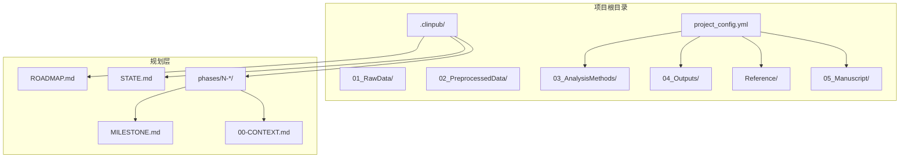
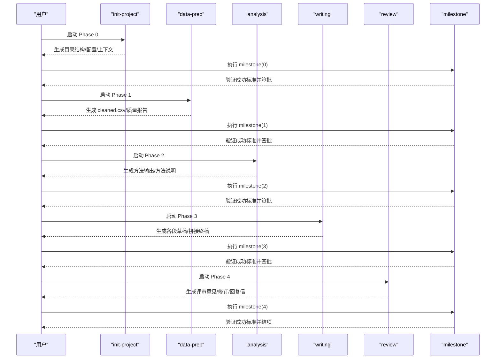
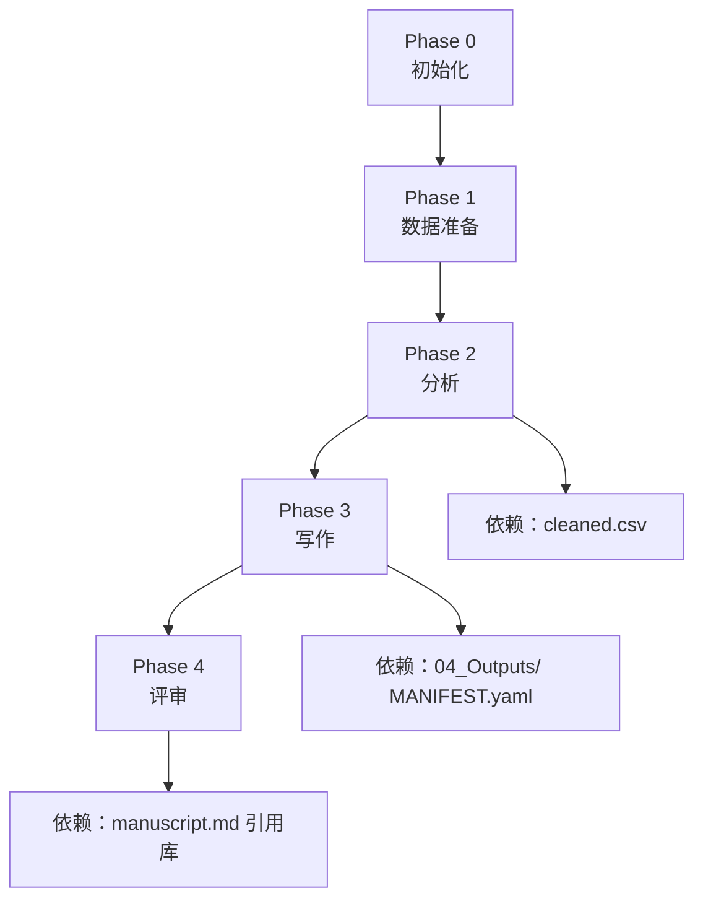
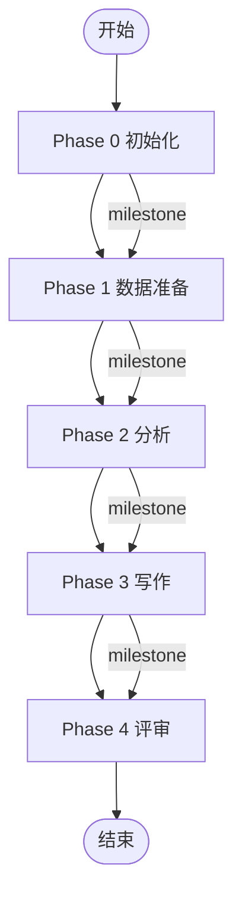
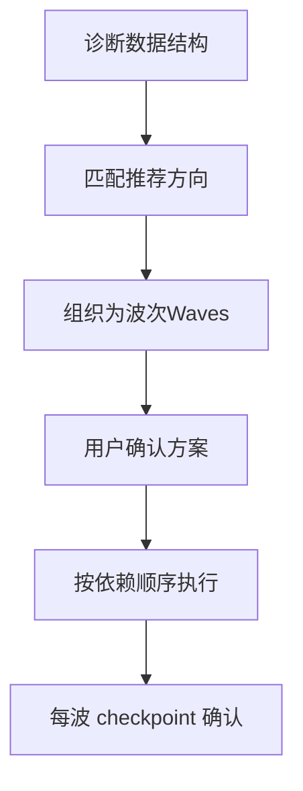

# 工作流程阶段

<cite>
**本文引用的文件**
- [pipeline/workflows/init-project.md](file://pipeline/workflows/init-project.md)
- [pipeline/workflows/data-prep.md](file://pipeline/workflows/data-prep.md)
- [pipeline/workflows/analysis.md](file://pipeline/workflows/analysis.md)
- [pipeline/workflows/writing.md](file://pipeline/workflows/writing.md)
- [pipeline/workflows/review.md](file://pipeline/workflows/review.md)
- [pipeline/workflows/milestone.md](file://pipeline/workflows/milestone.md)
- [pipeline/references/analysis_methods.md](file://pipeline/references/analysis_methods.md)
- [pipeline/references/checkpoints.md](file://pipeline/references/checkpoints.md)
- [pipeline/references/concatenation-protocol.md](file://pipeline/references/concatenation-protocol.md)
- [pipeline/references/citation-strategy.md](file://pipeline/references/citation-strategy.md)
</cite>

## 目录
1. [简介](#简介)
2. [项目结构](#项目结构)
3. [核心组件](#核心组件)
4. [架构总览](#架构总览)
5. [详细组件分析](#详细组件分析)
6. [依赖分析](#依赖分析)
7. [性能考虑](#性能考虑)
8. [故障排查指南](#故障排查指南)
9. [结论](#结论)
10. [附录](#附录)

## 简介
本文件系统化梳理 clinpub 项目的五阶段工作流程：初始化（Phase 0）、数据准备（Phase 1）、分析（Phase 2）、写作（Phase 3）、评审（Phase 4）。文档围绕每个阶段的目标、输入输出、关键任务、质量标准、阶段间依赖与转换条件、里程碑评审机制展开，并结合优化版本（v1.1+）的新功能（断点续做、手稿拼接、方法增强）提供执行指南与可视化图示，帮助用户高效、可审计地推进科研论文自动化管线。

## 项目结构
项目采用“阶段化工作流 + 可审计规划层”的双层组织：
- 阶段工作流：pipeline/workflows/*.md 定义每个 Phase 的目标、步骤、成功标准与里程碑协议
- 规划层：.clinpub/ 下的 ROADMAP.md、STATE.md、各阶段 MILESTONE.md 与上下文文件，确保过程可追踪、可回溯

**图示来源**
- [pipeline/workflows/init-project.md:39-65](file://pipeline/workflows/init-project.md#L39-L65)
- [pipeline/workflows/data-prep.md:100-130](file://pipeline/workflows/data-prep.md#L100-L130)
- [pipeline/workflows/analysis.md:187-210](file://pipeline/workflows/analysis.md#L187-L210)
- [pipeline/workflows/writing.md:198-260](file://pipeline/workflows/writing.md#L198-L260)

**章节来源**
- [pipeline/workflows/init-project.md:39-65](file://pipeline/workflows/init-project.md#L39-L65)
- [pipeline/workflows/data-prep.md:100-130](file://pipeline/workflows/data-prep.md#L100-L130)
- [pipeline/workflows/analysis.md:187-210](file://pipeline/workflows/analysis.md#L187-L210)
- [pipeline/workflows/writing.md:198-260](file://pipeline/workflows/writing.md#L198-L260)

## 核心组件
- 阶段工作流：每个 Phase 的执行蓝图，包含步骤、决策点、质量标准与里程碑
- 里程碑协议：统一的 Gate Review 流程，确保阶段性成果可验证、可审计
- 参考库与协议：分析方法决策树、断点检查点协议、手稿拼接协议、引用策略
- 规划与状态：ROADMAP/STATE 持久化阶段状态与决策轨迹

**章节来源**
- [pipeline/workflows/milestone.md:17-40](file://pipeline/workflows/milestone.md#L17-L40)
- [pipeline/references/checkpoints.md:1-120](file://pipeline/references/checkpoints.md#L1-L120)
- [pipeline/references/analysis_methods.md:18-78](file://pipeline/references/analysis_methods.md#L18-L78)
- [pipeline/references/concatenation-protocol.md:1-291](file://pipeline/references/concatenation-protocol.md#L1-L291)

## 架构总览
五阶段工作流以“阶段边界 + 里程碑评审”为核心控制点，阶段内通过“检查点（checkpoint）”实现人机协同与可审计的中间产物管理。阶段间通过 STATE/ROADMAP 的状态迁移与里程碑签名实现受控切换。

**图示来源**
- [pipeline/workflows/milestone.md:112-152](file://pipeline/workflows/milestone.md#L112-L152)
- [pipeline/workflows/init-project.md:99-113](file://pipeline/workflows/init-project.md#L99-L113)
- [pipeline/workflows/data-prep.md:157-171](file://pipeline/workflows/data-prep.md#L157-L171)
- [pipeline/workflows/analysis.md:255-269](file://pipeline/workflows/analysis.md#L255-L269)
- [pipeline/workflows/writing.md:290-304](file://pipeline/workflows/writing.md#L290-L304)
- [pipeline/workflows/review.md:107-121](file://pipeline/workflows/review.md#L107-L121)

## 详细组件分析

### 阶段 0：初始化（init-project）
- 目标
  - 明确研究框架（题目、类型、目标、假设）
  - 自动推断研究类型（当用户不确定时）
  - 创建项目目录结构与配置文件
  - 记录决策日志
- 输入
  - 用户研究意向与背景信息
  - 可选的自动类型推断规则
- 输出
  - .clinpub/ 目录与 ROADMAP/STATE/PROJECT.md
  - phases/00-init/00-CONTEXT.md
  - project_config.yml
  - 初始目录结构（含 01_RawData、02_PreprocessedData、03/04/05 等）
- 关键任务
  - 讨论研究框架与变量角色
  - 生成 project_config.yml
  - 创建阶段上下文与里程碑
- 质量标准
  - 目录结构完整
  - 配置反映用户决策
  - 仅创建用户确认的方法目录
  - 决策日志完备
- 里程碑评审
  - milestone(0) 验证成功标准并获得用户签批

**章节来源**
- [pipeline/workflows/init-project.md:6-124](file://pipeline/workflows/init-project.md#L6-L124)
- [pipeline/workflows/milestone.md:45-50](file://pipeline/workflows/milestone.md#L45-L50)

### 阶段 1：数据准备（data-prep）
- 目标
  - 将原始数据清洗为 cleaned.csv，生成数据质量报告
  - 支持“重入刷新”：在项目已初始化时重新运行 profile/spec/config 同步
- 输入
  - 01_RawData/ 原始数据文件
  - project_config.yml（含路径、变量、质量阈值等）
- 输出
  - 02_PreprocessedData/data/cleaned.csv
  - HTML 数据质量报告
  - 结构性笔记与时间点决策
- 关键任务
  - 重入刷新：更新变量字典、生成 spec、同步配置
  - 讨论清洗策略（缺失值、异常值、编码、派生变量、分割）
  - 数据结构诊断（纵向/横断面、结局类型、结构性缺失）
  - 执行清洗并生成质量报告
  - 验证输出与 Ambiguity 处理
- 质量标准
  - cleaned.csv 存在且维度合理
  - 报告覆盖缺失、分布、异常、分割（如适用）
  - 纵向数据按约定时间点过滤
  - 清洗代码可独立复现
- 里程碑评审
  - milestone(1) 验证成功标准并获得用户签批

**章节来源**
- [pipeline/workflows/data-prep.md:6-184](file://pipeline/workflows/data-prep.md#L6-L184)
- [pipeline/workflows/milestone.md:52-58](file://pipeline/workflows/milestone.md#L52-L58)

### 阶段 2：分析（analysis）
- 目标
  - 基于数据诊断动态构建分析方案，按依赖顺序执行，产出图、表与方法说明
- 输入
  - cleaned.csv / full_longitudinal.csv
  - project_config.yml
  - analysis_methods.md 决策树与场景参考
- 输出
  - 03_AnalysisMethods/{id}/ 与 04_Outputs/{id}/
  - MANIFEST.yaml（含 writer-agent 作为消费者）
  - 方法说明（按模板生成）
- 关键任务
  - 数据诊断：组别、时间点、结局类型、协变量、缺失模式、纵向标志
  - 动态提案：依据决策树生成推荐方案，按依赖组织为“波次”
  - 用户确认：方法列表、参数、颜色、分割、多重比较校正、显著性水平
  - 方法增强：用户询问不熟悉方法时自动触发 reference-agent 搜索
  - 波次执行：逐波执行并 checkpoint 确认
  - 最终验证：图 ≥300 DPI、英文标签、效应量+95%CI+p、代码可复现
- 质量标准
  - 每个方法具备完整图/表/方法说明
  - 图表符合出版级标准
  - 统计报告完整
  - 代码可从 cleaned.csv 独立运行
  - MANIFEST.yaml 完备
- 里程碑评审
  - milestone(2) 验证成功标准并获得用户签批

**章节来源**
- [pipeline/workflows/analysis.md:6-289](file://pipeline/workflows/analysis.md#L6-L289)
- [pipeline/references/analysis_methods.md:18-78](file://pipeline/references/analysis_methods.md#L18-L78)
- [pipeline/workflows/milestone.md:60-65](file://pipeline/workflows/milestone.md#L60-L65)

### 阶段 3：写作（writing）
- 目标
  - 按 IMRAD 顺序撰写手稿：引言→方法→结果→讨论；最终执行拼接协议生成 manuscript.md
- 输入
  - 各阶段输出（04_Outputs/ 与 03_AnalysisMethods/）
  - Reference/ 引用库与文献检索结果
  - project_config.yml（含目标期刊、引用策略）
- 输出
  - 05_Manuscript/sections/ 各段草稿
  - 05_Manuscript/manuscript.md（拼接终稿）
  - MANIFEST.yaml（含 verifier 作为消费者）
- 关键任务
  - 引用策略讨论：总量、段落配比、年限、IF 偏好
  - 写作计划：核心论点、目标期刊、图表整合
  - 预搜索：Reference Agent 搜索并维护共享引用库
  - 顺序撰写：逐段三步法（预搜索→撰写→用户审阅）
  - 人类化审查：每段内嵌 Humanizer 检查
  - 终稿拼接：按协议合并段落、替换占位符、统一编号、生成 YAML frontmatter
- 质量标准
  - IMRAD 结构完整
  - 引用去重、DOI 完备、编号连续
  - 各段引用与图表一一对应
  - 语言风格自然、无模板化痕迹
  - MANIFEST.yaml 完备
- 里程碑评审
  - milestone(3) 验证成功标准并获得用户签批

**章节来源**
- [pipeline/workflows/writing.md:6-330](file://pipeline/workflows/writing.md#L6-L330)
- [pipeline/references/concatenation-protocol.md:1-291](file://pipeline/references/concatenation-protocol.md#L1-L291)
- [pipeline/references/citation-strategy.md:1-88](file://pipeline/references/citation-strategy.md#L1-L88)
- [pipeline/workflows/milestone.md:67-72](file://pipeline/workflows/milestone.md#L67-L72)

### 阶段 4：评审（review）
- 目标
  - 模拟同行评审，迭代修订手稿并生成逐点回复信
- 输入
  - 05_Manuscript/sections/ 与最终 manuscript.md
  - Reference/references.bib（可能新增）
- 输出
  - 05_Manuscript/review_v1.md
  - 05_Manuscript/final/manuscript.md
  - 05_Manuscript/final/response_letter.md
- 关键任务
  - 评审范围讨论：评审严格度、关注点、补充搜索
  - 生成评审意见：重大/次要问题，定位与建议
  - 确认修订项：用户确认需处理的问题
  - 修订与跟踪：逐条修订并保留前后版本
  - 生成回复信：逐点回应、定位修订位置
  - 验证与循环：直至用户满意
- 质量标准
  - 评审意见完整、可操作
  - 所有确认项均已修订
  - 回复信逐点完整
  - 最终稿与回复信齐全
- 里程碑评审
  - milestone(4) 验证成功标准并结项

**章节来源**
- [pipeline/workflows/review.md:6-134](file://pipeline/workflows/review.md#L6-L134)
- [pipeline/workflows/milestone.md:74-78](file://pipeline/workflows/milestone.md#L74-L78)

## 依赖分析
- 阶段间依赖
  - Phase 0 → Phase 1：需要 project_config.yml 与目录结构
  - Phase 1 → Phase 2：需要 cleaned.csv 与数据质量报告
  - Phase 2 → Phase 3：需要 04_Outputs/ 与 MANIFEST.yaml
  - Phase 3 → Phase 4：需要拼接后的 manuscript.md 与引用库
- 内部依赖（Phase 2）
  - 方法执行按“波次”与“依赖”动态排序，前序输出作为后序输入
  - 纵向分析依赖 full_longitudinal.csv，描述性分析依赖 cleaned.csv
- 里程碑与状态
  - 每个阶段结束执行 milestone，更新 ROADMAP/STATE，用户签批后进入下一阶段

**图示来源**
- [pipeline/workflows/init-project.md:99-113](file://pipeline/workflows/init-project.md#L99-L113)
- [pipeline/workflows/data-prep.md:157-171](file://pipeline/workflows/data-prep.md#L157-L171)
- [pipeline/workflows/analysis.md:255-269](file://pipeline/workflows/analysis.md#L255-L269)
- [pipeline/workflows/writing.md:290-304](file://pipeline/workflows/writing.md#L290-L304)
- [pipeline/workflows/review.md:107-121](file://pipeline/workflows/review.md#L107-L121)

**章节来源**
- [pipeline/workflows/analysis.md:242-276](file://pipeline/workflows/analysis.md#L242-L276)
- [pipeline/references/analysis_methods.md:242-276](file://pipeline/references/analysis_methods.md#L242-L276)

## 性能考虑
- 断点续做（v1.1+）
  - 重入刷新：在项目已初始化时自动重新运行 profile/spec/config 同步，避免重复劳动
  - 波次 checkpoint：每波完成后等待用户确认，支持局部重跑与微调
- 执行效率
  - 动态依赖排序：仅在必要时执行后续波次，减少无效计算
  - 代码可复现：所有分析脚本从 cleaned.csv 读取，便于并行与缓存
- 输出一致性
  - 统一主题与 DPI 标准，减少后期调整成本
  - 引用统一编号与去重，避免拼接阶段的反复修正

**章节来源**
- [pipeline/workflows/data-prep.md:19-58](file://pipeline/workflows/data-prep.md#L19-L58)
- [pipeline/workflows/analysis.md:187-210](file://pipeline/workflows/analysis.md#L187-L210)

## 故障排查指南
- 常见问题与处理
  - 清洗策略分歧：通过 checkpoint:decision 明确选项与推荐，用户输入后继续
  - 输出不符合预期：checkpoint:verify 汇总产物清单，用户提出调整后回退到相应步骤
  - 里程碑未通过：milestone 验证失败时，MILESTONE.md 记录未满足项，修复后重新验证
- 可审计性
  - 所有决策与产物写入 .clinpub/，包括 ROADMAP/STATE/阶段上下文/MILESTONE.md
  - MANIFEST.yaml 声明消费者与质量要求，便于下游验证

**章节来源**
- [pipeline/references/checkpoints.md:10-75](file://pipeline/references/checkpoints.md#L10-L75)
- [pipeline/workflows/milestone.md:17-152](file://pipeline/workflows/milestone.md#L17-L152)

## 结论
五阶段工作流以“阶段边界 + 里程碑评审 + 可审计规划层”为核心，结合动态分析方案、统一拼接协议与严格的统计报告标准，形成从数据到手稿再到评审的闭环。v1.1+ 的断点续做、手稿拼接与方法增强进一步提升了灵活性与可维护性。遵循本文档的流程与质量标准，用户可在可控、可复现的前提下高效完成高质量论文自动化产出。

## 附录

### 阶段流程图（概念示意）

[本图为概念示意，无需图示来源]

### 决策树（Phase 2 方法选择）

**图示来源**
- [pipeline/references/analysis_methods.md:18-78](file://pipeline/references/analysis_methods.md#L18-L78)
- [pipeline/workflows/analysis.md:119-185](file://pipeline/workflows/analysis.md#L119-L185)