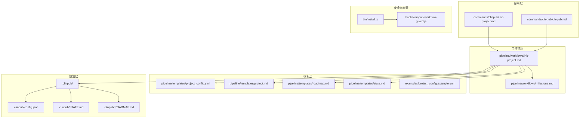
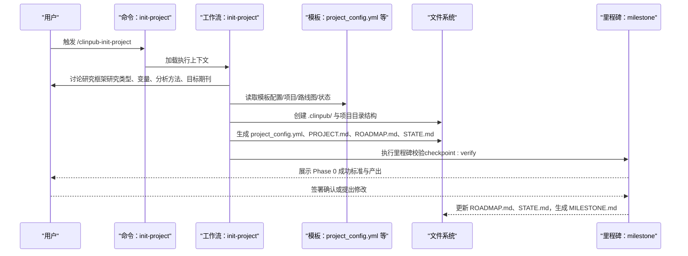
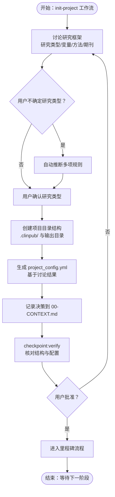
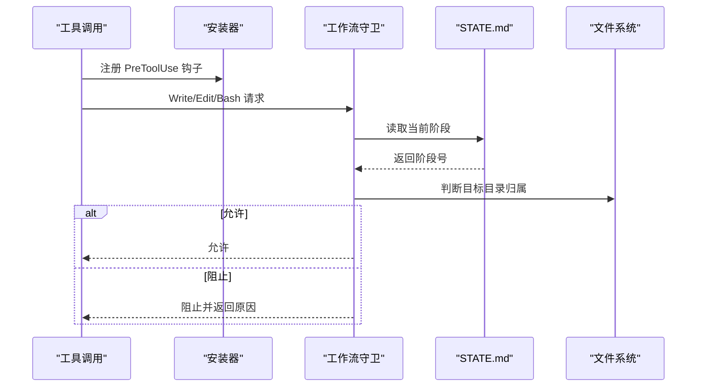
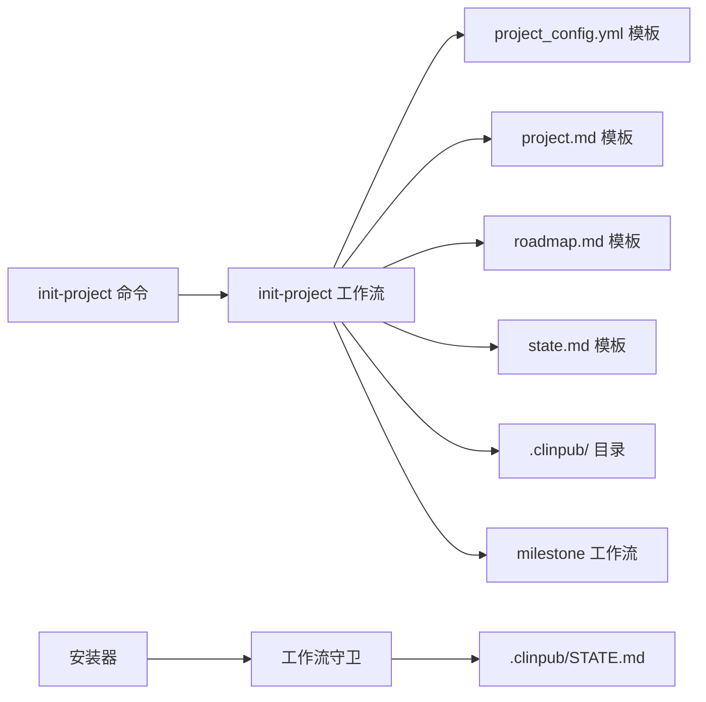

# 阶段一：项目初始化

<cite>
**本文引用的文件**
- [commands/clinpub/init-project.md](file://commands/clinpub/init-project.md)
- [pipeline/workflows/init-project.md](file://pipeline/workflows/init-project.md)
- [pipeline/templates/project_config.yml](file://pipeline/templates/project_config.yml)
- [examples/project_config.example.yml](file://examples/project_config.example.yml)
- [.clinpub/config.json](file://.clinpub/config.json)
- [.clinpub/ROADMAP.md](file://.clinpub/ROADMAP.md)
- [.clinpub/STATE.md](file://.clinpub/STATE.md)
- [pipeline/templates/project.md](file://pipeline/templates/project.md)
- [pipeline/templates/roadmap.md](file://pipeline/templates/roadmap.md)
- [pipeline/templates/state.md](file://pipeline/templates/state.md)
- [commands/clinpub/clinpub.md](file://commands/clinpub/clinpub.md)
- [hooks/clinpub-workflow-guard.js](file://hooks/clinpub-workflow-guard.js)
- [bin/install.js](file://bin/install.js)
- [pipeline/workflows/milestone.md](file://pipeline/workflows/milestone.md)
- [.clinpub/codebase/STRUCTURE.md](file://.clinpub/codebase/STRUCTURE.md)
</cite>

## 目录
1. [引言](#引言)
2. [项目结构](#项目结构)
3. [核心组件](#核心组件)
4. [架构总览](#架构总览)
5. [详细组件分析](#详细组件分析)
6. [依赖关系分析](#依赖关系分析)
7. [性能考量](#性能考量)
8. [故障排查指南](#故障排查指南)
9. [结论](#结论)
10. [附录](#附录)

## 引言
本阶段文档聚焦于“项目初始化”（Phase 0），目标是帮助用户在启动临床研究项目时，通过与系统对话明确研究框架，自动生成项目配置、目录结构以及规划类文档，并建立后续阶段的准入与状态管理机制。初始化阶段强调“先讨论、后生成”，确保所有产出均基于用户决策，且具备可审计的决策记录。

## 项目结构
初始化阶段涉及的目录与文件包括：
- 命令层：用于触发 Phase 0 的命令定义
- 工作流层：端到端编排初始化流程
- 模板层：生成配置、项目说明、路线图与状态等文档
- 规划层：.clinpub 目录下的项目管理制品
- 安全与访问控制：工作流守卫与安装器

**图表来源**
- [commands/clinpub/init-project.md:1-34](file://commands/clinpub/init-project.md#L1-L34)
- [pipeline/workflows/init-project.md:1-124](file://pipeline/workflows/init-project.md#L1-L124)
- [pipeline/templates/project_config.yml:1-97](file://pipeline/templates/project_config.yml#L1-L97)
- [.clinpub/STATE.md:1-63](file://.clinpub/STATE.md#L1-L63)
- [.clinpub/ROADMAP.md:1-123](file://.clinpub/ROADMAP.md#L1-L123)
- [.clinpub/config.json:1-15](file://.clinpub/config.json#L1-L15)
- [hooks/clinpub-workflow-guard.js:79-133](file://hooks/clinpub-workflow-guard.js#L79-L133)
- [bin/install.js:162-207](file://bin/install.js#L162-L207)

**章节来源**
- [commands/clinpub/init-project.md:1-34](file://commands/clinpub/init-project.md#L1-L34)
- [pipeline/workflows/init-project.md:1-124](file://pipeline/workflows/init-project.md#L1-L124)
- [.clinpub/ROADMAP.md:1-123](file://.clinpub/ROADMAP.md#L1-L123)
- [.clinpub/STATE.md:1-63](file://.clinpub/STATE.md#L1-L63)

## 核心组件
- 初始化命令：定义 Phase 0 的目标、执行上下文与成功标准，直接委托工作流执行。
- 初始化工作流：分步骤引导用户讨论研究框架、创建目录结构、生成配置与文档，并进行里程碑校验。
- 配置模板：提供项目配置的完整结构与默认值，支持示例配置作为参考。
- 规划文档模板：生成 PROJECT.md、ROADMAP.md、STATE.md 等，形成项目管理制品。
- 安全与访问控制：工作流守卫根据当前阶段限制对目录的写入权限，安装器注册守卫钩子。

**章节来源**
- [commands/clinpub/init-project.md:14-33](file://commands/clinpub/init-project.md#L14-L33)
- [pipeline/workflows/init-project.md:6-124](file://pipeline/workflows/init-project.md#L6-L124)
- [pipeline/templates/project_config.yml:6-97](file://pipeline/templates/project_config.yml#L6-L97)
- [pipeline/templates/project.md:1-30](file://pipeline/templates/project.md#L1-L30)
- [pipeline/templates/roadmap.md:1-19](file://pipeline/templates/roadmap.md#L1-L19)
- [pipeline/templates/state.md:1-19](file://pipeline/templates/state.md#L1-L19)
- [hooks/clinpub-workflow-guard.js:79-133](file://hooks/clinpub-workflow-guard.js#L79-L133)
- [bin/install.js:162-207](file://bin/install.js#L162-L207)

## 架构总览
初始化阶段采用“命令 → 工作流 → 模板 → 文档”的分层架构。命令负责入口与意图表达，工作流负责编排与校验，模板负责结构化生成，规划层负责状态与路线图维护。安全层通过工作流守卫与安装器确保阶段隔离与合规。

**图表来源**
- [commands/clinpub/init-project.md:20-26](file://commands/clinpub/init-project.md#L20-L26)
- [pipeline/workflows/init-project.md:18-113](file://pipeline/workflows/init-project.md#L18-L113)
- [pipeline/workflows/milestone.md:17-152](file://pipeline/workflows/milestone.md#L17-L152)

## 详细组件分析

### 初始化命令（/clinpub-init-project）
- 目标：在与用户充分讨论研究框架后，生成项目配置、目录结构与规划文档。
- 执行上下文：委托至初始化工作流，确保流程一致性。
- 成功标准：研究框架已记录、目录结构已创建、配置已生成、决策已归档。

**章节来源**
- [commands/clinpub/init-project.md:14-33](file://commands/clinpub/init-project.md#L14-L33)
- [commands/clinpub/clinpub.md:27-52](file://commands/clinpub/clinpub.md#L27-L52)

### 初始化工作流（init-project）
- 目的：通过与用户讨论确定研究框架，创建项目目录结构，生成项目配置与规划文档。
- 关键步骤：
  - 讨论研究框架：研究基础、数据概览、分析方法、预期产出；提供研究类型自动推断。
  - 创建项目结构：.clinpub/ 与各阶段输出目录；仅包含用户确认的分析方法目录。
  - 生成配置：基于讨论结果生成 project_config.yml，涵盖项目、变量、路径、方法、语言、质量、分析等关键段落。
  - 记录决策：将用户决策写入 .clinpub/phases/00-init/00-CONTEXT.md。
  - 里程碑校验：通过 checkpoint:verify 确认结构与配置，随后进入里程碑流程。

**图表来源**
- [pipeline/workflows/init-project.md:20-113](file://pipeline/workflows/init-project.md#L20-L113)

**章节来源**
- [pipeline/workflows/init-project.md:6-124](file://pipeline/workflows/init-project.md#L6-L124)

### 配置模板与示例
- 配置模板：提供 project 段（名称、描述、设计、样本量、目标期刊、报告规范）、variables 段（结局、暴露、协变量、分组、时间/事件变量、ID 变量）、paths 段（原始数据、预处理、方法、输出、参考、手稿、进度、全局）、analysis_plan 段（波次与方法）、language 段（论文/图表/统计语言）、quality 段（期刊级别、DPI、格式、字体、字号）、analysis 段（缺失阈值、显著性水平、多重比较方法）、citation_strategy 段（分段引用目标与总量范围）。
- 示例配置：提供一个 RCT 示例，展示如何将示例文件复制为 project_config.yml 并结合样例数据使用。

**章节来源**
- [pipeline/templates/project_config.yml:6-97](file://pipeline/templates/project_config.yml#L6-L97)
- [examples/project_config.example.yml:8-68](file://examples/project_config.example.yml#L8-L68)

### 规划文档模板
- PROJECT.md：生成项目愿景、研究类型、核心变量、需求与约束、决策记录表格。
- ROADMAP.md：生成项目路线图，包含各阶段目标、成功标准与当前阶段。
- STATE.md：生成项目状态页，包含当前位置、关键指标、最近决策与下一步行动。

**章节来源**
- [pipeline/templates/project.md:1-30](file://pipeline/templates/project.md#L1-L30)
- [pipeline/templates/roadmap.md:1-19](file://pipeline/templates/roadmap.md#L1-L19)
- [pipeline/templates/state.md:1-19](file://pipeline/templates/state.md#L1-L19)

### 安全与访问控制
- 工作流守卫：根据当前阶段判断目标文件所属目录是否允许写入，防止跨阶段写入。
- 安装器：注册 PreToolUse 钩子，将工作流守卫与 Bash/读写/编辑工具调用绑定。

**图表来源**
- [hooks/clinpub-workflow-guard.js:79-133](file://hooks/clinpub-workflow-guard.js#L79-L133)
- [bin/install.js:162-207](file://bin/install.js#L162-L207)

**章节来源**
- [hooks/clinpub-workflow-guard.js:40-133](file://hooks/clinpub-workflow-guard.js#L40-L133)
- [bin/install.js:162-207](file://bin/install.js#L162-L207)

### 里程碑与状态管理
- 里程碑工作流：加载阶段上下文，验证成功标准，收集决策，生成里程碑文档，更新 ROADMAP 与 STATE，并请求用户签核。
- 状态与路线图：STATE.md 记录当前阶段、进度与变更；ROADMAP.md 显示阶段序列与状态。

**章节来源**
- [pipeline/workflows/milestone.md:17-152](file://pipeline/workflows/milestone.md#L17-L152)
- [.clinpub/STATE.md:1-63](file://.clinpub/STATE.md#L1-63)
- [.clinpub/ROADMAP.md:1-123](file://.clinpub/ROADMAP.md#L1-L123)

## 依赖关系分析
- 命令依赖工作流：init-project 命令通过执行上下文指向初始化工作流。
- 工作流依赖模板：工作流在生成配置与文档时读取模板。
- 模板依赖规划层：生成的文档写入 .clinpub/ 目录。
- 安全依赖状态：工作流守卫通过 STATE.md 获取当前阶段，从而决定访问控制。

**图表来源**
- [commands/clinpub/init-project.md:20-26](file://commands/clinpub/init-project.md#L20-L26)
- [pipeline/workflows/init-project.md:10-16](file://pipeline/workflows/init-project.md#L10-L16)
- [hooks/clinpub-workflow-guard.js:79-133](file://hooks/clinpub-workflow-guard.js#L79-L133)
- [bin/install.js:162-207](file://bin/install.js#L162-L207)

**章节来源**
- [commands/clinpub/init-project.md:20-26](file://commands/clinpub/init-project.md#L20-L26)
- [pipeline/workflows/init-project.md:10-16](file://pipeline/workflows/init-project.md#L10-L16)
- [hooks/clinpub-workflow-guard.js:79-133](file://hooks/clinpub-workflow-guard.js#L79-L133)
- [bin/install.js:162-207](file://bin/install.js#L162-L207)

## 性能考量
- 模板渲染：初始化阶段主要为一次性生成，模板读取与文件写入开销较小。
- 讨论与推断：自动研究类型推断为轻量规则匹配，不会成为性能瓶颈。
- 安全检查：工作流守卫在 PreToolUse 钩子中进行，仅在写入操作时生效，对读取与执行操作无影响。

## 故障排查指南
- 无法生成配置或文档
  - 检查模板是否存在且可读。
  - 确认工作流已正确加载模板路径。
- 目录结构未创建
  - 确认工作流步骤已执行到“创建项目结构”。
  - 检查 .clinpub/ 是否可写。
- 研究类型自动推断不符合预期
  - 检查用户输入的关键变量是否满足推断规则。
  - 确保最终类型由用户确认。
- 里程碑校验失败
  - 按照里程碑工作流中的成功标准逐项核对。
  - 修改后重新执行里程碑校验。
- 写入被阻止
  - 检查 STATE.md 中的当前阶段标记。
  - 确认目标目录属于未来阶段，若如此则需先完成当前阶段。

**章节来源**
- [pipeline/workflows/init-project.md:36-37](file://pipeline/workflows/init-project.md#L36-L37)
- [pipeline/workflows/milestone.md:42-81](file://pipeline/workflows/milestone.md#L42-L81)
- [hooks/clinpub-workflow-guard.js:104-112](file://hooks/clinpub-workflow-guard.js#L104-L112)

## 结论
初始化阶段通过“先讨论、后生成”的方式，确保项目配置与目录结构完全符合用户预期，并通过规划文档与里程碑机制实现可审计与可追溯的状态管理。配合工作流守卫与安装器，系统在阶段边界上提供了必要的访问控制，保障项目执行的有序性与安全性。

## 附录

### 初始化命令使用方法与参数
- 命令入口：/clinpub-init-project
- 执行方式：在支持的客户端中输入命令并确认。
- 参数说明：命令文件未定义额外参数，初始化流程通过与用户的交互完成参数收集。
- 成功标准：研究框架已记录、目录结构已创建、配置已生成、决策已归档。

**章节来源**
- [commands/clinpub/clinpub.md:27-52](file://commands/clinpub/clinpub.md#L27-L52)
- [commands/clinpub/init-project.md:24-33](file://commands/clinpub/init-project.md#L24-L33)

### 项目配置参数说明与默认值
- 项目段（project）
  - name：项目名称（默认为空字符串）
  - description：项目描述（默认为空字符串）
  - design：研究设计（默认为队列研究）
  - sample_size：样本量（默认为 0）
  - target_journal：目标期刊（默认为 SCI Q1/Q2）
  - reporting_standard：报告规范（默认为 STROBE）
- 变量段（variables）
  - outcome：结局变量（默认为空字符串）
  - outcome_type：结局类型（默认为 binary）
  - exposure：暴露/预测变量（默认为空数组）
  - covariates：协变量（默认为空数组）
  - time_variable：生存分析时间变量（默认为空字符串）
  - event_variable：生存分析事件变量（默认为空字符串）
  - group_variable：分组变量（默认为空字符串）
  - id_variable：患者标识符（默认为空字符串）
- 路径段（paths）
  - raw_data：原始数据目录（默认为 01_RawData）
  - preprocessed：预处理目录（默认为 02_PreprocessedData）
  - methods：分析方法目录（默认为 03_AnalysisMethods）
  - outputs：输出目录（默认为 04_Outputs）
  - reference：参考文献目录（默认为 Reference）
  - manuscript：手稿目录（默认为 05_Manuscript）
  - progress：进度报告目录（默认为 06_ProgressReports）
  - global：全局目录（默认为 00_Global）
- 分析计划段（analysis_plan）
  - waves：波次与方法映射（默认为空对象）
- 语言段（language）
  - manuscript：论文语言（默认为 zh-CN）
  - figures_tables：图表语言（默认为 en）
  - statistics：统计主语言（默认为 R）
- 质量段（quality）
  - journal_level：期刊级别（默认为 Q1）
  - figure_dpi：图表分辨率（默认为 300）
  - figure_format：图表格式（默认为 png）
  - figure_font：图表字体（默认为 Arial）
  - figure_font_size：图表字号（默认为 10）
- 分析段（analysis）
  - missing_threshold_low：低缺失阈值（默认为 0.05）
  - missing_threshold_mid：中缺失阈值（默认为 0.20）
  - missing_threshold_high：高缺失阈值（默认为 0.20）
  - significance_level：显著性水平（默认为 0.05）
  - multiple_comparison：多重比较方法（默认为 fdr）
- 引用策略段（citation_strategy）
  - section_targets：分段引用目标范围（默认为 introduction: 10-15, methods: 3-5, results: 0-3, discussion: 15-25）
  - total_range：总引用数量范围（默认为 [30, 55]）
  - year_range：年份范围与例外（默认为 max_years_ago: 5, landmark_exceptions: []）
  - if_preference：最低影响因子偏好（默认为 null）

**章节来源**
- [pipeline/templates/project_config.yml:6-97](file://pipeline/templates/project_config.yml#L6-L97)
- [examples/project_config.example.yml:8-68](file://examples/project_config.example.yml#L8-L68)

### 目录结构创建与初始数据准备
- 目录结构
  - .clinpub/：项目管理制品（PROJECT.md、ROADMAP.md、STATE.md、phases/00-init/00-CONTEXT.md）
  - 01_RawData/：原始数据（只读）
  - 02_PreprocessedData/data/：清理后的数据文件（cleaned.csv）
  - 03_AnalysisMethods/：仅包含用户确认的分析方法目录
  - 04_Outputs/：图表与表格输出
  - Reference/：文献资料
  - 05_Manuscript/：章节草稿与回复信件
  - project_config.yml：项目配置
  - run_all.R：主 R 脚本
- 初始数据准备
  - 清理后的数据文件（cleaned.csv）位于 02_PreprocessedData/data/，供后续阶段使用。

**章节来源**
- [pipeline/workflows/init-project.md:39-65](file://pipeline/workflows/init-project.md#L39-L65)
- [.clinpub/codebase/STRUCTURE.md:247-259](file://.clinpub/codebase/STRUCTURE.md#L247-L259)

### 项目状态管理与里程碑
- 状态管理
  - STATE.md 记录当前阶段、进度与变更历史。
  - ROADMAP.md 显示阶段序列与状态。
- 里程碑
  - milestone 工作流验证成功标准、收集决策、生成里程碑文档并更新状态。
  - 用户签核后进入下一阶段。

**章节来源**
- [.clinpub/STATE.md:1-63](file://.clinpub/STATE.md#L1-L63)
- [.clinpub/ROADMAP.md:1-123](file://.clinpub/ROADMAP.md#L1-L123)
- [pipeline/workflows/milestone.md:17-152](file://pipeline/workflows/milestone.md#L17-L152)

### 版本控制与团队协作设置
- 版本控制
  - .clinpub/ 目录提交到版本库，用于追踪项目管理制品。
  - 项目输出目录（如 01_RawData/、02_PreprocessedData/ 等）不在仓库中，避免污染仓库体积。
- 团队协作
  - 通过 checkpoint:verify 与 milestone 流程确保阶段性成果经用户确认。
  - 工作流守卫与安装器保证阶段边界的安全性，减少跨阶段误操作。

**章节来源**
- [.clinpub/codebase/STRUCTURE.md:247-259](file://.clinpub/codebase/STRUCTURE.md#L247-L259)
- [hooks/clinpub-workflow-guard.js:79-133](file://hooks/clinpub-workflow-guard.js#L79-L133)
- [bin/install.js:162-207](file://bin/install.js#L162-L207)

### 完整初始化流程示例与最佳实践
- 流程示例
  - 步骤 1：输入 /clinpub-init-project
  - 步骤 2：与系统讨论研究框架（研究类型、变量、分析方法、目标期刊）
  - 步骤 3：系统自动推断研究类型（可选）
  - 步骤 4：创建 .clinpub/ 与项目目录结构
  - 步骤 5：生成 project_config.yml、PROJECT.md、ROADMAP.md、STATE.md
  - 步骤 6：通过 checkpoint:verify 核对结构与配置
  - 步骤 7：进入 milestone 流程并完成签核
- 最佳实践
  - 在讨论阶段充分澄清变量角色与分析方法，避免后续返工。
  - 仅确认将要执行的分析方法，保持 03_AnalysisMethods/ 与 04_Outputs/ 的整洁。
  - 将决策记录在 00-CONTEXT.md，便于审计与复盘。
  - 严格遵守阶段边界，确保每个阶段完成后才进入下一阶段。

**章节来源**
- [commands/clinpub/clinpub.md:27-52](file://commands/clinpub/clinpub.md#L27-L52)
- [pipeline/workflows/init-project.md:18-113](file://pipeline/workflows/init-project.md#L18-L113)
- [pipeline/workflows/milestone.md:17-152](file://pipeline/workflows/milestone.md#L17-L152)