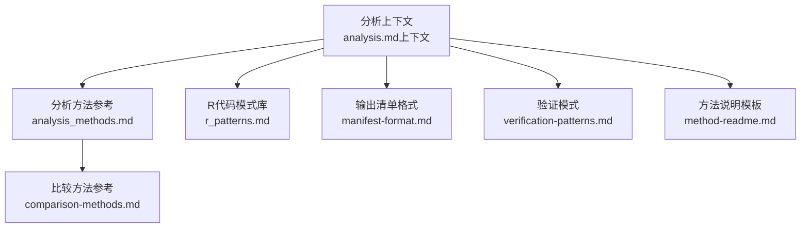
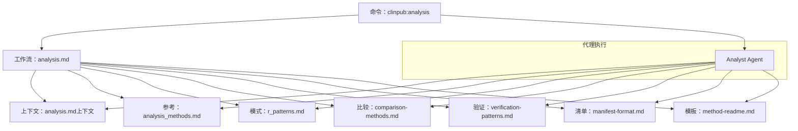
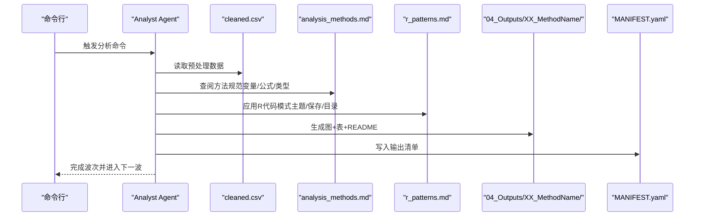
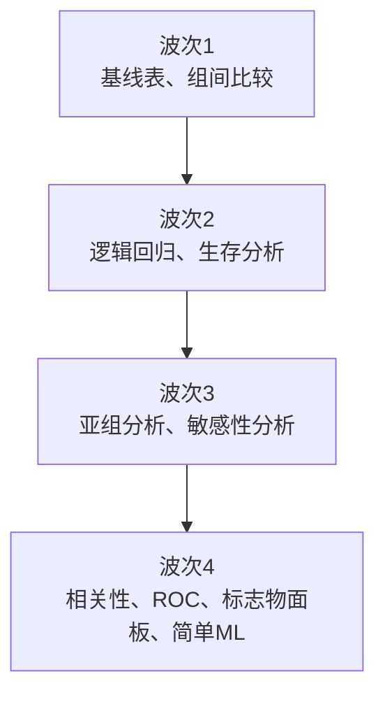
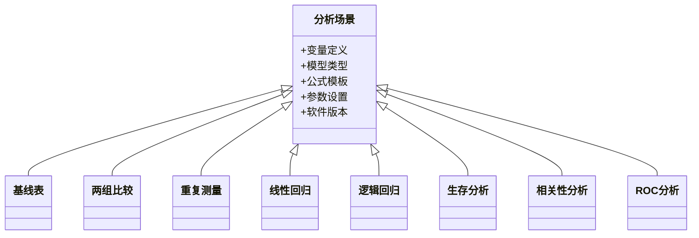
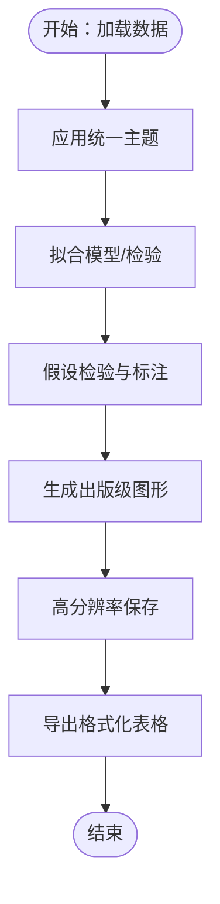
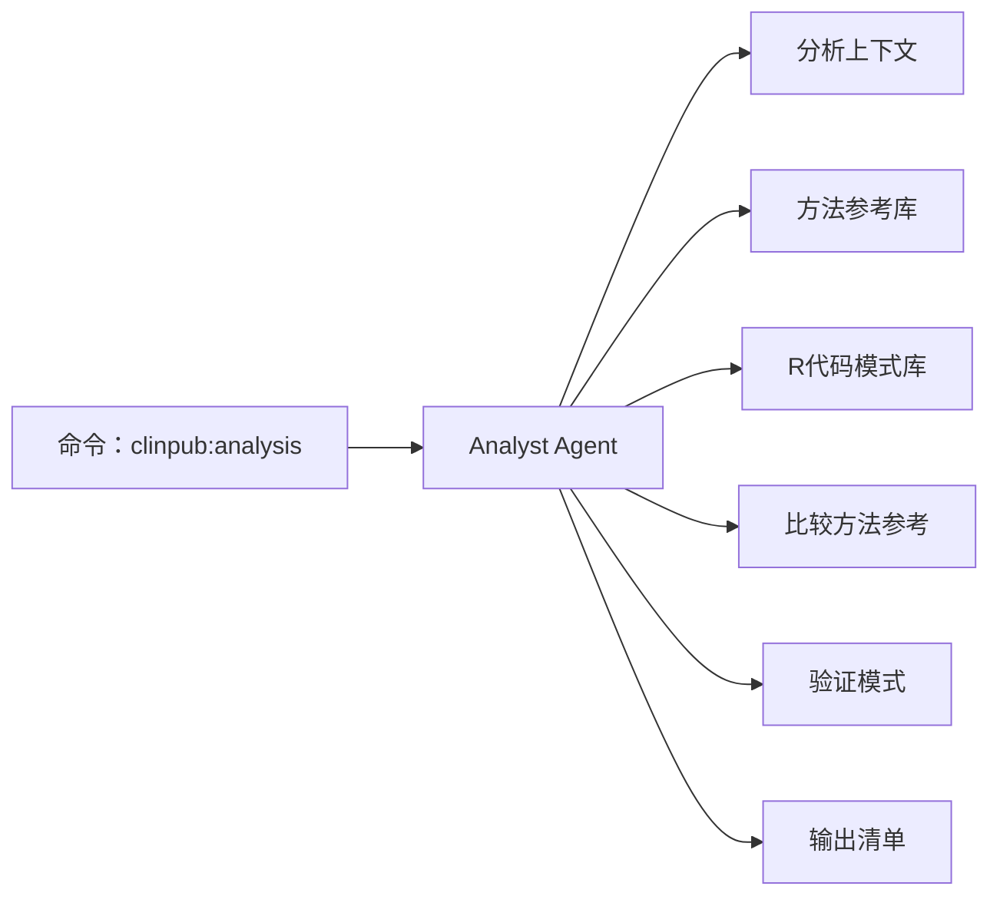

# 阶段三：统计分析

<cite>
**本文引用的文件**
- [analyst-agent.md](file://agents/analyst-agent.md)
- [analysis.md（命令）](file://commands/clinpub/analysis.md)
- [analysis.md（分析上下文）](file://pipeline/contexts/analysis.md)
- [analysis_methods.md](file://pipeline/references/analysis_methods.md)
- [r_patterns.md](file://pipeline/references/r_patterns.md)
- [comparison-methods.md](file://pipeline/references/comparison-methods.md)
- [verification-patterns.md](file://pipeline/references/verification-patterns.md)
- [manifest-format.md](file://pipeline/references/manifest-format.md)
- [method-readme.md](file://pipeline/templates/method-readme.md)
</cite>

## 目录
1. [引言](#引言)
2. [项目结构](#项目结构)
3. [核心组件](#核心组件)
4. [架构总览](#架构总览)
5. [详细组件分析](#详细组件分析)
6. [依赖关系分析](#依赖关系分析)
7. [性能与质量控制](#性能与质量控制)
8. [故障排查指南](#故障排查指南)
9. [结论](#结论)
10. [附录](#附录)

## 引言
本阶段文档聚焦于“统计分析”阶段（阶段三），系统化阐述以下内容：
- 统计方法推荐与选择标准
- 分析执行流程与波次依赖
- 结果验证与质量控制
- R语言脚本执行规范与模式
- 统计结果解读、图表生成与报告自动化
- 假设检验与多重比较校正策略
- 方法适用条件、局限性与替代方案
- 完整工作流程、结果解释指南与常见问题处理

该阶段严格遵循“CSV托盘”输入、“图优先”的输出原则，并要求每个方法产出“图+表+说明文档”，最终形成可复现、可审计、可提交的出版级分析产物。

## 项目结构
统计分析阶段围绕以下关键要素组织：
- 分析上下文与原则：定义输入数据、输出标准、波次顺序与质量要求
- 方法参考库：按场景给出方法清单、变量与公式模板、参数设置与软件版本
- R代码模式库：提供标准化的实现模式（含主题、保存、目录规则等）
- 比较方法参考：用于组间比较的策略与注意事项
- 验证与清单：输出清单格式与验证模式，确保可追溯与可消费

**图表来源**
- [analysis.md（分析上下文）:1-35](file://pipeline/contexts/analysis.md#L1-L35)
- [analysis_methods.md](file://pipeline/references/analysis_methods.md)
- [r_patterns.md](file://pipeline/references/r_patterns.md)
- [comparison-methods.md](file://pipeline/references/comparison-methods.md)
- [manifest-format.md](file://pipeline/references/manifest-format.md)
- [verification-patterns.md](file://pipeline/references/verification-patterns.md)
- [method-readme.md](file://pipeline/templates/method-readme.md)

**章节来源**
- [analysis.md（分析上下文）:1-35](file://pipeline/contexts/analysis.md#L1-L35)

## 核心组件
- 分析代理（Analyst Agent）：承担R主、Python辅的数据清洗、统计分析与出版级图表/表格生成；负责从预处理CSV读取数据，按波次执行方法，输出图、表与方法说明文档，并在每波结束后生成输出清单。
- 分析命令（clinpub:analysis）：驱动分析流程，读取分析上下文与参考材料，按用户确认的方法顺序执行，确保每个方法满足出版级标准。
- 分析上下文：定义输入输出规范、波次依赖、质量标准（分辨率、标签语言、主题、效应量与置信区间、精确p值等）。
- 方法参考库：提供各分析场景的变量、公式、模型类型、参数与软件版本等细节。
- R代码模式库：提供12种标准化实现模式（如主题、保存、目录规则、稳健性检查等）。
- 比较方法参考：指导组间比较的策略、前提假设与稳健性处理。
- 验证与清单：输出清单格式与验证模式，确保可复现与可消费。

**章节来源**
- [analyst-agent.md:1-107](file://agents/analyst-agent.md#L1-L107)
- [analysis.md（命令）:1-37](file://commands/clinpub/analysis.md#L1-L37)
- [analysis.md（分析上下文）:1-35](file://pipeline/contexts/analysis.md#L1-L35)

## 架构总览
下图展示从命令到代理再到参考库与模板的整体执行架构：

**图表来源**
- [analysis.md（命令）:1-37](file://commands/clinpub/analysis.md#L1-L37)
- [analyst-agent.md:1-107](file://agents/analyst-agent.md#L1-L107)
- [analysis.md（分析上下文）:1-35](file://pipeline/contexts/analysis.md#L1-L35)
- [analysis_methods.md](file://pipeline/references/analysis_methods.md)
- [r_patterns.md](file://pipeline/references/r_patterns.md)
- [comparison-methods.md](file://pipeline/references/comparison-methods.md)
- [verification-patterns.md](file://pipeline/references/verification-patterns.md)
- [manifest-format.md](file://pipeline/references/manifest-format.md)
- [method-readme.md](file://pipeline/templates/method-readme.md)

## 详细组件分析

### 组件一：分析代理（Analyst Agent）
职责与流程要点：
- 输入：从“02_PreprocessedData/data/cleaned.csv”读取数据
- 输出：每个方法在“04_Outputs/XX_MethodName/”生成图、表与方法说明文档
- 执行：按波次顺序执行，先完成所有方法再生成输出清单
- 质量：≥300 DPI、英文标签、色盲友好、主题统一；报告效应量、95%置信区间与精确p值
- 代码独立可运行：R脚本自包含，记录R版本与关键包版本

**图表来源**
- [analyst-agent.md:1-107](file://agents/analyst-agent.md#L1-L107)
- [analysis.md（命令）:1-37](file://commands/clinpub/analysis.md#L1-L37)
- [analysis_methods.md](file://pipeline/references/analysis_methods.md)
- [r_patterns.md](file://pipeline/references/r_patterns.md)
- [manifest-format.md](file://pipeline/references/manifest-format.md)

**章节来源**
- [analyst-agent.md:1-107](file://agents/analyst-agent.md#L1-L107)

### 组件二：分析上下文与波次依赖
- 输入输出规范：CSV托盘、≥300 DPI、英文标签、主题统一、效应量+95%CI+精确p值
- 波次顺序与依赖：
  - 波次1：基线表、组间比较（无依赖）
  - 波次2：逻辑回归、生存分析（依赖波次1）
  - 波次3：亚组分析、敏感性分析（依赖波次2模型）
  - 波次4：相关性分析、ROC分析、标志物面板、简单机器学习（依赖数据分区）

**图表来源**
- [analysis.md（分析上下文）:13-18](file://pipeline/contexts/analysis.md#L13-L18)

**章节来源**
- [analysis.md（分析上下文）:1-35](file://pipeline/contexts/analysis.md#L1-L35)

### 组件三：统计方法参考库（按场景）
方法参考库提供各分析场景的变量、公式、模型类型、参数与软件版本等细节，是方法选择与实现的关键依据。典型场景包括：
- 基线表：使用汇总表与p值生成工具，结合组间比较
- 两组比较：非参数或参数检验，配以箱线图
- 重复测量：混合效应模型与估计边际均数
- 线性回归：线性模型与共线性诊断
- 逻辑回归：广义线性模型与ROC曲线
- 生存分析：生存对象、生存曲线与Cox回归
- 相关性分析：相关系数与可视化
- ROC分析：受试者工作特征与置信区间

**图表来源**
- [analysis_methods.md](file://pipeline/references/analysis_methods.md)

**章节来源**
- [analysis_methods.md](file://pipeline/references/analysis_methods.md)

### 组件四：R代码模式库（标准化实现）
R代码模式库提供12种标准化实现模式，覆盖：
- 主题与保存：统一主题、高分辨率保存、目录命名规范
- 数据读取与清理：独立可运行、变量类型与缺失处理
- 假设检验与稳健性：正态性、方差齐性、比例风险等假设测试与标注
- 多重比较与稳健性：多重比较校正策略与稳健估计
- 可视化与表格：出版级图形与表格格式

**图表来源**
- [r_patterns.md](file://pipeline/references/r_patterns.md)

**章节来源**
- [r_patterns.md](file://pipeline/references/r_patterns.md)

### 组件五：比较方法参考与策略
比较方法参考提供组间比较的策略与注意事项，包括：
- 方法选择：参数vs非参数、单因素vs多因素
- 前提假设：正态性、方差齐性、独立性
- 稳健性：异常值处理、分层/协变量调整
- 报告规范：效应量、置信区间、精确p值

**章节来源**
- [comparison-methods.md](file://pipeline/references/comparison-methods.md)

### 组件六：验证与清单
- 验证模式：对输出进行一致性与完整性检查，确保可复现与可审计
- 输出清单格式：列出所有方法输出，声明消费者（如写稿代理），便于后续流程衔接

**章节来源**
- [verification-patterns.md](file://pipeline/references/verification-patterns.md)
- [manifest-format.md](file://pipeline/references/manifest-format.md)

## 依赖关系分析
- 命令驱动：命令负责触发分析流程，读取上下文与参考材料
- 代理执行：代理按波次顺序执行，依赖方法参考与R模式库
- 输出治理：每波完成后生成输出清单，确保下游可消费
- 质量控制：上下文定义质量标准，验证模式保障一致性

**图表来源**
- [analysis.md（命令）:1-37](file://commands/clinpub/analysis.md#L1-L37)
- [analyst-agent.md:1-107](file://agents/analyst-agent.md#L1-L107)
- [analysis.md（分析上下文）:1-35](file://pipeline/contexts/analysis.md#L1-L35)
- [analysis_methods.md](file://pipeline/references/analysis_methods.md)
- [r_patterns.md](file://pipeline/references/r_patterns.md)
- [comparison-methods.md](file://pipeline/references/comparison-methods.md)
- [verification-patterns.md](file://pipeline/references/verification-patterns.md)
- [manifest-format.md](file://pipeline/references/manifest-format.md)

**章节来源**
- [analysis.md（命令）:1-37](file://commands/clinpub/analysis.md#L1-L37)
- [analyst-agent.md:1-107](file://agents/analyst-agent.md#L1-L107)

## 性能与质量控制
- 图像质量：≥300 DPI，TIFF（LZW）、PNG、PDF（矢量）多种格式满足不同用途
- 标签与主题：英文标签、色盲友好、统一主题，提升可读性与可发表性
- 统计报告：效应量、95%置信区间、精确p值，避免模糊表述
- 假设检验：正态性、方差齐性、比例风险等假设逐一检验并标注
- 多重比较：采用合适校正策略，降低假阳性率
- 可复现性：R脚本自包含，记录R版本与关键包版本，支持独立运行

[本节为通用指导，无需具体文件分析]

## 故障排查指南
- 数据读取失败
  - 检查预处理数据是否存在于“02_PreprocessedData/data/cleaned.csv”
  - 确认字段名与大小写符合预期
- 图像分辨率不足
  - 确认使用高分辨率保存与统一主题
  - 检查输出格式是否为TIFF/PNG/PDF之一
- 报告不完整
  - 确保每个方法都生成图、表与README
  - 检查是否遗漏效应量、置信区间或精确p值
- 假设检验未通过
  - 检查正态性、方差齐性、比例风险等假设测试结果
  - 必要时更换非参数方法或进行数据变换
- 多重比较导致多重阳性
  - 使用合适的多重比较校正策略
  - 限制探索性分析范围，优先确认性分析
- 输出清单缺失
  - 在每波完成后生成并核对MANIFEST.yaml
  - 确保清单中包含所有输出文件并声明消费者

**章节来源**
- [analysis.md（分析上下文）:5-12](file://pipeline/contexts/analysis.md#L5-L12)
- [verification-patterns.md](file://pipeline/references/verification-patterns.md)
- [manifest-format.md](file://pipeline/references/manifest-format.md)

## 结论
统计分析阶段通过“命令—代理—参考库—模板”的协同体系，实现了从方法选择、执行到结果验证与报告自动化的全流程闭环。其关键在于：
- 明确的输入输出规范与波次依赖
- 可复现的R代码模式与出版级质量标准
- 全面的假设检验与多重比较校正
- 完整的验证与清单管理

该体系既保证了分析的科学性与可发表性，也为后续撰写与审阅提供了坚实基础。

[本节为总结性内容，无需具体文件分析]

## 附录

### A. 统计分析工作流程（步骤化）
- 准备阶段
  - 读取项目配置与预处理数据
  - 根据分析上下文理解变量、方法与输出设置
- 方法选择与生成
  - 依据计划与方法参考生成R/Python代码
  - 应用R代码模式（主题、保存、目录规则）
- 执行与验证
  - 运行代码，生成图、表与README
  - 对假设检验与多重比较进行标注与处理
- 清单与交接
  - 每波完成后生成输出清单，声明消费者
  - 进入下一波或进入下一阶段

**章节来源**
- [analyst-agent.md:17-75](file://agents/analyst-agent.md#L17-L75)
- [analysis.md（命令）:14-28](file://commands/clinpub/analysis.md#L14-L28)

### B. 方法选择与比较策略要点
- 选择标准：研究问题、变量类型、分布特性、样本量与设计
- 比较方法：参数vs非参数、单因素vs多因素、校正策略
- 报告规范：效应量、置信区间、精确p值、假设检验标注

**章节来源**
- [analysis_methods.md](file://pipeline/references/analysis_methods.md)
- [comparison-methods.md](file://pipeline/references/comparison-methods.md)

### C. 结果解读与报告模板
- 方法说明模板：目的、统计方法、输入变量、输出文件、解读要点
- 报告自动化：README与MANIFEST.yaml确保可追溯与可消费

**章节来源**
- [method-readme.md](file://pipeline/templates/method-readme.md)
- [manifest-format.md](file://pipeline/references/manifest-format.md)