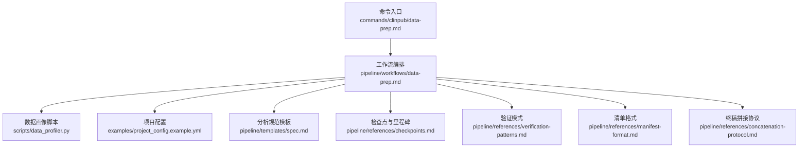
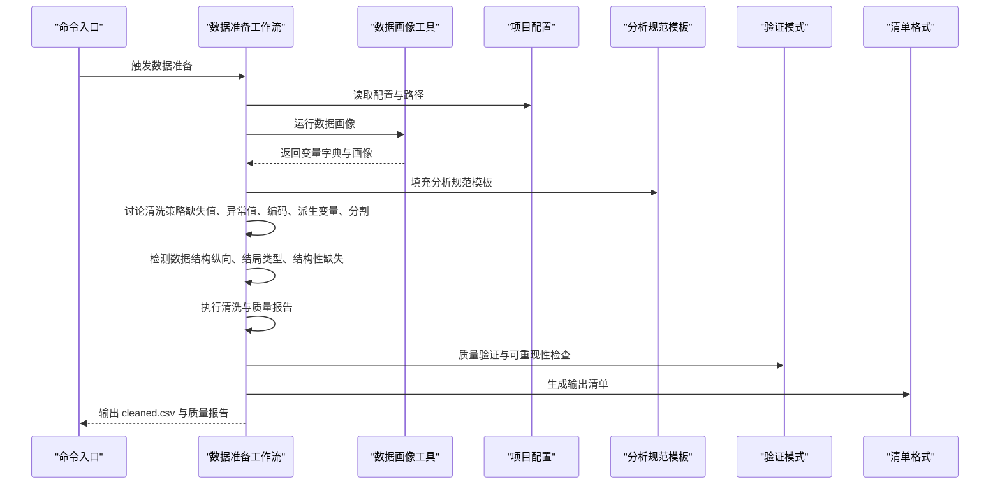
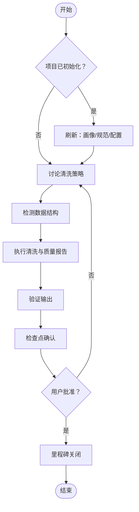
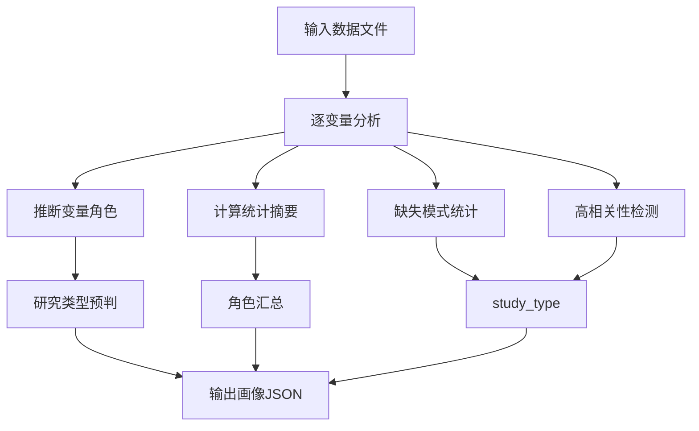
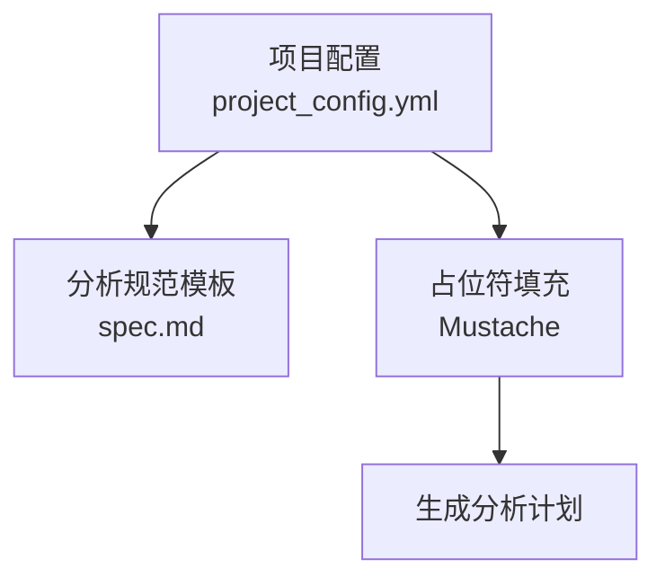
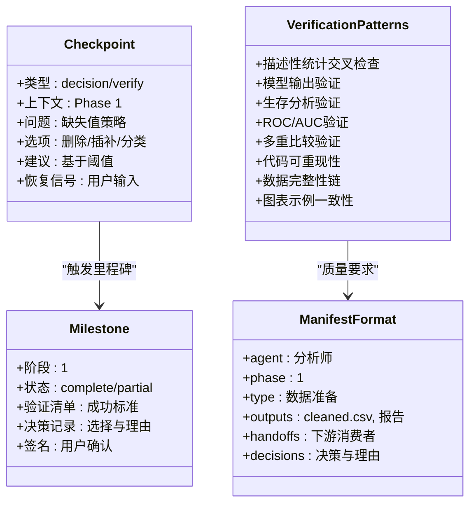
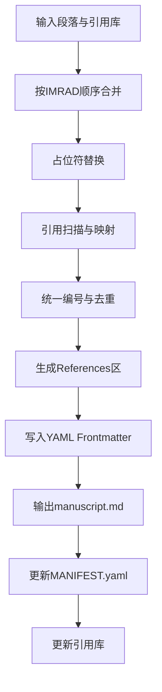
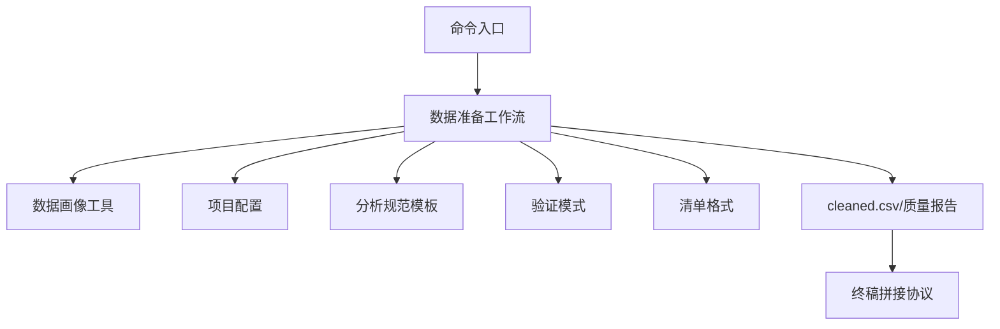

# 阶段二：数据准备

<cite>
**本文档引用的文件**
- [data-prep.md](file://pipeline/workflows/data-prep.md)
- [data-prep.md](file://commands/clinpub/data-prep.md)
- [data_profiler.py](file://scripts/data_profiler.py)
- [checkpoints.md](file://pipeline/references/checkpoints.md)
- [verification-patterns.md](file://pipeline/references/verification-patterns.md)
- [manifest-format.md](file://pipeline/references/manifest-format.md)
- [concatenation-protocol.md](file://pipeline/references/concatenation-protocol.md)
- [project_config.example.yml](file://examples/project_config.example.yml)
- [project_config.yml](file://pipeline/templates/project_config.yml)
- [spec.md](file://pipeline/templates/spec.md)
</cite>

## 目录
1. [引言](#引言)
2. [项目结构](#项目结构)
3. [核心组件](#核心组件)
4. [架构概览](#架构概览)
5. [详细组件分析](#详细组件分析)
6. [依赖关系分析](#依赖关系分析)
7. [性能考虑](#性能考虑)
8. [故障排除指南](#故障排除指南)
9. [结论](#结论)
10. [附录](#附录)

## 引言
本文件面向"阶段二：数据准备"，系统阐述从原始数据到分析就绪数据集的完整流程，包括数据清洗、转换、质量控制、档案生成、变量定义、缺失值处理、异常值检测、数据合并与格式标准化、元数据管理、质量评估与统计摘要、可视化方法、质量标准与验证规则以及错误修复策略。文档同时提供最佳实践、常见问题解决方案与性能优化建议，帮助研究团队构建可重现、高质量的数据准备流水线。

## 项目结构
数据准备阶段围绕以下核心文件与目录组织：
- 工作流与命令入口：pipeline/workflows/data-prep.md、commands/clinpub/data-prep.md
- 数据画像工具：scripts/data_profiler.py
- 质量与验证参考：pipeline/references/checkpoints.md、pipeline/references/verification-patterns.md、pipeline/references/manifest-format.md
- 项目配置与模板：examples/project_config.example.yml、pipeline/templates/project_config.yml、pipeline/templates/spec.md
- 终稿拼接协议：pipeline/references/concatenation-protocol.md

**图表来源**
- [data-prep.md:1-184](file://pipeline/workflows/data-prep.md#L1-L184)
- [data-prep.md:1-50](file://commands/clinpub/data-prep.md#L1-L50)
- [data_profiler.py:1-353](file://scripts/data_profiler.py#L1-L353)
- [checkpoints.md:1-120](file://pipeline/references/checkpoints.md#L1-L120)
- [verification-patterns.md:1-358](file://pipeline/references/verification-patterns.md#L1-L358)
- [manifest-format.md:1-187](file://pipeline/references/manifest-format.md#L1-L187)
- [concatenation-protocol.md:1-291](file://pipeline/references/concatenation-protocol.md#L1-L291)
- [project_config.example.yml:1-68](file://examples/project_config.example.yml#L1-L68)
- [project_config.yml:1-97](file://pipeline/templates/project_config.yml#L1-L97)
- [spec.md:1-125](file://pipeline/templates/spec.md#L1-L125)

**章节来源**
- [data-prep.md:1-184](file://pipeline/workflows/data-prep.md#L1-L184)
- [data-prep.md:1-50](file://commands/clinpub/data-prep.md#L1-L50)

## 核心组件
- 数据准备工作流：定义从数据加载、策略讨论、结构检测、清洗执行、输出验证到里程碑关闭的全流程步骤与成功标准。
- 数据画像工具：自动提取变量字典、缺失模式、变量角色、相关性与研究类型建议，支撑变量定义与清洗策略制定。
- 项目配置与规范模板：提供变量角色、路径、分析阈值、语言与质量标准等配置项，以及分析规范模板供生成分析计划。
- 质量与验证参考：检查点与里程碑协议、验证模式、清单格式，确保输出可验证、可追溯、可交接。
- 终稿拼接协议：为后续阶段的文本整合提供统一的占位符替换、引用编号与清单生成规则。

**章节来源**
- [data-prep.md:17-184](file://pipeline/workflows/data-prep.md#L17-L184)
- [data_profiler.py:1-353](file://scripts/data_profiler.py#L1-L353)
- [project_config.example.yml:1-68](file://examples/project_config.example.yml#L1-L68)
- [project_config.yml:1-97](file://pipeline/templates/project_config.yml#L1-L97)
- [spec.md:1-125](file://pipeline/templates/spec.md#L1-L125)
- [checkpoints.md:1-120](file://pipeline/references/checkpoints.md#L1-L120)
- [verification-patterns.md:1-358](file://pipeline/references/verification-patterns.md#L1-L358)
- [manifest-format.md:1-187](file://pipeline/references/manifest-format.md#L1-L187)
- [concatenation-protocol.md:1-291](file://pipeline/references/concatenation-protocol.md#L1-L291)

## 架构概览
数据准备阶段采用"策略讨论—结构检测—清洗执行—质量验证—里程碑关闭"的流水线架构，结合项目配置与画像工具实现自动化与人工确认的平衡。

**图表来源**
- [data-prep.md:19-184](file://pipeline/workflows/data-prep.md#L19-L184)
- [data_profiler.py:201-325](file://scripts/data_profiler.py#L201-L325)
- [spec.md:1-125](file://pipeline/templates/spec.md#L1-L125)
- [verification-patterns.md:158-224](file://pipeline/references/verification-patterns.md#L158-L224)
- [manifest-format.md:51-100](file://pipeline/references/manifest-format.md#L51-L100)

## 详细组件分析

### 数据准备工作流（data-prep.md）
- 重新进入刷新：若检测到已初始化项目，自动刷新数据画像、分析规范与配置，保持变量定义与分析计划的一致性。
- 清洗策略讨论：在执行任何变换前，与用户确认缺失值策略、异常值处理、变量编码、派生变量与训练/验证分割。
- 数据结构检测：识别纵向数据、结局类型与结构性缺失，形成结构注释，指导后续分析与表格生成。
- 清洗执行：导入数据、处理缺失值、检测异常值、创建派生变量与编码、生成HTML质量报告，并按用户确认的时间点过滤纵向数据。
- 输出验证：核对cleaned.csv存在性、行列数、缺失值处理、数据类型、清洗代码可重现性，并向用户汇报清理摘要。
- 检查点与里程碑：呈现验证检查点，用户批准后进入里程碑流程，正式关闭阶段并进入下一阶段。

**图表来源**
- [data-prep.md:19-184](file://pipeline/workflows/data-prep.md#L19-L184)

**章节来源**
- [data-prep.md:19-184](file://pipeline/workflows/data-prep.md#L19-L184)

### 数据画像工具（data_profiler.py）
- 变量角色推断：基于变量名模式识别结局、暴露、时间、协变量、标志物、匹配与ID等角色。
- 变量类型与分布：区分连续、编码分类与分类型，计算统计量与缺失率，提取唯一值与顶部取值分布。
- 缺失模式与相关性：统计缺失变量数量与比例，高相关性提示（Spearman），并给出样本量评估。
- 研究类型预判：综合结局、暴露、时间与标志物数量，给出研究设计建议与分析方法清单。
- 角色汇总与study_type：输出角色汇总与研究类型建议，支撑分析规范生成。

**图表来源**
- [data_profiler.py:201-325](file://scripts/data_profiler.py#L201-L325)

**章节来源**
- [data_profiler.py:67-199](file://scripts/data_profiler.py#L67-L199)
- [data_profiler.py:201-325](file://scripts/data_profiler.py#L201-L325)

### 项目配置与分析规范模板
- 项目配置：定义研究名称、设计、样本量、目标期刊、报告标准、变量角色、路径、语言与质量标准、分析阈值等。
- 分析规范模板：提供变量规范、分析方法、统计阈值、图表计划与成功标准，支持Mustache占位符填充生成分析计划。

**图表来源**
- [project_config.yml:6-78](file://pipeline/templates/project_config.yml#L6-L78)
- [spec.md:1-125](file://pipeline/templates/spec.md#L1-L125)

**章节来源**
- [project_config.example.yml:8-68](file://examples/project_config.example.yml#L8-L68)
- [project_config.yml:6-78](file://pipeline/templates/project_config.yml#L6-L78)
- [spec.md:1-125](file://pipeline/templates/spec.md#L1-L125)

### 质量与验证参考
- 检查点与里程碑：定义决策、验证与里程碑的格式与流程，确保阶段输出可验证、可追溯。
- 验证模式：提供描述性统计交叉检查、模型输出验证、生存分析一致性、ROC/AUC验证、多重比较验证、代码可重现性、数据完整性链、图表示例一致性等模式。
- 清单格式：定义输出清单的结构、消费者声明与质量要求，确保下游消费前的文件与质量校验。

**图表来源**
- [checkpoints.md:12-75](file://pipeline/references/checkpoints.md#L12-L75)
- [verification-patterns.md:9-155](file://pipeline/references/verification-patterns.md#L9-L155)
- [manifest-format.md:51-100](file://pipeline/references/manifest-format.md#L51-L100)

**章节来源**
- [checkpoints.md:1-120](file://pipeline/references/checkpoints.md#L1-L120)
- [verification-patterns.md:158-224](file://pipeline/references/verification-patterns.md#L158-L224)
- [manifest-format.md:51-100](file://pipeline/references/manifest-format.md#L51-L100)

### 终稿拼接协议
- 输入输出：各段独立文件与引用库，输出完整终稿与独立段落文件。
- 拼接步骤：按IMRAD顺序合并段落，占位符替换（表格/图编号、方法引用、章节交叉引用）。
- 引用统一编号：扫描正文引用，建立映射并重编号，生成Vancouver格式参考文献区。
- YAML Frontmatter：标题、目标期刊、字数统计与引用计数。
- 清单与引用库更新：生成MANIFEST.yaml并更新引用库标记与时间戳。

**图表来源**
- [concatenation-protocol.md:28-291](file://pipeline/references/concatenation-protocol.md#L28-L291)

**章节来源**
- [concatenation-protocol.md:1-291](file://pipeline/references/concatenation-protocol.md#L1-L291)

## 依赖关系分析
- 命令入口依赖工作流；工作流依赖数据画像工具、项目配置与规范模板；输出受验证模式与清单格式约束；最终产物进入拼接协议。
- 项目配置与规范模板为工作流提供上下文与占位符填充依据；验证模式与清单格式保障输出质量与可消费性。

**图表来源**
- [data-prep.md:21-23](file://commands/clinpub/data-prep.md#L21-L23)
- [data-prep.md:11-15](file://pipeline/workflows/data-prep.md#L11-L15)
- [data_profiler.py:1-353](file://scripts/data_profiler.py#L1-L353)
- [project_config.yml:1-97](file://pipeline/templates/project_config.yml#L1-L97)
- [spec.md:1-125](file://pipeline/templates/spec.md#L1-L125)
- [verification-patterns.md:1-358](file://pipeline/references/verification-patterns.md#L1-L358)
- [manifest-format.md:1-187](file://pipeline/references/manifest-format.md#L1-L187)
- [concatenation-protocol.md:1-291](file://pipeline/references/concatenation-protocol.md#L1-L291)

**章节来源**
- [data-prep.md:21-23](file://commands/clinpub/data-prep.md#L21-L23)
- [data-prep.md:11-15](file://pipeline/workflows/data-prep.md#L11-L15)

## 性能考虑
- 数据画像：对大表进行相关性分析时设置阈值（变量数>30时发出警告），避免计算开销过大。
- 缺失值处理：采用阈值驱动的策略（<5%删除/填充，5-20%MICE插补，>20%讨论），减少不必要的复杂处理。
- 清洗执行：优先使用向量化操作与批量处理，避免逐行循环；对派生变量与编码一次性应用，减少多次读写。
- 质量报告：按需生成关键变量分布图与缺失矩阵，避免生成过多图表导致内存压力。
- 可重现性：固定随机种子、记录包版本、使用相对路径，降低环境差异带来的性能波动。

[本节为通用性能建议，无需特定文件引用]

## 故障排除指南
- 清洗策略未确认：在策略讨论步骤与检查点中反复提醒用户确认，确保所有歧义处理点均有明确决策。
- 数据结构误判：通过结构检测步骤识别纵向与结局类型，必要时要求用户提供分析时间点选择。
- 缺失值处理不当：验证模式要求高缺失变量需用户确认处理策略，MICE参数需文档化，插补值需标记或跟踪。
- 异常值处理：IQR或Z-score阈值需明确，winsorization与排除需记录，确保可追溯。
- 输出验证失败：检查cleaned.csv存在性、行列数、变量类型、派生变量可重现性与质量报告完整性。
- 清单与交接：确保清单中声明的输出文件与质量要求全部满足，下游消费前进行文件与质量校验。

**章节来源**
- [checkpoints.md:12-75](file://pipeline/references/checkpoints.md#L12-L75)
- [verification-patterns.md:181-224](file://pipeline/references/verification-patterns.md#L181-L224)
- [manifest-format.md:151-187](file://pipeline/references/manifest-format.md#L151-L187)

## 结论
数据准备阶段通过策略讨论、结构检测、清洗执行与质量验证，确保数据集满足下游分析要求。借助数据画像工具、项目配置与规范模板，实现自动化与人工确认的平衡；通过验证模式与清单格式，保障输出的可重现性与可消费性；最终通过里程碑与拼接协议，为后续阶段奠定坚实基础。

[本节为总结性内容，无需特定文件引用]

## 附录

### 数据准备质量标准与验证规则
- 数据质量验证：行/列数匹配、缺失处理策略透明、变量类型正确、派生变量可重现、质量报告完整。
- 缺失值处理验证：高缺失变量需用户确认、MICE参数文档化、插补值标记或跟踪、删除行数与排除文档一致。
- 数据分割完整性：分层变量分布保持、训练/验证集无重叠、分割比例与配置一致、随机种子固定。
- 可重现性：脚本从cleaned.csv读取、无手动步骤、随机种子与包版本记录、输出路径相对引用。

**章节来源**
- [verification-patterns.md:160-224](file://pipeline/references/verification-patterns.md#L160-L224)

### 数据准备最佳实践
- 在执行任何变换前先进行策略讨论与结构检测，确保分析方向正确。
- 使用数据画像工具生成变量字典与研究类型建议，支撑变量定义与分析计划。
- 对缺失值与异常值采用阈值驱动策略，保留可追溯的文档与日志。
- 生成HTML质量报告，包含变量摘要、缺失矩阵、分布图与异常值记录。
- 严格遵守清单格式与验证模式，确保输出可被下游阶段消费。

**章节来源**
- [data-prep.md:60-130](file://pipeline/workflows/data-prep.md#L60-L130)
- [verification-patterns.md:101-155](file://pipeline/references/verification-patterns.md#L101-L155)

### 常见问题与解决方案
- 项目已初始化但配置不完整：通过命令入口的重新进入检测，自动刷新画像、规范与配置，再进入正常流程。
- 纵向数据处理：与用户确认分析时间点（如基线），过滤后保存cleaned.csv，完整纵向数据另存以便后续混合模型分析。
- 高缺失率变量：>20%缺失需用户确认处理策略，避免盲目插补导致偏差。
- 异常值处理：明确IQR或Z-score阈值，winsorization与排除均需记录，确保可追溯。

**章节来源**
- [data-prep.md:25-38](file://commands/clinpub/data-prep.md#L25-L38)
- [data-prep.md:70-98](file://pipeline/workflows/data-prep.md#L70-L98)
- [data-prep.md:100-130](file://pipeline/workflows/data-prep.md#L100-L130)

### 性能优化技巧
- 控制相关性分析规模：变量数>30时发出警告，避免全矩阵计算。
- 批量处理派生变量与编码，减少多次IO。
- 生成关键图表与报告，避免过度生成导致资源浪费。
- 固定随机种子、记录包版本、使用相对路径，提升可重现性与稳定性。

**章节来源**
- [data_profiler.py:279-298](file://scripts/data_profiler.py#L279-L298)