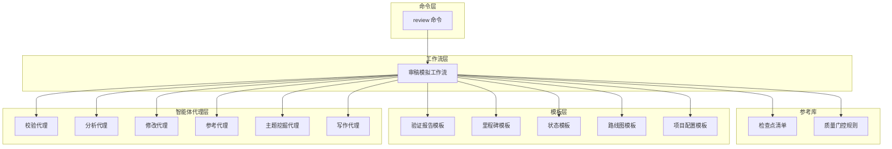
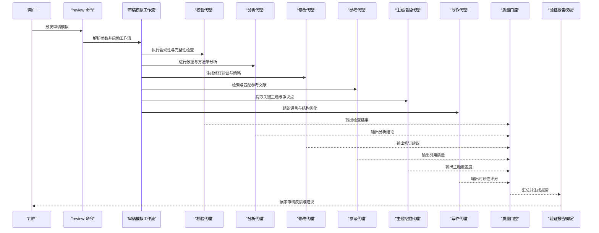
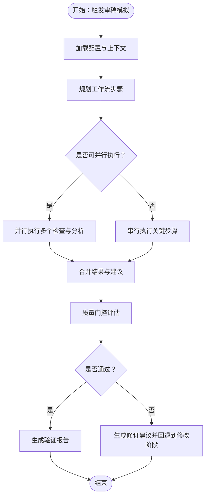
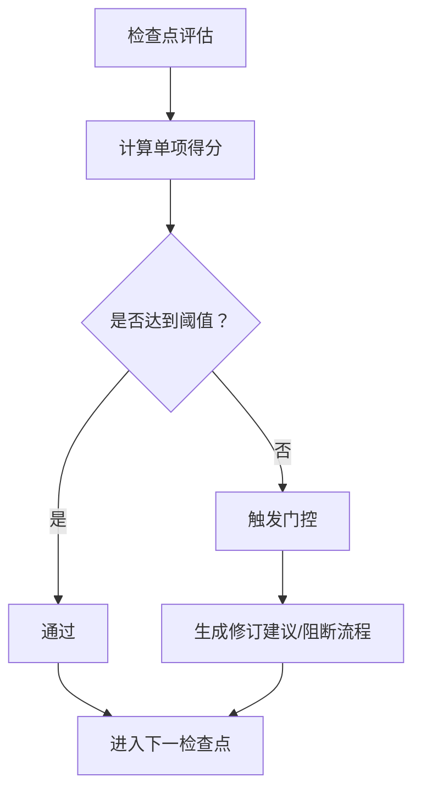
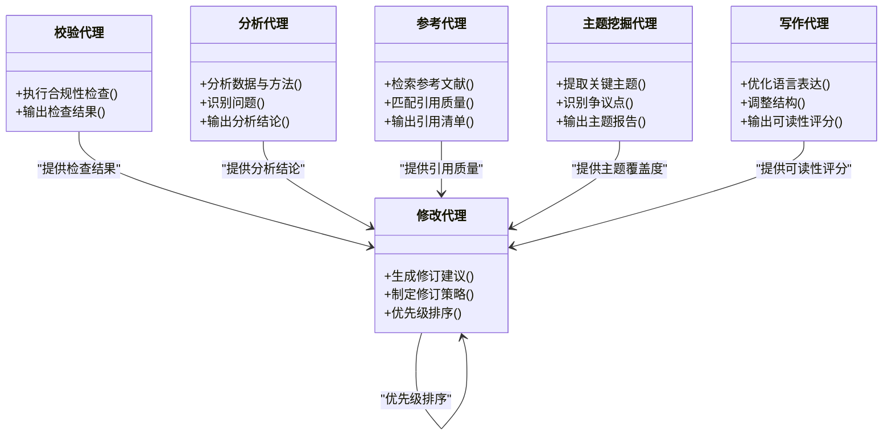
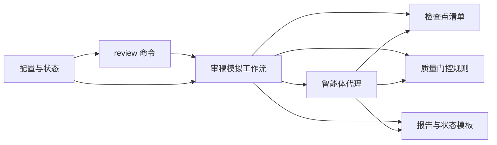

# 阶段五：审稿模拟

<cite>
**本文引用的文件**
- [review.md](file://commands/clinpub/review.md)
- [review.md](file://pipeline/workflows/review.md)
- [checkpoints.md](file://pipeline/references/checkpoints.md)
- [gates.md](file://pipeline/references/gates.md)
- [clinpub-verifier.md](file://agents/clinpub-verifier.md)
- [analyst-agent.md](file://agents/analyst-agent.md)
- [modify-agent.md](file://agents/modify-agent.md)
- [reference-agent.md](file://agents/reference-agent.md)
- [topic-miner-agent.md](file://agents/topic-miner-agent.md)
- [writer-agent.md](file://agents/writer-agent.md)
- [verification-report.md](file://pipeline/templates/verification-report.md)
- [milestone.md](file://pipeline/templates/milestone.md)
- [state.md](file://pipeline/templates/state.md)
- [roadmap.md](file://pipeline/templates/roadmap.md)
- [project_config.yml](file://pipeline/templates/project_config.yml)
- [config.json](file://.clinpub/config.json)
- [STATE.md](file://.clinpub/STATE.md)
- [ROADMAP.md](file://.clinpub/ROADMAP.md)
</cite>

## 目录
1. [引言](#引言)
2. [项目结构](#项目结构)
3. [核心组件](#核心组件)
4. [架构总览](#架构总览)
5. [详细组件分析](#详细组件分析)
6. [依赖关系分析](#依赖关系分析)
7. [性能考量](#性能考量)
8. [故障排查指南](#故障排查指南)
9. [结论](#结论)
10. [附录](#附录)

## 引言
本阶段聚焦“审稿模拟”，目标是通过系统化的同行评议流程、质量检查与修订建议生成，帮助研究团队在正式投稿前完成自我审查与质量门控。文档围绕以下关键主题展开：审稿标准制定、检查点评估与合规性验证、修订策略与优先级排序、审稿人视角分析、常见问题预测与应对、质量门控阈值与自动触发机制，以及完整的审稿模拟流程与最终提交准备。

## 项目结构
本项目的审稿模拟相关能力由命令层、工作流层、参考库与模板层、以及智能体代理层协同实现。命令层提供用户入口（review），工作流层定义审稿模拟的步骤与顺序，参考库提供检查点与门控规则，模板层提供报告与状态管理载体，智能体代理层负责具体任务执行与协作。

图表来源
- [review.md:1-200](file://commands/clinpub/review.md#L1-L200)
- [review.md:1-200](file://pipeline/workflows/review.md#L1-L200)
- [checkpoints.md:1-200](file://pipeline/references/checkpoints.md#L1-L200)
- [gates.md:1-200](file://pipeline/references/gates.md#L1-L200)
- [verification-report.md:1-200](file://pipeline/templates/verification-report.md#L1-L200)
- [milestone.md:1-200](file://pipeline/templates/milestone.md#L1-L200)
- [state.md:1-200](file://pipeline/templates/state.md#L1-L200)
- [roadmap.md:1-200](file://pipeline/templates/roadmap.md#L1-L200)
- [project_config.yml:1-200](file://pipeline/templates/project_config.yml#L1-L200)
- [clinpub-verifier.md:1-200](file://agents/clinpub-verifier.md#L1-L200)
- [analyst-agent.md:1-200](file://agents/analyst-agent.md#L1-L200)
- [modify-agent.md:1-200](file://agents/modify-agent.md#L1-L200)
- [reference-agent.md:1-200](file://agents/reference-agent.md#L1-L200)
- [topic-miner-agent.md:1-200](file://agents/topic-miner-agent.md#L1-L200)
- [writer-agent.md:1-200](file://agents/writer-agent.md#L1-L200)

章节来源
- [review.md:1-200](file://commands/clinpub/review.md#L1-L200)
- [review.md:1-200](file://pipeline/workflows/review.md#L1-L200)

## 核心组件
- 审稿模拟命令：提供用户入口与参数解析，协调工作流执行。
- 审稿模拟工作流：定义审稿模拟的步骤、顺序与并行化策略。
- 质量检查点与门控：标准化检查清单与阈值规则，支持自动触发与人工复核。
- 智能体代理：分别承担校验、分析、修改、参考检索、主题挖掘与写作支持等职责。
- 报告与状态模板：统一输出格式，支撑审稿反馈与项目状态追踪。

章节来源
- [review.md:1-200](file://commands/clinpub/review.md#L1-L200)
- [review.md:1-200](file://pipeline/workflows/review.md#L1-L200)
- [checkpoints.md:1-200](file://pipeline/references/checkpoints.md#L1-L200)
- [gates.md:1-200](file://pipeline/references/gates.md#L1-L200)
- [verification-report.md:1-200](file://pipeline/templates/verification-report.md#L1-L200)
- [state.md:1-200](file://pipeline/templates/state.md#L1-L200)

## 架构总览
审稿模拟以“命令驱动 + 工作流编排 + 参考规则 + 模板输出 + 智能体协作”的方式运行。命令层接收输入后，工作流层按序或并行调度各智能体代理执行具体任务；参考库提供检查点与门控规则，确保质量一致性；模板层统一输出报告与状态，便于审稿人与团队成员理解与跟踪。

图表来源
- [review.md:1-200](file://commands/clinpub/review.md#L1-L200)
- [review.md:1-200](file://pipeline/workflows/review.md#L1-L200)
- [checkpoints.md:1-200](file://pipeline/references/checkpoints.md#L1-L200)
- [gates.md:1-200](file://pipeline/references/gates.md#L1-L200)
- [verification-report.md:1-200](file://pipeline/templates/verification-report.md#L1-L200)
- [clinpub-verifier.md:1-200](file://agents/clinpub-verifier.md#L1-L200)
- [analyst-agent.md:1-200](file://agents/analyst-agent.md#L1-L200)
- [modify-agent.md:1-200](file://agents/modify-agent.md#L1-L200)
- [reference-agent.md:1-200](file://agents/reference-agent.md#L1-L200)
- [topic-miner-agent.md:1-200](file://agents/topic-miner-agent.md#L1-L200)
- [writer-agent.md:1-200](file://agents/writer-agent.md#L1-L200)

## 详细组件分析

### 审稿模拟命令与工作流
- 命令入口：解析用户输入，加载配置，调用工作流执行审稿模拟。
- 工作流编排：定义步骤顺序、并行执行策略、失败重试与回滚机制。
- 参数与上下文：支持传入项目状态、里程碑、路线图与配置文件路径，确保上下文一致。

图表来源
- [review.md:1-200](file://commands/clinpub/review.md#L1-L200)
- [review.md:1-200](file://pipeline/workflows/review.md#L1-L200)

章节来源
- [review.md:1-200](file://commands/clinpub/review.md#L1-L200)
- [review.md:1-200](file://pipeline/workflows/review.md#L1-L200)

### 质量检查点与门控规则
- 检查点清单：覆盖研究设计、数据完整性、方法学严谨性、引用规范性、伦理与披露等关键维度。
- 门控阈值：为每个检查点设定通过/不通过的阈值与权重，支持自动判定与人工复核。
- 自动触发：当检查点得分低于阈值时，自动进入修订建议生成与反馈流程。

图表来源
- [checkpoints.md:1-200](file://pipeline/references/checkpoints.md#L1-L200)
- [gates.md:1-200](file://pipeline/references/gates.md#L1-L200)

章节来源
- [checkpoints.md:1-200](file://pipeline/references/checkpoints.md#L1-L200)
- [gates.md:1-200](file://pipeline/references/gates.md#L1-L200)

### 智能体代理协作
- 校验代理：负责合规性与完整性检查，输出结构化检查结果。
- 分析代理：对数据与方法进行深度分析，识别潜在问题与改进空间。
- 修改代理：基于检查与分析结果，生成可操作的修订建议与策略。
- 参考代理：检索与匹配参考文献，确保引用质量与一致性。
- 主题挖掘代理：提取关键主题与争议点，辅助审稿人视角分析。
- 写作代理：优化语言表达与结构，提升可读性与逻辑性。

图表来源
- [clinpub-verifier.md:1-200](file://agents/clinpub-verifier.md#L1-L200)
- [analyst-agent.md:1-200](file://agents/analyst-agent.md#L1-L200)
- [modify-agent.md:1-200](file://agents/modify-agent.md#L1-L200)
- [reference-agent.md:1-200](file://agents/reference-agent.md#L1-L200)
- [topic-miner-agent.md:1-200](file://agents/topic-miner-agent.md#L1-L200)
- [writer-agent.md:1-200](file://agents/writer-agent.md#L1-L200)

章节来源
- [clinpub-verifier.md:1-200](file://agents/clinpub-verifier.md#L1-L200)
- [analyst-agent.md:1-200](file://agents/analyst-agent.md#L1-L200)
- [modify-agent.md:1-200](file://agents/modify-agent.md#L1-L200)
- [reference-agent.md:1-200](file://agents/reference-agent.md#L1-L200)
- [topic-miner-agent.md:1-200](file://agents/topic-miner-agent.md#L1-L200)
- [writer-agent.md:1-200](file://agents/writer-agent.md#L1-L200)

### 报告与状态模板
- 验证报告模板：统一输出审稿反馈、检查结果、修订建议与门控状态。
- 里程碑模板：记录阶段性成果与评审节点。
- 状态模板：维护项目当前状态与变更历史。
- 路线图模板：展示后续步骤与交付物。
- 项目配置模板：提供可复用的配置项与默认值。

章节来源
- [verification-report.md:1-200](file://pipeline/templates/verification-report.md#L1-L200)
- [milestone.md:1-200](file://pipeline/templates/milestone.md#L1-L200)
- [state.md:1-200](file://pipeline/templates/state.md#L1-L200)
- [roadmap.md:1-200](file://pipeline/templates/roadmap.md#L1-L200)
- [project_config.yml:1-200](file://pipeline/templates/project_config.yml#L1-L200)

### 配置与上下文管理
- 全局配置：集中管理审稿模拟的开关、阈值、并行度与输出路径。
- 项目状态与路线图：与全局状态联动，确保审稿模拟与整体进度一致。

章节来源
- [config.json:1-200](file://.clinpub/config.json#L1-L200)
- [STATE.md:1-200](file://.clinpub/STATE.md#L1-L200)
- [ROADMAP.md:1-200](file://.clinpub/ROADMAP.md#L1-L200)

## 依赖关系分析
- 命令层依赖工作流层；工作流层依赖参考库与模板层；智能体代理层为工作流提供执行能力。
- 质量门控规则与检查点清单为工作流提供决策依据；报告模板为输出提供格式保障。
- 配置文件与状态文件贯穿全流程，确保一致性与可追溯性。

图表来源
- [review.md:1-200](file://commands/clinpub/review.md#L1-L200)
- [review.md:1-200](file://pipeline/workflows/review.md#L1-L200)
- [checkpoints.md:1-200](file://pipeline/references/checkpoints.md#L1-L200)
- [gates.md:1-200](file://pipeline/references/gates.md#L1-L200)
- [verification-report.md:1-200](file://pipeline/templates/verification-report.md#L1-L200)
- [state.md:1-200](file://pipeline/templates/state.md#L1-L200)
- [config.json:1-200](file://.clinpub/config.json#L1-L200)

章节来源
- [review.md:1-200](file://commands/clinpub/review.md#L1-L200)
- [review.md:1-200](file://pipeline/workflows/review.md#L1-L200)
- [checkpoints.md:1-200](file://pipeline/references/checkpoints.md#L1-L200)
- [gates.md:1-200](file://pipeline/references/gates.md#L1-L200)
- [verification-report.md:1-200](file://pipeline/templates/verification-report.md#L1-L200)
- [state.md:1-200](file://pipeline/templates/state.md#L1-L200)
- [config.json:1-200](file://.clinpub/config.json#L1-L200)

## 性能考量
- 并行化执行：对独立检查与分析任务采用并行策略，缩短整体耗时。
- 缓存与增量：对重复性检查与参考检索结果进行缓存，减少重复计算。
- 门控前置：在早期阶段快速筛除明显不合规项，降低后续处理成本。
- 日志与可观测性：为关键步骤输出结构化日志，便于定位瓶颈与异常。

## 故障排查指南
- 检查点未命中：确认检查点清单与门控规则是否正确加载，核对阈值设置。
- 代理执行失败：检查代理权限、网络访问与外部服务可用性，查看代理日志。
- 报告格式异常：核对模板字段与数据映射，确保输出键与模板一致。
- 配置不生效：检查配置文件路径与键名，确认与工作流参数绑定关系。

章节来源
- [checkpoints.md:1-200](file://pipeline/references/checkpoints.md#L1-L200)
- [gates.md:1-200](file://pipeline/references/gates.md#L1-L200)
- [verification-report.md:1-200](file://pipeline/templates/verification-report.md#L1-L200)
- [config.json:1-200](file://.clinpub/config.json#L1-L200)

## 结论
审稿模拟阶段通过标准化的检查点、严格的门控规则与多智能体协作，实现了从“自我审查”到“修订建议生成”的闭环。配合统一的报告与状态模板，团队可在正式投稿前显著提升研究质量与合规性，降低拒稿风险。

## 附录
- 审稿模拟流程清单
  - 准备阶段：加载配置、初始化上下文、准备检查点与门控规则。
  - 执行阶段：并行/串行执行检查与分析，收集结果与建议。
  - 评估阶段：质量门控自动评估，必要时人工复核。
  - 输出阶段：生成验证报告与修订建议，更新状态与里程碑。
- 质量改进策略
  - 建立持续改进机制：定期回顾检查点与门控阈值，结合审稿反馈迭代优化。
  - 强化预检：在写作与修改阶段嵌入轻量检查，提前发现问题。
  - 审稿人视角：引入外部专家参与模拟审稿，提升反馈质量。
- 最终提交准备
  - 对齐模板：确保报告、状态与里程碑与模板一致。
  - 复查引用：通过参考代理再次核查引用质量与完整性。
  - 文档归档：保存审稿模拟全过程日志与报告，形成知识资产。