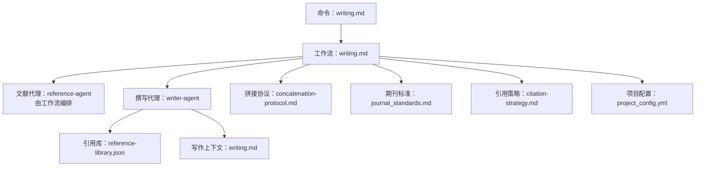
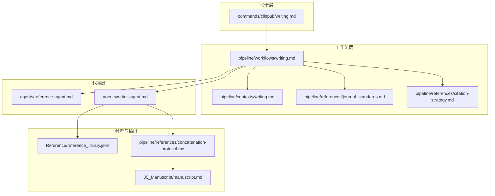
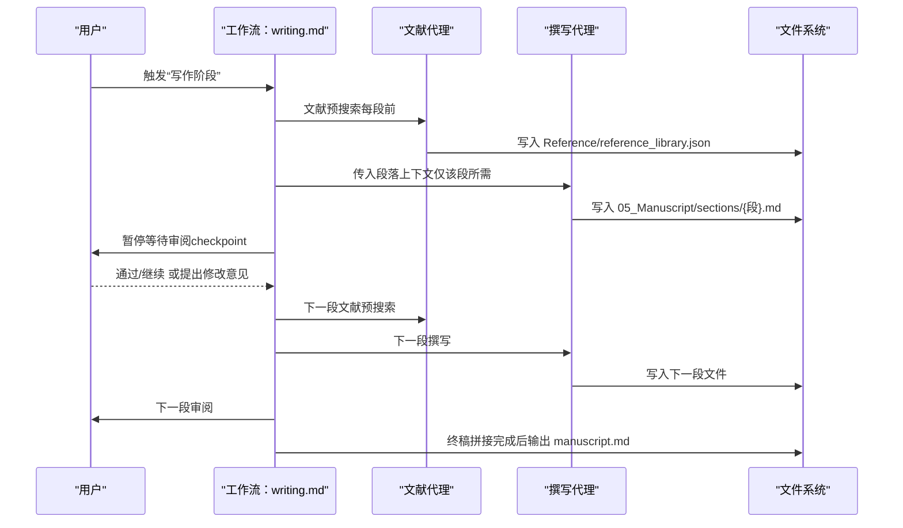
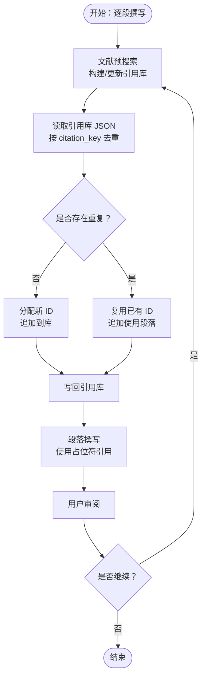
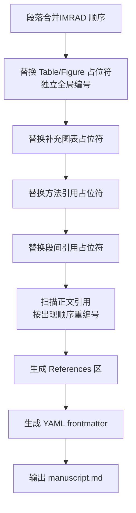
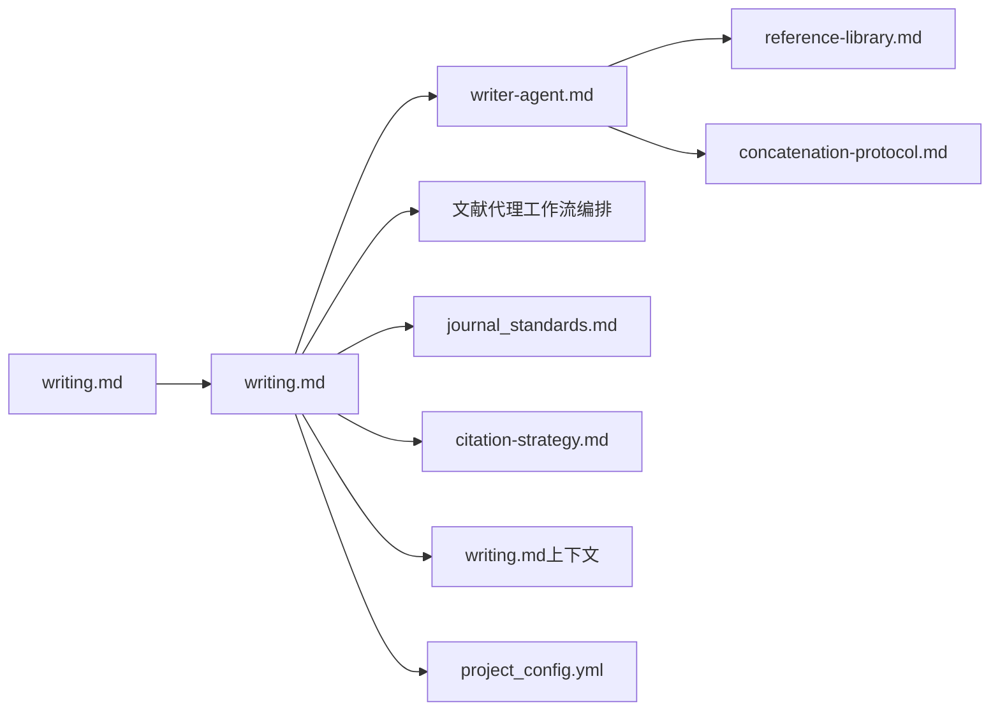

# 阶段四：论文写作

<cite>
**本文引用的文件**
- [commands/clinpub/writing.md](file://commands/clinpub/writing.md)
- [pipeline/workflows/writing.md](file://pipeline/workflows/writing.md)
- [agents/writer-agent.md](file://agents/writer-agent.md)
- [pipeline/references/reference-library.md](file://pipeline/references/reference-library.md)
- [pipeline/references/citation-strategy.md](file://pipeline/references/citation-strategy.md)
- [pipeline/references/concatenation-protocol.md](file://pipeline/references/concatenation-protocol.md)
- [pipeline/contexts/writing.md](file://pipeline/contexts/writing.md)
- [pipeline/references/journal_standards.md](file://pipeline/references/journal_standards.md)
- [examples/project_config.example.yml](file://examples/project_config.example.yml)
- [docs/ARCHITECTURE.md](file://docs/ARCHITECTURE.md)
- [docs/CONFIGURATION.md](file://docs/CONFIGURATION.md)
- [pipeline/references/checkpoints.md](file://pipeline/references/checkpoints.md)
</cite>

## 目录
1. [简介](#简介)
2. [项目结构](#项目结构)
3. [核心组件](#核心组件)
4. [架构总览](#架构总览)
5. [详细组件分析](#详细组件分析)
6. [依赖关系分析](#依赖关系分析)
7. [性能考量](#性能考量)
8. [故障排查指南](#故障排查指南)
9. [结论](#结论)
10. [附录](#附录)

## 简介
本阶段围绕“IMRAD 结构化写作”展开，目标是以顺序化、可审查的方式产出完整手稿。工作流采用“逐段撰写 + 文献预搜索 + 用户审阅暂停”的闭环，结合统一的引用库与占位符交叉引用机制，最终通过拼接协议生成带 YAML frontmatter 的终稿。本文档系统阐述 IMRAD 流程、模板体系、生成机制、图表与引用规范、语言润色、质量控制、同行评议准备与投稿策略，并给出定制化选项、批量生成与版本管理建议。

## 项目结构
- 命令入口：commands/clinpub/writing.md 定义“写作阶段”命令，串联工作流与参考规范。
- 工作流：pipeline/workflows/writing.md 实施 IMRAD 顺序、文献预搜索、逐段撰写、人类化自检、终稿拼接与里程碑。
- 角色代理：agents/writer-agent.md 定义撰写角色、上下文加载、章节顺序与人类化规则。
- 引用与拼接：pipeline/references/reference-library.md、pipeline/references/citation-strategy.md、pipeline/references/concatenation-protocol.md 提供引用库 JSON Schema、Vancouver 格式、占位符替换与终稿拼接规则。
- 写作上下文：pipeline/contexts/writing.md 明确语言政策、章节顺序、模板引用与目标期刊标准。
- 配置与示例：examples/project_config.example.yml 与 docs/CONFIGURATION.md 提供项目配置与目录结构。
- 质量门控：pipeline/references/checkpoints.md 定义决策、验证与里程碑流程。

**图示来源**
- [commands/clinpub/writing.md:1-56](file://commands/clinpub/writing.md#L1-L56)
- [pipeline/workflows/writing.md:1-330](file://pipeline/workflows/writing.md#L1-L330)
- [agents/writer-agent.md:1-166](file://agents/writer-agent.md#L1-L166)
- [pipeline/references/reference-library.md:1-214](file://pipeline/references/reference-library.md#L1-L214)
- [pipeline/references/concatenation-protocol.md:1-291](file://pipeline/references/concatenation-protocol.md#L1-L291)
- [pipeline/contexts/writing.md:1-49](file://pipeline/contexts/writing.md#L1-L49)
- [pipeline/references/journal_standards.md:1-78](file://pipeline/references/journal_standards.md#L1-L78)
- [pipeline/references/citation-strategy.md:1-88](file://pipeline/references/citation-strategy.md#L1-L88)
- [examples/project_config.example.yml:1-68](file://examples/project_config.example.yml#L1-L68)

**章节来源**
- [commands/clinpub/writing.md:1-56](file://commands/clinpub/writing.md#L1-L56)
- [docs/ARCHITECTURE.md:1-160](file://docs/ARCHITECTURE.md#L1-L160)
- [docs/CONFIGURATION.md:1-270](file://docs/CONFIGURATION.md#L1-L270)

## 核心组件
- IMRAD 顺序化撰写：按 Introduction → Methods → Results → Discussion 的顺序，每段撰写前由文献代理进行预搜索，撰写后暂停等待用户审阅，确保阶段性质量与方向一致性。
- 引用库与去重：共享引用库 JSON，按 citation_key 去重，全局统一编号；拼接时按正文出现顺序重编号，实现自然去重与连续编号。
- 占位符交叉引用：段内使用 {{Table:N}}、{{Figure:N}}、{{Method:name}}、{{Section:name}} 等占位符，终稿拼接时统一替换为真实编号与文本。
- 人类化（Humanizer）规则：强制避免 AI 模板化表达，强调段落自然流动、句式多样、术语嵌入与具体作者语境化引用。
- 终稿拼接协议：按 IMRAD 顺序合并段落，替换占位符，统一引用编号，生成 YAML frontmatter 与 References 区，输出 manuscript.md。

**章节来源**
- [pipeline/workflows/writing.md:82-161](file://pipeline/workflows/writing.md#L82-L161)
- [agents/writer-agent.md:110-157](file://agents/writer-agent.md#L110-L157)
- [pipeline/references/reference-library.md:104-151](file://pipeline/references/reference-library.md#L104-L151)
- [pipeline/references/concatenation-protocol.md:28-291](file://pipeline/references/concatenation-protocol.md#L28-L291)

## 架构总览
IMRAD 写作阶段采用“命令 → 工作流 → 代理 → 参考规范”的分层架构。命令文件定义阶段目标与工具权限；工作流编排两代理协作、读取上下文与参考规范；代理依据角色定义执行撰写与文献搜索；参考规范提供引用、拼接与期刊标准的权威约束。

**图示来源**
- [commands/clinpub/writing.md:1-56](file://commands/clinpub/writing.md#L1-L56)
- [pipeline/workflows/writing.md:1-330](file://pipeline/workflows/writing.md#L1-L330)
- [agents/writer-agent.md:1-166](file://agents/writer-agent.md#L1-L166)
- [pipeline/references/reference-library.md:1-214](file://pipeline/references/reference-library.md#L1-L214)
- [pipeline/references/concatenation-protocol.md:1-291](file://pipeline/references/concatenation-protocol.md#L1-L291)
- [pipeline/contexts/writing.md:1-49](file://pipeline/contexts/writing.md#L1-L49)
- [pipeline/references/journal_standards.md:1-78](file://pipeline/references/journal_standards.md#L1-L78)

## 详细组件分析

### IMRAD 顺序化撰写流程
- 顺序约束：严格按 Introduction → Methods → Results → Discussion 的顺序推进，每段完成后暂停等待用户审阅，确认后再进入下一段。
- 上下文自动读取：撰写阶段自动读取项目配置、分析输出与引用库，确保内容与数据一致。
- 篇幅与风格：全文 >5000 字，自然成段，避免 bullet point；Results 段落以发现为主线，避免“如表 X 所示”式的机械引导。

**图示来源**
- [pipeline/workflows/writing.md:69-161](file://pipeline/workflows/writing.md#L69-L161)
- [agents/writer-agent.md:17-51](file://agents/writer-agent.md#L17-L51)

**章节来源**
- [pipeline/workflows/writing.md:82-161](file://pipeline/workflows/writing.md#L82-L161)
- [agents/writer-agent.md:53-106](file://agents/writer-agent.md#L53-L106)

### 引用策略与引用库管理
- 引用总量与段落配比：总量 30-55 篇为硬约束；各段建议配比 ±20% 弹性浮动；Discussion 优先用于补充对比文献。
- 年限与 IF 偏好：默认近 5 年；支持 landmark 经典文献例外；IF 偏好影响搜索筛选但不硬性排除。
- 引用库 JSON：以 citation_key 去重，全局统一编号；拼接时按正文出现顺序重编号，实现自然去重与连续编号。
- Vancouver 格式：正文 [1][2-3][1,4,7]，末尾统一 References 区。

**图示来源**
- [pipeline/references/citation-strategy.md:1-88](file://pipeline/references/citation-strategy.md#L1-L88)
- [pipeline/references/reference-library.md:13-68](file://pipeline/references/reference-library.md#L13-L68)
- [pipeline/workflows/writing.md:69-116](file://pipeline/workflows/writing.md#L69-L116)

**章节来源**
- [pipeline/references/citation-strategy.md:6-77](file://pipeline/references/citation-strategy.md#L6-L77)
- [pipeline/references/reference-library.md:13-101](file://pipeline/references/reference-library.md#L13-L101)

### 占位符交叉引用与终稿拼接
- 占位符命名：{{Table:N}}、{{Figure:N}}、{{SupplementaryTable:N}}、{{SupplementaryFigure:N}}、{{Method:name}}、{{Section:name}}。
- 段内主观编号：各段内按出现顺序编号，拼接时按 IMRAD 顺序全局重编号。
- 方法引用映射：从项目配置读取分析方法名，统一替换为“the {name} analysis”等自然表述。
- References 区生成：按新编号顺序生成 Vancouver 格式条目，确保与正文引用一一对应。

**图示来源**
- [pipeline/references/concatenation-protocol.md:28-291](file://pipeline/references/concatenation-protocol.md#L28-L291)
- [pipeline/references/reference-library.md:104-151](file://pipeline/references/reference-library.md#L104-L151)

**章节来源**
- [pipeline/references/concatenation-protocol.md:28-291](file://pipeline/references/concatenation-protocol.md#L28-L291)
- [pipeline/references/reference-library.md:104-151](file://pipeline/references/reference-library.md#L104-L151)

### 人类化（Humanizer）规则与语言润色
- 段落与过渡：避免“首先/其次/最后”式序列；使用具体因果/对比连接词，减少公式化过渡。
- 句式多样性：避免连续三句以上相同结构；混合短句、插入语、破折号/冒号结构。
- 术语与引用：技术术语自然嵌入；引用给出具体作者与情境，避免“研究表明…”等泛化。
- 结论与解释：避免“需要进一步研究”等空洞结论；替换为具体未来研究方向。

**章节来源**
- [agents/writer-agent.md:110-157](file://agents/writer-agent.md#L110-L157)

### 模板系统与章节结构
- 研究类型模板：根据 study type 选择相应模板（RCT 使用 CONSORT，观察性研究使用 STROBE 等）。
- 章节顺序与职责：
  - Methods：最结构化，先写；涵盖研究设计、人群、变量、统计方法、软件版本。
  - Results：数据驱动，主结果优先，报告效应量 + 95%CI + 精确 p 值。
  - Introduction：漏斗结构（背景 → 已知证据 → 研究空白 → 目标）。
  - Discussion：总结 → 对比 → 机制 → 临床意义 → 局限 → 结论与未来方向。
  - Abstract：结构化摘要，最后撰写。
- 语言政策：手稿正文中文，图表与表格英文；引用 Vancouver 格式并要求 DOI。

**章节来源**
- [pipeline/contexts/writing.md:11-31](file://pipeline/contexts/writing.md#L11-L31)
- [agents/writer-agent.md:53-102](file://agents/writer-agent.md#L53-L102)

### 内容填充策略与图表制作标准
- 图表数量与质量：限制 6 个图/表（除非充分理由）；分辨率 ≥300 DPI，矢量格式优先；拒绝 Excel 默认图表。
- 统计报告：效应量 + 95%CI + 精确 p 值；多重比较校正（FDR/Bonferroni）；报告软件版本。
- 语言与结构：Results 以主要结局开头；Discussion 聚焦临床意义；摘要结构化；封面信明确新颖贡献。

**章节来源**
- [pipeline/references/journal_standards.md:53-78](file://pipeline/references/journal_standards.md#L53-L78)

### 质量控制与里程碑
- 质量门控：每个阶段结束后进行验证与里程碑评审，确保交付物完整、标准达标。
- 成功标准：IMRAD 结构完整、引用全有 DOI、图表存在、语言一致、无 AI 模板模式、字数达标、引用去重、MANIFEST 声明齐全。
- 里程碑：生成 MILESTONE.md，更新 ROADMAP 与 STATE，等待用户签字放行。

**章节来源**
- [pipeline/references/checkpoints.md:1-120](file://pipeline/references/checkpoints.md#L1-L120)
- [pipeline/workflows/writing.md:180-196](file://pipeline/workflows/writing.md#L180-L196)

## 依赖关系分析
- 命令 → 工作流：命令文件定义阶段目标与工具权限，工作流负责编排两代理协作与质量门控。
- 工作流 → 代理：工作流读取上下文与参考规范，向代理传递最小必要上下文，避免角色膨胀。
- 代理 → 参考规范：引用库、拼接协议、期刊标准与引用策略为代理提供权威约束。
- 配置 → 输出：项目配置决定研究类型、目标期刊与语言政策，直接影响模板选择与输出格式。

**图示来源**
- [commands/clinpub/writing.md:1-56](file://commands/clinpub/writing.md#L1-L56)
- [pipeline/workflows/writing.md:1-330](file://pipeline/workflows/writing.md#L1-L330)
- [agents/writer-agent.md:1-166](file://agents/writer-agent.md#L1-L166)
- [pipeline/references/reference-library.md:1-214](file://pipeline/references/reference-library.md#L1-L214)
- [pipeline/references/concatenation-protocol.md:1-291](file://pipeline/references/concatenation-protocol.md#L1-L291)
- [pipeline/contexts/writing.md:1-49](file://pipeline/contexts/writing.md#L1-L49)
- [pipeline/references/journal_standards.md:1-78](file://pipeline/references/journal_standards.md#L1-L78)
- [pipeline/references/citation-strategy.md:1-88](file://pipeline/references/citation-strategy.md#L1-L88)
- [examples/project_config.example.yml:1-68](file://examples/project_config.example.yml#L1-L68)

**章节来源**
- [docs/ARCHITECTURE.md:67-83](file://docs/ARCHITECTURE.md#L67-L83)
- [docs/CONFIGURATION.md:187-270](file://docs/CONFIGURATION.md#L187-L270)

## 性能考量
- 文献搜索效率：按段落设定合理引用数量上限，避免过度搜索；利用 landmark 例外与 IF 偏好缩小候选集。
- 引用库去重：以 citation_key 为主键，减少重复条目；拼接时按正文出现顺序重编号，避免二次遍历开销。
- 拼接替换：占位符替换与引用重编号采用一次扫描策略，避免嵌套替换带来的复杂度上升。
- 人工审阅节奏：每段审阅暂停降低错误传播概率，减少后期返工成本。

## 故障排查指南
- 引用无 DOI：检查引用库条目，补齐缺失 DOI；拼接前确保所有引用有 DOI。
- 占位符残留：拼接后使用正则扫描，确认无 {{Table:\d+}}、{{Figure:\d+}} 等未替换项。
- 图表缺失：核对 04_Outputs/ 是否存在对应图表；段落引用与实际产出需一致。
- 语言问题：若 Humanizer 检查未通过，逐条修正段落中的 AI 模式表达。
- 期刊标准不符：对照 journal_standards.md 的报告规范与统计要求，补齐 CONSORT/STROBE checklist 或补充统计细节。

**章节来源**
- [pipeline/references/reference-library.md:55-67](file://pipeline/references/reference-library.md#L55-L67)
- [pipeline/references/concatenation-protocol.md:276-291](file://pipeline/references/concatenation-protocol.md#L276-L291)
- [agents/writer-agent.md:110-157](file://agents/writer-agent.md#L110-L157)
- [pipeline/references/journal_standards.md:16-52](file://pipeline/references/journal_standards.md#L16-L52)

## 结论
本阶段通过 IMRAD 顺序化撰写、文献预搜索与用户审阅暂停，结合统一引用库与占位符交叉引用机制，实现了高质量、可追溯的手稿生成。配合期刊标准与人类化规则，确保语言自然、结构严谨、引用规范。终稿拼接协议保障引用去重与编号连续，YAML frontmatter 与 References 区完整输出。建议在写作过程中持续对照期刊标准与引用策略，严格执行质量门控与里程碑评审，以提升投稿成功率。

## 附录
- 定制化选项：通过项目配置（study type、target_journal、variables）选择模板与标准；引用策略讨论可调整各段引用数量、年限与 IF 偏好。
- 批量生成：工作流自动读取分析输出与引用库，按 IMRAD 顺序批量生成各段文件与终稿。
- 版本管理：MANIFEST.yaml 记录输出与消费者；拼接后更新引用库标记与时间戳；里程碑文件固化阶段成果与决策。

**章节来源**
- [examples/project_config.example.yml:1-68](file://examples/project_config.example.yml#L1-L68)
- [pipeline/workflows/writing.md:198-288](file://pipeline/workflows/writing.md#L198-L288)
- [pipeline/references/reference-library.md:188-193](file://pipeline/references/reference-library.md#L188-L193)
- [pipeline/references/checkpoints.md:77-120](file://pipeline/references/checkpoints.md#L77-L120)