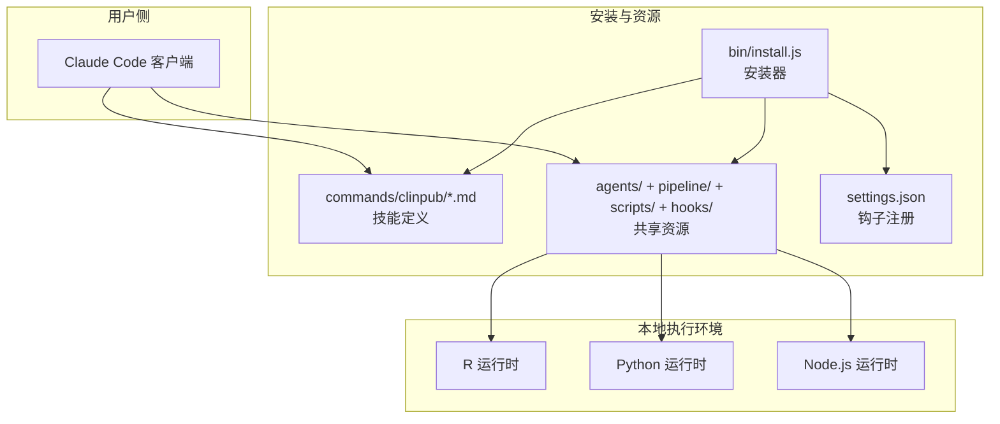
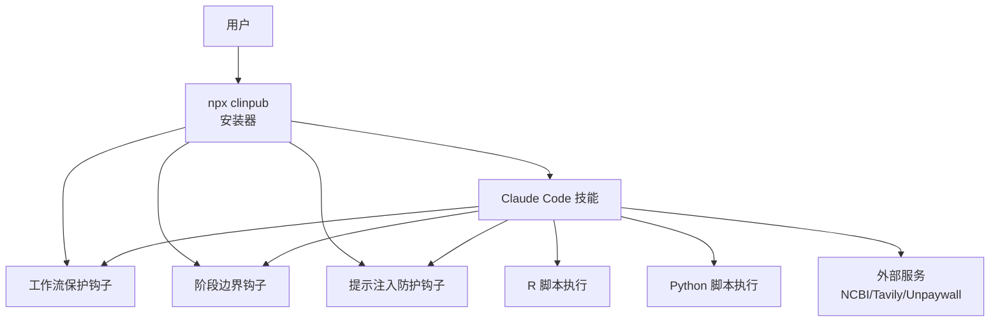
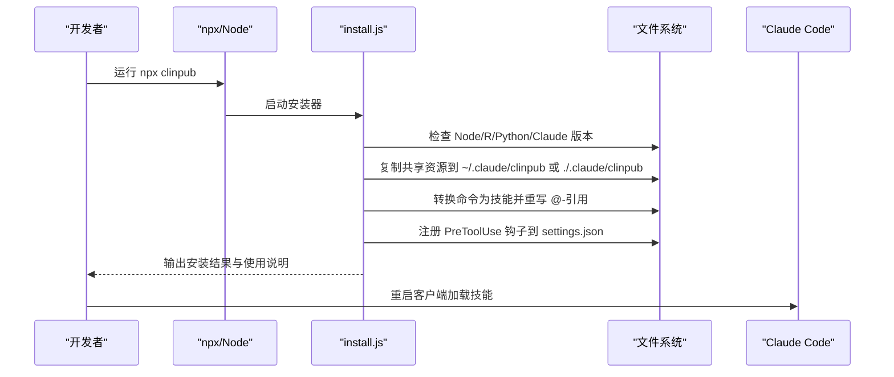
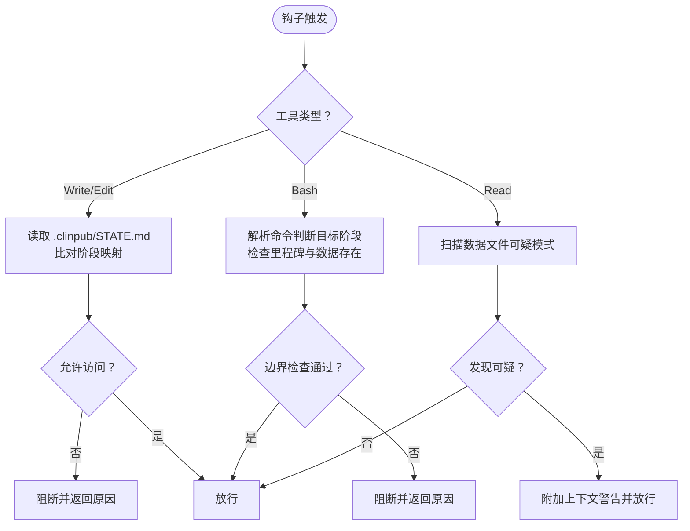
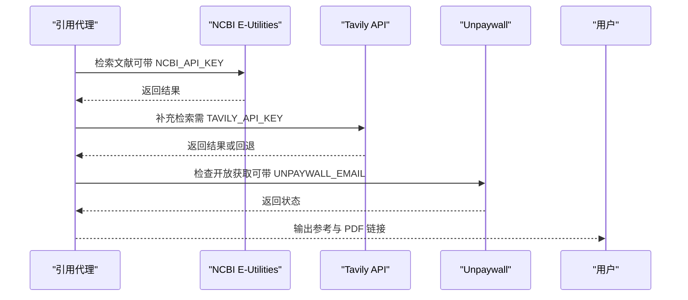
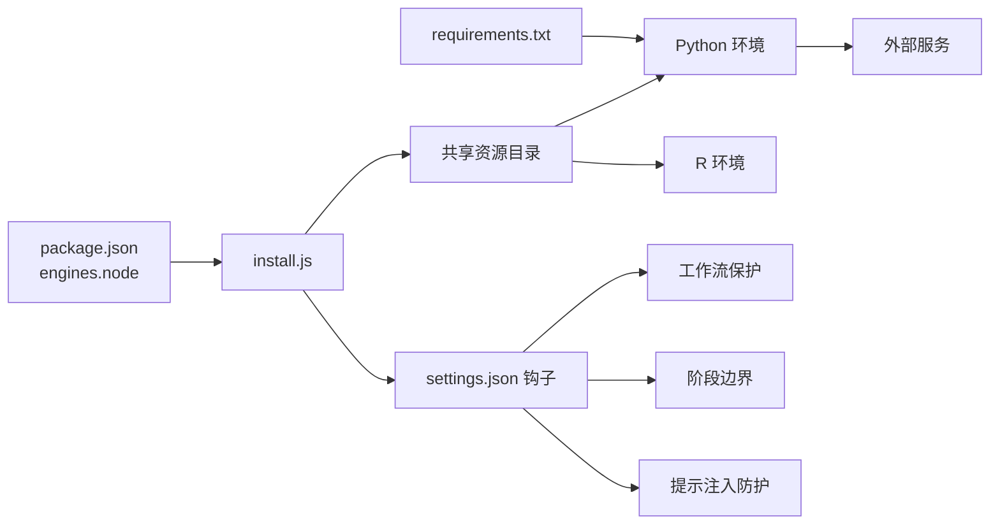

# 技术栈概览

<cite>
**本文引用的文件**
- [package.json](file://package.json)
- [requirements.txt](file://requirements.txt)
- [INSTALL.md](file://INSTALL.md)
- [CLAUDE.md](file://CLAUDE.md)
- [README.md](file://README.md)
- [install.js](file://bin/install.js)
- [clinpub-workflow-guard.js](file://hooks/clinpub-workflow-guard.js)
- [clinpub-phase-boundary.sh](file://hooks/clinpub-phase-boundary.sh)
- [clinpub-prompt-guard.js](file://hooks/clinpub-prompt-guard.js)
- [data_profiler.py](file://scripts/data_profiler.py)
- [.clinpub/codebase/INTEGRATIONS.md](file://.clinpub/codebase/INTEGRATIONS.md)
- [.clinpub/codebase/CONCERNS.md](file://.clinpub/codebase/CONCERNS.md)
</cite>

## 目录
1. [简介](#简介)
2. [项目结构](#项目结构)
3. [核心组件](#核心组件)
4. [架构总览](#架构总览)
5. [详细组件分析](#详细组件分析)
6. [依赖关系分析](#依赖关系分析)
7. [性能考量](#性能考量)
8. [故障排查指南](#故障排查指南)
9. [结论](#结论)
10. [附录](#附录)

## 简介
本文件为 clinpub 项目的“技术栈概览”，面向开发者与使用者，系统梳理项目所采用的核心技术与工具链，解释技术选型的原因、版本要求与兼容性考虑，并给出依赖清单、第三方技能与外部服务集成方式、扩展性与维护策略、升级路径以及环境搭建指引。

## 项目结构
clinpub 是一个围绕 Claude Code 平台构建的“技能”集合，通过安装器将命令文档转换为 Claude Code 技能，并复制共享资源（agents、pipeline、scripts、hooks），同时注册工作流钩子以保障阶段化流程的正确执行。整体采用“命令入口 → 工作流编排 → 代理协作 → 工具脚本”的分层架构。

**图表来源**
- [install.js:1-500](file://bin/install.js#L1-L500)
- [INSTALL.md:1-136](file://INSTALL.md#L1-L136)

**章节来源**
- [README.md:20-45](file://README.md#L20-L45)
- [CLAUDE.md:9-23](file://CLAUDE.md#L9-L23)
- [INSTALL.md:20-44](file://INSTALL.md#L20-L44)

## 核心组件
- Node.js 运行时与安装器
  - 用于将命令文档转换为 Claude Code 技能、复制共享资源、注册钩子。
  - 版本要求：>= 22.0.0。
- R 统计分析环境
  - 用于统计建模、可视化与输出，覆盖数据处理、统计模型、绘图与表格导出。
  - 包依赖：dplyr、tidyr、stringr、readr、readxl、survival、lme4、glmnet、pROC、ggplot2、ggpubr、patchwork、survminer、ggsurvfit、ggsignif、gtsummary、flextable、openxlsx、here、fs。
- Python 数据处理生态
  - 用于数据画像、缺失模式分析、相关性检测、研究类型预判等。
  - 包依赖：pandas、numpy、requests、openpyxl；另有历史依赖 pymupdf（当前仓库已移除相关脚本，建议清理）。
- Claude Code 技能与钩子
  - 技能：ncbi-search（文献检索）、tavily（补充信息检索）、pdf-reader（PDF 全文阅读）。
  - 钩子：工作流保护、阶段边界检查、提示注入防护，保障阶段顺序与数据安全。
- 外部服务集成
  - NCBI E-Utilities API（PubMed）、Tavily AI Search API、Unpaywall（开放获取检查）。

**章节来源**
- [package.json:15-17](file://package.json#L15-L17)
- [INSTALL.md:64-83](file://INSTALL.md#L64-L83)
- [CLAUDE.md:85-91](file://CLAUDE.md#L85-L91)
- [requirements.txt:1-8](file://requirements.txt#L1-L8)
- [README.md:141-157](file://README.md#L141-L157)
- [.clinpub/codebase/INTEGRATIONS.md:90-149](file://.clinpub/codebase/INTEGRATIONS.md#L90-L149)

## 架构总览
下图展示 clinpub 在 Claude Code 环境中的整体交互：安装器负责资源部署与钩子注册；用户通过技能触发工作流；代理在各自上下文中执行任务；R/Python 脚本在本地执行；钩子在关键节点拦截并校验。

**图表来源**
- [install.js:141-211](file://bin/install.js#L141-L211)
- [clinpub-workflow-guard.js:1-134](file://hooks/clinpub-workflow-guard.js#L1-L134)
- [clinpub-phase-boundary.sh:1-153](file://hooks/clinpub-phase-boundary.sh#L1-L153)
- [clinpub-prompt-guard.js:1-162](file://hooks/clinpub-prompt-guard.js#L1-L162)
- [.clinpub/codebase/INTEGRATIONS.md:104-130](file://.clinpub/codebase/INTEGRATIONS.md#L104-L130)

## 详细组件分析

### Node.js 运行时与安装器
- 作用
  - 将 commands/clinpub/*.md 转换为 Claude Code 技能（SKILL.md），重写内部 @-引用指向已安装资源路径。
  - 复制 agents/、pipeline/、scripts/、hooks/ 到共享资源目录。
  - 注册 PreToolUse 钩子到 settings.json，实现阶段顺序与数据安全控制。
- 版本要求与兼容性
  - engines.node >= 22.0.0。
  - 对 Windows/Linux 均可用，PATH 中需可找到 R、Python、Claude Code（可选）。
- 关键行为
  - 支持全局/本地两种安装位置，自动计算资源引用路径（~/.claude/clinpub 或 ./.claude/clinpub）。
  - 注册三个钩子：Write/Edit 阻止越阶段写入；Bash 触发阶段边界检查；Read 扫描数据文件潜在注入风险。

**图表来源**
- [install.js:251-323](file://bin/install.js#L251-L323)
- [install.js:325-398](file://bin/install.js#L325-L398)
- [install.js:141-211](file://bin/install.js#L141-L211)

**章节来源**
- [package.json:15-17](file://package.json#L15-L17)
- [install.js:1-500](file://bin/install.js#L1-L500)
- [INSTALL.md:58-103](file://INSTALL.md#L58-L103)

### R 统计分析环境
- 选型理由
  - 生态成熟、包丰富，覆盖数据处理、统计建模、可视化与表格导出，满足发表级图表与方法说明需求。
- 包依赖与用途
  - 数据处理：dplyr、tidyr、stringr、readr、readxl
  - 统计模型：survival、lme4、glmnet、pROC
  - 可视化：ggplot2、ggpubr、patchwork、survminer、ggsurvfit、ggsignif
  - 输出：gtsummary、flextable、openxlsx
  - 路径：here、fs
- 版本与兼容性
  - 要求 R >= 4.2；具体包版本以 INSTALL.md 中的 install.packages() 为准。
- 性能与维护
  - 建议在本地安装最新稳定版 R 与 CRAN 镜像，避免跨版本差异。
  - 方法与图表标准统一（如 theme_pub、分辨率与配色），便于复现与审稿。

**章节来源**
- [INSTALL.md:64-77](file://INSTALL.md#L64-L77)
- [README.md:148-153](file://README.md#L148-L153)
- [CLAUDE.md:87-87](file://CLAUDE.md#L87-L87)

### Python 数据处理生态
- 选型理由
  - pandas/numpy 提供高效的数据结构与数值计算；openpyxl 支持 Excel 读写；requests 用于网络请求；tavily-python 用于补充检索。
- 包依赖与用途
  - pandas、numpy：数据读取、清洗、统计摘要。
  - requests：HTTP 请求（如 Unpaywall）。
  - openpyxl：Excel 文件读取。
  - tavily-python：Tavily 搜索 API。
  - 历史依赖 pymupdf（当前仓库已移除相关脚本，建议清理 requirements.txt 中该行）。
- 性能与维护
  - 建议使用虚拟环境隔离依赖，定期更新至最低版本要求之上。
  - data_profiler.py 提供数据画像、缺失模式、相关性与研究类型预判，适合作为 data2idea 的前置步骤。

**章节来源**
- [requirements.txt:1-8](file://requirements.txt#L1-L8)
- [data_profiler.py:1-353](file://scripts/data_profiler.py#L1-L353)
- [.clinpub/codebase/CONCERNS.md:50-55](file://.clinpub/codebase/CONCERNS.md#L50-L55)

### Claude Code 技能与钩子
- 技能集成
  - ncbi-search：PubMed 文献检索（v1.2 起为唯一检索入口，内置脚本已移除）。
  - tavily：补充信息检索（需设置 TAVILY_API_KEY）。
  - pdf-reader：PDF 全文阅读。
- 钩子机制
  - 工作流保护钩子：阻止越阶段写文件，依据 .clinpub/STATE.md 的阶段状态判断。
  - 阶段边界钩子：Bash 触发，检查前一阶段里程碑完成情况与必要数据是否存在。
  - 提示注入防护钩子：扫描 CSV/XLSX 等数据文件，识别潜在注入模式与异常长字符串。

**图表来源**
- [clinpub-workflow-guard.js:25-77](file://hooks/clinpub-workflow-guard.js#L25-L77)
- [clinpub-phase-boundary.sh:34-104](file://hooks/clinpub-phase-boundary.sh#L34-L104)
- [clinpub-prompt-guard.js:55-93](file://hooks/clinpub-prompt-guard.js#L55-L93)

**章节来源**
- [README.md:131-140](file://README.md#L131-L140)
- [CLAUDE.md:89-91](file://CLAUDE.md#L89-L91)
- [clinpub-workflow-guard.js:1-134](file://hooks/clinpub-workflow-guard.js#L1-L134)
- [clinpub-phase-boundary.sh:1-153](file://hooks/clinpub-phase-boundary.sh#L1-L153)
- [clinpub-prompt-guard.js:1-162](file://hooks/clinpub-prompt-guard.js#L1-L162)

### 外部服务集成
- NCBI E-Utilities API（PubMed）
  - 用途：文献检索与参考管理。
  - 配置：可选 NCBI_API_KEY 提升速率限制；若未设置，默认 3 req/s。
- Tavily AI Search API
  - 用途：补充信息检索。
  - 配置：必需 TAVILY_API_KEY；未设置时降级为 Claude 内置知识。
- Unpaywall
  - 用途：开放获取 PDF 访问检查。
  - 配置：可选 UNPAYWALL_EMAIL；未设置时回退为用户提供 PDF。

**图表来源**
- [.clinpub/codebase/INTEGRATIONS.md:104-130](file://.clinpub/codebase/INTEGRATIONS.md#L104-L130)

**章节来源**
- [.clinpub/codebase/INTEGRATIONS.md:90-149](file://.clinpub/codebase/INTEGRATIONS.md#L90-L149)
- [INSTALL.md:85-91](file://INSTALL.md#L85-L91)

## 依赖关系分析
- 运行时与工具链
  - Node.js（>= 22）：安装器与钩子执行。
  - R（>= 4.2）：统计分析与可视化。
  - Python（>= 3.9）：数据处理与检索脚本。
- 第三方技能
  - ncbi-search、tavily、pdf-reader（由用户在 Claude Code 中安装）。
- 外部服务
  - NCBI、Tavily、Unpaywall（需相应 API Key）。
- 内部耦合
  - 安装器将 commands/ 转换为技能，重写 @-引用指向共享资源目录。
  - 钩子读取 .clinpub/STATE.md 与项目布局，强制阶段顺序与数据完整性。

**图表来源**
- [package.json:15-17](file://package.json#L15-L17)
- [requirements.txt:1-8](file://requirements.txt#L1-L8)
- [install.js:325-398](file://bin/install.js#L325-L398)
- [clinpub-phase-boundary.sh:14-33](file://hooks/clinpub-phase-boundary.sh#L14-L33)

**章节来源**
- [package.json:15-17](file://package.json#L15-L17)
- [requirements.txt:1-8](file://requirements.txt#L1-L8)
- [install.js:325-398](file://bin/install.js#L325-L398)
- [README.md:141-157](file://README.md#L141-L157)

## 性能考量
- R 性能
  - 使用 data.table 替代 data.frame（如适用）；对大规模数据采用并行处理（如 mclapply）。
- Python 性能
  - 大文件分块读取（chunksize）；必要时使用 multiprocessing。
- 外部服务
  - NCBI 默认 3 req/s，建议配置 NCBI_API_KEY；Tavily 需要 API Key 以获得更稳定的响应。
- 缓存与持久化
  - 当前未实现缓存层；建议在 CI/CD 中引入缓存策略，减少重复 API 调用。

[本节为通用性能建议，不直接分析具体文件]

## 故障排查指南
- 技能未出现或不可用
  - 重启 Claude Code 以重新加载技能；确认安装器输出与资源目录存在。
- R 包错误
  - 执行 INSTALL.md 中的 R install.packages() 命令，确保所需包已安装。
- Python 导入错误
  - 执行 pip install -r requirements.txt；确认 pandas、numpy、requests、openpyxl 已安装。
- PubMed 检索失败
  - 设置 NCBI_API_KEY；若未设置，速率受限会较慢但不会完全失败。
- Tavily 检索失败
  - 设置 TAVILY_API_KEY；未设置时降级为 Claude 内置知识。
- 钩子阻断报错
  - 检查 .clinpub/STATE.md 的阶段状态与里程碑完成情况；确认前一阶段已完成并获得签名/完成标记。

**章节来源**
- [INSTALL.md:105-115](file://INSTALL.md#L105-L115)
- [README.md:131-140](file://README.md#L131-L140)

## 结论
clinpub 采用“Node.js + R + Python + Claude Code 技能”的组合，围绕阶段化工作流与钩子机制实现严谨的流程控制与数据安全。技术栈选择兼顾学术发表的统计与可视化需求、数据处理效率与外部检索能力。通过安装器与钩子，项目实现了可移植、可维护且可扩展的发布管线。

[本节为总结性内容，不直接分析具体文件]

## 附录

### 版本与兼容性清单
- Node.js：>= 22.0.0
- R：>= 4.2
- Python：>= 3.9
- Claude Code：>= 2.1.88（可选）

**章节来源**
- [package.json:15-17](file://package.json#L15-L17)
- [INSTALL.md:62-65](file://INSTALL.md#L62-L65)

### 依赖包清单
- R 包（按类别）
  - 数据处理：dplyr、tidyr、stringr、readr、readxl
  - 统计：survival、lme4、glmnet、pROC
  - 可视化：ggplot2、ggpubr、patchwork、survminer、ggsurvfit、ggsignif
  - 输出：gtsummary、flextable、openxlsx
  - 路径：here、fs
- Python 包
  - pandas、numpy、requests、openpyxl、tavily-python
  - 历史依赖（建议清理）：pymupdf

**章节来源**
- [INSTALL.md:67-83](file://INSTALL.md#L67-L83)
- [requirements.txt:1-8](file://requirements.txt#L1-L8)
- [.clinpub/codebase/CONCERNS.md:50-55](file://.clinpub/codebase/CONCERNS.md#L50-L55)

### 外部服务与配置
- NCBI_API_KEY：可选，提升 PubMed 速率限制
- TAVILY_API_KEY：必需（Tavily 检索）
- UNPAYWALL_EMAIL：可选，用于 Unpaywall 开放获取检查

**章节来源**
- [.clinpub/codebase/INTEGRATIONS.md:90-98](file://.clinpub/codebase/INTEGRATIONS.md#L90-L98)

### 维护策略与升级路径
- 安装器升级
  - 通过 npx clinpub@latest 重新运行安装器，即可获取最新技能与资源。
- R 包升级
  - 在本地 R 环境中更新包版本，确保与 INSTALL.md 中的版本范围兼容。
- Python 依赖升级
  - 更新 requirements.txt 并在虚拟环境中重新安装；注意 tavily-python 的变更。
- 钩子与工作流
  - 升级时检查 .claude/settings.json 中的钩子注册，确保路径与命令正确。

**章节来源**
- [INSTALL.md:92-96](file://INSTALL.md#L92-L96)
- [install.js:141-211](file://bin/install.js#L141-L211)