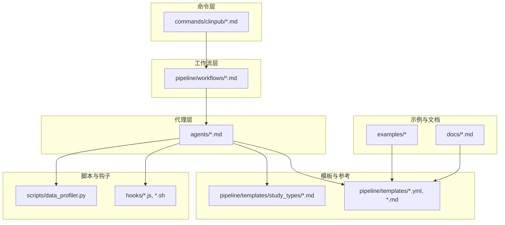
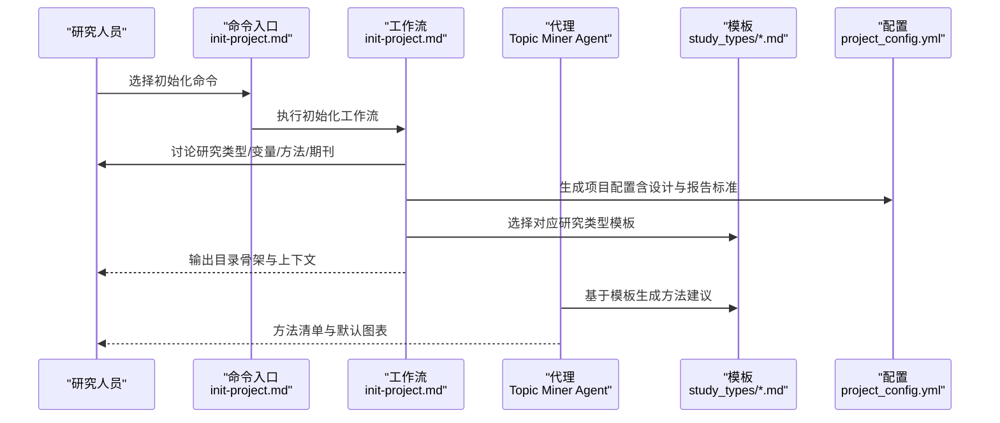
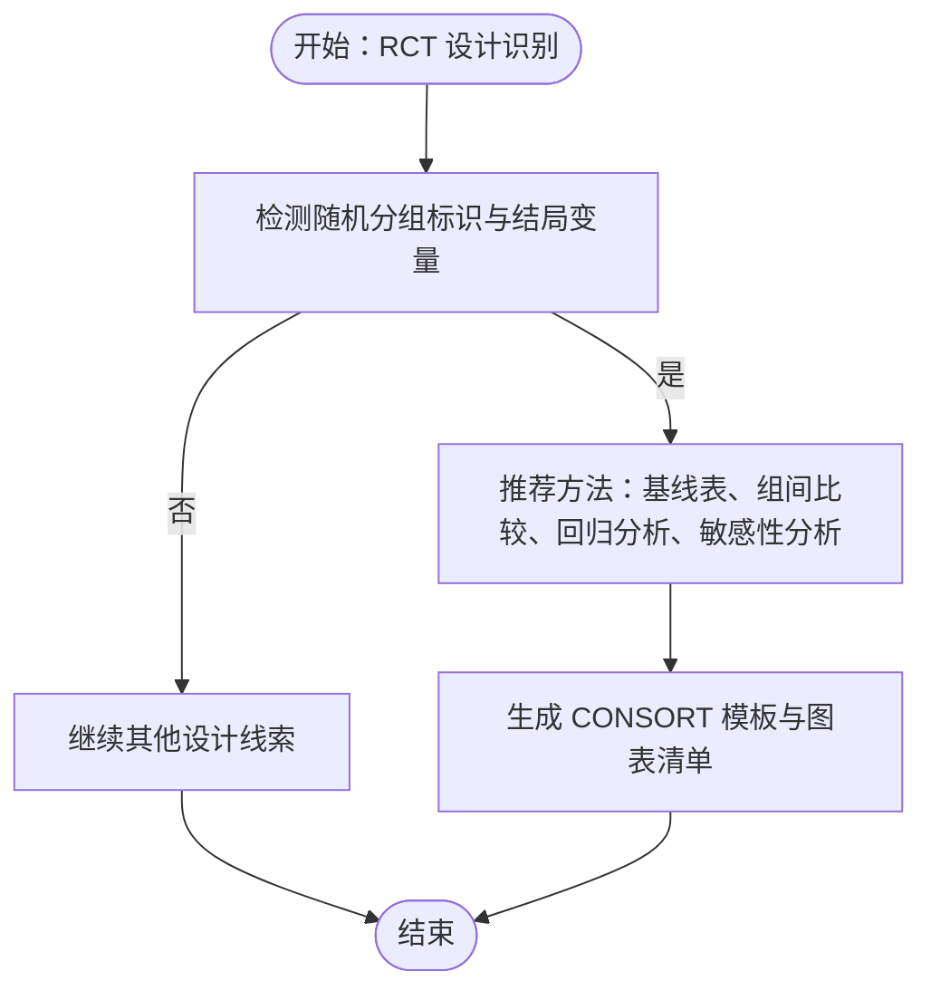
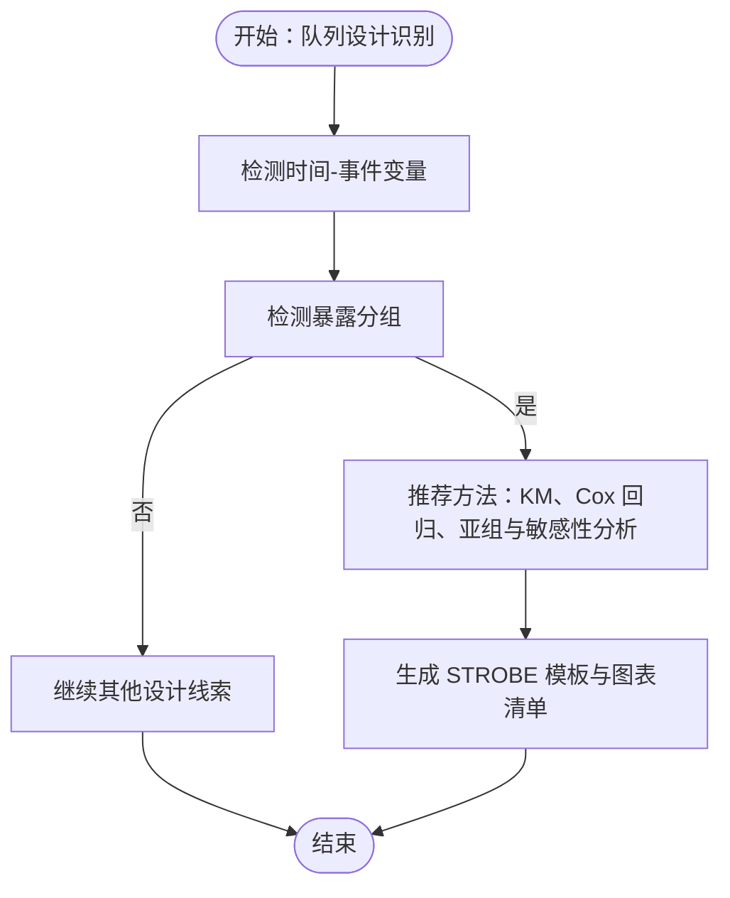
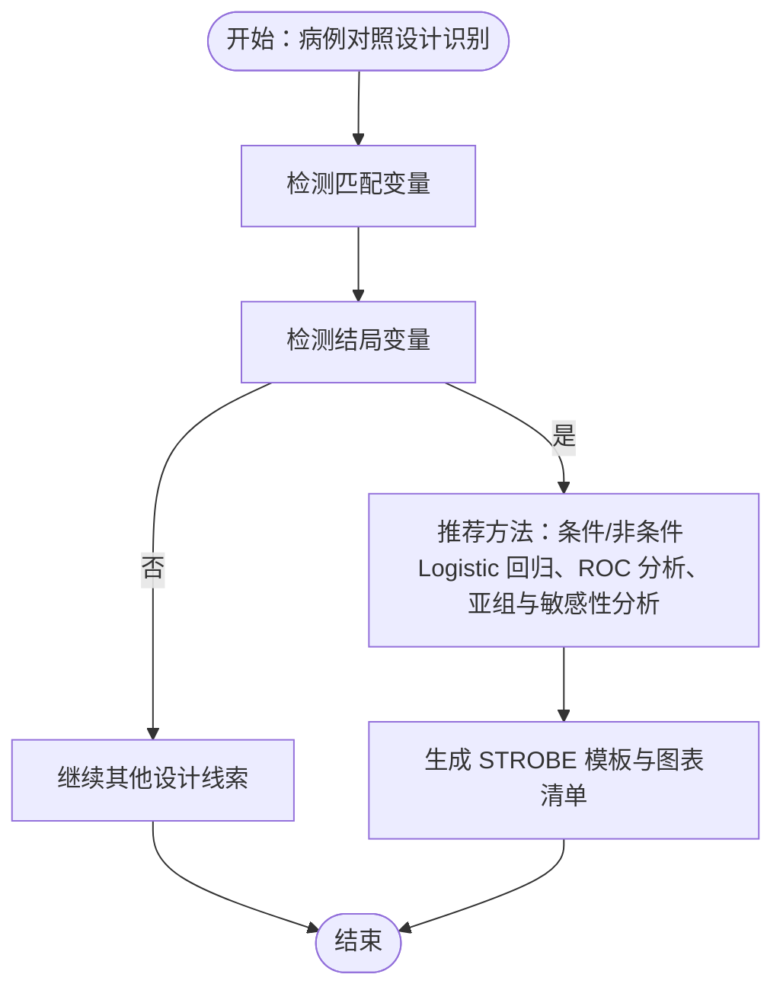
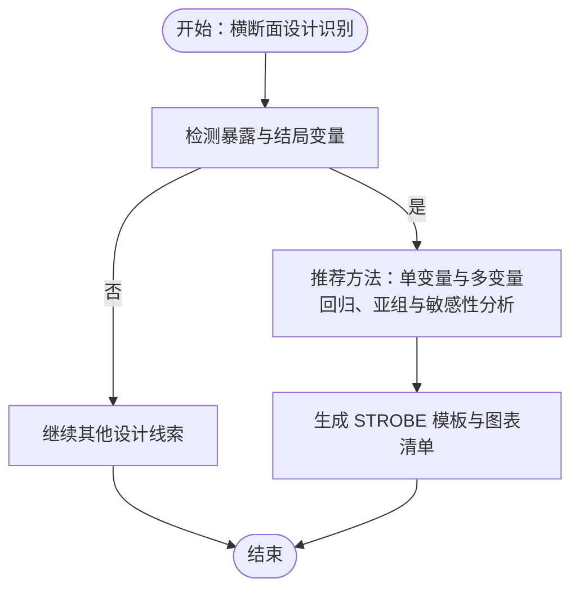
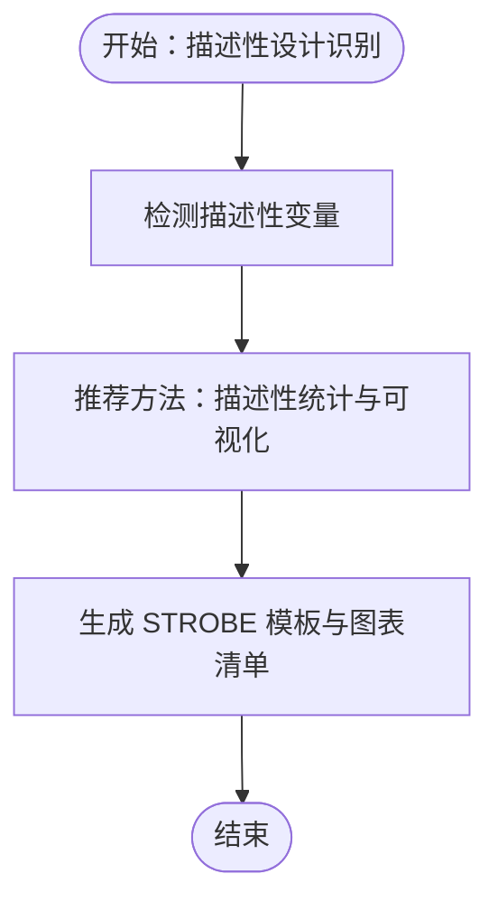
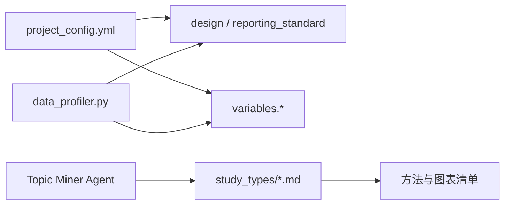

# 支持的研究类型

<cite>
**本文引用的文件**
- [README.md](file://README.md)
- [getting-started.md](file://docs/getting-started.md)
- [init-project.md](file://commands/clinpub/init-project.md)
- [project.md](file://pipeline/templates/project.md)
- [project_config.yml](file://pipeline/templates/project_config.yml)
- [context.md](file://pipeline/templates/context.md)
- [rct.md](file://pipeline/templates/study_types/rct.md)
- [cohort.md](file://pipeline/templates/study_types/cohort.md)
- [case_control.md](file://pipeline/templates/study_types/case_control.md)
- [cross_sectional.md](file://pipeline/templates/study_types/cross_sectional.md)
- [descriptive.md](file://pipeline/templates/study_types/descriptive.md)
- [project_config.example.yml](file://examples/project_config.example.yml)
- [STRUCTURE.md](file://.clinpub/codebase/STRUCTURE.md)
- [data_profiler.py](file://scripts/data_profiler.py)
- [topic-miner-agent.md](file://agents/topic-miner-agent.md)
</cite>

## 目录
1. [简介](#简介)
2. [项目结构](#项目结构)
3. [核心组件](#核心组件)
4. [架构概览](#架构概览)
5. [详细组件分析](#详细组件分析)
6. [依赖分析](#依赖分析)
7. [性能考虑](#性能考虑)
8. [故障排查指南](#故障排查指南)
9. [结论](#结论)
10. [附录](#附录)

## 简介
本文件面向研究人员，系统梳理 clinpub 项目支持的各类临床研究设计类型，涵盖随机对照试验（RCT）、队列研究、病例对照研究、横断面研究与描述性研究。文档解释每类研究的报告标准（CONSORT、STROBE 等）、适用场景、数据收集与分析方法、结果呈现要点，并提供研究设计选择指南、模板应用示例与最佳实践建议，帮助团队高效完成从数据到论文的全流程。

## 项目结构
clinpub 以“命令-工作流-代理-脚本-钩子”的分层架构组织，支持五阶段管线：初始化、数据准备、统计分析、论文撰写、审稿修稿。研究类型相关内容集中于模板与配置文件中，便于在项目初始化阶段即确定设计类型与报告标准，并贯穿后续分析与写作。

**图示来源**
- [STRUCTURE.md:5-105](file://.clinpub/codebase/STRUCTURE.md#L5-L105)
- [README.md:20-45](file://README.md#L20-L45)

**章节来源**
- [README.md:20-45](file://README.md#L20-L45)
- [.clinpub/codebase/STRUCTURE.md:5-105](file://.clinpub/codebase/STRUCTURE.md#L5-L105)

## 核心组件
- 研究类型模板：提供 RCT、队列、病例对照、横断面、描述性研究的撰写指导与默认图表清单，确保符合相应报告标准。
- 项目配置模板：统一定义研究设计、报告标准、变量角色与路径，支撑初始化与分析执行。
- 上下文模板：在初始化阶段明确目标期刊、报告标准、约束与成功标准，形成可追溯的决策记录。
- 数据画像与变量角色推断：基于数据特征自动识别研究设计线索（如随机分组、时间-事件、匹配变量等），辅助方法推荐。

**章节来源**
- [project.md:1-30](file://pipeline/templates/project.md#L1-L30)
- [project_config.yml:1-32](file://pipeline/templates/project_config.yml#L1-L32)
- [context.md:76-121](file://pipeline/templates/context.md#L76-L121)
- [data_profiler.py:102-164](file://scripts/data_profiler.py#L102-L164)

## 架构概览
下图展示研究类型在项目生命周期中的关键节点与流转关系：初始化阶段确定设计与报告标准；数据准备阶段清洗与质量评估；统计分析阶段按设计类型动态生成分析方案；论文撰写阶段依据模板与报告标准输出章节与图表；审稿修稿阶段模拟评审与回复。

**图示来源**
- [init-project.md:14-34](file://commands/clinpub/init-project.md#L14-L34)
- [project_config.yml:6-12](file://pipeline/templates/project_config.yml#L6-L12)
- [rct.md:1-138](file://pipeline/templates/study_types/rct.md#L1-L138)
- [cohort.md:1-135](file://pipeline/templates/study_types/cohort.md#L1-L135)
- [case_control.md:1-126](file://pipeline/templates/study_types/case_control.md#L1-L126)
- [cross_sectional.md:1-116](file://pipeline/templates/study_types/cross_sectional.md#L1-L116)
- [descriptive.md:1-100](file://pipeline/templates/study_types/descriptive.md#L1-L100)

**章节来源**
- [init-project.md:14-34](file://commands/clinpub/init-project.md#L14-L34)
- [project_config.yml:6-12](file://pipeline/templates/project_config.yml#L6-L12)
- [topic-miner-agent.md:207-218](file://agents/topic-miner-agent.md#L207-L218)

## 详细组件分析

### 随机对照试验（RCT）— CONSORT
- 报告标准：遵循 CONSORT 规范，强调随机化、盲法、样本量估算、意向治疗（ITT）人群、安全性结局与不报告偏倚。
- 适用场景：干预性研究，评估新疗法、行为或药物干预的效果，强调内部有效性。
- 数据与分析要点：
  - 随机分组标识与结局变量是关键线索，系统可据此识别 RCT 设计并推荐基线表、组间比较、回归分析与敏感性分析。
  - 主要结局单一且精确定义，次要结局不超过 5 个；报告效应量、95% 置信区间与精确 p 值。
  - 统计方法建议：t 检验、Mann-Whitney、ANCOVA、回归分析；缺失数据处理采用多重插补或 LOCF。
- 结果呈现：CONSORT 流程图、主要/次要结局森林图、亚组分析图、不良事件汇总表。
- 模板应用：标题、摘要结构、引言推进逻辑、方法（样本量、随机化与盲法、干预方案、结局指标、统计分析）、结果（受试者流程、基线特征、主要/次要结局、亚组分析、安全性）、讨论与结论、图表清单。

**图示来源**
- [data_profiler.py:115-138](file://scripts/data_profiler.py#L115-L138)
- [rct.md:39-100](file://pipeline/templates/study_types/rct.md#L39-L100)

**章节来源**
- [README.md:123-129](file://README.md#L123-L129)
- [data_profiler.py:115-138](file://scripts/data_profiler.py#L115-L138)
- [rct.md:1-138](file://pipeline/templates/study_types/rct.md#L1-L138)
- [project_config.example.yml:11-14](file://examples/project_config.example.yml#L11-L14)

### 队列研究（Cohort）— STROBE
- 报告标准：遵循 STROBE 规范，强调队列来源、暴露测量、结局定义、协变量调整与生存分析。
- 适用场景：前瞻性或回顾性队列，研究暴露与结局的关联，评估因果推断强度。
- 数据与分析要点：
  - 时间-事件数据与暴露分组是关键线索，系统可据此识别队列设计并推荐 KM 曲线、Cox 回归、亚组与敏感性分析。
  - 多模型策略：Model 1（无调整）→ Model 2（基本人口学）→ Model 3（完全调整）→ Model 4（过度调整敏感性）。
  - 生存分析：Kaplan-Meier 曲线、log-rank 检验、Cox 比例风险回归；比例风险假设检验与限制性立方样条。
- 结果呈现：Kaplan-Meier 曲线、剂量反应图、亚组森林图、多模型回归表、敏感性分析表。
- 模板应用：标题、摘要结构、引言、方法（研究设计与人群、数据收集、暴露与结局定义、协变量、统计分析、样本量与效力）、结果（基线特征、发病率/患病率、单变量与多变量分析、生存分析、亚组与敏感性分析）、讨论与结论、图表清单。

**图示来源**
- [data_profiler.py:140-148](file://scripts/data_profiler.py#L140-L148)
- [cohort.md:57-72](file://pipeline/templates/study_types/cohort.md#L57-L72)

**章节来源**
- [README.md:123-129](file://README.md#L123-L129)
- [data_profiler.py:140-148](file://scripts/data_profiler.py#L140-L148)
- [cohort.md:1-135](file://pipeline/templates/study_types/cohort.md#L1-L135)

### 病例对照研究（Case-Control）— STROBE
- 报告标准：遵循 STROBE 规范，强调病例与对照来源、匹配设计、暴露评估与诊断性能分析。
- 适用场景：罕见病或潜伏期长的暴露研究，快速评估暴露与结局的关联。
- 数据与分析要点：
  - 匹配变量与结局变量是关键线索，系统可据此识别病例对照设计并推荐条件/非条件 Logistic 回归、ROC 分析与亚组/敏感性分析。
  - 多模型策略：单变量/匹配变量 → 核心混杂 → 完全调整；暴露趋势检验与 ROC 分析（AUC、敏感度、特异度、最佳阈值）。
  - 样本量：基于预期 OR、暴露率与病例数计算。
- 结果呈现：暴露分布图、ROC 曲线叠合图、亚组森林图、多因素回归表、ROC 诊断性能表、敏感性分析表。
- 模板应用：标题、摘要结构、引言、方法（研究设计、病例与对照、暴露评估、统计分析、样本量）、结果（人口学特征、暴露分布、单变量与多变量分析、ROC、亚组与敏感性分析）、讨论与结论、图表清单。

**图示来源**
- [data_profiler.py:158-164](file://scripts/data_profiler.py#L158-L164)
- [case_control.md:51-62](file://pipeline/templates/study_types/case_control.md#L51-L62)

**章节来源**
- [README.md:123-129](file://README.md#L123-L129)
- [data_profiler.py:158-164](file://scripts/data_profiler.py#L158-L164)
- [case_control.md:1-126](file://pipeline/templates/study_types/case_control.md#L1-L126)

### 横断面研究（Cross-Sectional）— STROBE
- 报告标准：遵循 STROBE 规范，强调抽样方法、变量测量与关联分析。
- 适用场景：描述暴露与结局的当前状态，提供关联证据，为后续队列研究奠定基础。
- 数据与分析要点：
  - 无时间维度但具备暴露与结局变量是关键线索，系统可据此识别横断面设计并推荐单变量与多变量回归、亚组与敏感性分析。
  - 多模型策略：粗模型 → 基本人口学 → 完全调整；复杂抽样需加权分析。
  - 结论强调关联而非因果，避免时间顺序与混杂问题。
- 结果呈现：流行率图、亚组森林图、剂量反应曲线（如适用）、多因素回归表。
- 模板应用：标题、摘要结构、引言、方法（研究设计与场所、研究对象、变量与测量、样本量、统计分析）、结果（研究对象特征、流行率、单变量与多变量分析、亚组与补充分析）、讨论与结论、图表清单。

**图示来源**
- [data_profiler.py:150-156](file://scripts/data_profiler.py#L150-L156)
- [cross_sectional.md:53-59](file://pipeline/templates/study_types/cross_sectional.md#L53-L59)

**章节来源**
- [README.md:123-129](file://README.md#L123-L129)
- [data_profiler.py:150-156](file://scripts/data_profiler.py#L150-L156)
- [cross_sectional.md:1-116](file://pipeline/templates/study_types/cross_sectional.md#L1-L116)

### 描述性研究（Descriptive）— STROBE
- 报告标准：遵循 STROBE（观察性研究）规范，强调数据来源、变量定义与描述性统计。
- 适用场景：无明确暴露-结局假设，旨在描述人群特征、疾病模式或资源使用现状。
- 数据与分析要点：
  - 以描述性变量为主，强调变量操作化定义与分层描述；统计方法以描述性为主，避免过度统计检验。
  - 可探索趋势与模式（年龄梯度、性别差异、时间/地域趋势），但不进行假设检验。
- 结果呈现：人口学分布图、临床特征分布图、共病热图/UpSet 图、趋势图、基线特征表。
- 模板应用：标题、摘要结构、引言、方法（研究设计、数据来源与研究对象、变量、统计分析）、结果（一般特征、主要发现、趋势与模式）、讨论与结论、图表清单。

**图示来源**
- [descriptive.md:49-54](file://pipeline/templates/study_types/descriptive.md#L49-L54)

**章节来源**
- [README.md:123-129](file://README.md#L123-L129)
- [descriptive.md:1-100](file://pipeline/templates/study_types/descriptive.md#L1-L100)

### 研究设计选择指南
- RCT：当研究目标为干预效果评估，且具备随机化与盲法条件时优先选择；关注样本量估算、ITT 人群与安全性结局。
- 队列：当研究目标为暴露与结局的因果关联，且具备长期随访与事件记录时选择；关注协变量调整与生存分析。
- 病例对照：当研究目标为罕见病或潜伏期长的暴露关联，且能匹配病例与对照时选择；关注匹配设计与诊断性能分析。
- 横断面：当研究目标为当前状态描述或关联探索，且不具备时间维度时选择；强调关联而非因果。
- 描述性：当研究目标为现状描述、模式识别或资源使用现状时选择；强调变量定义与分层描述。

**章节来源**
- [data_profiler.py:102-164](file://scripts/data_profiler.py#L102-L164)
- [topic-miner-agent.md:207-218](file://agents/topic-miner-agent.md#L207-L218)

### 模板应用示例
- RCT 示例：参考示例配置文件中的设计与报告标准字段，结合 CONSORT 模板生成方法清单与图表。
- 队列/病例对照/横断面/描述性：在初始化阶段选择对应模板，系统自动生成方法建议与默认图表清单。

**章节来源**
- [project_config.example.yml:11-14](file://examples/project_config.example.yml#L11-L14)
- [rct.md:125-138](file://pipeline/templates/study_types/rct.md#L125-L138)
- [cohort.md:123-135](file://pipeline/templates/study_types/cohort.md#L123-L135)
- [case_control.md:113-126](file://pipeline/templates/study_types/case_control.md#L113-L126)
- [cross_sectional.md:105-116](file://pipeline/templates/study_types/cross_sectional.md#L105-L116)
- [descriptive.md:89-100](file://pipeline/templates/study_types/descriptive.md#L89-L100)

### 最佳实践建议
- 初始化阶段：明确研究设计、报告标准、核心变量与分析方法，形成可追溯的决策记录。
- 数据准备阶段：确保变量角色清晰（结局、暴露、协变量、分组、时间变量），缺失率与样本量满足分析要求。
- 统计分析阶段：严格遵循报告标准，效应量、95% CI、精确 p 值缺一不可；多模型策略与敏感性分析提升结果稳健性。
- 论文撰写阶段：以叙事逻辑驱动，避免机械填空；图表标题使用英文，引用格式符合期刊要求。
- 审稿修稿阶段：模拟评审意见，逐条修改并生成回应信，直至满足提交标准。

**章节来源**
- [project.md:1-30](file://pipeline/templates/project.md#L1-L30)
- [context.md:76-121](file://pipeline/templates/context.md#L76-L121)
- [getting-started.md:65-206](file://docs/getting-started.md#L65-L206)

## 依赖分析
- 研究类型依赖于项目配置中的 design 与 reporting_standard 字段，以及变量角色（outcome、exposure、covariates、group_variable、time_variable、event_variable）。
- 系统通过数据画像脚本识别设计线索，结合代理方法建议生成分析方案。
- 模板文件提供报告标准与默认图表清单，确保产出符合期刊要求。

**图示来源**
- [project_config.yml:6-22](file://pipeline/templates/project_config.yml#L6-L22)
- [data_profiler.py:102-164](file://scripts/data_profiler.py#L102-L164)
- [topic-miner-agent.md:207-218](file://agents/topic-miner-agent.md#L207-L218)

**章节来源**
- [project_config.yml:6-22](file://pipeline/templates/project_config.yml#L6-L22)
- [data_profiler.py:102-164](file://scripts/data_profiler.py#L102-L164)
- [topic-miner-agent.md:207-218](file://agents/topic-miner-agent.md#L207-L218)

## 性能考虑
- 自动化设计识别与方法推荐可减少人工判断误差，提高分析方案一致性。
- 模板化图表清单有助于统一产出质量，降低后期修改成本。
- 建议在初始化阶段即明确变量角色与报告标准，避免分析阶段反复调整。

## 故障排查指南
- 项目配置缺失：确认 project_config.yml 是否存在且包含 design 与 reporting_standard 字段。
- 变量角色不明确：检查 variables 字段映射是否与数据列名一致，确保 outcome、exposure、covariates、group_variable、time_variable、event_variable 完整。
- 模板未生效：确认初始化阶段选择了正确的研究类型模板，模板文件存在于 pipeline/templates/study_types/ 目录。
- 数据画像误判：若系统未能正确识别设计类型，可在初始化阶段手动修正设计与报告标准。

**章节来源**
- [getting-started.md:53-58](file://docs/getting-started.md#L53-L58)
- [project_config.yml:6-22](file://pipeline/templates/project_config.yml#L6-L22)
- [STRUCTURE.md:81-86](file://.clinpub/codebase/STRUCTURE.md#L81-L86)

## 结论
clinpub 通过模板化研究类型与报告标准、自动化设计识别与方法推荐，为研究人员提供了从设计到发表的系统化支持。建议在项目初始化阶段明确研究设计与报告标准，结合模板与默认图表清单，确保分析与写作过程高效、规范、可追溯。

## 附录
- 命令参考与阶段说明：参见命令入口与阶段文档，了解各阶段职责与产出。
- 质量门控：确保伦理审查、数据质量、分析有效性和提交准备四个阶段的质量标准得到满足。

**章节来源**
- [README.md:96-122](file://README.md#L96-L122)
- [getting-started.md:195-207](file://docs/getting-started.md#L195-L207)