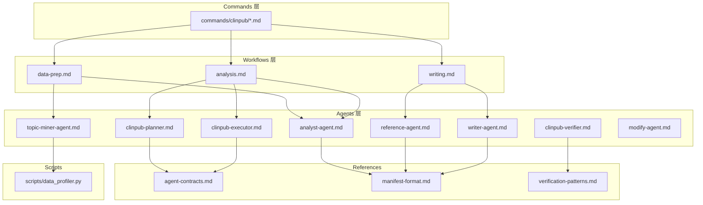
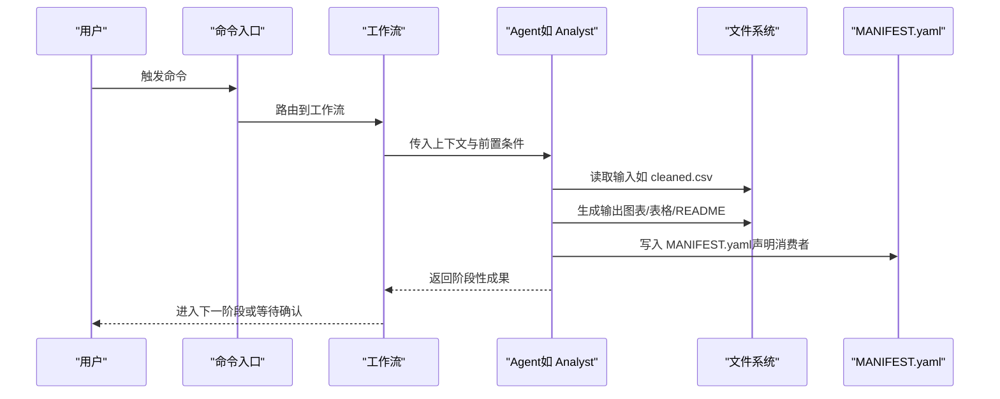
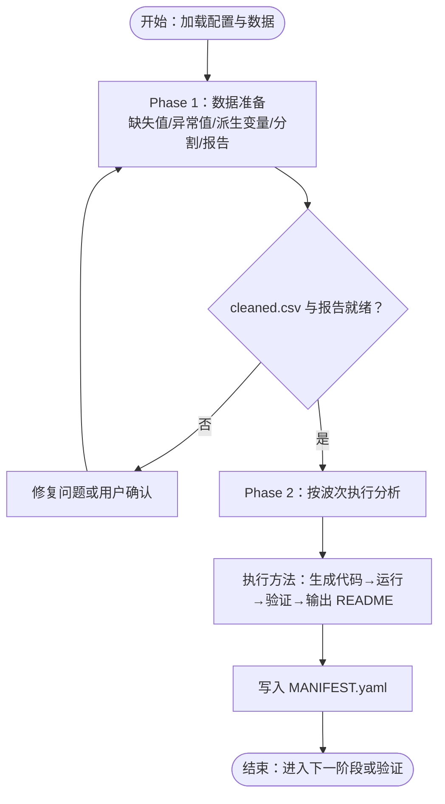
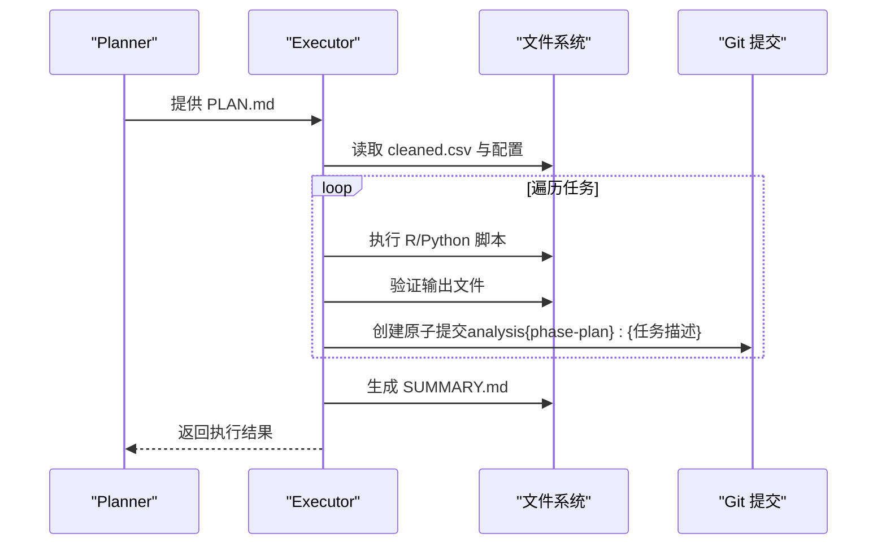
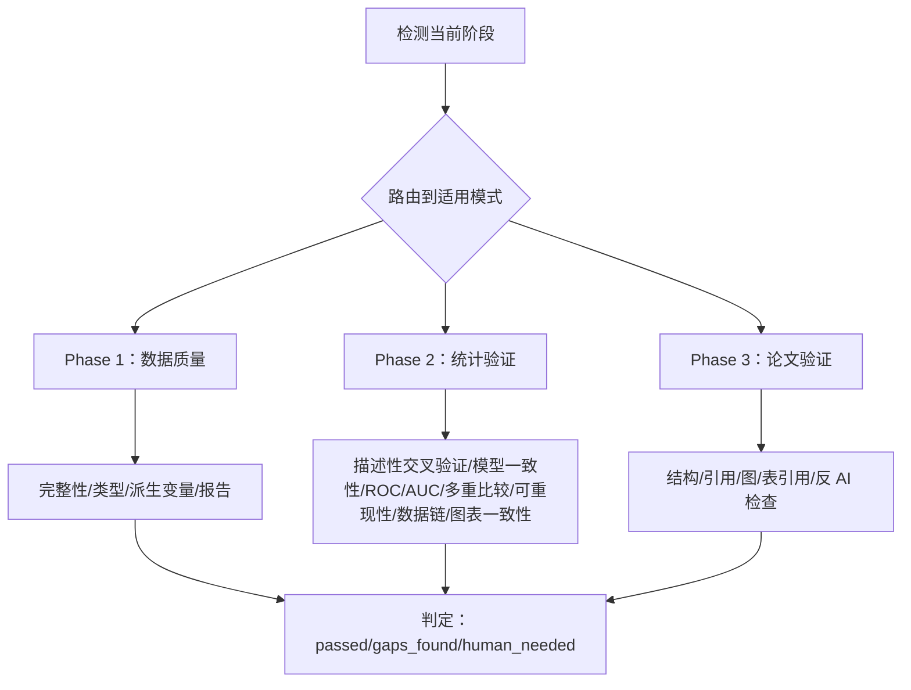
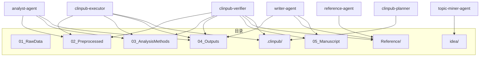

# Agents层设计

<cite>
**本文档引用的文件**
- [AGENTS.md](file://AGENTS.md)
- [agents/analyst-agent.md](file://agents/analyst-agent.md)
- [agents/clinpub-executor.md](file://agents/clinpub-executor.md)
- [agents/clinpub-planner.md](file://agents/clinpub-planner.md)
- [agents/clinpub-verifier.md](file://agents/clinpub-verifier.md)
- [agents/modify-agent.md](file://agents/modify-agent.md)
- [agents/reference-agent.md](file://agents/reference-agent.md)
- [agents/topic-miner-agent.md](file://agents/topic-miner-agent.md)
- [agents/writer-agent.md](file://agents/writer-agent.md)
- [pipeline/references/agent-contracts.md](file://pipeline/references/agent-contracts.md)
- [pipeline/references/manifest-format.md](file://pipeline/references/manifest-format.md)
- [pipeline/references/verification-patterns.md](file://pipeline/references/verification-patterns.md)
- [pipeline/workflows/analysis.md](file://pipeline/workflows/analysis.md)
- [pipeline/workflows/data-prep.md](file://pipeline/workflows/data-prep.md)
- [pipeline/workflows/writing.md](file://pipeline/workflows/writing.md)
- [docs/ARCHITECTURE.md](file://docs/ARCHITECTURE.md)
</cite>

## 目录
1. [引言](#引言)
2. [项目结构](#项目结构)
3. [核心组件](#核心组件)
4. [架构总览](#架构总览)
5. [详细组件分析](#详细组件分析)
6. [依赖分析](#依赖分析)
7. [性能考虑](#性能考虑)
8. [故障排除指南](#故障排除指南)
9. [结论](#结论)
10. [附录](#附录)

## 引言
本设计文档聚焦 clinpub 的 Agents 层，系统阐述其专业化任务执行能力与协作机制。Agents 层通过 8 个专业化 Agent 角色卡片，围绕“数据准备 → 分析计划 → 执行与验证 → 论文写作”的科研管线，实现端到端自动化与可审计的跨阶段协作。本文将从角色定位、职责边界、输入输出规范、工具权限、协作模式、通信协议、生命周期与状态维护、错误恢复、可扩展性与自定义开发等方面进行全面解析。

## 项目结构
Agents 层位于三层架构的最外层，直接面向工作流与用户交互，负责将工作流编排转化为可执行的分析与写作任务。核心目录与文件如下：
- agents/：存放 8 个 Agent 的角色卡片与执行规范
- pipeline/workflows/：定义各阶段的编排逻辑与依赖关系
- pipeline/references/：提供契约、清单格式、验证模式等支撑文档
- scripts/：数据画像等工具脚本
- hooks/：工作流强制与安全防护

**图表来源**
- [docs/ARCHITECTURE.md:45-83](file://docs/ARCHITECTURE.md#L45-L83)
- [pipeline/workflows/data-prep.md:1-184](file://pipeline/workflows/data-prep.md#L1-L184)
- [pipeline/workflows/analysis.md:1-289](file://pipeline/workflows/analysis.md#L1-L289)
- [pipeline/workflows/writing.md:1-330](file://pipeline/workflows/writing.md#L1-L330)

**章节来源**
- [docs/ARCHITECTURE.md:1-160](file://docs/ARCHITECTURE.md#L1-L160)
- [AGENTS.md:1-123](file://AGENTS.md#L1-L123)

## 核心组件
Agents 层包含 8 个专业化 Agent，每个 Agent 通过角色卡片定义职责、输入输出、工具权限与质量标准，并通过文件系统与清单（MANIFEST.yaml）实现跨阶段协作。

- 专题挖掘 Agent（topic-miner-agent）：面向数据驱动的选题生成，产出数据画像、文献扫描与候选主题。
- 统计分析 Agent（analyst-agent）：面向数据准备与统计分析，生成清洗后的数据与发布级图表表格。
- 文献检索 Agent（reference-agent）：面向 PubMed 搜索与引用管理，输出结构化参考文献与映射。
- 论文撰写 Agent（writer-agent）：面向 IMRAD 结构化写作，遵循目标期刊规范与反 AI 模板规则。
- 研究规划 Agent（clinpub-planner）：面向动态分析计划构建，生成可执行的 PLAN.md。
- 分析执行 Agent（clinpub-executor）：面向原子化任务执行与提交，生成 SUMMARY.md。
- 统计验证 Agent（clinpub-verifier）：面向跨阶段验证，应用 15 种验证模式。
- 输出修改 Agent（modify-agent）：面向分析输出的可视化与方法级修改。

**章节来源**
- [agents/analyst-agent.md:1-141](file://agents/analyst-agent.md#L1-L141)
- [agents/clinpub-executor.md:1-128](file://agents/clinpub-executor.md#L1-L128)
- [agents/clinpub-planner.md:1-131](file://agents/clinpub-planner.md#L1-L131)
- [agents/clinpub-verifier.md:1-439](file://agents/clinpub-verifier.md#L1-L439)
- [agents/modify-agent.md:1-176](file://agents/modify-agent.md#L1-L176)
- [agents/reference-agent.md:1-321](file://agents/reference-agent.md#L1-L321)
- [agents/topic-miner-agent.md:1-320](file://agents/topic-miner-agent.md#L1-L320)
- [agents/writer-agent.md:1-166](file://agents/writer-agent.md#L1-L166)

## 架构总览
Agents 层采用“文件系统 + 清单契约”的协作范式，Agent 之间不直接消息通信，而是通过共享文件系统与 MANIFEST.yaml 实现解耦协作。每个 Agent 在完成输出后写入 MANIFEST.yaml，下游 Agent 在消费前读取并校验清单，确保质量与一致性。

**图表来源**
- [pipeline/references/manifest-format.md:149-187](file://pipeline/references/manifest-format.md#L149-L187)
- [agents/analyst-agent.md:14-15](file://agents/analyst-agent.md#L14-L15)
- [agents/writer-agent.md:27-51](file://agents/writer-agent.md#L27-L51)

**章节来源**
- [pipeline/references/agent-contracts.md:125-133](file://pipeline/references/agent-contracts.md#L125-L133)
- [pipeline/references/manifest-format.md:1-187](file://pipeline/references/manifest-format.md#L1-L187)

## 详细组件分析

### Analyst Agent（统计分析）
- 角色定位：临床数据清洗与发布级统计分析的高级统计师，R/Python 双主。
- 职责范围：Phase 1 数据准备（缺失值处理、异常值检测、派生变量、训练/验证分割、数据质量报告）；Phase 2 统计分析（按波次执行方法，生成图表与表格，输出 README）。
- 输入输出规范：
  - 输入：原始数据、项目配置、分析方法参考、R/Python 模式参考。
  - 输出：cleaned.csv、数据质量报告、方法目录（figures + tables + README）、MANIFEST.yaml。
- 工具权限：读取、写入、编辑、Bash、Glob、Grep。
- 关键规则：严格的发布级标准（分辨率、字体、颜色、尺寸、网格）、多重比较校正、假设检验验证、代码可重现性（随机种子、版本记录）。
- 生命周期与状态：Phase 1 完成标志为 cleaned.csv 与数据质量报告；Phase 2 完成标志为每个方法目录包含 figure + table + README，且满足质量标准。

**图表来源**
- [agents/analyst-agent.md:17-107](file://agents/analyst-agent.md#L17-L107)
- [pipeline/workflows/analysis.md:187-222](file://pipeline/workflows/analysis.md#L187-L222)

**章节来源**
- [agents/analyst-agent.md:1-141](file://agents/analyst-agent.md#L1-L141)
- [pipeline/references/agent-contracts.md:20-32](file://pipeline/references/agent-contracts.md#L20-L32)

### Clinpub Planner（研究规划）
- 角色定位：面向分析阶段的研究规划专家，构建可执行的 PLAN.md。
- 职责范围：基于数据诊断与用户确认，分解为依赖有序的波次（Wave），每波 2-3 个任务，确保可并行性与验证标准。
- 输入输出规范：
  - 输入：项目配置、路线图、阶段状态、分析方法参考。
  - 输出：PLAN.md（含前端元数据、目标、上下文、任务、验证与成功标准）。
- 工具权限：读取、写入、Bash、Glob、Grep。
- 成功标准：PLAN.md 完整、依赖图正确、任务字段齐全、覆盖所有确认方法。

**章节来源**
- [agents/clinpub-planner.md:1-131](file://agents/clinpub-planner.md#L1-L131)
- [pipeline/references/agent-contracts.md:80-92](file://pipeline/references/agent-contracts.md#L80-L92)

### Clinpub Executor（分析执行）
- 角色定位：原子化任务执行与提交的执行器，类似 GSD 执行器但专用于临床分析。
- 职责范围：读取 PLAN.md，按类型执行（自动/决策检查点/人工验证），逐任务创建提交，最终生成 SUMMARY.md。
- 执行模式：自动执行、带检查点的暂停、断点续跑。
- 关键规则：失败自动修复（语法/包缺失/路径）、数据问题自动处理、缺失输出自动修复、方法变更需决策检查点。
- 生命周期：完成所有任务提交、生成 SUMMARY.md、更新 STATE.md。

**图表来源**
- [agents/clinpub-executor.md:17-127](file://agents/clinpub-executor.md#L17-L127)
- [pipeline/workflows/analysis.md:187-222](file://pipeline/workflows/analysis.md#L187-L222)

**章节来源**
- [agents/clinpub-executor.md:1-128](file://agents/clinpub-executor.md#L1-L128)
- [pipeline/references/agent-contracts.md:95-107](file://pipeline/references/agent-contracts.md#L95-L107)

### Clinpub Verifier（统计验证）
- 角色定位：跨阶段验证的对抗式审查员，面向数据质量（Phase 1）、统计分析（Phase 2）、论文完整性（Phase 3）。
- 验证模式：15 种验证模式（统计有效性、可重现性、数据完整性、图表一致性、数据质量、缺失值处理、分割完整性、论文结构、引用完整性、图/表引用、反 AI 检查等）。
- 执行流程：阶段识别 → 选择模式 → 应用检查 → 生成 VERIFICATION.md → 状态判定（passed/gaps_found/human_needed）。
- 关键规则：不信任 SUMMARY 的声明，必须核验实际输出文件；严格的质量门禁与人类复核阈值。

**图表来源**
- [agents/clinpub-verifier.md:33-311](file://agents/clinpub-verifier.md#L33-L311)
- [pipeline/references/verification-patterns.md:1-358](file://pipeline/references/verification-patterns.md#L1-L358)

**章节来源**
- [agents/clinpub-verifier.md:1-439](file://agents/clinpub-verifier.md#L1-L439)
- [pipeline/references/agent-contracts.md:110-122](file://pipeline/references/agent-contracts.md#L110-L122)

### Reference Agent（文献检索）
- 角色定位：PubMed/NCBI 文献检索与引用管理专家，使用 ncbi-search 技能。
- 职责范围：搜索、筛选、去重、格式化（Vancouver），输出 references.bib 与 citation_map.md。
- 工具权限：读取、写入、Bash、Glob、Grep。
- 关键规则：每条引用必须有 DOI；首次输出摘要级，追问后展开深入层；搜索统一使用 ncbi-search 技能。

**章节来源**
- [agents/reference-agent.md:1-321](file://agents/reference-agent.md#L1-L321)
- [pipeline/references/agent-contracts.md:35-47](file://pipeline/references/agent-contracts.md#L35-L47)

### Topic Miner Agent（专题挖掘）
- 角色定位：基于患者水平数据的数据驱动选题顾问，不进行统计分析或论文写作。
- 职责范围：数据画像（分布、缺失、相关性）、变量角色推断、文献扫描（并行子代理）、复合新颖性分析、候选主题生成、项目配置生成。
- 工具权限：读取、写入、Bash、Glob、Grep。
- 关键规则：变量角色自动检测仅为建议，需用户确认；生成 idea/to_project_config.yml 供用户审阅后重命名为 project_config.yml。

**章节来源**
- [agents/topic-miner-agent.md:1-320](file://agents/topic-miner-agent.md#L1-L320)
- [pipeline/references/agent-contracts.md:65-77](file://pipeline/references/agent-contracts.md#L65-L77)

### Writer Agent（论文撰写）
- 角色定位：面向 SCI Q1/Q2 期刊的 IMRAD 结构化写作专家，遵循目标期刊规范与反 AI 模板规则。
- 职责范围：按研究类型模板撰写 Introduction/Methods/Results/Discussion，模拟审稿与修订，最终拼接 manuscript.md。
- 工具权限：读取、写入、编辑、Bash、Glob、Grep。
- 关键规则：IMRAD 结构完整、引用全 DOI、图/表引用一致、语言规范（中文正文 + 英文图/表标题）、反 AI 模板检查。

**章节来源**
- [agents/writer-agent.md:1-166](file://agents/writer-agent.md#L1-L166)
- [pipeline/references/agent-contracts.md:50-62](file://pipeline/references/agent-contracts.md#L50-L62)

### Modify Agent（输出修改）
- 角色定位：分析输出修改专家，支持样式调整（颜色、字体、图表类型）与方法级变更（测试替换、变量组合、模型参数）。
- 职责范围：构建方法清单 → 明确修改范围 → 执行修改 → 验证输出 → 追加修改历史到 PLAN.md。
- 工具权限：读取、写入、编辑、Bash、Glob、Grep。
- 关键规则：仅修改 03_AnalysisMethods/ 与 04_Outputs/；禁止修改 05_Manuscript/、Reference/、02_PreprocessedData/；最大 5 次修改/session。

**章节来源**
- [agents/modify-agent.md:1-176](file://agents/modify-agent.md#L1-L176)
- [pipeline/references/agent-contracts.md:1-156](file://pipeline/references/agent-contracts.md#L1-L156)

## 依赖分析
Agents 层通过“目录访问矩阵”实现严格的单写者与只读依赖关系，避免循环依赖与竞态。

**图表来源**
- [pipeline/references/agent-contracts.md:136-156](file://pipeline/references/agent-contracts.md#L136-L156)

**章节来源**
- [pipeline/references/agent-contracts.md:125-156](file://pipeline/references/agent-contracts.md#L125-L156)

## 性能考虑
- 文件系统 I/O 优化：Agent 输出采用标准化目录与命名约定，便于快速扫描与批量处理。
- 清单契约加速：通过 MANIFEST.yaml 预校验，减少下游 Agent 的无效尝试与回滚成本。
- 并行化策略：Topic Miner 的并行子代理与 Writer 的分段撰写，提升整体吞吐。
- 可重现性与缓存：R/Python 脚本独立运行、随机种子固定、版本记录，降低重复执行成本。

## 故障排除指南
- 清单缺失或不一致：检查上游 Agent 是否正确写入 MANIFEST.yaml，下游 Agent 是否在消费前读取并校验。
- 输出不满足质量标准：对照发布级标准（分辨率、字体、颜色、主题、统计报告完整性）逐项核查。
- 验证失败（gaps_found）：根据 VERIFICATION.md 的具体问题逐条修复，必要时进行人类复核（human_needed）。
- 执行器错误：利用自动修复规则（语法/包/路径/输出缺失）与偏差记录，定位并修复问题。
- 写作语言与格式：确保中文正文与英文图/表标题分离，反 AI 检查通过。

**章节来源**
- [pipeline/references/manifest-format.md:149-187](file://pipeline/references/manifest-format.md#L149-L187)
- [agents/clinpub-verifier.md:415-439](file://agents/clinpub-verifier.md#L415-L439)
- [agents/clinpub-executor.md:70-86](file://agents/clinpub-executor.md#L70-L86)

## 结论
Agents 层通过角色化、契约化与文件系统协作，实现了高内聚、低耦合的临床科研自动化流水线。其对抗式验证与清单契约保障了质量与可追溯性，而可扩展的设计允许新增 Agent 与研究类型。开发者可据此快速理解系统并进行定制扩展。

## 附录

### Agent 角色与协作速览
- Topic Miner → Analyst（数据准备）→ Planner/Executor（分析）→ Verifier（验证）→ Reference（文献）→ Writer（写作）
- Modify Agent 作为输出修改入口，贯穿 Phase 2/3/4 的迭代优化

**章节来源**
- [AGENTS.md:72-84](file://AGENTS.md#L72-L84)
- [docs/ARCHITECTURE.md:67-83](file://docs/ARCHITECTURE.md#L67-L83)