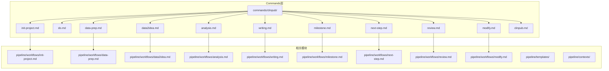
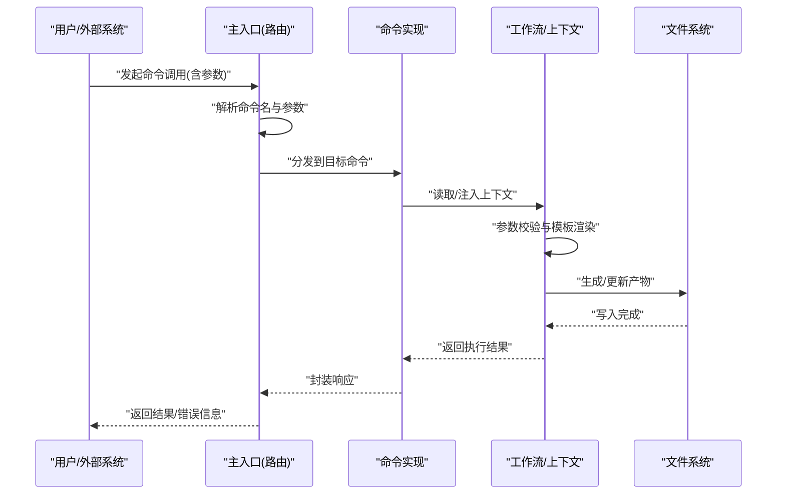
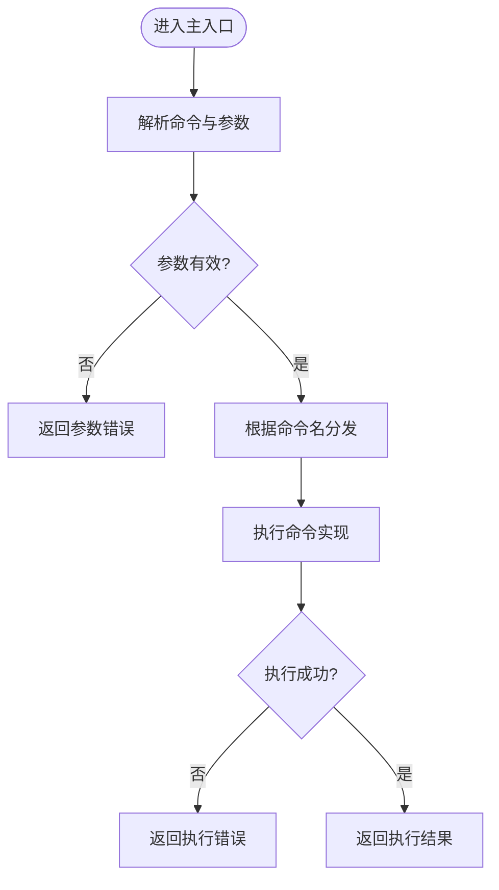
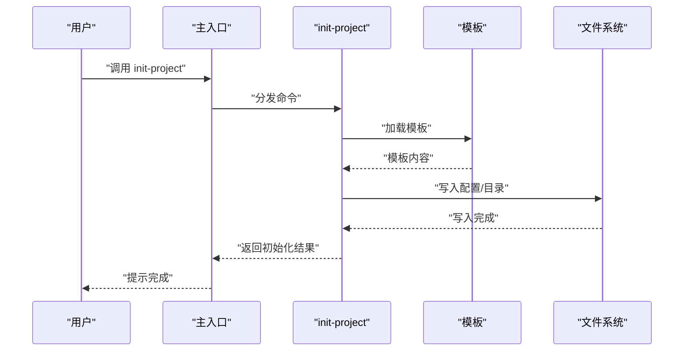
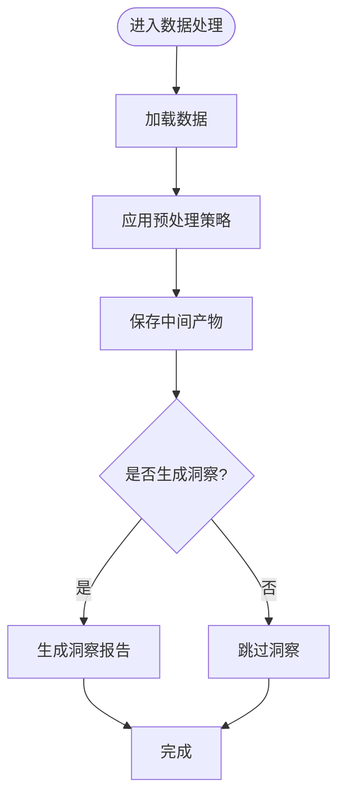
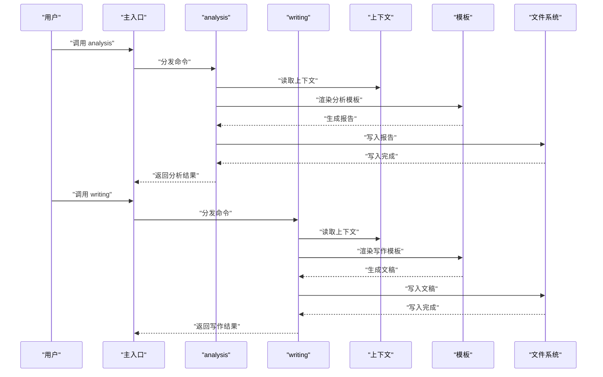
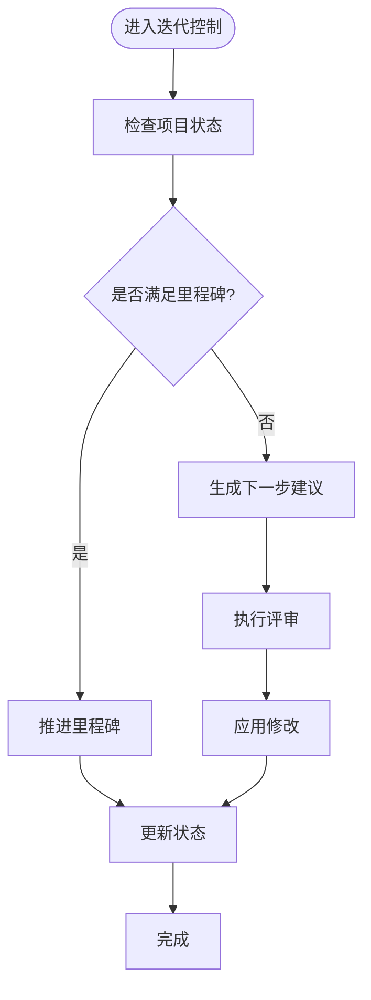
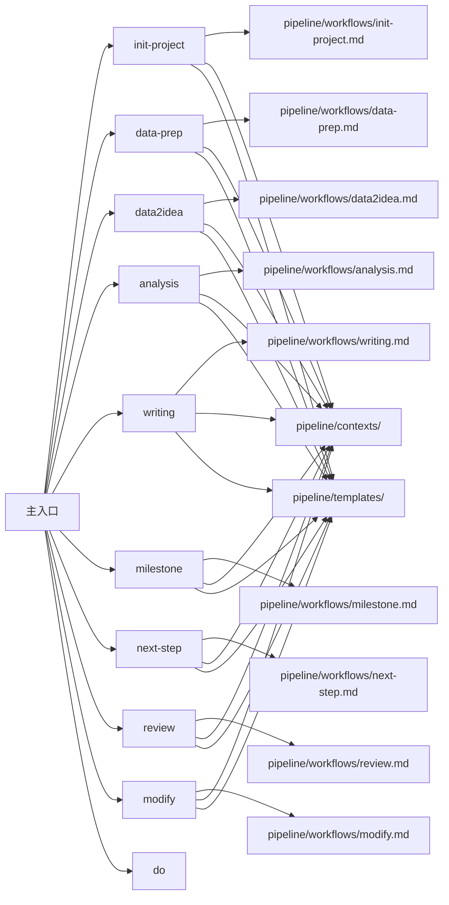

# Commands层设计

<cite>
**本文档引用的文件**
- [README.md](file://README.md)
- [SKILL.md](file://SKILL.md)
- [CLAUDE.md](file://CLAUDE.md)
- [commands/clinpub/clinpub.md](file://commands/clinpub/clinpub.md)
- [commands/clinpub/init-project.md](file://commands/clinpub/init-project.md)
- [commands/clinpub/do.md](file://commands/clinpub/do.md)
- [commands/clinpub/data-prep.md](file://commands/clinpub/data-prep.md)
- [commands/clinpub/data2idea.md](file://commands/clinpub/data2idea.md)
- [commands/clinpub/analysis.md](file://commands/clinpub/analysis.md)
- [commands/clinpub/writing.md](file://commands/clinpub/writing.md)
- [commands/clinpub/milestone.md](file://commands/clinpub/milestone.md)
- [commands/clinpub/next-step.md](file://commands/clinpub/next-step.md)
- [commands/clinpub/review.md](file://commands/clinpub/review.md)
- [commands/clinpub/modify.md](file://commands/clinpub/modify.md)
</cite>

## 目录
1. [简介](#简介)
2. [项目结构](#项目结构)
3. [核心组件](#核心组件)
4. [架构总览](#架构总览)
5. [详细组件分析](#详细组件分析)
6. [依赖关系分析](#依赖关系分析)
7. [性能考虑](#性能考虑)
8. [故障排除指南](#故障排除指南)
9. [结论](#结论)
10. [附录](#附录)

## 简介
本设计文档聚焦于clinpub的Commands层，系统性阐述其作为用户接口的设计理念与实现机制。Commands层以“命令即动作”的思想组织，将复杂的科研管线操作抽象为可组合、可复用的命令集合，面向终端用户与外部系统（如Claude Code Skill）提供统一的触发入口与参数化执行路径。本文将逐项解析各命令的功能职责、触发条件、参数定义与执行流程，并说明主入口路由与命令分发逻辑，给出参数验证与错误处理策略，以及与Claude Code Skill系统的集成方式与最佳实践。

## 项目结构
Commands层位于commands/clinpub目录下，采用“按功能域命名”的文件组织方式，每个命令对应一个独立的Markdown文件，便于维护与扩展。Commands层与管道上下文、模板、工作流等模块协同，形成从“意图识别”到“动作执行”的闭环。

**图表来源**
- [commands/clinpub/clinpub.md](file://commands/clinpub/clinpub.md)
- [commands/clinpub/init-project.md](file://commands/clinpub/init-project.md)
- [commands/clinpub/do.md](file://commands/clinpub/do.md)
- [commands/clinpub/data-prep.md](file://commands/clinpub/data-prep.md)
- [commands/clinpub/data2idea.md](file://commands/clinpub/data2idea.md)
- [commands/clinpub/analysis.md](file://commands/clinpub/analysis.md)
- [commands/clinpub/writing.md](file://commands/clinpub/writing.md)
- [commands/clinpub/milestone.md](file://commands/clinpub/milestone.md)
- [commands/clinpub/next-step.md](file://commands/clinpub/next-step.md)
- [commands/clinpub/review.md](file://commands/clinpub/review.md)
- [commands/clinpub/modify.md](file://commands/clinpub/modify.md)

**章节来源**
- [README.md](file://README.md)
- [commands/clinpub/clinpub.md](file://commands/clinpub/clinpub.md)

## 核心组件
Commands层的核心由以下要素构成：
- 命令定义：每个命令以独立文件形式存在，明确职责边界与输入输出约定。
- 主入口与路由：通过主入口文件集中声明命令清单与分发逻辑，实现“名称到实现”的映射。
- 参数与上下文：命令参数在文件内声明，结合管道上下文与模板进行参数注入与校验。
- 执行链路：命令经由主入口路由后，调用相应工作流或脚本，最终落地到具体动作（如生成文件、更新状态、触发下一步）。
- 集成点：与Claude Code Skill系统对接，暴露可被外部系统调用的命令接口。

关键职责划分：
- 初始化类命令：负责项目初始化、配置生成与基础环境准备。
- 数据处理类命令：负责数据预处理、数据洞察与知识提炼。
- 分析与写作类命令：负责研究分析与论文写作阶段的自动化执行。
- 迭代与里程碑类命令：负责阶段性评审、里程碑推进与修改迭代。
- 辅助类命令：负责下一步建议、执行与通用能力。

**章节来源**
- [commands/clinpub/clinpub.md](file://commands/clinpub/clinpub.md)
- [commands/clinpub/init-project.md](file://commands/clinpub/init-project.md)
- [commands/clinpub/data-prep.md](file://commands/clinpub/data-prep.md)
- [commands/clinpub/data2idea.md](file://commands/clinpub/data2idea.md)
- [commands/clinpub/analysis.md](file://commands/clinpub/analysis.md)
- [commands/clinpub/writing.md](file://commands/clinpub/writing.md)
- [commands/clinpub/milestone.md](file://commands/clinpub/milestone.md)
- [commands/clinpub/next-step.md](file://commands/clinpub/next-step.md)
- [commands/clinpub/review.md](file://commands/clinpub/review.md)
- [commands/clinpub/modify.md](file://commands/clinpub/modify.md)

## 架构总览
Commands层的总体架构围绕“命令即契约”展开：命令文件定义行为与参数；主入口负责路由与参数校验；工作流承接命令并驱动上下文与模板；最终落地到具体动作。该架构确保了命令的可发现性、可测试性与可演进性。

**图表来源**
- [commands/clinpub/clinpub.md](file://commands/clinpub/clinpub.md)
- [commands/clinpub/do.md](file://commands/clinpub/do.md)

## 详细组件分析

### 主入口与路由机制
- 路由职责：接收命令请求，解析命令名与参数，定位到对应命令文件，执行参数校验与上下文注入，最后返回结果。
- 命令清单：主入口集中声明所有可用命令，保证命令发现与版本一致性。
- 分发策略：基于命令名进行精确匹配，支持别名与简写（若存在），并提供默认参数与回退策略。
- 错误处理：对未知命令、参数缺失、类型不匹配等情况进行统一捕获与提示。

**图表来源**
- [commands/clinpub/clinpub.md](file://commands/clinpub/clinpub.md)
- [commands/clinpub/do.md](file://commands/clinpub/do.md)

**章节来源**
- [commands/clinpub/clinpub.md](file://commands/clinpub/clinpub.md)
- [commands/clinpub/do.md](file://commands/clinpub/do.md)

### 初始化类命令
- init-project：用于初始化新项目，生成基础配置与目录结构，确保后续命令运行所需的前置条件。
- 触发条件：项目未初始化或需要重置时。
- 关键参数：项目标识、作者信息、初始模板选择等。
- 执行流程：读取模板 -> 注入参数 -> 写入文件 -> 更新状态文件 -> 返回结果。

**图表来源**
- [commands/clinpub/init-project.md](file://commands/clinpub/init-project.md)

**章节来源**
- [commands/clinpub/init-project.md](file://commands/clinpub/init-project.md)

### 数据处理类命令
- data-prep：负责数据预处理，清洗与标准化，生成中间产物供后续分析使用。
- data2idea：从数据中提炼研究思路与假设，输出初步洞察报告。
- 触发条件：已有原始数据且处于数据准备阶段。
- 关键参数：数据源路径、预处理策略、输出格式等。
- 执行流程：读取数据 -> 应用预处理策略 -> 生成中间产物 -> 可选：生成洞察报告 -> 返回结果。

**图表来源**
- [commands/clinpub/data-prep.md](file://commands/clinpub/data-prep.md)
- [commands/clinpub/data2idea.md](file://commands/clinpub/data2idea.md)

**章节来源**
- [commands/clinpub/data-prep.md](file://commands/clinpub/data-prep.md)
- [commands/clinpub/data2idea.md](file://commands/clinpub/data2idea.md)

### 分析与写作类命令
- analysis：执行研究分析，结合上下文与方法库生成分析报告。
- writing：驱动写作流程，依据大纲与上下文生成初稿或修订稿。
- 触发条件：具备中间产物与分析上下文。
- 关键参数：分析方法、输出范围、引用策略等。
- 执行流程：读取上下文 -> 选择分析方法 -> 渲染模板 -> 写入产物 -> 返回结果。

**图表来源**
- [commands/clinpub/analysis.md](file://commands/clinpub/analysis.md)
- [commands/clinpub/writing.md](file://commands/clinpub/writing.md)

**章节来源**
- [commands/clinpub/analysis.md](file://commands/clinpub/analysis.md)
- [commands/clinpub/writing.md](file://commands/clinpub/writing.md)

### 迭代与里程碑类命令
- milestone：推进项目至下一里程碑，更新状态与检查点。
- next-step：基于当前状态与上下文生成下一步建议。
- review：执行阶段性评审，产出评审意见与改进建议。
- modify：根据评审意见对项目进行修改与迭代。
- 触发条件：项目已进入相应阶段，具备评审与修改条件。
- 关键参数：评审维度、修改策略、建议范围等。
- 执行流程：读取状态 -> 评估条件 -> 生成建议/评审意见 -> 应用修改 -> 更新状态 -> 返回结果。

**图表来源**
- [commands/clinpub/milestone.md](file://commands/clinpub/milestone.md)
- [commands/clinpub/next-step.md](file://commands/clinpub/next-step.md)
- [commands/clinpub/review.md](file://commands/clinpub/review.md)
- [commands/clinpub/modify.md](file://commands/clinpub/modify.md)

**章节来源**
- [commands/clinpub/milestone.md](file://commands/clinpub/milestone.md)
- [commands/clinpub/next-step.md](file://commands/clinpub/next-step.md)
- [commands/clinpub/review.md](file://commands/clinpub/review.md)
- [commands/clinpub/modify.md](file://commands/clinpub/modify.md)

### 辅助类命令
- do：通用执行命令，用于直接触发某个动作或脚本，常用于调试与快速验证。
- 触发条件：需要快速执行某段逻辑或验证参数。
- 关键参数：动作标识、参数集、执行模式等。
- 执行流程：解析动作 -> 注入参数 -> 执行脚本 -> 返回结果。

**章节来源**
- [commands/clinpub/do.md](file://commands/clinpub/do.md)

## 依赖关系分析
Commands层与管道工作流、上下文与模板存在强耦合关系，命令文件通过引用工作流与模板来实现功能落地。主入口承担依赖聚合与解耦的关键角色，避免命令文件直接耦合底层实现细节。

**图表来源**
- [commands/clinpub/clinpub.md](file://commands/clinpub/clinpub.md)
- [commands/clinpub/init-project.md](file://commands/clinpub/init-project.md)
- [commands/clinpub/data-prep.md](file://commands/clinpub/data-prep.md)
- [commands/clinpub/data2idea.md](file://commands/clinpub/data2idea.md)
- [commands/clinpub/analysis.md](file://commands/clinpub/analysis.md)
- [commands/clinpub/writing.md](file://commands/clinpub/writing.md)
- [commands/clinpub/milestone.md](file://commands/clinpub/milestone.md)
- [commands/clinpub/next-step.md](file://commands/clinpub/next-step.md)
- [commands/clinpub/review.md](file://commands/clinpub/review.md)
- [commands/clinpub/modify.md](file://commands/clinpub/modify.md)

**章节来源**
- [commands/clinpub/clinpub.md](file://commands/clinpub/clinpub.md)

## 性能考虑
- 命令粒度：将复杂流程拆分为细粒度命令，提升可缓存性与可并行性。
- 上下文最小化：仅注入必要上下文，减少IO与渲染开销。
- 模板复用：共享模板与方法库，降低重复计算成本。
- 异步与批处理：对耗时操作采用异步与批处理策略，避免阻塞主流程。
- 缓存策略：对中间产物与结果进行缓存，加速重复执行。

## 故障排除指南
- 参数错误：检查命令参数类型与必填项，确保与命令定义一致。
- 路由失败：确认命令名拼写与主入口清单，避免大小写与空格问题。
- 文件权限：确保写入目录具有足够权限，避免写入失败。
- 上下文缺失：核对上下文文件是否存在且格式正确。
- 工作流异常：查看工作流日志，定位具体步骤与错误原因。
- 外部系统集成：对于Claude Code Skill，关注回调与鉴权配置，确保请求可达与参数透传。

**章节来源**
- [commands/clinpub/clinpub.md](file://commands/clinpub/clinpub.md)

## 结论
Commands层通过“命令即契约”的设计，实现了用户接口的清晰性与可扩展性。主入口路由与参数校验保障了调用的一致性，命令与工作流的解耦提升了可维护性。配合Claude Code Skill的集成，Commands层能够无缝融入更广泛的自动化与协作场景。建议在实际开发中遵循参数最小化、上下文透明化与结果可追踪的原则，持续优化命令粒度与执行效率。

## 附录
- 命令调用示例（路径参考）
  - 初始化项目：[commands/clinpub/init-project.md](file://commands/clinpub/init-project.md)
  - 数据预处理：[commands/clinpub/data-prep.md](file://commands/clinpub/data-prep.md)
  - 数据洞察：[commands/clinpub/data2idea.md](file://commands/clinpub/data2idea.md)
  - 分析执行：[commands/clinpub/analysis.md](file://commands/clinpub/analysis.md)
  - 写作执行：[commands/clinpub/writing.md](file://commands/clinpub/writing.md)
  - 里程碑推进：[commands/clinpub/milestone.md](file://commands/clinpub/milestone.md)
  - 下一步建议：[commands/clinpub/next-step.md](file://commands/clinpub/next-step.md)
  - 阶段评审：[commands/clinpub/review.md](file://commands/clinpub/review.md)
  - 修改迭代：[commands/clinpub/modify.md](file://commands/clinpub/modify.md)
  - 通用执行：[commands/clinpub/do.md](file://commands/clinpub/do.md)

- 与Claude Code Skill集成要点
  - 接口暴露：Commands层应提供稳定的命令列表与参数规范，便于外部系统发现与调用。
  - 参数透传：确保命令参数在路由与执行链路中完整传递，避免丢失或篡改。
  - 错误反馈：对外部系统返回统一的错误码与错误信息，便于上层系统处理。
  - 安全与鉴权：在主入口处统一接入鉴权与访问控制，防止未授权调用。
  - 版本管理：通过主入口清单与版本号管理命令变更，确保外部系统兼容性。

**章节来源**
- [CLAUDE.md](file://CLAUDE.md)
- [commands/clinpub/clinpub.md](file://commands/clinpub/clinpub.md)