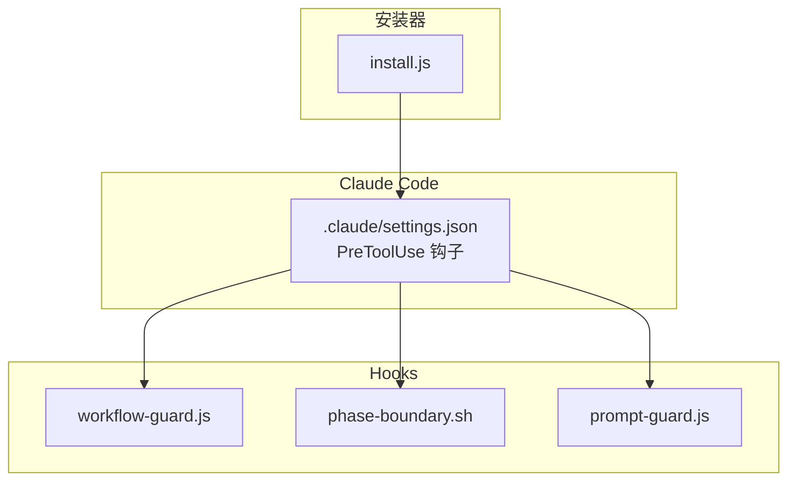
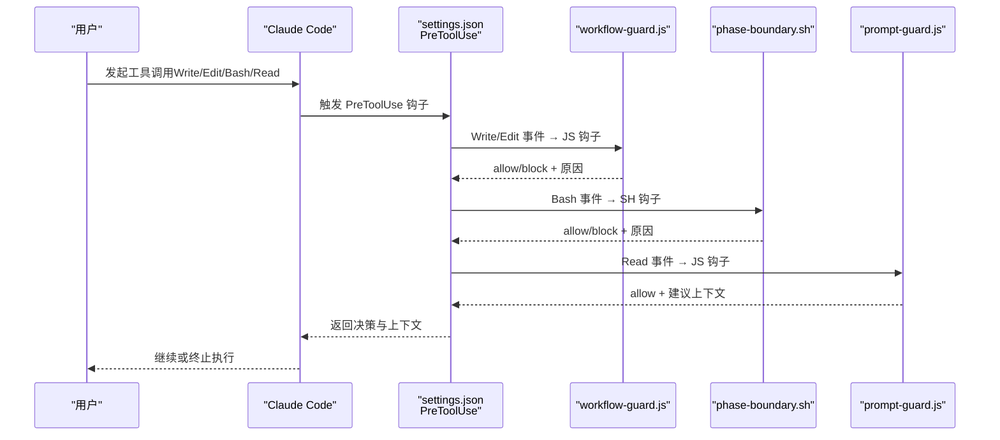
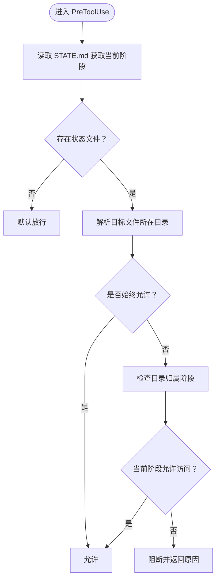
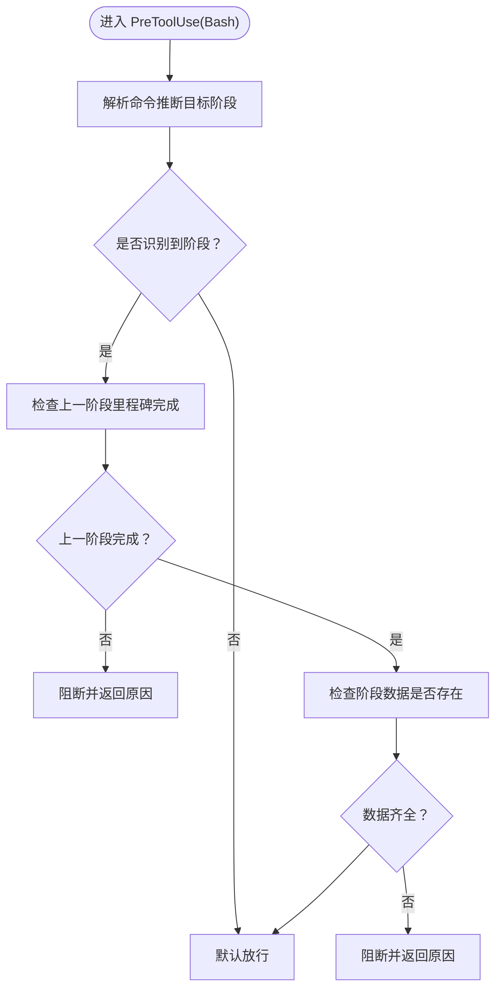
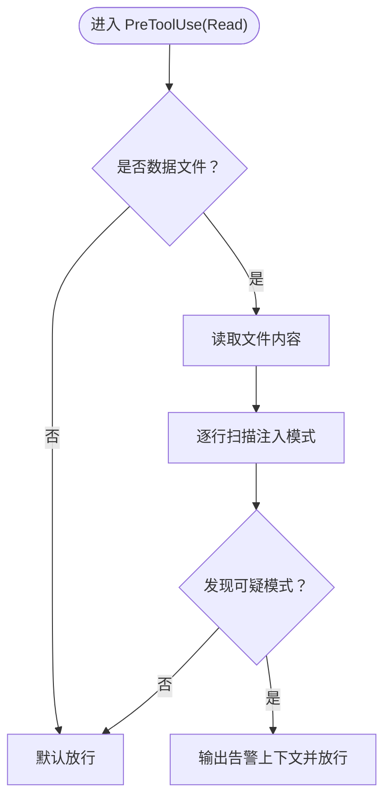
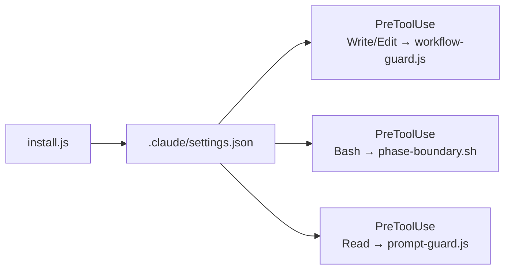

# Hooks机制设计

<cite>
**本文引用的文件**
- [hooks/clinpub-workflow-guard.js](file://hooks/clinpub-workflow-guard.js)
- [hooks/clinpub-phase-boundary.sh](file://hooks/clinpub-phase-boundary.sh)
- [hooks/clinpub-prompt-guard.js](file://hooks/clinpub-prompt-guard.js)
- [bin/install.js](file://bin/install.js)
- [README.md](file://README.md)
- [docs/ARCHITECTURE.md](file://docs/ARCHITECTURE.md)
- [.clinpub/codebase/CONCERNS.md](file://.clinpub/codebase/CONCERNS.md)
- [.clinpub/phases/01-bug-fixes/01-01-SUMMARY.md](file://.clinpub/phases/01-bug-fixes/01-01-SUMMARY.md)
- [commands/clinpub/next-step.md](file://commands/clinpub/next-step.md)
</cite>

## 目录
1. [简介](#简介)
2. [项目结构](#项目结构)
3. [核心组件](#核心组件)
4. [架构总览](#架构总览)
5. [详细组件分析](#详细组件分析)
6. [依赖分析](#依赖分析)
7. [性能考虑](#性能考虑)
8. [故障排除指南](#故障排除指南)
9. [结论](#结论)
10. [附录](#附录)

## 简介
本设计文档围绕 clinpub 的 Hooks 机制展开，系统性阐述三个 Claude Code Hooks 的安全保护机制与实现原理，包括：
- workflow-guard.js 的工作流阶段保护逻辑
- phase-boundary.sh 的阶段边界检查
- prompt-guard.js 的提示注入防护

文档还覆盖 Hooks 的触发时机、执行流程、安全策略、配置方法、调试技巧与故障排除，并解释系统的可扩展性与自定义开发方式，帮助开发者全面掌握并安全地使用 Hooks。

## 项目结构
Hooks 位于 hooks/ 目录，配合安装器 bin/install.js 自动注册到 Claude Code 的 PreToolUse 钩子事件中，形成对 Write/Edit/Bash/Read 等工具调用的前置拦截与告警。

**图示来源**
- [bin/install.js:141-211](file://bin/install.js#L141-L211)
- [README.md:131-139](file://README.md#L131-L139)

**章节来源**
- [README.md:30](file://README.md#L30)
- [docs/ARCHITECTURE.md:35-38](file://docs/ARCHITECTURE.md#L35-L38)
- [bin/install.js:141-211](file://bin/install.js#L141-L211)

## 核心组件
- workflow-guard.js：在 Write/Edit 工具调用前，校验目标文件是否属于当前阶段允许的目录，防止越阶写入。
- phase-boundary.sh：在 Bash 工具调用前，识别目标命令所对应的阶段，检查前置里程碑完成状态与必要数据存在性，阻断不符合条件的阶段推进。
- prompt-guard.js：在 Read 工具调用前，扫描数据文件内容，检测潜在的提示注入模式与异常长字符串，发出警告但不阻断读取。

**章节来源**
- [hooks/clinpub-workflow-guard.js:1-134](file://hooks/clinpub-workflow-guard.js#L1-L134)
- [hooks/clinpub-phase-boundary.sh:1-153](file://hooks/clinpub-phase-boundary.sh#L1-L153)
- [hooks/clinpub-prompt-guard.js:1-162](file://hooks/clinpub-prompt-guard.js#L1-L162)
- [README.md:131-139](file://README.md#L131-L139)

## 架构总览
Hooks 作为 Claude Code 的 PreToolUse 钩子，串联在 Commands → Workflows → Agents → Scripts 的执行链路之前，形成“前置校验 + 告警”的安全网。

**图示来源**
- [bin/install.js:162-166](file://bin/install.js#L162-L166)
- [README.md:131-139](file://README.md#L131-L139)

## 详细组件分析

### workflow-guard.js：工作流阶段保护
- 触发时机：PreToolUse → Write/Edit
- 核心逻辑：
  - 从项目状态文件读取当前阶段
  - 解析目标文件所属目录，判断是否属于当前阶段允许范围
  - 对始终开放的目录（如 .clinpub、hooks、agents 等）直接放行
  - 若目标目录属于未来阶段，返回 block 并附带原因
- 安全策略：
  - 严格限制跨阶段写入，避免破坏阶段化产出的完整性
  - 结构化状态解析优先，回退兼容保留
- 错误处理：解析失败或状态文件缺失时默认放行，避免阻断未初始化项目

**图示来源**
- [hooks/clinpub-workflow-guard.js:25-77](file://hooks/clinpub-workflow-guard.js#L25-L77)
- [hooks/clinpub-workflow-guard.js:84-131](file://hooks/clinpub-workflow-guard.js#L84-L131)

**章节来源**
- [hooks/clinpub-workflow-guard.js:1-134](file://hooks/clinpub-workflow-guard.js#L1-L134)
- [.clinpub/phases/01-bug-fixes/01-01-SUMMARY.md:22-47](file://.clinpub/phases/01-bug-fixes/01-01-SUMMARY.md#L22-L47)

### phase-boundary.sh：阶段边界检查
- 触发时机：PreToolUse → Bash
- 核心逻辑：
  - 从传入命令推断目标阶段
  - 检查上一阶段里程碑完成状态（STATE.md 或独立 MILESTONE.md）
  - 检查阶段所需数据是否存在（如 cleaned.csv、输出目录等）
- 安全策略：
  - 强制阶段推进前完成里程碑与数据准备
  - 对 Gate 验证缺失给出警告，避免跳过关键质量控制
- 错误处理：解析失败或状态缺失时默认放行，但会输出阻断原因

**图示来源**
- [hooks/clinpub-phase-boundary.sh:106-150](file://hooks/clinpub-phase-boundary.sh#L106-L150)

**章节来源**
- [hooks/clinpub-phase-boundary.sh:1-153](file://hooks/clinpub-phase-boundary.sh#L1-L153)
- [commands/clinpub/next-step.md:270-294](file://commands/clinpub/next-step.md#L270-L294)

### prompt-guard.js：提示注入防护
- 触发时机：PreToolUse → Read
- 核心逻辑：
  - 仅对数据文件（CSV/XLSX/TXT 等）进行扫描
  - 检测多种提示注入模式（指令类、系统标签类、编码载荷等）
  - 检测异常长字符串（可能隐藏注入载荷）
- 安全策略：
  - 以告警代替阻断，提醒人工复核可疑文件
  - 保持最小干扰，不影响正常读取流程
- 错误处理：读取失败或解析异常时默认放行

**图示来源**
- [hooks/clinpub-prompt-guard.js:108-159](file://hooks/clinpub-prompt-guard.js#L108-L159)

**章节来源**
- [hooks/clinpub-prompt-guard.js:1-162](file://hooks/clinpub-prompt-guard.js#L1-L162)

## 依赖分析
Hooks 通过安装器注册到 Claude Code 的 PreToolUse 钩子，形成对不同工具类型的分发：

**图示来源**
- [bin/install.js:162-166](file://bin/install.js#L162-L166)
- [bin/install.js:192-207](file://bin/install.js#L192-L207)

**章节来源**
- [bin/install.js:141-211](file://bin/install.js#L141-L211)
- [README.md:131-139](file://README.md#L131-L139)

## 性能考虑
- workflow-guard.js：正则匹配与文件系统读取开销较小；状态解析优先结构化行，回退兼容保留，避免重复计算。
- phase-boundary.sh：存在一次调用被重复执行的问题（参见故障排除指南），建议合并输出捕获与返回值判断，减少文件系统与文本匹配开销。
- prompt-guard.js：按行扫描，对大文件存在线性时间复杂度；建议对超大文件采用分块或采样策略（自定义扩展时可考虑）。

[本节为通用性能讨论，无需特定文件引用]

## 故障排除指南
- 阶段推进被阻断
  - 现象：phase-boundary.sh 返回阻断原因
  - 排查：确认上一阶段的里程碑文件是否生成且标记完成；检查 STATE.md 与 ROADMAP.md 的状态一致性
  - 参考：commands/clinpub/next-step.md 中关于 MILESTONE.md 生成与推进规则
- 越阶写入被阻止
  - 现象：workflow-guard.js 返回阻断原因
  - 排查：检查目标文件是否位于未来阶段目录；确认 STATE.md 的结构化阶段行格式是否正确
  - 参考：.clinpub/phases/01-bug-fixes/01-01-SUMMARY.md 中关于结构化行的权威匹配
- Bash 命令被意外阻断
  - 现象：phase-boundary.sh 重复执行导致性能下降或误判
  - 排查：检查 hooks/clinpub-phase-boundary.sh 中第135-136行的重复调用逻辑
  - 建议：重构为一次性调用并同时获取返回值与输出
- 数据文件读取告警
  - 现象：prompt-guard.js 输出告警上下文
  - 处理：人工复核可疑文件，确认是否存在注入迹象；必要时清理或替换数据源

**章节来源**
- [commands/clinpub/next-step.md:270-294](file://commands/clinpub/next-step.md#L270-L294)
- [.clinpub/phases/01-bug-fixes/01-01-SUMMARY.md:22-47](file://.clinpub/phases/01-bug-fixes/01-01-SUMMARY.md#L22-L47)
- [.clinpub/codebase/CONCERNS.md:64-84](file://.clinpub/codebase/CONCERNS.md#L64-L84)

## 结论
Hooks 机制通过 PreToolUse 钩子在关键节点对工具调用进行前置校验与告警，有效保障了 clinpub 的阶段化执行与数据安全。workflow-guard.js 保证阶段边界不被跨越，phase-boundary.sh 强制里程碑与数据准备，prompt-guard.js 提示注入风险的早期预警。结合安装器的自动化注册与状态文件的权威解析，形成了稳定、可扩展且易于维护的安全体系。

[本节为总结性内容，无需特定文件引用]

## 附录

### Hooks 配置与调试
- 安装与注册
  - 使用安装器将 hooks 目录复制到共享资源区，并在 Claude Code settings.json 中注册 PreToolUse 钩子
  - 参考：bin/install.js 中的钩子定义与注册逻辑
- 调试技巧
  - 在本地环境中临时禁用特定钩子以定位问题
  - 通过 additionalContext 或 stderr 输出查看钩子返回的具体原因
  - 检查 PROJECT_DIR 环境变量是否指向正确的项目根目录
- 故障排查清单
  - 确认 STATE.md 的结构化阶段行格式正确
  - 确认上一阶段的里程碑文件已生成并标记完成
  - 确认目标文件路径与阶段目录映射关系符合预期
  - 检查 hooks 脚本的可执行权限与 Node/Bash 环境

**章节来源**
- [bin/install.js:141-211](file://bin/install.js#L141-L211)
- [README.md:131-139](file://README.md#L131-L139)

### 可扩展性与自定义开发
- 新增钩子
  - 在 hooks/ 目录新增 JS/SH 文件，并在 install.js 中扩展 getHookDefinitions 与注册逻辑
  - 选择合适的触发事件（如 PreToolUse 的不同 matcher）
- 自定义规则
  - workflow-guard.js：扩展 PHASE_MAP 与 alwaysAllowed 列表
  - phase-boundary.sh：增加新的阶段识别规则与数据检查项
  - prompt-guard.js：调整 INJECTION_PATTERNS 与 DATA_EXTENSIONS
- 最佳实践
  - 保持钩子幂等与可重复执行
  - 优先使用结构化状态文件作为权威来源
  - 对外部依赖（文件系统、环境变量）做好容错与降级

**章节来源**
- [docs/ARCHITECTURE.md:140-153](file://docs/ARCHITECTURE.md#L140-L153)
- [bin/install.js:149-167](file://bin/install.js#L149-L167)