# Workflows层设计

<cite>
**本文档引用的文件**
- [init-project.md](file://pipeline/workflows/init-project.md)
- [data-prep.md](file://pipeline/workflows/data-prep.md)
- [analysis.md](file://pipeline/workflows/analysis.md)
- [writing.md](file://pipeline/workflows/writing.md)
- [review.md](file://pipeline/workflows/review.md)
- [milestone.md](file://pipeline/workflows/milestone.md)
- [next-step.md](file://pipeline/workflows/next-step.md)
- [modify.md](file://pipeline/workflows/modify.md)
- [checkpoints.md](file://pipeline/references/checkpoints.md)
- [analysis_methods.md](file://pipeline/references/analysis_methods.md)
- [r_patterns.md](file://pipeline/references/r_patterns.md)
- [concatenation-protocol.md](file://pipeline/references/concatenation-protocol.md)
- [project_config.yml](file://pipeline/templates/project_config.yml)
- [project.md](file://pipeline/templates/project.md)
- [roadmap.md](file://pipeline/templates/roadmap.md)
- [state.md](file://pipeline/templates/state.md)
- [milestone_template.md](file://pipeline/templates/milestone.md)
- [spec.md](file://pipeline/templates/spec.md)
- [reference-agent.md](file://agents/reference-agent.md)
- [writer-agent.md](file://agents/writer-agent.md)
- [analyst-agent.md](file://agents/analyst-agent.md)
- [modify-agent.md](file://agents/modify-agent.md)
- [clinpub-phase-boundary.sh](file://hooks/clinpub-phase-boundary.sh)
- [data_profiler.py](file://scripts/data_profiler.py)
</cite>

## 目录
1. [引言](#引言)
2. [项目结构](#项目结构)
3. [核心组件](#核心组件)
4. [架构总览](#架构总览)
5. [详细组件分析](#详细组件分析)
6. [依赖关系分析](#依赖关系分析)
7. [性能考虑](#性能考虑)
8. [故障排除指南](#故障排除指南)
9. [结论](#结论)
10. [附录](#附录)

## 引言
本设计文档面向clinpub的Workflows层，系统阐述五阶段工作流的流程编排机制、阶段转换逻辑与质量门控策略。文档聚焦以下目标：
- 解释项目初始化、数据准备、统计分析、论文撰写、审稿修稿五个阶段的执行顺序、依赖关系与控制流程
- 描述阶段间的质量门控机制、里程碑检查点与异常处理策略
- 阐明工作流的可配置性与扩展性设计
- 为开发者提供Workflows层的完整实现与定制指南

## 项目结构
Workflows层位于pipeline/workflows目录，围绕五阶段工作流形成闭环：init-project → data-prep → analysis → writing → review。每个阶段均配套里程碑（milestone）与质量门控（checkpoint），并通过STATE.md/ROADMAP.md/PROJECT.md等计划文件驱动自动化推进。

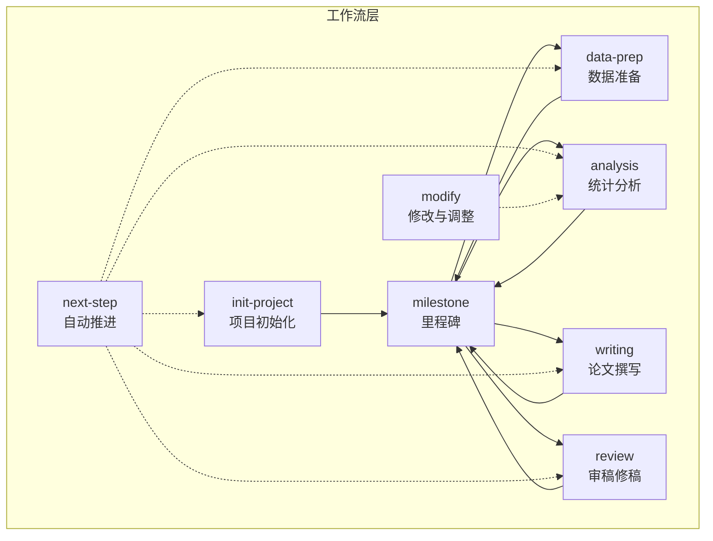

图示来源
- [init-project.md:1-124](file://pipeline/workflows/init-project.md#L1-L124)
- [data-prep.md:1-184](file://pipeline/workflows/data-prep.md#L1-L184)
- [analysis.md:1-289](file://pipeline/workflows/analysis.md#L1-L289)
- [writing.md:1-330](file://pipeline/workflows/writing.md#L1-L330)
- [review.md:1-134](file://pipeline/workflows/review.md#L1-L134)
- [milestone.md:1-163](file://pipeline/workflows/milestone.md#L1-L163)
- [next-step.md:1-385](file://pipeline/workflows/next-step.md#L1-L385)
- [modify.md:1-136](file://pipeline/workflows/modify.md#L1-L136)

章节来源
- [init-project.md:1-124](file://pipeline/workflows/init-project.md#L1-L124)
- [data-prep.md:1-184](file://pipeline/workflows/data-prep.md#L1-L184)
- [analysis.md:1-289](file://pipeline/workflows/analysis.md#L1-L289)
- [writing.md:1-330](file://pipeline/workflows/writing.md#L1-L330)
- [review.md:1-134](file://pipeline/workflows/review.md#L1-L134)
- [milestone.md:1-163](file://pipeline/workflows/milestone.md#L1-L163)
- [next-step.md:1-385](file://pipeline/workflows/next-step.md#L1-L385)
- [modify.md:1-136](file://pipeline/workflows/modify.md#L1-L136)

## 核心组件
- 五阶段工作流：init-project、data-prep、analysis、writing、review，分别对应项目启动、数据准备、统计分析、论文撰写与审稿修稿。
- 里程碑（milestone）：每个阶段结束时的质量门控与阶段转换检查点，确保交付物与决策记录齐全。
- 自动推进（next-step）：基于STATE.md/ROADMAP.md/project_config.yml的自动化推进器，支持阶段内波次（Wave）与阶段间推进。
- 修改与调整（modify）：在分析完成后对既有输出进行针对性修改，支持样式、变量、方法与新增方法的变更。
- 质量门控（checkpoints）：贯穿各阶段的checkpoint:verify与checkpoint:milestone，确保用户确认与审计可追溯。

章节来源
- [milestone.md:1-163](file://pipeline/workflows/milestone.md#L1-L163)
- [next-step.md:1-385](file://pipeline/workflows/next-step.md#L1-L385)
- [modify.md:1-136](file://pipeline/workflows/modify.md#L1-L136)
- [checkpoints.md](file://pipeline/references/checkpoints.md)

## 架构总览
Workflows层采用“阶段-波次”两级控制结构：
- 阶段（Phase 0-4）：项目初始化、数据准备、统计分析、论文撰写、审稿修稿
- 波次（Wave）：统计分析阶段内的动态执行单元，按依赖顺序执行，支持用户确认后推进

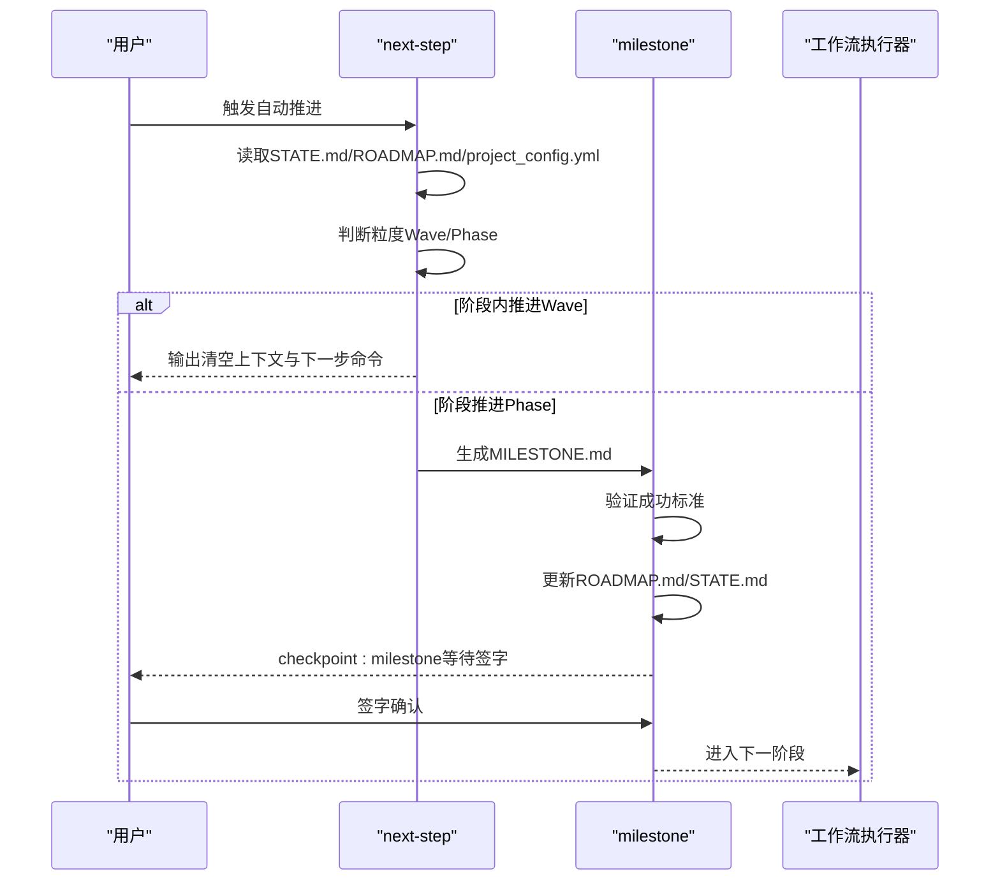

图示来源
- [next-step.md:1-385](file://pipeline/workflows/next-step.md#L1-L385)
- [milestone.md:1-163](file://pipeline/workflows/milestone.md#L1-L163)

章节来源
- [next-step.md:1-385](file://pipeline/workflows/next-step.md#L1-L385)
- [milestone.md:1-163](file://pipeline/workflows/milestone.md#L1-L163)

## 详细组件分析

### 项目初始化（init-project）
职责与流程
- 用户讨论研究框架，自动推断研究类型，生成项目目录结构与配置文件
- 创建.clinpub/计划层与初始阶段目录，记录决策日志
- 通过里程碑（milestone）正式关闭阶段0并进入阶段1

关键步骤与质量门控
- 讨论研究框架与变量角色，必要时自动推断研究类型（尊重用户最终确认）
- 生成project_config.yml与模板文件（PROJECT.md/ROADMAP.md/STATE.md）
- 决策日志记录到00-CONTEXT.md
- checkpoint:verify确认结构与配置，里程碑生成MILESTONE.md并更新ROADMAP/STATE

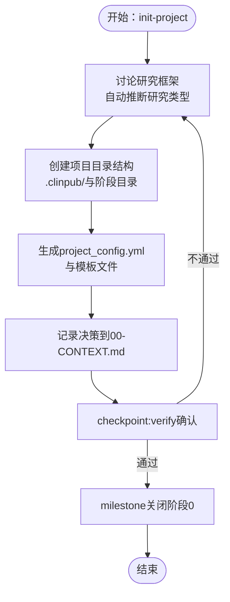

图示来源
- [init-project.md:1-124](file://pipeline/workflows/init-project.md#L1-L124)

章节来源
- [init-project.md:1-124](file://pipeline/workflows/init-project.md#L1-L124)
- [project_config.yml](file://pipeline/templates/project_config.yml)
- [project.md](file://pipeline/templates/project.md)
- [roadmap.md](file://pipeline/templates/roadmap.md)
- [state.md](file://pipeline/templates/state.md)

### 数据准备（data-prep）
职责与流程
- 加载原始数据，与用户讨论清洗策略，执行数据清理与质量报告生成
- 支持项目已初始化时的全链路刷新：重新运行profile、生成spec、同步配置
- 识别数据结构特征（纵向/横断面、结局类型、结构性缺失等）

关键步骤与质量门控
- reinit_data_prep：刷新profile/spec/config，输出变更摘要
- 讨论缺失值、异常值、编码与派生变量策略
- detect_data_structure：识别纵向数据与结局类型，记录结构特征
- execute_cleaning：执行清洗、生成cleaned.csv与HTML质量报告
- validate_output：维度、类型、缺失处理、可重现性校验
- checkpoint:verify确认，milestone关闭阶段1并进入阶段2

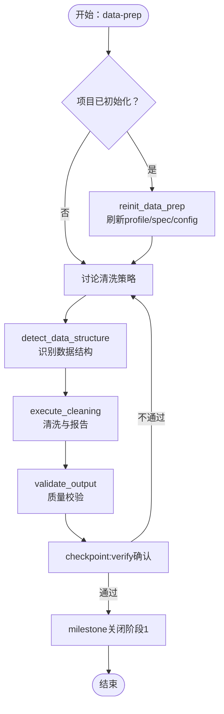

图示来源
- [data-prep.md:1-184](file://pipeline/workflows/data-prep.md#L1-L184)
- [data_profiler.py](file://scripts/data_profiler.py)

章节来源
- [data-prep.md:1-184](file://pipeline/workflows/data-prep.md#L1-L184)
- [data_profiler.py](file://scripts/data_profiler.py)

### 统计分析（analysis）
职责与流程
- 基于清洗后的数据进行结构诊断，动态构建分析计划，按依赖顺序执行各波次
- 每个方法生成figure/table/方法说明，满足出版级标准
- 支持写作与审稿阶段追加分析（新增波次）

关键步骤与质量门控
- diagnose_data_structure：记录患者数、分组、时间点、结局类型、协变量、缺失模式、纵向标志等
- propose_analysis_plan：基于决策树推荐方法，组织依赖波次
- discuss_and_confirm：用户确认方法列表、参数、图表偏好、多重比较校正等
- execute_waves：按波次顺序执行，每波结束后用户确认
- verify_outputs：检查图形分辨率、标签、统计量、代码可重现性、MANIFEST.yaml
- user_satisfaction_check：在milestone前确认满意度，不满足则引导/correct

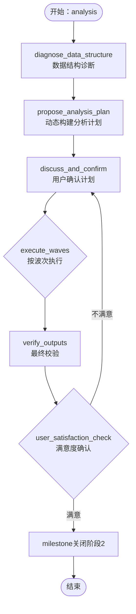

图示来源
- [analysis.md:1-289](file://pipeline/workflows/analysis.md#L1-L289)
- [analysis_methods.md](file://pipeline/references/analysis_methods.md)
- [r_patterns.md](file://pipeline/references/r_patterns.md)

章节来源
- [analysis.md:1-289](file://pipeline/workflows/analysis.md#L1-L289)
- [analysis_methods.md](file://pipeline/references/analysis_methods.md)
- [r_patterns.md](file://pipeline/references/r_patterns.md)

### 论文撰写（writing）
职责与流程
- 以IMRAD顺序（引言→方法→结果→讨论）逐段撰写，每段经文献预搜索→草稿→用户审阅暂停
- 使用共享引用库进行去重，支持占位符交叉引用，最终拼接为manuscript.md

关键步骤与质量门控
- discuss_citation_strategy：确认各段引用数量、时间范围、IF偏好
- discuss_writing_plan：核心论点、目标期刊、图表集成
- reference_pre_search：构建citation_map与references.bib，MANIFEST.yaml声明消费者
- sequential_section_writing：四段循环，writer-agent按段落上下文生成草稿
- humanizer_review：每段写入前执行AI模板模式检查
- verify_manuscript：IMRAD结构、引用DOI、图表引用、语言一致性、Manifest完整性
- concatenate_manuscript：按拼接协议替换占位符、统一编号、生成frontmatter
- checkpoint:verify确认，milestone关闭阶段3并进入阶段4

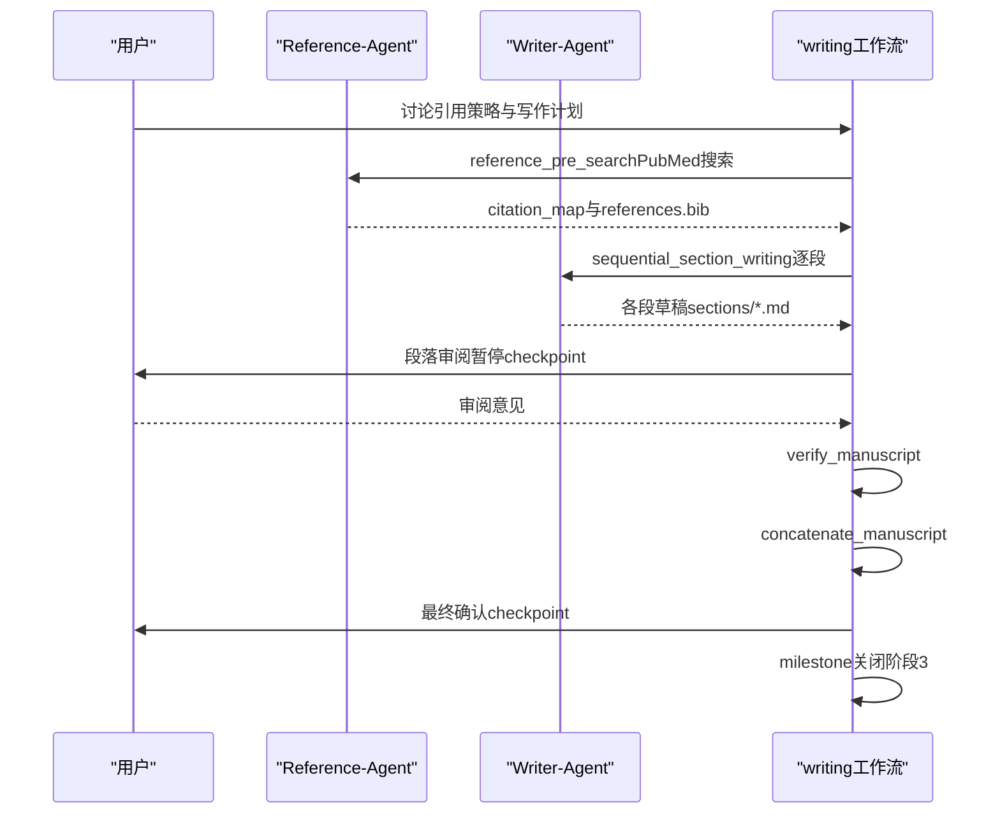

图示来源
- [writing.md:1-330](file://pipeline/workflows/writing.md#L1-L330)
- [reference-agent.md](file://agents/reference-agent.md)
- [writer-agent.md](file://agents/writer-agent.md)
- [concatenation-protocol.md](file://pipeline/references/concatenation-protocol.md)

章节来源
- [writing.md:1-330](file://pipeline/workflows/writing.md#L1-L330)
- [reference-agent.md](file://agents/reference-agent.md)
- [writer-agent.md](file://agents/writer-agent.md)
- [concatenation-protocol.md](file://pipeline/references/concatenation-protocol.md)

### 审稿修稿（review）
职责与流程
- 模拟同行评审，生成评审意见，与用户确认修订项，逐项修订并生成逐点回复信
- 支持重大修改触发补充分析或文献检索，直至用户满意

关键步骤与质量门控
- discuss_review_scope：评审严格程度、关注领域、补充搜索
- generate_review：生成major/minor评论，含位置、问题、建议与严重性
- confirm_revision_items：用户确认需处理的修订项
- revise_manuscript：系统性修订，跟踪变更，必要时补充分析或文献
- generate_response_letter：逐点回复，注明修改位置
- verify_and_loop：验证修订完成度，循环直至满意，milestone关闭阶段4

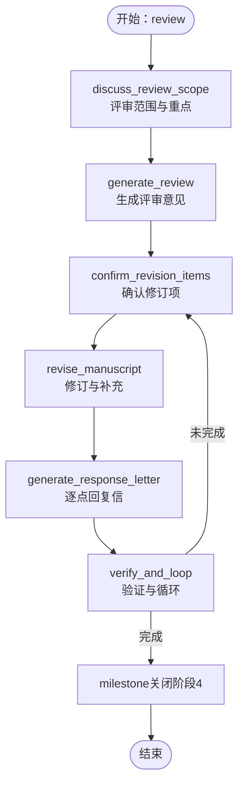

图示来源
- [review.md:1-134](file://pipeline/workflows/review.md#L1-L134)

章节来源
- [review.md:1-134](file://pipeline/workflows/review.md#L1-L134)

### 里程碑（milestone）
职责与流程
- 形式的阶段门控审查，验证成功标准、收集决策与输出、生成MILESTONE.md、更新ROADMAP/STATE、获取用户签字
- 通过checkpoint:milestone向用户展示阶段成果与下一步

关键步骤与质量门控
- load_phase_context：加载当前阶段与项目上下文
- verify_success_criteria：按阶段核对成功标准清单
- collect_decisions：汇总阶段决策与日志
- generate_milestone：生成里程碑文档模板
- update_roadmap：更新路线图状态
- user_signoff：输出里程碑签字请求，签字后进入下一阶段

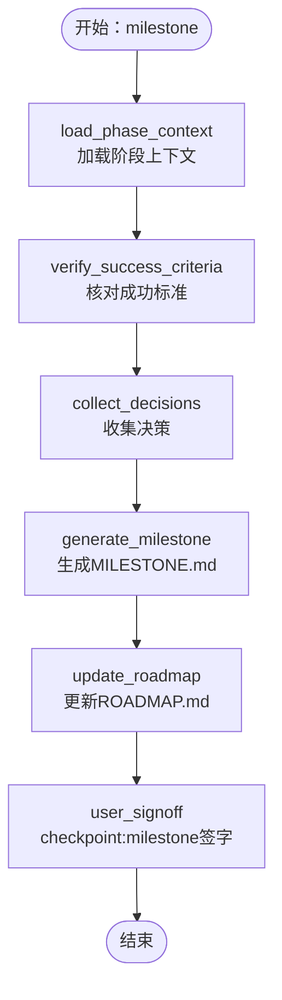

图示来源
- [milestone.md:1-163](file://pipeline/workflows/milestone.md#L1-L163)
- [milestone_template.md](file://pipeline/templates/milestone.md)

章节来源
- [milestone.md:1-163](file://pipeline/workflows/milestone.md#L1-L163)
- [milestone_template.md](file://pipeline/templates/milestone.md)

### 自动推进（next-step）
职责与流程
- 自动判断当前阶段内是否还有未完成波次，或是否应推进到下一阶段
- 推进前验证当前步骤完成状态，推进后更新STATE/ROADMAP并生成MILESTONE.md
- 输出标准化的“清空上下文+下一步命令+进度总结”提示

关键逻辑
- 读取STATE.md定位当前阶段，读取ROADMAP.md统计计划完成度，读取project_config.yml获取分析波次结构
- 根据不同阶段的完成状态决定推进粒度（Wave/Phase）
- 推进到新阶段时强制生成MILESTONE.md，避免边界钩子阻塞

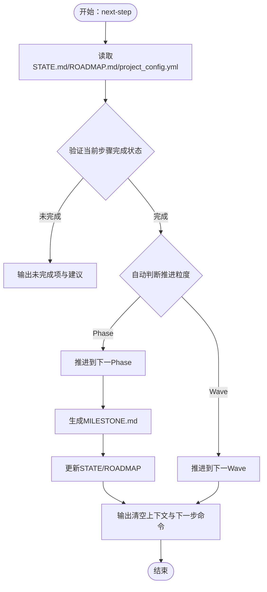

图示来源
- [next-step.md:1-385](file://pipeline/workflows/next-step.md#L1-L385)
- [clinpub-phase-boundary.sh](file://hooks/clinpub-phase-boundary.sh)

章节来源
- [next-step.md:1-385](file://pipeline/workflows/next-step.md#L1-L385)
- [clinpub-phase-boundary.sh](file://hooks/clinpub-phase-boundary.sh)

### 修改与调整（modify）
职责与流程
- 在分析完成后对既有输出进行针对性修改，支持样式、变量、方法与新增方法的变更
- 通过modify-agent执行define→execute→verify→record的结构化流程

关键步骤与质量门控
- validate_prerequisites：确保分析计划、清洗数据与输出存在
- define_modifications：构建方法清单，用户确认修改范围
- execute_modifications：按风险顺序执行（样式→变量→方法→新增），失败不自动安装包
- verify_outputs：校验图形分辨率、标签、表格更新与README更新
- update_plan_history：记录修改历史，更新STATE.md最后活动时间

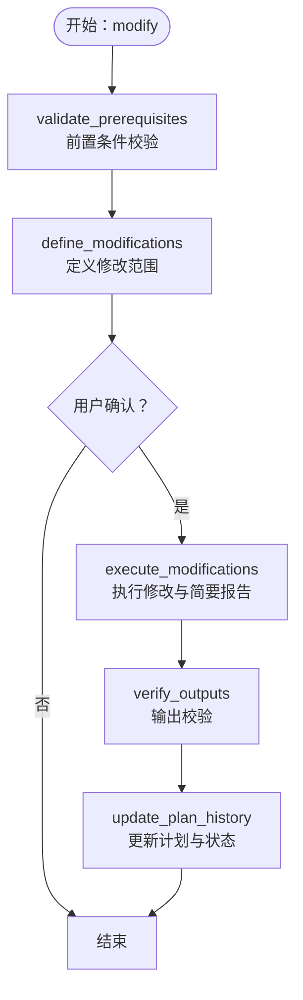

图示来源
- [modify.md:1-136](file://pipeline/workflows/modify.md#L1-L136)
- [modify-agent.md](file://agents/modify-agent.md)

章节来源
- [modify.md:1-136](file://pipeline/workflows/modify.md#L1-L136)
- [modify-agent.md](file://agents/modify-agent.md)

## 依赖关系分析
- 工作流间依赖
  - init-project → milestone → data-prep → milestone → analysis → milestone → writing → milestone → review
  - next-step贯穿所有阶段，负责阶段内波次与阶段间推进
  - milestone为每个阶段的强制门控，确保交付物与决策可审计
- 数据与配置依赖
  - project_config.yml承载变量、路径、方法、语言、质量等配置
  - .clinpub/计划层（ROADMAP/STATE/PROJECT）驱动自动化推进与状态追踪
  - spec.md模板在data-prep阶段动态填充，用于分析规范
- 代理与参考依赖
  - Analyst-Agent参与分析阶段的诊断与方法建议
  - Reference-Agent与Writer-Agent分别负责文献预搜索与草稿撰写
  - Modify-Agent支持分析完成后的输出调整

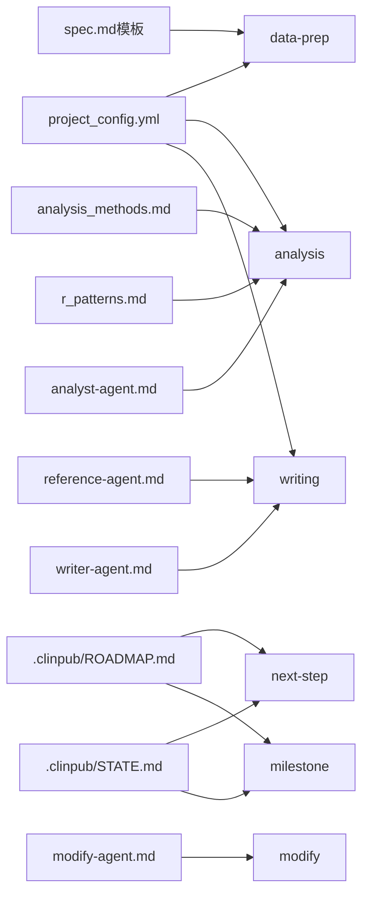

图示来源
- [project_config.yml](file://pipeline/templates/project_config.yml)
- [roadmap.md](file://pipeline/templates/roadmap.md)
- [state.md](file://pipeline/templates/state.md)
- [next-step.md:1-385](file://pipeline/workflows/next-step.md#L1-L385)
- [milestone.md:1-163](file://pipeline/workflows/milestone.md#L1-L163)
- [data-prep.md:1-184](file://pipeline/workflows/data-prep.md#L1-L184)
- [analysis.md:1-289](file://pipeline/workflows/analysis.md#L1-L289)
- [writing.md:1-330](file://pipeline/workflows/writing.md#L1-L330)
- [analysis_methods.md](file://pipeline/references/analysis_methods.md)
- [r_patterns.md](file://pipeline/references/r_patterns.md)
- [reference-agent.md](file://agents/reference-agent.md)
- [writer-agent.md](file://agents/writer-agent.md)
- [analyst-agent.md](file://agents/analyst-agent.md)
- [modify-agent.md](file://agents/modify-agent.md)

章节来源
- [project_config.yml](file://pipeline/templates/project_config.yml)
- [roadmap.md](file://pipeline/templates/roadmap.md)
- [state.md](file://pipeline/templates/state.md)
- [next-step.md:1-385](file://pipeline/workflows/next-step.md#L1-L385)
- [milestone.md:1-163](file://pipeline/workflows/milestone.md#L1-L163)
- [data-prep.md:1-184](file://pipeline/workflows/data-prep.md#L1-L184)
- [analysis.md:1-289](file://pipeline/workflows/analysis.md#L1-L289)
- [writing.md:1-330](file://pipeline/workflows/writing.md#L1-L330)
- [modify.md:1-136](file://pipeline/workflows/modify.md#L1-L136)

## 性能考虑
- 数据准备阶段的profile与spec生成：通过脚本与模板渲染减少重复劳动，建议在大规模数据集上缓存中间产物
- 统计分析阶段的波次执行：按依赖顺序串行执行，避免不必要的并行开销；对于独立波次可考虑异步执行与资源池管理
- 论文撰写阶段的引用去重与拼接：共享引用库与占位符替换应避免全量扫描，建议建立索引与增量更新
- 里程碑与自动推进：读取STATE/ROADMAP/project_config的频率应最小化，建议引入缓存与变更监听

## 故障排除指南
常见问题与处理
- 项目未初始化或STATE/ROADMAP不一致
  - 现象：next-step无法识别当前阶段或推进逻辑异常
  - 处理：执行/init-project初始化，确保STATE.md包含阶段标识，ROADMAP.md计划勾选与实际执行一致
- 分析阶段无波次结构或SUMMARY.md缺失
  - 现象：Phase 2推进卡在Wave未完成
  - 处理：确认project_config.yml中analysis_plan.waves定义，确保每个Wave结束后生成SUMMARY.md
- 里程碑未生成导致边界钩子阻塞
  - 现象：进入下一阶段被clinpub-phase-boundary.sh拦截
  - 处理：先执行milestone生成MILESTONE.md，再进行阶段推进
- 写作阶段引用缺失或占位符未替换
  - 现象：manuscript.md存在残留占位符或引用无DOI
  - 处理：检查Reference/与拼接协议，确保引用库去重与占位符替换完成
- 修改后输出未达标
  - 现象：图形分辨率不足或统计报告不完整
  - 处理：verify_outputs阶段逐项检查，必要时回滚修改并重新执行

章节来源
- [next-step.md:1-385](file://pipeline/workflows/next-step.md#L1-L385)
- [milestone.md:1-163](file://pipeline/workflows/milestone.md#L1-L163)
- [writing.md:1-330](file://pipeline/workflows/writing.md#L1-L330)
- [modify.md:1-136](file://pipeline/workflows/modify.md#L1-L136)
- [clinpub-phase-boundary.sh](file://hooks/clinpub-phase-boundary.sh)

## 结论
Workflows层通过“阶段-波次”的两级控制与严格的里程碑门控，实现了从项目初始化到审稿修稿的全流程自动化与可审计化。next-step提供智能推进，milestone确保质量与合规，modify支持后期精细化调整。该设计既保证了科学性与可重复性，又兼顾了灵活性与可扩展性，便于在不同研究场景中快速落地与迭代。

## 附录
- 参考文件与模板
  - 项目配置模板：project_config.yml
  - 计划与状态模板：project.md、roadmap.md、state.md
  - 里程碑模板：milestone.md
  - 分析方法参考：analysis_methods.md、r_patterns.md
  - 拼接协议：concatenation-protocol.md
  - 质量门控：checkpoints.md
  - 代理与脚本：analyst-agent.md、reference-agent.md、writer-agent.md、modify-agent.md、data_profiler.py