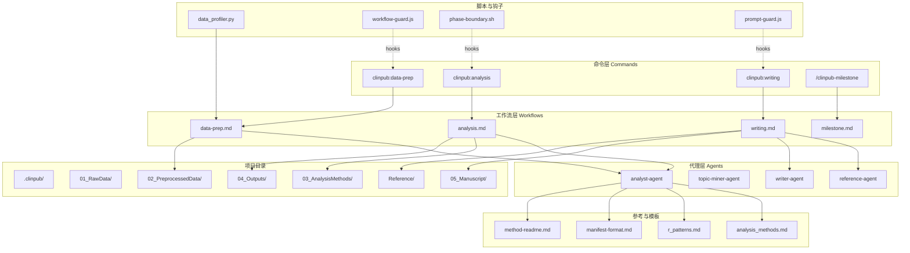
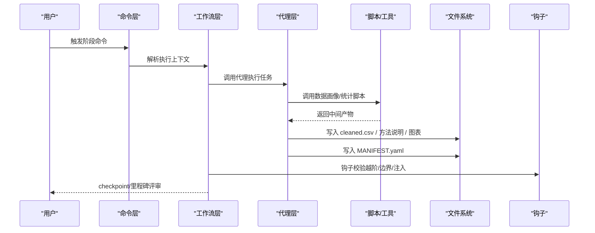
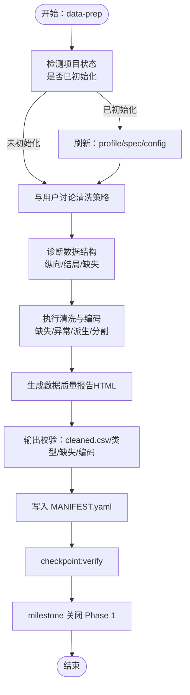
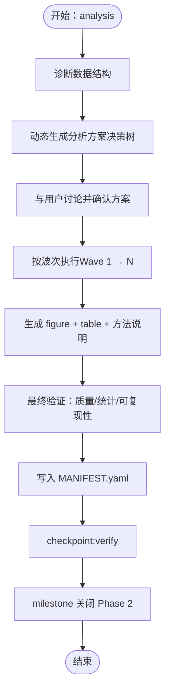
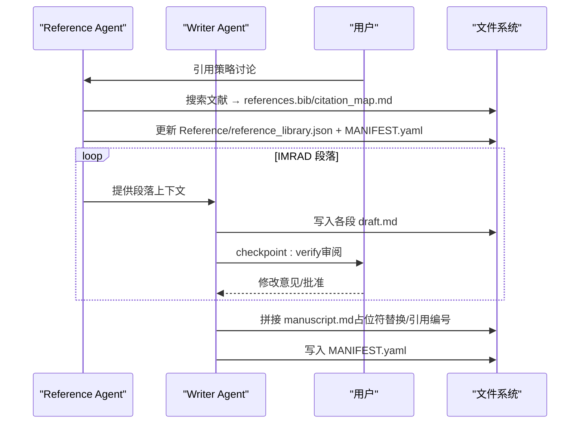
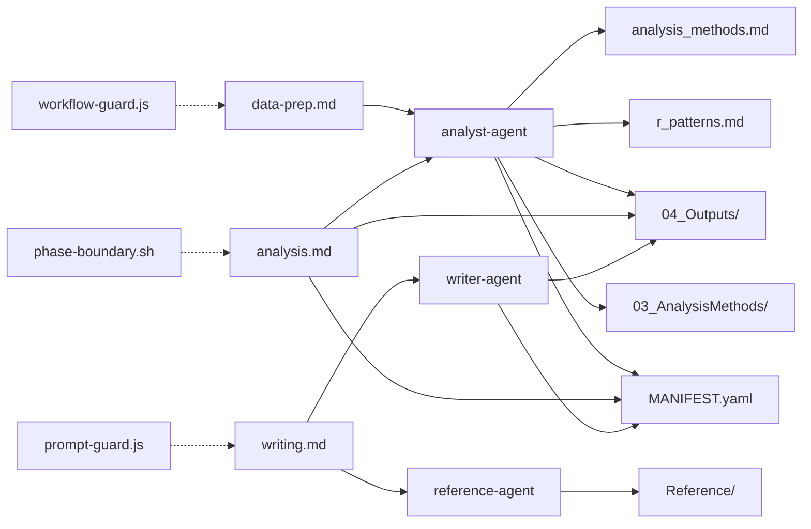
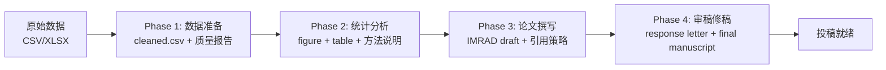

# 数据流设计

<cite>
**本文引用的文件**
- [README.md](file://README.md)
- [ARCHITECTURE.md](file://docs/ARCHITECTURE.md)
- [CONFIGURATION.md](file://docs/CONFIGURATION.md)
- [data-prep.md](file://pipeline/workflows/data-prep.md)
- [analysis.md](file://pipeline/workflows/analysis.md)
- [writing.md](file://pipeline/workflows/writing.md)
- [milestone.md](file://pipeline/workflows/milestone.md)
- [analyst-agent.md](file://agents/analyst-agent.md)
- [topic-miner-agent.md](file://agents/topic-miner-agent.md)
- [analysis_methods.md](file://pipeline/references/analysis_methods.md)
- [r_patterns.md](file://pipeline/references/r_patterns.md)
- [manifest-format.md](file://pipeline/references/manifest-format.md)
- [data_profiler.py](file://scripts/data_profiler.py)
- [config.json](file://.clinpub/config.json)
- [STATE.md](file://.clinpub/STATE.md)
- [ROADMAP.md](file://.clinpub/ROADMAP.md)
- [data-prep 命令](file://commands/clinpub/data-prep.md)
- [analysis 命令](file://commands/clinpub/analysis.md)
</cite>

## 目录
1. [引言](#引言)
2. [项目结构](#项目结构)
3. [核心组件](#核心组件)
4. [架构总览](#架构总览)
5. [详细组件分析](#详细组件分析)
6. [依赖关系分析](#依赖关系分析)
7. [性能考量](#性能考量)
8. [故障排查指南](#故障排查指南)
9. [结论](#结论)
10. [附录](#附录)

## 引言
本文件面向开发者与管线使用者，系统化梳理 clinpub 从“原始数据”到“最终发表”的完整数据流设计。文档覆盖数据输入输出格式、转换规则、质量控制点、阶段间传递机制、存储策略与版本管理、安全与备份恢复策略、性能优化建议，并提供数据字典与转换规则说明，帮助读者高效理解与优化数据流系统。

## 项目结构
clinpub 采用三层架构：命令层（Commands）→ 工作流层（Workflows）→ 代理层（Agents）。项目目录按阶段划分，形成清晰的数据与产物边界，配合 MANIFEST.yaml 实现文件系统级的契约式传递。

**图表来源**
- [ARCHITECTURE.md:1-160](file://docs/ARCHITECTURE.md#L1-L160)
- [data-prep.md:1-184](file://pipeline/workflows/data-prep.md#L1-L184)
- [analysis.md:1-289](file://pipeline/workflows/analysis.md#L1-L289)
- [writing.md:1-330](file://pipeline/workflows/writing.md#L1-L330)
- [analyst-agent.md:1-141](file://agents/analyst-agent.md#L1-L141)
- [topic-miner-agent.md:1-320](file://agents/topic-miner-agent.md#L1-L320)
- [analysis_methods.md:1-311](file://pipeline/references/analysis_methods.md#L1-L311)
- [r_patterns.md:1-532](file://pipeline/references/r_patterns.md#L1-L532)
- [manifest-format.md:1-187](file://pipeline/references/manifest-format.md#L1-L187)
- [data_profiler.py:1-353](file://scripts/data_profiler.py#L1-L353)

**章节来源**
- [README.md:82-94](file://README.md#L82-L94)
- [ARCHITECTURE.md:1-160](file://docs/ARCHITECTURE.md#L1-L160)

## 核心组件
- 命令层（Commands）：提供用户入口，封装阶段调用与前置校验，例如 data-prep 命令具备“重新进入检测”逻辑，自动刷新配置与模板。
- 工作流层（Workflows）：定义阶段编排与质量门控，包括数据准备、统计分析、论文撰写、里程碑评审等。
- 代理层（Agents）：执行具体任务，如分析师代理负责清洗与分析，主题挖掘代理负责选题生成。
- 参考与模板：分析方法库、R 可视化标准、MANIFEST 契约格式等，保障输出一致性与可验证性。
- 脚本与钩子：数据画像脚本、Claude Code hooks 保护工作流。

**章节来源**
- [data-prep 命令:25-40](file://commands/clinpub/data-prep.md#L25-L40)
- [data-prep.md:1-184](file://pipeline/workflows/data-prep.md#L1-L184)
- [analysis.md:1-289](file://pipeline/workflows/analysis.md#L1-L289)
- [writing.md:1-330](file://pipeline/workflows/writing.md#L1-L330)
- [analyst-agent.md:1-141](file://agents/analyst-agent.md#L1-L141)
- [topic-miner-agent.md:1-320](file://agents/topic-miner-agent.md#L1-L320)
- [analysis_methods.md:1-311](file://pipeline/references/analysis_methods.md#L1-L311)
- [r_patterns.md:1-532](file://pipeline/references/r_patterns.md#L1-L532)
- [manifest-format.md:1-187](file://pipeline/references/manifest-format.md#L1-L187)

## 架构总览
数据流自上而下遵循“命令 → 工作流 → 代理 → 脚本/工具 → 钩子”的执行链路，阶段间通过里程碑评审与 MANIFEST 契约实现质量门控与可追溯性。

**图表来源**
- [ARCHITECTURE.md:45-87](file://docs/ARCHITECTURE.md#L45-L87)
- [milestone.md:1-163](file://pipeline/workflows/milestone.md#L1-L163)
- [manifest-format.md:149-187](file://pipeline/references/manifest-format.md#L149-L187)

## 详细组件分析

### 数据准备阶段（Phase 1：data-prep）
- 输入：原始数据（CSV/XLSX），项目配置（project_config.yml），可选已初始化项目状态。
- 处理流程：
  - 重新进入检测：若检测到有效配置，自动刷新 profile、spec、config，并提示下一步清理策略讨论。
  - 数据结构诊断：识别纵向/横断面、结局类型、结构性缺失等。
  - 清洗与编码：缺失值分级处理、异常值检测、派生变量与因子编码、训练/验证集划分。
  - 质量报告：HTML 报告包含变量摘要、缺失矩阵、分布图、异常值与分割摘要。
  - 输出：cleaned.csv、数据质量报告、MANIFEST.yaml。
- 质量门控：cleaned.csv 存在、缺失处理策略达成共识、数据类型正确、清洗代码可复现。
- 关键契约：MANIFEST.yaml 声明 outputs 与消费者（分析师代理）。

**图表来源**
- [data-prep.md:19-171](file://pipeline/workflows/data-prep.md#L19-L171)
- [data-prep 命令:25-40](file://commands/clinpub/data-prep.md#L25-L40)
- [analyst-agent.md:17-43](file://agents/analyst-agent.md#L17-L43)
- [manifest-format.md:51-71](file://pipeline/references/manifest-format.md#L51-L71)

**章节来源**
- [data-prep.md:1-184](file://pipeline/workflows/data-prep.md#L1-L184)
- [data-prep 命令:1-50](file://commands/clinpub/data-prep.md#L1-L50)
- [analyst-agent.md:17-43](file://agents/analyst-agent.md#L17-L43)
- [manifest-format.md:51-71](file://pipeline/references/manifest-format.md#L51-L71)

### 统计分析阶段（Phase 2：analysis）
- 输入：cleaned.csv、full_longitudinal.csv（如有）、用户确认的分析计划（01-PLAN.md）。
- 处理流程：
  - 数据诊断：识别样本量、分组、时间点、结局类型、协变量、缺失模式、纵向标志等。
  - 动态提案：基于决策树生成方案，按依赖顺序组织为“波次（wave）”，数量不固定。
  - 用户确认：方法列表、参数、颜色方案、分割比例、多重比较校正、显著性水平等。
  - 执行波次：按波次顺序执行，每方法生成 figure + table + 方法说明，应用统一主题与分辨率标准。
  - 最终验证：检查所有输出、图表质量、统计报告完整性、代码可复现性、MANIFEST.yaml。
- 质量门控：每方法 figure≥300 DPI、英文标签、效应量+95%CI+精确 p 值、R 版本与关键包版本记录。
- 关键契约：MANIFEST.yaml 声明 outputs 与消费者（写作者代理）。

**图表来源**
- [analysis.md:19-269](file://pipeline/workflows/analysis.md#L19-L269)
- [analysis_methods.md:18-104](file://pipeline/references/analysis_methods.md#L18-L104)
- [r_patterns.md:66-133](file://pipeline/references/r_patterns.md#L66-L133)
- [analyst-agent.md:45-75](file://agents/analyst-agent.md#L45-L75)
- [manifest-format.md:72-101](file://pipeline/references/manifest-format.md#L72-L101)

**章节来源**
- [analysis.md:1-289](file://pipeline/workflows/analysis.md#L1-L289)
- [analysis_methods.md:1-311](file://pipeline/references/analysis_methods.md#L1-L311)
- [r_patterns.md:1-532](file://pipeline/references/r_patterns.md#L1-L532)
- [analyst-agent.md:45-75](file://agents/analyst-agent.md#L45-L75)
- [manifest-format.md:72-101](file://pipeline/references/manifest-format.md#L72-L101)

### 论文撰写阶段（Phase 3：writing）
- 输入：各分析方法的 figure + table + 方法说明、参考库（Reference/）、项目配置。
- 处理流程：
  - 引用策略讨论：段落引用数量、时间范围、IF 偏好。
  - 顺序撰写：Introduction → Methods → Results → Discussion，逐段执行“参考预搜索 → 写者代理撰写 → 用户审阅”循环。
  - 共享参考库：JSON 去重、分配 ID、更新 MANIFEST.yaml。
  - 终稿拼接：按 IMRAD 顺序合并段落，替换占位符（Table/Figure/Method/Section），统一引用编号，生成 YAML frontmatter。
  - 最终验证：IMRAD 结构完整、引用去重、语言审查、MANIFEST.yaml。
- 质量门控：引用均有 DOI、图表/表格引用齐全、STROBE/CONSORT 覆盖、语言一致性、无残留占位符。

**图表来源**
- [writing.md:25-304](file://pipeline/workflows/writing.md#L25-L304)
- [analyst-agent.md:1-141](file://agents/analyst-agent.md#L1-L141)

**章节来源**
- [writing.md:1-330](file://pipeline/workflows/writing.md#L1-L330)
- [analyst-agent.md:1-141](file://agents/analyst-agent.md#L1-L141)

### 里程碑评审（milestone）
- 目的：正式阶段门控，确保成功标准达成、决策记录、用户签批。
- 流程：加载阶段上下文 → 验证成功标准 → 收集决策 → 生成 MILESTONE.md → 更新 ROADMAP/STATE → 用户签批。
- 成功标准：各阶段核查清单（如 cleaned.csv、IMRAD 结构、引用 DOIs 等）。

**章节来源**
- [milestone.md:1-163](file://pipeline/workflows/milestone.md#L1-L163)
- [STATE.md:1-63](file://.clinpub/STATE.md#L1-L63)
- [ROADMAP.md:1-123](file://.clinpub/ROADMAP.md#L1-L123)

### 数据字典与转换规则

- 输入数据
  - 原始数据：CSV/XLSX，每行一位患者，每列一个变量。
  - 项目配置：project_config.yml，包含研究类型、变量映射、路径、分析阈值、图表配置等。
  - 参考库：Reference/，包含 references.bib、citation_map.md、reference_library.json。

- 中间产物
  - cleaned.csv：Phase 1 输出，分析就绪数据。
  - 方法说明：03_AnalysisMethods/XX_MethodName/README.md，包含目的、方法、输入变量、输出文件、解释说明。
  - 图表与表格：04_Outputs/XX_MethodName/ 下的 figure 与 table。
  - 终稿：05_Manuscript/manuscript.md，分段 draft.md。

- 转换规则
  - 数据准备：缺失值分级处理（<5%/5-20%/>20%）、异常值 IQR/Z-score、派生变量与因子编码、训练/验证集划分。
  - 统计分析：按数据特征与用户确认动态生成方案，应用统一主题与分辨率标准，报告效应量+95%CI+精确 p 值。
  - 论文撰写：占位符替换、引用统一编号、YAML frontmatter、语言审查（Humanizer）。

- 质量控制点
  - Phase 1：cleaned.csv、数据质量报告、缺失处理策略、异常值文档、派生变量与编码、清洗代码可复现。
  - Phase 2：figure≥300 DPI、英文标签、效应量+95%CI+精确 p 值、R版本与关键包版本、MANIFEST.yaml。
  - Phase 3：IMRAD 结构、引用 DOIs、图表/表格引用齐全、STROBE/CONSORT 覆盖、无残留占位符。

**章节来源**
- [data-prep.md:100-145](file://pipeline/workflows/data-prep.md#L100-L145)
- [analysis.md:224-235](file://pipeline/workflows/analysis.md#L224-L235)
- [writing.md:180-260](file://pipeline/workflows/writing.md#L180-L260)
- [r_patterns.md:66-133](file://pipeline/references/r_patterns.md#L66-L133)
- [manifest-format.md:1-187](file://pipeline/references/manifest-format.md#L1-L187)

## 依赖关系分析
- 组件耦合
  - 工作流与代理：工作流定义阶段职责，代理执行具体任务；代理依赖参考库与模板。
  - 代理与脚本：分析师代理调用数据画像脚本生成 profile/spec/config；写者代理依赖参考库与分析输出。
  - 钩子与命令：钩子在写/读/执行阶段拦截，防止越阶写文件、检查前置里程碑、扫描 prompt 注入。
- 依赖链
  - data-prep → cleaned.csv → analysis → figures/tables/README → writing → manuscript.md。
  - 每个阶段通过 MANIFEST.yaml 声明输出与消费者，形成“生产者-消费者”契约。
- 循环依赖
  - 通过阶段性里程碑与占位符替换避免循环引用；审稿阶段新增分析以新波次形式追加。

**图表来源**
- [data-prep.md:1-184](file://pipeline/workflows/data-prep.md#L1-L184)
- [analysis.md:1-289](file://pipeline/workflows/analysis.md#L1-L289)
- [writing.md:1-330](file://pipeline/workflows/writing.md#L1-L330)
- [analyst-agent.md:1-141](file://agents/analyst-agent.md#L1-L141)
- [analysis_methods.md:1-311](file://pipeline/references/analysis_methods.md#L1-L311)
- [r_patterns.md:1-532](file://pipeline/references/r_patterns.md#L1-L532)
- [manifest-format.md:1-187](file://pipeline/references/manifest-format.md#L1-L187)

**章节来源**
- [data-prep.md:1-184](file://pipeline/workflows/data-prep.md#L1-L184)
- [analysis.md:1-289](file://pipeline/workflows/analysis.md#L1-L289)
- [writing.md:1-330](file://pipeline/workflows/writing.md#L1-L330)
- [manifest-format.md:1-187](file://pipeline/references/manifest-format.md#L1-L187)

## 性能考量
- 数据准备
  - 大文件读取：使用 pandas/numpy，注意内存占用；缺失率高时优先 MICE/imputation，减少人工干预。
  - 并行文献扫描：主题挖掘代理支持并行子代理，提高 PubMed 搜索效率。
- 统计分析
  - 代码生成：统一模板与主题，减少重复逻辑；按波次执行，降低一次性资源压力。
  - 可复现性：严格从 cleaned.csv 读取，避免中间文件依赖导致的缓存污染。
- 论文撰写
  - 占位符替换：批量扫描与替换，避免 O(n^2) 搜索；引用统一编号按出现顺序重排。
  - 人类化审查：内嵌 Humanizer 检查，减少后期返工。
- 钩子与校验
  - 越阶写拦截：在写阶段即时阻止，避免无效计算与磁盘浪费。
  - 前置里程碑检查：确保阶段顺序正确，减少无效重跑。

[本节为通用性能建议，不直接分析具体文件]

## 故障排查指南
- 常见问题
  - cleaned.csv 不存在或格式错误：检查缺失处理策略与数据类型，重新执行 data-prep。
  - 图表分辨率不足：确认应用统一主题与分辨率标准，重新生成。
  - 引用无 DOI：检查 reference-agent 输出，补充缺失条目。
  - 占位符未替换：核对拼接协议，确保引用库与段落文件完整。
- 诊断步骤
  - 校验 MANIFEST.yaml：确认 outputs 与消费者声明完整。
  - 里程碑核查：对照成功标准逐项检查。
  - 日志与决策：查看 .clinpub/phases/NN-*/ 下的上下文与决策记录。
- 修复建议
  - 重新生成：清理错误输出后重新执行对应阶段。
  - 参数调整：根据 Humanizer 检查与用户反馈微调参数与颜色方案。

**章节来源**
- [milestone.md:42-81](file://pipeline/workflows/milestone.md#L42-L81)
- [manifest-format.md:149-187](file://pipeline/references/manifest-format.md#L149-L187)
- [writing.md:180-260](file://pipeline/workflows/writing.md#L180-L260)

## 结论
clinpub 的数据流设计以“阶段化 + 契约式传递 + 质量门控”为核心，通过命令层、工作流层与代理层的协同，实现了从原始数据到发表级论文的自动化与可审计化。借助 MANIFEST.yaml 与钩子机制，系统在文件系统之上建立了轻量契约与安全边界；通过统一的 R 可视化标准与分析模板，确保输出的一致性与可复现性。开发者可据此优化性能、扩展方法与代理，并持续改进数据流的稳定性与用户体验。

[本节为总结性内容，不直接分析具体文件]

## 附录

### 数据流图（端到端）

**图表来源**
- [README.md:88-104](file://README.md#L88-L104)
- [writing.md:198-260](file://pipeline/workflows/writing.md#L198-L260)

### 配置与环境
- 项目配置：project_config.yml，包含研究类型、变量映射、路径、分析阈值、图表配置。
- 环境变量：NCBI_API_KEY、TAVILY_API_KEY、UNPAYWALL_EMAIL。
- R/Python 包：见配置文档与 requirements.txt。
- Hooks：自动注册在 .claude/settings.json，保护工作流。

**章节来源**
- [CONFIGURATION.md:1-270](file://docs/CONFIGURATION.md#L1-L270)
- [config.json:1-15](file://.clinpub/config.json#L1-L15)