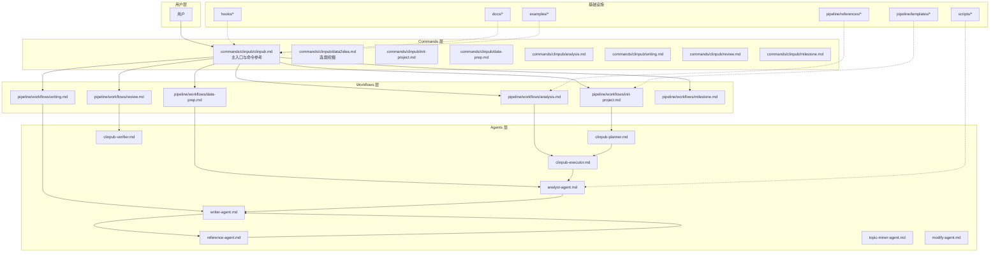
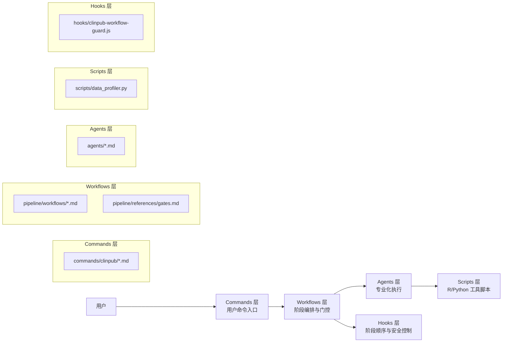
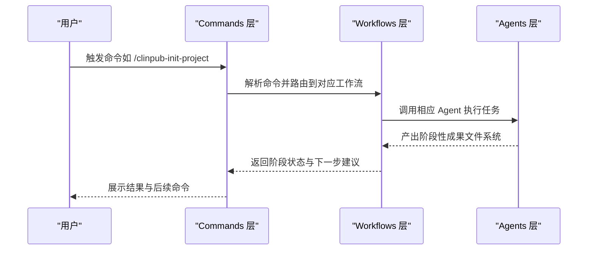
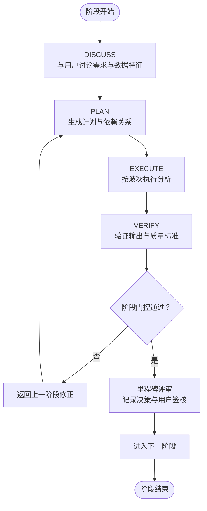
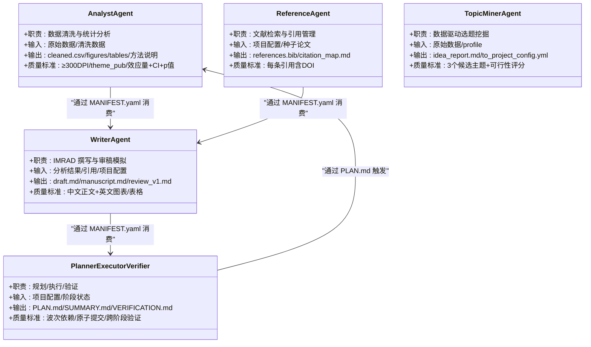
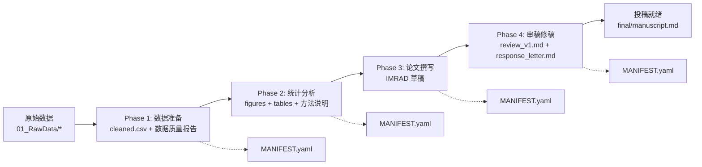
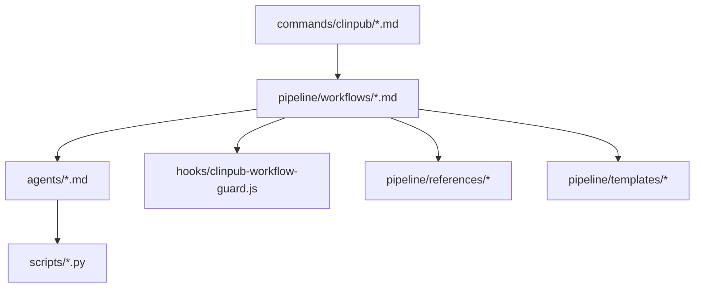

# 整体架构概览

<cite>
**本文档引用的文件**
- [README.md](file://README.md)
- [docs/ARCHITECTURE.md](file://docs/ARCHITECTURE.md)
- [docs/getting-started.md](file://docs/getting-started.md)
- [AGENTS.md](file://AGENTS.md)
- [SKILL.md](file://SKILL.md)
- [commands/clinpub/clinpub.md](file://commands/clinpub/clinpub.md)
- [pipeline/workflows/init-project.md](file://pipeline/workflows/init-project.md)
- [pipeline/workflows/data-prep.md](file://pipeline/workflows/data-prep.md)
- [pipeline/workflows/analysis.md](file://pipeline/workflows/analysis.md)
- [agents/analyst-agent.md](file://agents/analyst-agent.md)
- [hooks/clinpub-workflow-guard.js](file://hooks/clinpub-workflow-guard.js)
- [pipeline/references/gates.md](file://pipeline/references/gates.md)
- [pipeline/references/agent-contracts.md](file://pipeline/references/agent-contracts.md)
- [scripts/data_profiler.py](file://scripts/data_profiler.py)
</cite>

## 目录
1. [简介](#简介)
2. [项目结构](#项目结构)
3. [核心组件](#核心组件)
4. [架构总览](#架构总览)
5. [详细组件分析](#详细组件分析)
6. [依赖关系分析](#依赖关系分析)
7. [性能考量](#性能考量)
8. [故障排查指南](#故障排查指南)
9. [结论](#结论)

## 简介
clinpub 是面向 SCI Q1/Q2 期刊的端到端临床数据分析与发表加速器，采用三层架构设计：Commands（用户接口）、Workflows（流程编排）、Agents（专业化执行）。该架构以“阶段化、可验证、可扩展”为核心原则，通过严格的阶段门控和文件系统驱动的代理协作，确保从原始数据到投稿稿的全流程质量与可追溯性。

## 项目结构
项目采用模块化组织，围绕“三层架构 + 管线配置 + 钩子机制”的布局展开：
- commands/clinpub：用户命令入口，定义触发条件与执行流程
- pipeline/workflows：阶段编排逻辑，定义 DISCUSS→PLAN→EXECUTE→VERIFY 的执行范式
- agents：专业化 AI Agent 角色卡片，定义职责、输入输出与质量标准
- scripts：工具脚本（数据画像、搜索、PDF 处理等）
- hooks：Claude Code 钩子，强制阶段顺序与安全访问控制
- pipeline/references/templates/contexts：参考文档、模板与上下文配置

**图表来源**
- [commands/clinpub/clinpub.md:1-61](file://commands/clinpub/clinpub.md#L1-L61)
- [docs/ARCHITECTURE.md:45-87](file://docs/ARCHITECTURE.md#L45-L87)
- [pipeline/workflows/init-project.md:1-124](file://pipeline/workflows/init-project.md#L1-L124)
- [pipeline/workflows/data-prep.md:1-184](file://pipeline/workflows/data-prep.md#L1-L184)
- [pipeline/workflows/analysis.md:1-289](file://pipeline/workflows/analysis.md#L1-L289)
- [agents/analyst-agent.md:1-141](file://agents/analyst-agent.md#L1-L141)
- [hooks/clinpub-workflow-guard.js:1-134](file://hooks/clinpub-workflow-guard.js#L1-L134)

**章节来源**
- [README.md:20-94](file://README.md#L20-L94)
- [docs/ARCHITECTURE.md:7-43](file://docs/ARCHITECTURE.md#L7-L43)

## 核心组件
- Commands 层（用户接口）：通过 Claude Code 的 Skill 系统暴露命令，每个命令定义触发条件、参数与执行流程，主入口负责路由到具体工作流。
- Workflows 层（流程编排）：定义每个阶段的执行顺序与依赖关系，采用 DISCUSS→PLAN→EXECUTE→VERIFY 的范式，并通过里程碑评审确保阶段质量。
- Agents 层（专业化执行）：每个 Agent 是独立的角色卡片，定义职责、输入输出、工具权限与质量标准，通过文件系统进行无共享内存的协作。

**章节来源**
- [docs/ARCHITECTURE.md:47-83](file://docs/ARCHITECTURE.md#L47-L83)
- [AGENTS.md:9-22](file://AGENTS.md#L9-L22)

## 架构总览
三层架构的设计原则：
- 分层解耦：Commands 负责用户交互，Workflows 负责流程编排，Agents 负责专业执行，降低耦合度与复杂度。
- 阶段化与可验证：每个阶段四步走，阶段间通过里程碑评审与质量门控，确保可追溯与可复现。
- 文件系统驱动：代理间通信通过文件系统，避免共享状态带来的不确定性，提高隔离性与可测试性。
- 可扩展性：新增研究类型与 Agent 通过模板与契约扩展，不影响既有流程。

**图表来源**
- [docs/ARCHITECTURE.md:45-87](file://docs/ARCHITECTURE.md#L45-L87)
- [hooks/clinpub-workflow-guard.js:16-23](file://hooks/clinpub-workflow-guard.js#L16-L23)
- [pipeline/references/gates.md:1-112](file://pipeline/references/gates.md#L1-L112)

## 详细组件分析

### Commands 层（用户接口）
- 主入口：commands/clinpub/clinpub.md 定义命令参考与阶段流程，强调每个阶段必须单独调用，确保严谨性与用户审查。
- 命令类型：包括 init-project、data-prep、analysis、writing、review、milestone、data2idea 等，覆盖从项目初始化到审稿修稿的完整生命周期。
- 设计要点：命令文件定义触发条件、参数与工具权限，通过 Claude Code 的 Skill 系统集成，形成统一的用户交互入口。

**图表来源**
- [commands/clinpub/clinpub.md:20-53](file://commands/clinpub/clinpub.md#L20-L53)
- [docs/ARCHITECTURE.md:47-66](file://docs/ARCHITECTURE.md#L47-L66)

**章节来源**
- [commands/clinpub/clinpub.md:14-61](file://commands/clinpub/clinpub.md#L14-L61)
- [docs/ARCHITECTURE.md:47-66](file://docs/ARCHITECTURE.md#L47-L66)

### Workflows 层（流程编排）
- 阶段定义：init-project、data-prep、analysis、writing、review、milestone，每个阶段包含 DISCUSS→PLAN→EXECUTE→VERIFY 的执行范式。
- 质量门控：4 道门控贯穿阶段转换，确保伦理合规、数据质量、分析有效性与投稿准备。
- 里程碑评审：每个阶段结束通过 milestone 关卡，记录决策、验证成功标准并请求用户签核。

**图表来源**
- [pipeline/workflows/analysis.md:17-289](file://pipeline/workflows/analysis.md#L17-L289)
- [pipeline/workflows/data-prep.md:17-184](file://pipeline/workflows/data-prep.md#L17-L184)
- [pipeline/workflows/init-project.md:18-124](file://pipeline/workflows/init-project.md#L18-L124)
- [pipeline/references/gates.md:90-112](file://pipeline/references/gates.md#L90-L112)

**章节来源**
- [pipeline/workflows/analysis.md:17-289](file://pipeline/workflows/analysis.md#L17-L289)
- [pipeline/workflows/data-prep.md:17-184](file://pipeline/workflows/data-prep.md#L17-L184)
- [pipeline/workflows/init-project.md:18-124](file://pipeline/workflows/init-project.md#L18-L124)
- [pipeline/references/gates.md:1-112](file://pipeline/references/gates.md#L1-L112)

### Agents 层（专业化执行）
- 代理协作：Analyst Agent 负责数据清洗与统计分析；Reference Agent 负责文献检索与引用管理；Writer Agent 负责 IMRAD 撰写；Topic Miner Agent 负责数据驱动的选题挖掘；Planner/Executor/Verifier 提供规划、执行与验证能力。
- 文件系统通信：代理间通过文件系统传递产物，每个代理在完成后写入 MANIFEST.yaml，下游代理在消费前校验清单。
- 质量标准：统一的图表分辨率、字体、主题与方法说明模板，确保出版级质量。

**图表来源**
- [agents/analyst-agent.md:1-141](file://agents/analyst-agent.md#L1-L141)
- [pipeline/references/agent-contracts.md:20-156](file://pipeline/references/agent-contracts.md#L20-L156)

**章节来源**
- [agents/analyst-agent.md:1-141](file://agents/analyst-agent.md#L1-L141)
- [pipeline/references/agent-contracts.md:20-156](file://pipeline/references/agent-contracts.md#L20-L156)

### 数据流与文件系统契约
- 数据流：用户数据 → init-project → data-prep → analysis → writing → review → 投稿就绪。
- 文件系统契约：每个代理在完成后写入 MANIFEST.yaml，下游代理在消费前校验清单；代理间通信仅通过文件系统，避免共享状态。
- 质量门控：阶段转换前自动与人工检查结合，确保文件存在、内容完整与标准达标。

**图表来源**
- [docs/ARCHITECTURE.md:88-104](file://docs/ARCHITECTURE.md#L88-L104)
- [pipeline/references/agent-contracts.md:125-133](file://pipeline/references/agent-contracts.md#L125-L133)

**章节来源**
- [docs/ARCHITECTURE.md:88-104](file://docs/ARCHITECTURE.md#L88-L104)
- [pipeline/references/agent-contracts.md:125-133](file://pipeline/references/agent-contracts.md#L125-L133)

## 依赖关系分析
- Commands 依赖 Workflows：命令解析后路由到具体工作流。
- Workflows 依赖 Agents：工作流调用代理执行任务，遵循阶段顺序与门控。
- Agents 依赖 Scripts：代理执行 R/Python 脚本，如数据画像与统计分析。
- Hooks 依赖 Workflows：通过读取 STATE.md 与目录映射强制阶段顺序。
- References 与 Templates 为 Workflows 与 Agents 提供标准与模板支撑。

**图表来源**
- [docs/ARCHITECTURE.md:45-87](file://docs/ARCHITECTURE.md#L45-L87)
- [hooks/clinpub-workflow-guard.js:25-38](file://hooks/clinpub-workflow-guard.js#L25-L38)

**章节来源**
- [docs/ARCHITECTURE.md:45-87](file://docs/ARCHITECTURE.md#L45-L87)
- [hooks/clinpub-workflow-guard.js:25-38](file://hooks/clinpub-workflow-guard.js#L25-L38)

## 性能考量
- 并行与串行：阶段内按波次串行执行，波次间可并行推进，减少等待时间。
- 依赖计算：分析计划基于数据诊断动态生成，避免不必要的方法执行。
- 资源隔离：代理间通过文件系统通信，避免共享状态导致的锁竞争与死锁。
- 可观测性：每个阶段输出 MANIFEST.yaml，便于快速定位缺失或错误的产物。
- 可扩展性：新增研究类型与 Agent 通过模板与契约扩展，不影响既有流程。

## 故障排查指南
- 阶段顺序违规：hooks/clinpub-workflow-guard.js 会阻止越阶段写文件，检查 .clinpub/STATE.md 的当前阶段与目标目录映射。
- 数据准备失败：确认 cleaned.csv 存在、变量字典完整、缺失率与样本量达标、清洗代码可独立复现。
- 分析有效性问题：确保每个方法都有 figure + table + 方法说明，效应量、95%CI、p 值完整，多重比较校正应用。
- 投稿准备问题：IMRAD 结构完整、图表 ≥300 DPI、英文标签、引用含 DOI、引文映射一致。
- 常见问题：R 包安装失败、PubMed 搜索无结果、图表中文乱码、cleaned.csv 生成失败等，参见 docs/getting-started.md 的常见问题章节。

**章节来源**
- [hooks/clinpub-workflow-guard.js:45-77](file://hooks/clinpub-workflow-guard.js#L45-L77)
- [pipeline/references/gates.md:90-112](file://pipeline/references/gates.md#L90-L112)
- [docs/getting-started.md:225-270](file://docs/getting-started.md#L225-L270)

## 结论
clinpub 的三层架构以 Commands、Workflows、Agents 为核心，通过严格的阶段门控与文件系统契约，实现了从数据到投稿稿的高质量自动化流程。其设计原则强调阶段化、可验证、可扩展与可维护性，适合需要严谨科学流程与高可追溯性的临床研究项目。开发者可通过模板与契约快速扩展新的研究类型与 Agent，同时利用钩子与质量门控保障流程安全与一致性。