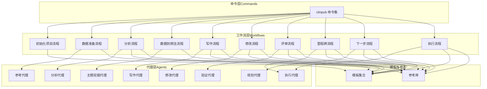
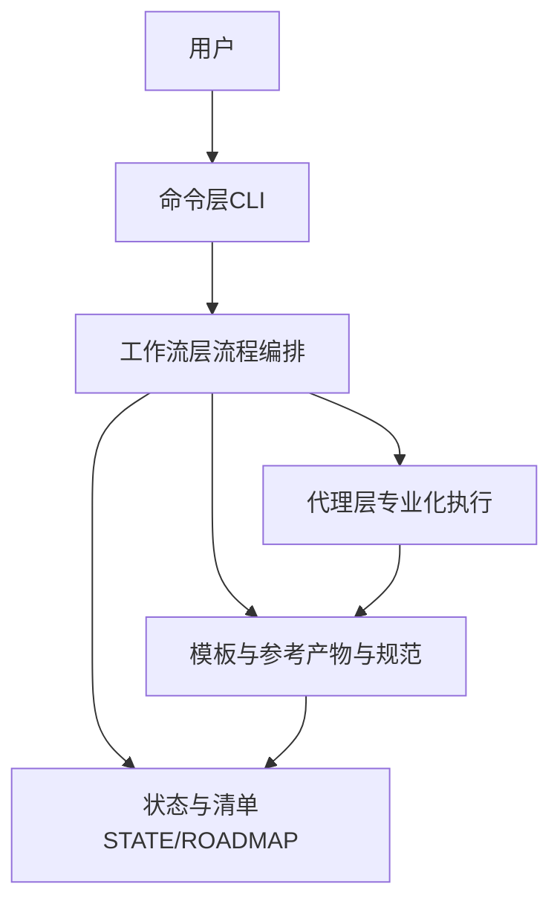
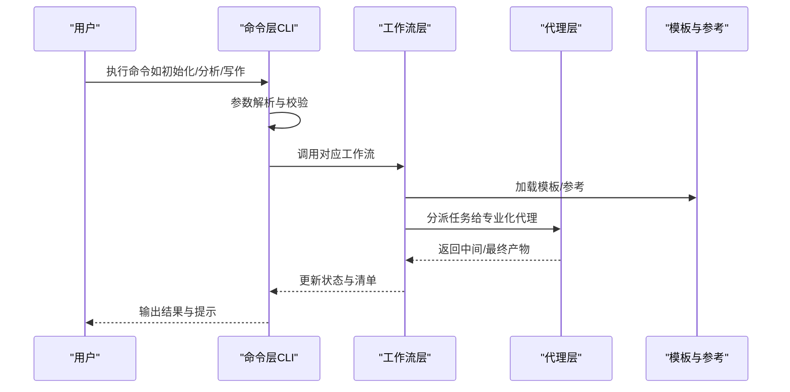
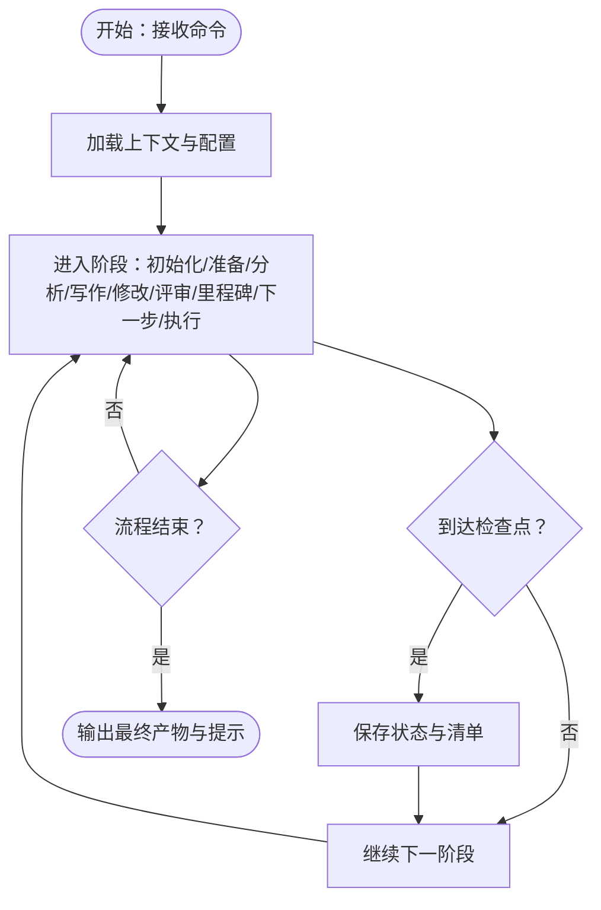
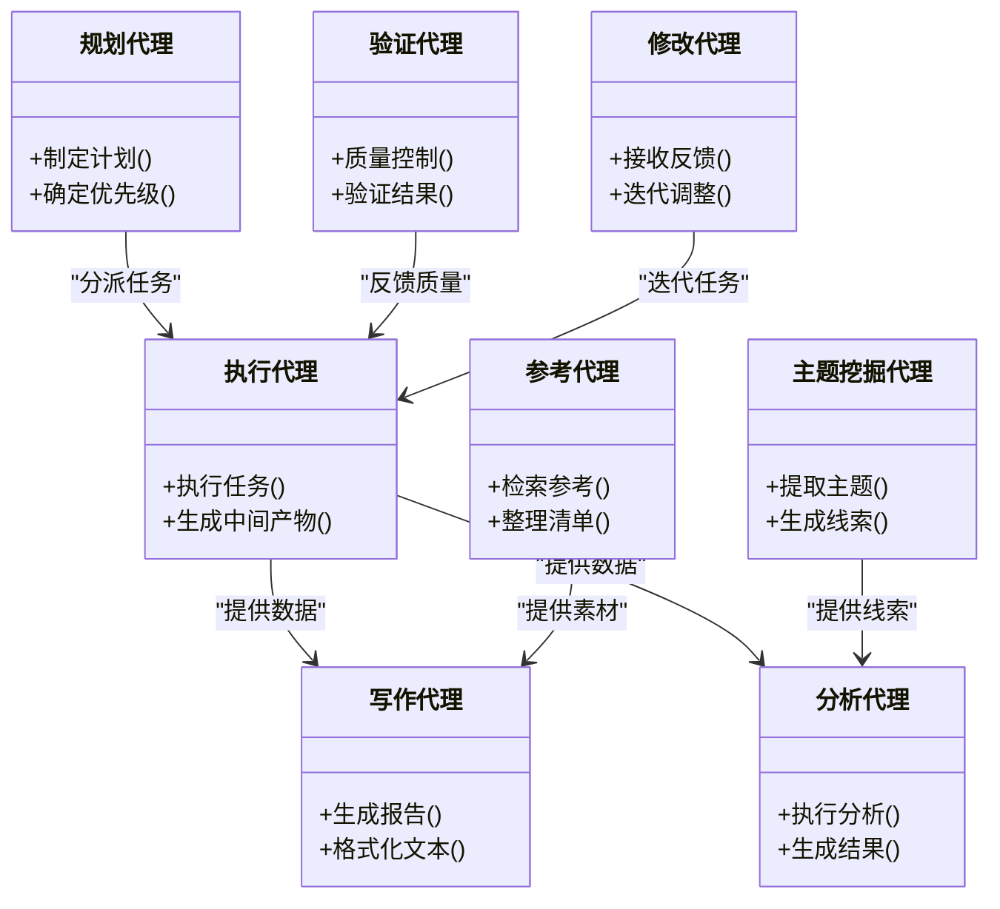
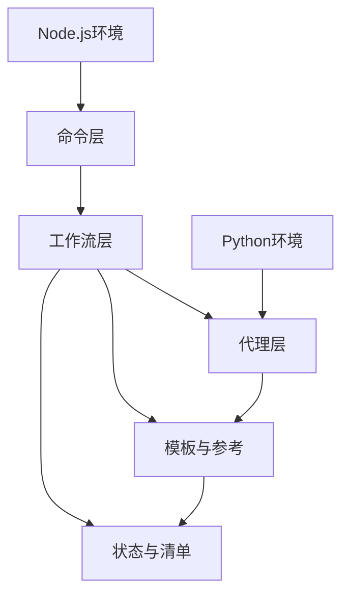

# 架构设计

<cite>
**本文引用的文件**
- [README.md](file://README.md)
- [ARCHITECTURE.md](file://docs/ARCHITECTURE.md)
- [DEVELOPMENT.md](file://docs/DEVELOPMENT.md)
- [CONFIGURATION.md](file://docs/CONFIGURATION.md)
- [getting-started.md](file://docs/getting-started.md)
- [clinpub.md](file://commands/clinpub/clinpub.md)
- [init-project.md](file://commands/clinpub/init-project.md)
- [data-prep.md](file://commands/clinpub/data-prep.md)
- [analysis.md](file://commands/clinpub/analysis.md)
- [writing.md](file://commands/clinpub/writing.md)
- [modify.md](file://commands/clinpub/modify.md)
- [review.md](file://commands/clinpub/review.md)
- [milestone.md](file://commands/clinpub/milestone.md)
- [next-step.md](file://commands/clinpub/next-step.md)
- [do.md](file://commands/clinpub/do.md)
- [data2idea.md](file://commands/clinpub/data2idea.md)
- [analyst-agent.md](file://agents/analyst-agent.md)
- [clinpub-executor.md](file://agents/clinpub-executor.md)
- [clinpub-planner.md](file://agents/clinpub-planner.md)
- [clinpub-verifier.md](file://agents/clinpub-verifier.md)
- [modify-agent.md](file://agents/modify-agent.md)
- [reference-agent.md](file://agents/reference-agent.md)
- [topic-miner-agent.md](file://agents/topic-miner-agent.md)
- [writer-agent.md](file://agents/writer-agent.md)
- [analysis.md](file://pipeline/workflows/analysis.md)
- [data-prep.md](file://pipeline/workflows/data-prep.md)
- [data2idea.md](file://pipeline/workflows/data2idea.md)
- [init-project.md](file://pipeline/workflows/init-project.md)
- [milestone.md](file://pipeline/workflows/milestone.md)
- [modify.md](file://pipeline/workflows/modify.md)
- [next-step.md](file://pipeline/workflows/next-step.md)
- [review.md](file://pipeline/workflows/review.md)
- [writing.md](file://pipeline/workflows/writing.md)
- [agent-contracts.md](file://pipeline/references/agent-contracts.md)
- [reference-library.md](file://pipeline/references/reference-library.md)
- [manifest-format.md](file://pipeline/references/manifest-format.md)
- [roadmap.md](file://pipeline/templates/roadmap.md)
- [project.md](file://pipeline/templates/project.md)
- [state.md](file://pipeline/templates/state.md)
- [spec.md](file://pipeline/templates/spec.md)
- [context.md](file://pipeline/templates/context.md)
- [method-readme.md](file://pipeline/templates/method-readme.md)
- [verification-report.md](file://pipeline/templates/verification-report.md)
- [UAT.md](file://pipeline/templates/UAT.md)
- [VALIDATION.md](file://pipeline/templates/VALIDATION.md)
- [project_config.example.yml](file://examples/project_config.example.yml)
- [install.js](file://bin/install.js)
- [requirements.txt](file://requirements.txt)
- [package.json](file://package.json)
</cite>

## 目录
1. [引言](#引言)
2. [项目结构](#项目结构)
3. [核心组件](#核心组件)
4. [架构总览](#架构总览)
5. [详细组件分析](#详细组件分析)
6. [依赖关系分析](#依赖关系分析)
7. [性能考虑](#性能考虑)
8. [故障排查指南](#故障排查指南)
9. [结论](#结论)
10. [附录](#附录)

## 引言
本架构设计文档面向clinpub项目的开发者与维护者，系统阐述“命令层（Commands）→ 工作流层（Workflows）→ 代理层（Agents）”的三层架构设计。该架构以命令层作为用户入口与意图表达，工作流层负责流程编排与状态管理，代理层承载专业化的任务执行与决策。文档将从职责边界、交互方式、数据流向、技术选型、可扩展性与性能优化等维度进行深入解析，并辅以架构图、组件关系图与数据流图，帮助读者快速建立对系统的整体认知。

## 项目结构
项目采用按功能域分层的组织方式：
- 命令层（commands/clinpub）：定义CLI命令与用户交互入口，封装用户意图到标准化动作。
- 工作流层（pipeline/workflows）：定义端到端流程规范与阶段编排，确保可重复、可观测的执行路径。
- 代理层（agents）：定义专业化Agent的行为契约与能力边界，聚焦特定任务的推理与执行。
- 模板与参考（pipeline/templates、pipeline/references）：提供可复用的产物模板、清单格式与参考库。
- 文档（docs）：提供架构、配置、开发与测试指南。
- 示例与安装（examples、bin、requirements.txt、package.json）：提供环境配置与安装脚本。

图表来源
- [clinpub.md](file://commands/clinpub/clinpub.md)
- [init-project.md](file://pipeline/workflows/init-project.md)
- [data-prep.md](file://pipeline/workflows/data-prep.md)
- [analysis.md](file://pipeline/workflows/analysis.md)
- [data2idea.md](file://pipeline/workflows/data2idea.md)
- [writing.md](file://pipeline/workflows/writing.md)
- [modify.md](file://pipeline/workflows/modify.md)
- [review.md](file://pipeline/workflows/review.md)
- [milestone.md](file://pipeline/workflows/milestone.md)
- [next-step.md](file://pipeline/workflows/next-step.md)
- [do.md](file://pipeline/workflows/do.md)
- [analyst-agent.md](file://agents/analyst-agent.md)
- [clinpub-executor.md](file://agents/clinpub-executor.md)
- [clinpub-planner.md](file://agents/clinpub-planner.md)
- [clinpub-verifier.md](file://agents/clinpub-verifier.md)
- [modify-agent.md](file://agents/modify-agent.md)
- [reference-agent.md](file://agents/reference-agent.md)
- [topic-miner-agent.md](file://agents/topic-miner-agent.md)
- [writer-agent.md](file://agents/writer-agent.md)
- [agent-contracts.md](file://pipeline/references/agent-contracts.md)
- [reference-library.md](file://pipeline/references/reference-library.md)

章节来源
- [README.md](file://README.md)
- [ARCHITECTURE.md](file://docs/ARCHITECTURE.md)
- [DEVELOPMENT.md](file://docs/DEVELOPMENT.md)
- [CONFIGURATION.md](file://docs/CONFIGURATION.md)
- [getting-started.md](file://docs/getting-started.md)

## 核心组件
- 命令层（Commands）
  - 职责：接收用户输入，解析意图，调用相应工作流；提供统一CLI入口与参数校验。
  - 关键点：命令与工作流一一映射，便于扩展新的端到端流程；通过hooks与守卫保障输入安全与流程约束。
- 工作流层（Workflows）
  - 职责：定义端到端流程步骤、阶段检查点、产物清单与状态流转；保证流程可重复、可观测、可审计。
  - 关键点：每个流程对应一个或多个Agent协作；通过模板与参考库确保产物一致性。
- 代理层（Agents）
  - 职责：承担具体任务的推理与执行，遵循行为契约；支持组合、复用与扩展。
  - 关键点：规划、执行、写作、参考、主题挖掘、分析、验证、修改等专业化Agent协同完成复杂任务。

章节来源
- [clinpub.md](file://commands/clinpub/clinpub.md)
- [init-project.md](file://pipeline/workflows/init-project.md)
- [data-prep.md](file://pipeline/workflows/data-prep.md)
- [analysis.md](file://pipeline/workflows/analysis.md)
- [data2idea.md](file://pipeline/workflows/data2idea.md)
- [writing.md](file://pipeline/workflows/writing.md)
- [modify.md](file://pipeline/workflows/modify.md)
- [review.md](file://pipeline/workflows/review.md)
- [milestone.md](file://pipeline/workflows/milestone.md)
- [next-step.md](file://pipeline/workflows/next-step.md)
- [do.md](file://pipeline/workflows/do.md)
- [analyst-agent.md](file://agents/analyst-agent.md)
- [clinpub-executor.md](file://agents/clinpub-executor.md)
- [clinpub-planner.md](file://agents/clinpub-planner.md)
- [clinpub-verifier.md](file://agents/clinpub-verifier.md)
- [modify-agent.md](file://agents/modify-agent.md)
- [reference-agent.md](file://agents/reference-agent.md)
- [topic-miner-agent.md](file://agents/topic-miner-agent.md)
- [writer-agent.md](file://agents/writer-agent.md)

## 架构总览
三层架构的核心思想是“意图—编排—执行”的清晰分离：
- 命令层负责“用户意图表达”，将用户输入转化为标准化动作；
- 工作流层负责“流程编排”，定义阶段、检查点与产物；
- 代理层负责“专业化执行”，在各自领域内完成推理与产出。

图表来源
- [clinpub.md](file://commands/clinpub/clinpub.md)
- [init-project.md](file://pipeline/workflows/init-project.md)
- [data-prep.md](file://pipeline/workflows/data-prep.md)
- [analysis.md](file://pipeline/workflows/analysis.md)
- [data2idea.md](file://pipeline/workflows/data2idea.md)
- [writing.md](file://pipeline/workflows/writing.md)
- [modify.md](file://pipeline/workflows/modify.md)
- [review.md](file://pipeline/workflows/review.md)
- [milestone.md](file://pipeline/workflows/milestone.md)
- [next-step.md](file://pipeline/workflows/next-step.md)
- [do.md](file://pipeline/workflows/do.md)
- [analyst-agent.md](file://agents/analyst-agent.md)
- [clinpub-executor.md](file://agents/clinpub-executor.md)
- [clinpub-planner.md](file://agents/clinpub-planner.md)
- [clinpub-verifier.md](file://agents/clinpub-verifier.md)
- [modify-agent.md](file://agents/modify-agent.md)
- [reference-agent.md](file://agents/reference-agent.md)
- [topic-miner-agent.md](file://agents/topic-miner-agent.md)
- [writer-agent.md](file://agents/writer-agent.md)
- [agent-contracts.md](file://pipeline/references/agent-contracts.md)
- [reference-library.md](file://pipeline/references/reference-library.md)
- [manifest-format.md](file://pipeline/references/manifest-format.md)
- [roadmap.md](file://pipeline/templates/roadmap.md)
- [project.md](file://pipeline/templates/project.md)
- [state.md](file://pipeline/templates/state.md)
- [spec.md](file://pipeline/templates/spec.md)
- [context.md](file://pipeline/templates/context.md)
- [method-readme.md](file://pipeline/templates/method-readme.md)
- [verification-report.md](file://pipeline/templates/verification-report.md)
- [UAT.md](file://pipeline/templates/UAT.md)
- [VALIDATION.md](file://pipeline/templates/VALIDATION.md)

## 详细组件分析

### 命令层（Commands）：用户界面与意图表达
- 设计理念
  - 将复杂的科学管线抽象为一组CLI命令，降低用户心智负担；
  - 每个命令对应一个明确的业务目标（如初始化、数据准备、分析、写作、修改、评审、里程碑、下一步、执行）。
- 职责分工
  - 解析用户输入与上下文；
  - 校验参数与前置条件；
  - 调用对应工作流并传递上下文；
  - 输出结果与状态更新。
- 交互方式
  - CLI交互为主，辅以配置文件与环境变量；
  - 通过hooks与守卫拦截异常输入，保障流程安全。
- 数据流向
  - 输入参数 → 参数校验 → 工作流调度 → 上下文构建 → 代理执行 → 产物生成 → 状态更新。

图表来源
- [clinpub.md](file://commands/clinpub/clinpub.md)
- [init-project.md](file://pipeline/workflows/init-project.md)
- [data-prep.md](file://pipeline/workflows/data-prep.md)
- [analysis.md](file://pipeline/workflows/analysis.md)
- [writing.md](file://pipeline/workflows/writing.md)
- [modify.md](file://pipeline/workflows/modify.md)
- [review.md](file://pipeline/workflows/review.md)
- [milestone.md](file://pipeline/workflows/milestone.md)
- [next-step.md](file://pipeline/workflows/next-step.md)
- [do.md](file://pipeline/workflows/do.md)
- [analyst-agent.md](file://agents/analyst-agent.md)
- [clinpub-executor.md](file://agents/clinpub-executor.md)
- [clinpub-planner.md](file://agents/clinpub-planner.md)
- [clinpub-verifier.md](file://agents/clinpub-verifier.md)
- [modify-agent.md](file://agents/modify-agent.md)
- [reference-agent.md](file://agents/reference-agent.md)
- [topic-miner-agent.md](file://agents/topic-miner-agent.md)
- [writer-agent.md](file://agents/writer-agent.md)
- [agent-contracts.md](file://pipeline/references/agent-contracts.md)
- [reference-library.md](file://pipeline/references/reference-library.md)
- [manifest-format.md](file://pipeline/references/manifest-format.md)
- [roadmap.md](file://pipeline/templates/roadmap.md)
- [project.md](file://pipeline/templates/project.md)
- [state.md](file://pipeline/templates/state.md)
- [spec.md](file://pipeline/templates/spec.md)
- [context.md](file://pipeline/templates/context.md)
- [method-readme.md](file://pipeline/templates/method-readme.md)
- [verification-report.md](file://pipeline/templates/verification-report.md)
- [UAT.md](file://pipeline/templates/UAT.md)
- [VALIDATION.md](file://pipeline/templates/VALIDATION.md)

章节来源
- [clinpub.md](file://commands/clinpub/clinpub.md)
- [init-project.md](file://commands/clinpub/init-project.md)
- [data-prep.md](file://commands/clinpub/data-prep.md)
- [analysis.md](file://commands/clinpub/analysis.md)
- [writing.md](file://commands/clinpub/writing.md)
- [modify.md](file://commands/clinpub/modify.md)
- [review.md](file://commands/clinpub/review.md)
- [milestone.md](file://commands/clinpub/milestone.md)
- [next-step.md](file://commands/clinpub/next-step.md)
- [do.md](file://commands/clinpub/do.md)

### 工作流层（Workflows）：流程编排与状态管理
- 设计理念
  - 将端到端任务拆分为可复用的流程模块，每个流程包含阶段、检查点、产物清单与状态记录；
  - 通过模板与参考库确保产物一致性与可审计性。
- 职责分工
  - 定义流程步骤与顺序；
  - 维护阶段状态与路线图；
  - 协调代理间的任务分配与依赖关系；
  - 生成与更新清单（manifest）与状态文件。
- 交互方式
  - 与命令层对接，接收标准化动作；
  - 与代理层协作，触发专业化任务；
  - 与模板/参考库交互，生成标准化产物。
- 数据流向
  - 上下文输入 → 阶段推进 → 代理执行 → 中间产物 → 清单与状态更新 → 下一阶段或结束。

图表来源
- [init-project.md](file://pipeline/workflows/init-project.md)
- [data-prep.md](file://pipeline/workflows/data-prep.md)
- [analysis.md](file://pipeline/workflows/analysis.md)
- [data2idea.md](file://pipeline/workflows/data2idea.md)
- [writing.md](file://pipeline/workflows/writing.md)
- [modify.md](file://pipeline/workflows/modify.md)
- [review.md](file://pipeline/workflows/review.md)
- [milestone.md](file://pipeline/workflows/milestone.md)
- [next-step.md](file://pipeline/workflows/next-step.md)
- [do.md](file://pipeline/workflows/do.md)
- [state.md](file://pipeline/templates/state.md)
- [roadmap.md](file://pipeline/templates/roadmap.md)
- [manifest-format.md](file://pipeline/references/manifest-format.md)

章节来源
- [init-project.md](file://pipeline/workflows/init-project.md)
- [data-prep.md](file://pipeline/workflows/data-prep.md)
- [analysis.md](file://pipeline/workflows/analysis.md)
- [data2idea.md](file://pipeline/workflows/data2idea.md)
- [writing.md](file://pipeline/workflows/writing.md)
- [modify.md](file://pipeline/workflows/modify.md)
- [review.md](file://pipeline/workflows/review.md)
- [milestone.md](file://pipeline/workflows/milestone.md)
- [next-step.md](file://pipeline/workflows/next-step.md)
- [do.md](file://pipeline/workflows/do.md)
- [state.md](file://pipeline/templates/state.md)
- [roadmap.md](file://pipeline/templates/roadmap.md)
- [manifest-format.md](file://pipeline/references/manifest-format.md)

### 代理层（Agents）：专业化任务执行
- 设计理念
  - 每个代理专注于特定任务域，遵循统一的行为契约；
  - 支持组合与复用，形成可扩展的代理生态。
- 职责分工
  - 规划代理：制定执行计划与优先级；
  - 执行代理：按计划执行具体任务并产出中间/最终产物；
  - 写作代理：生成符合规范的文本与报告；
  - 参考代理：检索与整理参考文献与方法；
  - 主题挖掘代理：从数据中提取研究主题与线索；
  - 分析代理：执行统计/逻辑分析；
  - 验证代理：质量控制与验证；
  - 修改代理：根据反馈迭代调整。
- 交互方式
  - 接收工作流分派的任务；
  - 读取模板与参考库；
  - 生成标准化产物并回传工作流。
- 数据流向
  - 输入上下文 → 任务解析 → 行动执行 → 产物生成 → 回传工作流。

图表来源
- [clinpub-planner.md](file://agents/clinpub-planner.md)
- [clinpub-executor.md](file://agents/clinpub-executor.md)
- [writer-agent.md](file://agents/writer-agent.md)
- [reference-agent.md](file://agents/reference-agent.md)
- [topic-miner-agent.md](file://agents/topic-miner-agent.md)
- [analyst-agent.md](file://agents/analyst-agent.md)
- [clinpub-verifier.md](file://agents/clinpub-verifier.md)
- [modify-agent.md](file://agents/modify-agent.md)

章节来源
- [analyst-agent.md](file://agents/analyst-agent.md)
- [clinpub-executor.md](file://agents/clinpub-executor.md)
- [clinpub-planner.md](file://agents/clinpub-planner.md)
- [clinpub-verifier.md](file://agents/clinpub-verifier.md)
- [modify-agent.md](file://agents/modify-agent.md)
- [reference-agent.md](file://agents/reference-agent.md)
- [topic-miner-agent.md](file://agents/topic-miner-agent.md)
- [writer-agent.md](file://agents/writer-agent.md)
- [agent-contracts.md](file://pipeline/references/agent-contracts.md)

## 依赖关系分析
- 层内依赖
  - 命令层依赖工作流层接口，通过标准化动作触发流程；
  - 工作流层依赖代理层契约，按阶段分派任务；
  - 代理层依赖模板与参考库，确保产物一致性。
- 层间耦合
  - 通过“动作—流程—任务”的三段式解耦，降低耦合度；
  - 通过清单与状态文件实现跨层可见性与可观测性。
- 外部依赖
  - Python运行时与依赖包（requirements.txt）；
  - Node.js运行时与包管理（package.json）；
  - 安装脚本（install.js）提供环境准备。

图表来源
- [requirements.txt](file://requirements.txt)
- [package.json](file://package.json)
- [install.js](file://bin/install.js)
- [state.md](file://pipeline/templates/state.md)
- [roadmap.md](file://pipeline/templates/roadmap.md)
- [manifest-format.md](file://pipeline/references/manifest-format.md)

章节来源
- [requirements.txt](file://requirements.txt)
- [package.json](file://package.json)
- [install.js](file://bin/install.js)
- [state.md](file://pipeline/templates/state.md)
- [roadmap.md](file://pipeline/templates/roadmap.md)
- [manifest-format.md](file://pipeline/references/manifest-format.md)

## 性能考虑
- 并行与串行
  - 在不破坏依赖的前提下，尽可能并行执行独立任务，缩短端到端时间；
  - 对于强依赖链路，采用流水线式串行以保证正确性。
- 缓存与增量
  - 利用模板与参考库缓存常用资源；
  - 基于清单与状态文件实现增量计算与跳过已执行阶段。
- I/O与网络
  - 控制外部API调用频率，增加重试与退避策略；
  - 对大文件处理采用流式或分块策略，避免内存峰值。
- 可观测性
  - 通过状态与清单记录关键指标，便于性能分析与瓶颈定位。

## 故障排查指南
- 命令层问题
  - 检查参数是否满足工作流前置条件；
  - 查看CLI输出与错误码，确认输入合法性。
- 工作流问题
  - 核对当前阶段与检查点状态；
  - 对比清单与预期产物，定位缺失或异常环节。
- 代理层问题
  - 根据代理契约核对输入上下文；
  - 检查模板与参考库可用性与版本一致性。
- 环境问题
  - 确认Python与Node.js版本与依赖安装；
  - 运行安装脚本完成环境初始化。

章节来源
- [DEVELOPMENT.md](file://docs/DEVELOPMENT.md)
- [CONFIGURATION.md](file://docs/CONFIGURATION.md)
- [state.md](file://pipeline/templates/state.md)
- [roadmap.md](file://pipeline/templates/roadmap.md)
- [manifest-format.md](file://pipeline/references/manifest-format.md)

## 结论
clinpub的三层架构以“命令—编排—执行”为主线，实现了用户意图、流程规范与专业化执行的解耦与协同。通过清晰的职责边界、标准化的契约与模板参考，系统具备良好的可扩展性与可维护性。建议在后续演进中持续完善代理生态、增强可观测性与自动化测试，以支撑更大规模的科学管线实践。

## 附录
- 快速开始
  - 参考入门文档了解安装与基本使用；
  - 使用示例配置文件与模板快速启动项目。
- 配置参考
  - 项目配置文件与环境变量说明；
  - 模板与参考库的使用规范。

章节来源
- [getting-started.md](file://docs/getting-started.md)
- [project_config.example.yml](file://examples/project_config.example.yml)
- [project.md](file://pipeline/templates/project.md)
- [context.md](file://pipeline/templates/context.md)
- [spec.md](file://pipeline/templates/spec.md)
- [method-readme.md](file://pipeline/templates/method-readme.md)
- [verification-report.md](file://pipeline/templates/verification-report.md)
- [UAT.md](file://pipeline/templates/UAT.md)
- [VALIDATION.md](file://pipeline/templates/VALIDATION.md)