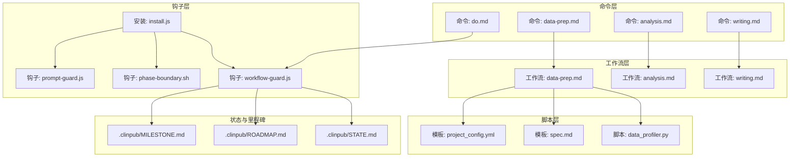
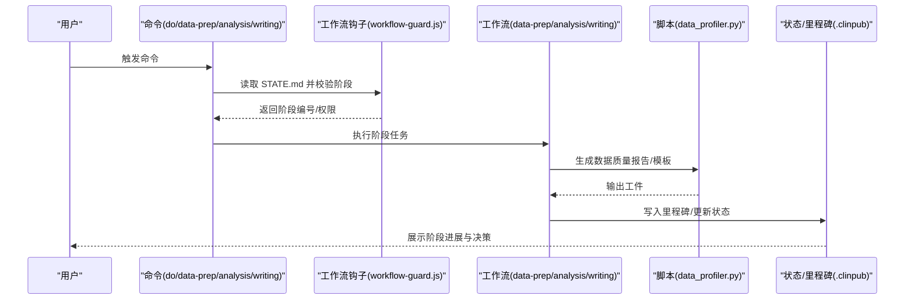
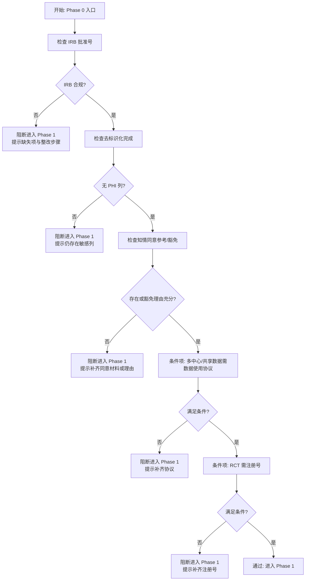
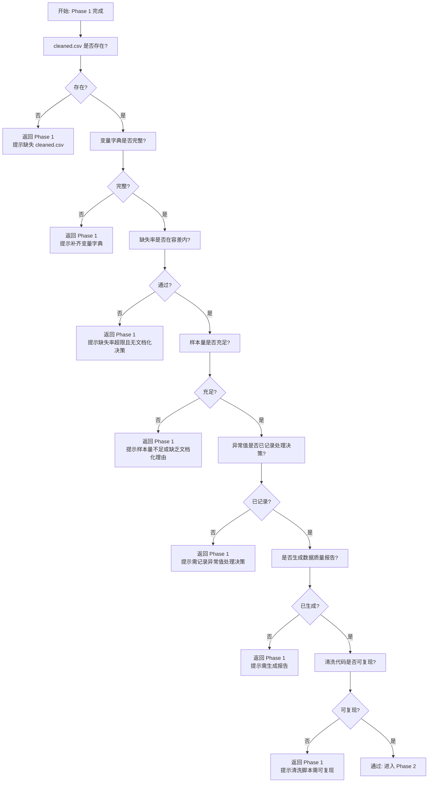
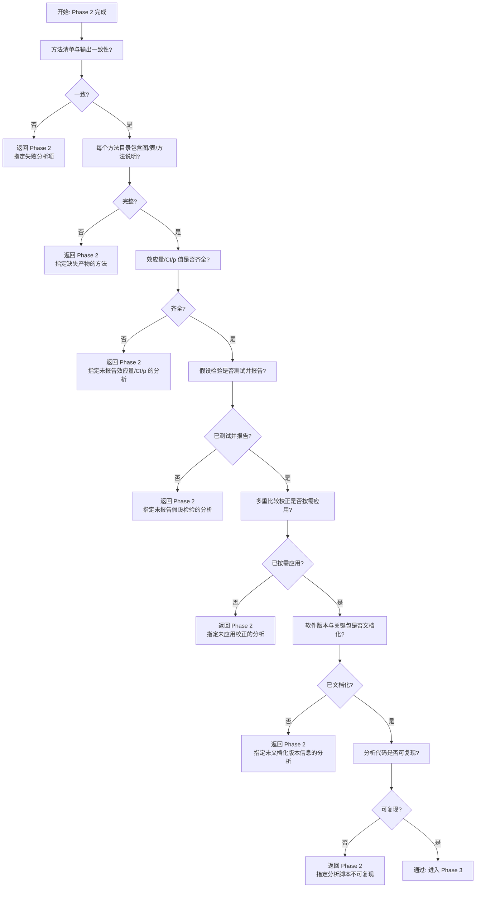
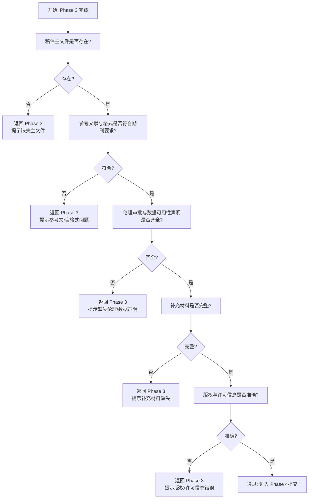
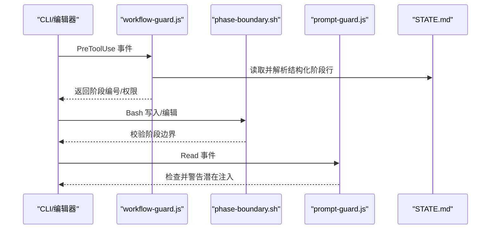
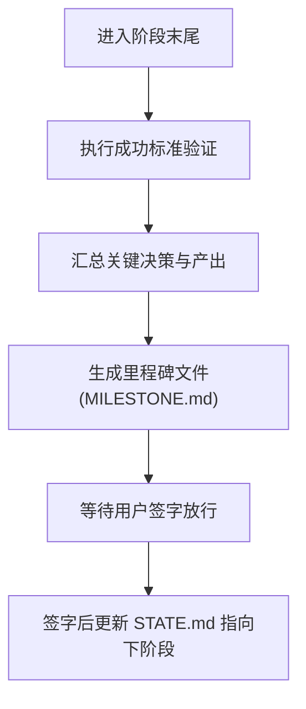
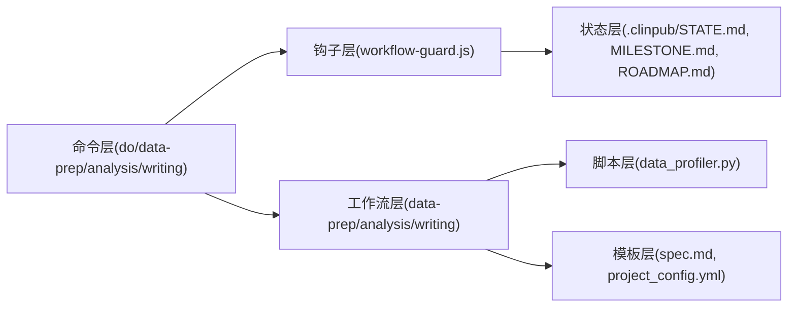

# 质量门控系统

<cite>
**本文引用的文件**
- [gates.md](file://pipeline/references/gates.md)
- [checkpoints.md](file://pipeline/references/checkpoints.md)
- [verification-patterns.md](file://pipeline/references/verification-patterns.md)
- [clinpub-workflow-guard.js](file://hooks/clinpub-workflow-guard.js)
- [clinpub-phase-boundary.sh](file://hooks/clinpub-phase-boundary.sh)
- [clinpub-prompt-guard.js](file://hooks/clinpub-prompt-guard.js)
- [install.js](file://bin/install.js)
- [do.md](file://commands/clinpub/do.md)
- [data-prep.md](file://commands/clinpub/data-prep.md)
- [analysis.md](file://commands/clinpub/analysis.md)
- [writing.md](file://commands/clinpub/writing.md)
- [SPEC.md](file://pipeline/templates/spec.md)
- [project_config.yml](file://pipeline/templates/project_config.yml)
- [STATE.md](file://.clinpub/STATE.md)
- [ROADMAP.md](file://.clinpub/ROADMAP.md)
- [MILESTONE.md](file://.clinpub/MILESTONE.md)
- [data_profiler.py](file://scripts/data_profiler.py)
</cite>

## 目录
1. [引言](#引言)
2. [项目结构](#项目结构)
3. [核心组件](#核心组件)
4. [架构总览](#架构总览)
5. [详细组件分析](#详细组件分析)
6. [依赖关系分析](#依赖关系分析)
7. [性能考量](#性能考量)
8. [故障排查指南](#故障排查指南)
9. [结论](#结论)
10. [附录](#附录)

## 引言
本设计文档围绕 clinpub 的“四道质量门控”体系展开，系统化阐述 IRB/Ethics Gate、Data Quality Gate、Analysis Validity Gate 与 Submission Gate 的设计理念、检查标准、验证规则与通过条件。文档还覆盖门控检查流程、异常处理策略、质量报告生成、自动化程度、可配置性与扩展性设计，并为开发者提供完整实现指南。

## 项目结构
质量门控系统贯穿命令层、工作流层与脚本层，配合钩子与状态文件实现自动化门控与人工确认的平衡：
- 命令层：提供面向用户的入口（如数据准备、分析、写作等），负责触发工作流与状态检测。
- 工作流层：定义各阶段的执行顺序、里程碑与检查点协议。
- 脚本层：提供数据质量报告生成、参数模板与配置模板等支撑能力。
- 钩子层：在工具使用前后拦截，校验阶段边界、防止越权访问与注入风险。
- 状态与里程碑：以结构化文件记录当前阶段、里程碑完成情况与决策。

图表来源
- [do.md:107-140](file://commands/clinpub/do.md#L107-L140)
- [data-prep.md](file://commands/clinpub/data-prep.md)
- [analysis.md](file://commands/clinpub/analysis.md)
- [writing.md](file://commands/clinpub/writing.md)
- [data_profiler.py](file://scripts/data_profiler.py)
- [SPEC.md](file://pipeline/templates/spec.md)
- [project_config.yml](file://pipeline/templates/project_config.yml)
- [clinpub-workflow-guard.js](file://hooks/clinpub-workflow-guard.js)
- [clinpub-phase-boundary.sh](file://hooks/clinpub-phase-boundary.sh)
- [clinpub-prompt-guard.js](file://hooks/clinpub-prompt-guard.js)
- [install.js:162-207](file://bin/install.js#L162-L207)
- [STATE.md](file://.clinpub/STATE.md)
- [ROADMAP.md](file://.clinpub/ROADMAP.md)
- [MILESTONE.md](file://.clinpub/MILESTONE.md)

章节来源
- [do.md:107-140](file://commands/clinpub/do.md#L107-L140)
- [data-prep.md](file://commands/clinpub/data-prep.md)
- [analysis.md](file://commands/clinpub/analysis.md)
- [writing.md](file://commands/clinpub/writing.md)
- [SPEC.md](file://pipeline/templates/spec.md)
- [project_config.yml](file://pipeline/templates/project_config.yml)
- [data_profiler.py](file://scripts/data_profiler.py)
- [clinpub-workflow-guard.js](file://hooks/clinpub-workflow-guard.js)
- [clinpub-phase-boundary.sh](file://hooks/clinpub-phase-boundary.sh)
- [clinpub-prompt-guard.js](file://hooks/clinpub-prompt-guard.js)
- [install.js:162-207](file://bin/install.js#L162-L207)
- [STATE.md](file://.clinpub/STATE.md)
- [ROADMAP.md](file://.clinpub/ROADMAP.md)
- [MILESTONE.md](file://.clinpub/MILESTONE.md)

## 核心组件
- 四道门控规范：由 gates.md 定义，明确每道门的检查项、通过条件与失败动作。
- 检查点与里程碑协议：由 checkpoints.md 定义，统一决策、验证与里程碑记录格式。
- 验证报告模板：由 verification-patterns.md 提供结构化报告模板。
- 阶段边界与安全钩子：由 workflow-guard.js、phase-boundary.sh、prompt-guard.js 与 install.js 实现。
- 状态与里程碑文件：由 STATE.md、ROADMAP.md、MILESTONE.md 记录阶段推进与决策。
- 数据质量报告与模板：由 data_profiler.py、spec.md、project_config.yml 支撑。

章节来源
- [gates.md:1-112](file://pipeline/references/gates.md#L1-L112)
- [checkpoints.md:1-120](file://pipeline/references/checkpoints.md#L1-L120)
- [verification-patterns.md:329-358](file://pipeline/references/verification-patterns.md#L329-L358)
- [clinpub-workflow-guard.js](file://hooks/clinpub-workflow-guard.js)
- [clinpub-phase-boundary.sh](file://hooks/clinpub-phase-boundary.sh)
- [clinpub-prompt-guard.js](file://hooks/clinpub-prompt-guard.js)
- [install.js:162-207](file://bin/install.js#L162-L207)
- [STATE.md](file://.clinpub/STATE.md)
- [ROADMAP.md](file://.clinpub/ROADMAP.md)
- [MILESTONE.md](file://.clinpub/MILESTONE.md)
- [data_profiler.py](file://scripts/data_profiler.py)
- [SPEC.md](file://pipeline/templates/spec.md)
- [project_config.yml](file://pipeline/templates/project_config.yml)

## 架构总览
质量门控系统采用“命令-工作流-脚本-钩子-状态”的分层架构：
- 命令层负责入口与状态检测；
- 工作流层组织阶段任务与里程碑；
- 脚本层提供数据质量与配置模板；
- 钩子层在工具使用前后进行阶段校验与安全防护；
- 状态与里程碑文件持久化阶段进展与决策。

图表来源
- [do.md:107-140](file://commands/clinpub/do.md#L107-L140)
- [clinpub-workflow-guard.js](file://hooks/clinpub-workflow-guard.js)
- [data-prep.md](file://commands/clinpub/data-prep.md)
- [analysis.md](file://commands/clinpub/analysis.md)
- [writing.md](file://commands/clinpub/writing.md)
- [data_profiler.py](file://scripts/data_profiler.py)
- [STATE.md](file://.clinpub/STATE.md)
- [MILESTONE.md](file://.clinpub/MILESTONE.md)

## 详细组件分析

### IRB/Ethics Gate（第一道门）
- 目标：在任何数据处理之前确保伦理合规。
- 检查标准与通过条件
  - 必填项：IRB 批准号、去标识化完成、知情同意参考或豁免说明。
  - 条件项：多中心/共享数据需数据使用协议；RCT 需注册号。
  - 通过条件：所有“必填”检查通过，且“条件”项按要求处理。
- 失败动作：阻断进入 Phase 1，列出缺失项与整改建议。
- 实施要点
  - 项目配置文件中的 IRB 与注册号字段校验。
  - 清洗流程前对受保护健康信息（PHI）列进行扫描与报告。
  - 知情同意文档路径存在性与豁免理由一致性检查。

图表来源
- [gates.md:9-24](file://pipeline/references/gates.md#L9-L24)

章节来源
- [gates.md:9-24](file://pipeline/references/gates.md#L9-L24)

### Data Quality Gate（第二道门）
- 目标：确保清洗后的数据具备分析就绪状态。
- 检查标准与通过条件
  - 必填项：cleaned.csv 存在、变量字典完整、缺失率在容差内、样本量充足、异常值已记录、生成数据质量报告、清洗代码可复现。
  - 通过条件：全部检查通过。
- 失败动作：返回 Phase 1，明确指出失败检查项。
- 实施要点
  - 清洗产物路径与完整性校验。
  - 变量字典字段齐全性与缺失率阈值控制。
  - 样本量依据功效分析或文档化理由。
  - 异常值处理决策记录。
  - 自动生成数据质量报告并归档。
  - 清洗脚本从原始数据到清洗数据的端到端可复现。

图表来源
- [gates.md:27-44](file://pipeline/references/gates.md#L27-L44)

章节来源
- [gates.md:27-44](file://pipeline/references/gates.md#L27-L44)
- [data_profiler.py](file://scripts/data_profiler.py)

### Analysis Validity Gate（第三道门）
- 目标：确保统计分析有效、完整且可复现。
- 检查标准与通过条件
  - 必填项：所有确认的方法均已执行并产生输出；每个方法目录包含图、表与方法说明；效应量与 95% 置信区间及精确 p 值；假设检验与报告；多重比较校正（>3 检验时）；软件版本与关键包文档；分析代码可复现。
  - 通过条件：全部检查通过。
- 失败动作：返回 Phase 2，明确指出失败分析项。
- 实施要点
  - 方法清单与输出目录一致性核验。
  - 每个方法的三类产物（图/表/方法说明）完整性。
  - 效应量、置信区间与显著性值的报告一致性。
  - 假设检验与报告的完整性。
  - 多重比较校正策略与应用。
  - 软件版本与关键包版本文档化。
  - 分析脚本从清洗数据到最终产物的端到端可复现。

图表来源
- [gates.md:47-64](file://pipeline/references/gates.md#L47-L64)

章节来源
- [gates.md:47-64](file://pipeline/references/gates.md#L47-L64)

### Submission Gate（第四道门）
- 目标：确保投稿材料完整、合规并具备可发表性。
- 检查标准与通过条件
  - 必填项：稿件主文件存在；参考文献与格式符合目标期刊要求；伦理审批与数据可用性声明齐全；补充材料完整；版权与许可信息准确。
  - 通过条件：全部检查通过。
- 失败动作：返回 Phase 3，明确指出失败项。
- 实施要点
  - 稿件主文件与补充材料的完整性核验。
  - 参考文献格式与数据库一致性。
  - 伦理审批与数据可用性声明的合规性。
  - 版权与许可信息的准确性与一致性。
  - 投稿前的最终一致性检查与报告生成。

图表来源
- [gates.md:66-100](file://pipeline/references/gates.md#L66-L100)

章节来源
- [gates.md:66-100](file://pipeline/references/gates.md#L66-L100)

### 阶段边界与安全钩子
- 阶段检测与边界控制
  - 通过 STATE.md 中结构化行“- 阶段：Phase N”确定当前阶段，避免依赖自然语言或表情符号回退。
  - workflow-guard.js 在工具使用前校验阶段权限，防止写入未来阶段目录。
- Prompt 安全与注入防护
  - prompt-guard.js 以警告模式拦截潜在注入指令，不阻断操作。
- 钩子安装与注册
  - install.js 将三个钩子注册到预工具使用事件，确保拦截生效。

图表来源
- [clinpub-workflow-guard.js](file://hooks/clinpub-workflow-guard.js)
- [clinpub-phase-boundary.sh](file://hooks/clinpub-phase-boundary.sh)
- [clinpub-prompt-guard.js](file://hooks/clinpub-prompt-guard.js)
- [install.js:162-207](file://bin/install.js#L162-L207)
- [STATE.md](file://.clinpub/STATE.md)

章节来源
- [clinpub-workflow-guard.js](file://hooks/clinpub-workflow-guard.js)
- [clinpub-phase-boundary.sh](file://hooks/clinpub-phase-boundary.sh)
- [clinpub-prompt-guard.js](file://hooks/clinpub-prompt-guard.js)
- [install.js:162-207](file://bin/install.js#L162-L207)
- [STATE.md](file://.clinpub/STATE.md)

### 检查点与里程碑协议
- 决策检查点（decision）：在分析路径出现分支时，引导用户做出明确选择并记录。
- 验证检查点（verify）：自动步骤完成后，要求用户确认结果是否符合预期。
- 里程碑（milestone）：阶段完成时，正式验证成功标准、汇总关键决策与产出、生成里程碑文件并等待签字放行。

图表来源
- [checkpoints.md:51-119](file://pipeline/references/checkpoints.md#L51-L119)

章节来源
- [checkpoints.md:1-120](file://pipeline/references/checkpoints.md#L1-L120)
- [MILESTONE.md](file://.clinpub/MILESTONE.md)

### 质量报告生成
- 数据质量报告：由 data_profiler.py 生成 HTML 报告并归档至预处理报告目录。
- 验证报告模板：verification-patterns.md 提供结构化报告模板，包含检查项、状态、问题与签核项。

章节来源
- [data_profiler.py](file://scripts/data_profiler.py)
- [verification-patterns.md:329-358](file://pipeline/references/verification-patterns.md#L329-L358)

## 依赖关系分析
- 命令层依赖钩子层进行阶段校验与安全拦截。
- 工作流层依赖脚本层生成数据质量报告与模板。
- 钩子层依赖状态文件进行阶段判定。
- 里程碑与状态文件跨层持久化阶段进展与决策。

图表来源
- [do.md:107-140](file://commands/clinpub/do.md#L107-L140)
- [data-prep.md](file://commands/clinpub/data-prep.md)
- [analysis.md](file://commands/clinpub/analysis.md)
- [writing.md](file://commands/clinpub/writing.md)
- [data_profiler.py](file://scripts/data_profiler.py)
- [SPEC.md](file://pipeline/templates/spec.md)
- [project_config.yml](file://pipeline/templates/project_config.yml)
- [clinpub-workflow-guard.js](file://hooks/clinpub-workflow-guard.js)
- [STATE.md](file://.clinpub/STATE.md)
- [MILESTONE.md](file://.clinpub/MILESTONE.md)
- [ROADMAP.md](file://.clinpub/ROADMAP.md)

章节来源
- [do.md:107-140](file://commands/clinpub/do.md#L107-L140)
- [data-prep.md](file://commands/clinpub/data-prep.md)
- [analysis.md](file://commands/clinpub/analysis.md)
- [writing.md](file://commands/clinpub/writing.md)
- [data_profiler.py](file://scripts/data_profiler.py)
- [SPEC.md](file://pipeline/templates/spec.md)
- [project_config.yml](file://pipeline/templates/project_config.yml)
- [clinpub-workflow-guard.js](file://hooks/clinpub-workflow-guard.js)
- [STATE.md](file://.clinpub/STATE.md)
- [MILESTONE.md](file://.clinpub/MILESTONE.md)
- [ROADMAP.md](file://.clinpub/ROADMAP.md)

## 性能考量
- 自动化优先：尽可能将检查与报告生成自动化，减少人工干预。
- 可复现性：确保清洗与分析脚本从原始数据到最终产物的端到端可复现，降低返工成本。
- 模块化与模板化：通过模板与配置文件标准化检查项与报告格式，提升一致性与可维护性。
- 钩子拦截开销：PreToolUse 事件拦截应保持轻量，避免影响工具使用体验。

## 故障排查指南
- 阶段检测失败
  - 现象：无法识别当前阶段或权限不足。
  - 排查：确认 STATE.md 中存在结构化行“- 阶段：Phase N”，并检查 workflow-guard.js 的解析逻辑。
- 门控检查失败
  - 现象：某项检查未通过导致阻断。
  - 排查：对照 gates.md 的具体检查项逐项核验，补齐缺失材料或修正错误。
- 报告生成异常
  - 现象：数据质量报告未生成或格式异常。
  - 排查：检查 data_profiler.py 的执行路径与输出目录权限，确认模板与配置文件完整。
- 钩子未生效
  - 现象：阶段边界被绕过或安全拦截失效。
  - 排查：确认 install.js 已正确注册钩子，检查 PreToolUse 事件是否触发。

章节来源
- [STATE.md](file://.clinpub/STATE.md)
- [gates.md:1-112](file://pipeline/references/gates.md#L1-L112)
- [data_profiler.py](file://scripts/data_profiler.py)
- [install.js:162-207](file://bin/install.js#L162-L207)

## 结论
质量门控系统通过四道门控与检查点/里程碑协议，结合钩子与状态文件，实现了从伦理合规到投稿发布的全流程质量保障。系统强调自动化、可复现性与可配置性，既保证严谨性又兼顾实用性。开发者可基于现有模板与钩子快速扩展新门控或调整检查规则。

## 附录
- 开发者实现指南
  - 新增门控：参照 gates.md 的表格格式定义检查项与通过条件，必要时扩展钩子拦截逻辑。
  - 配置与模板：使用 project_config.yml 与 spec.md 模板标准化输入与输出。
  - 报告与里程碑：遵循 verification-patterns.md 与 checkpoints.md 的结构化格式生成报告与里程碑文件。
  - 安全与边界：通过 workflow-guard.js 与 phase-boundary.sh 严格控制阶段边界，通过 prompt-guard.js 防范注入风险。

章节来源
- [gates.md:1-112](file://pipeline/references/gates.md#L1-L112)
- [checkpoints.md:1-120](file://pipeline/references/checkpoints.md#L1-L120)
- [verification-patterns.md:329-358](file://pipeline/references/verification-patterns.md#L329-L358)
- [project_config.yml](file://pipeline/templates/project_config.yml)
- [SPEC.md](file://pipeline/templates/spec.md)
- [clinpub-workflow-guard.js](file://hooks/clinpub-workflow-guard.js)
- [clinpub-phase-boundary.sh](file://hooks/clinpub-phase-boundary.sh)
- [clinpub-prompt-guard.js](file://hooks/clinpub-prompt-guard.js)
- [install.js:162-207](file://bin/install.js#L162-L207)