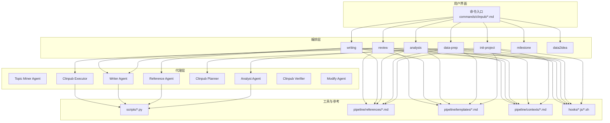
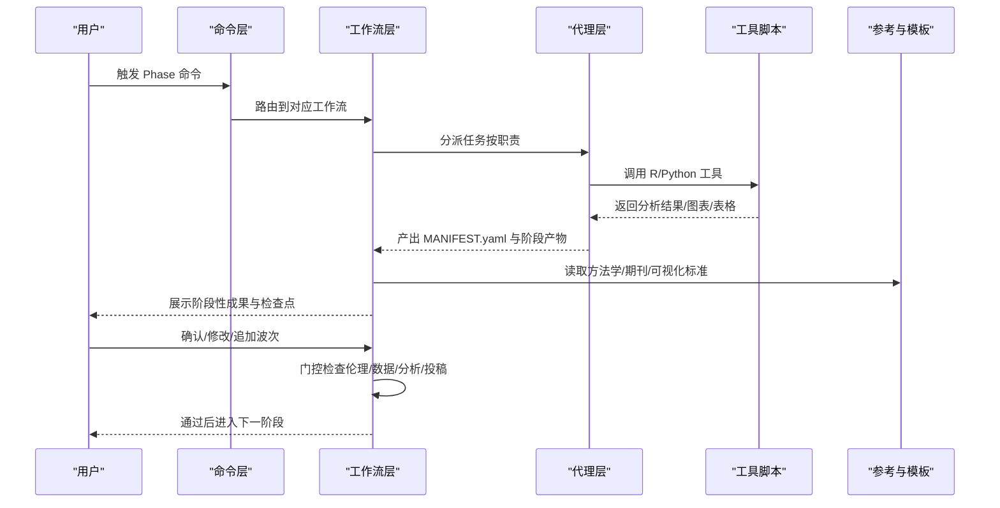
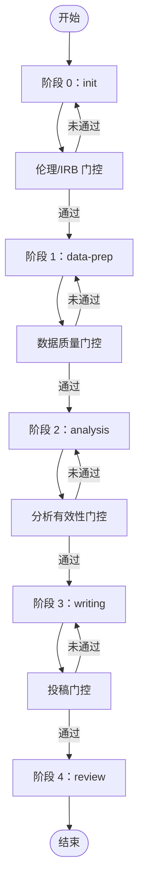
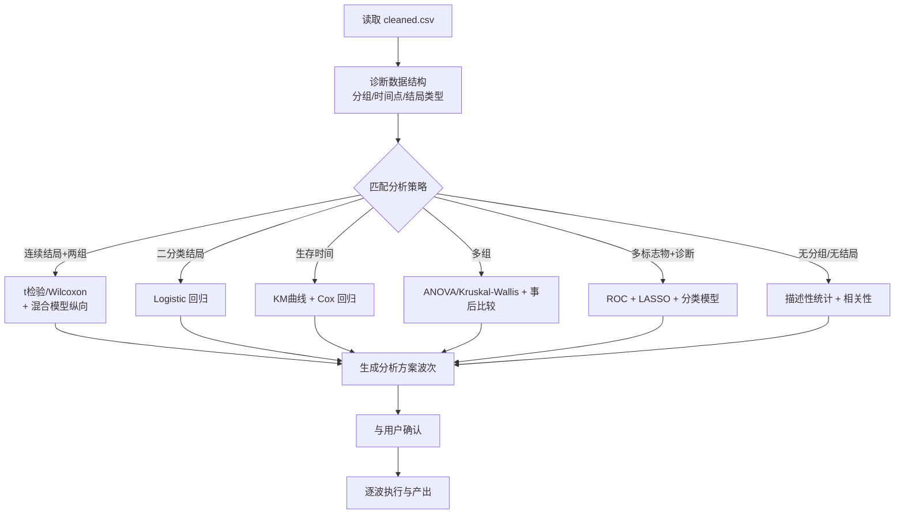
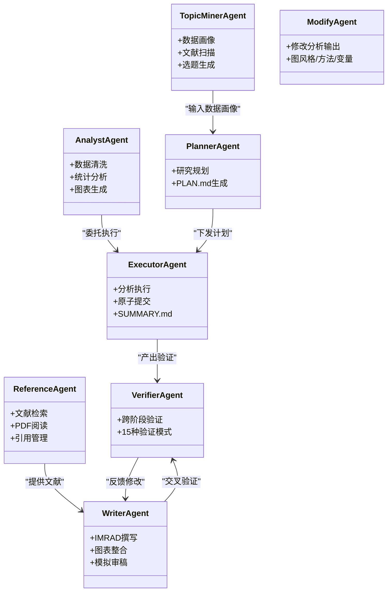
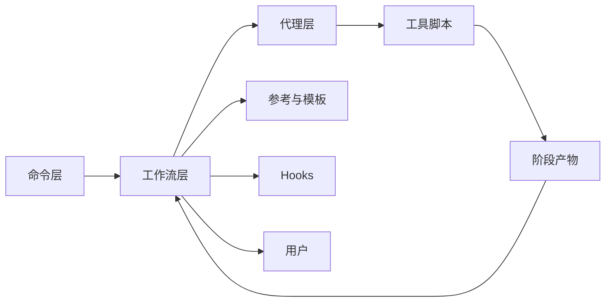

# 核心价值主张

<cite>
**本文引用的文件**
- [README.md](file://README.md)
- [SKILL.md](file://SKILL.md)
- [AGENTS.md](file://AGENTS.md)
- [docs/ARCHITECTURE.md](file://docs/ARCHITECTURE.md)
- [docs/getting-started.md](file://docs/getting-started.md)
- [pipeline/workflows/init-project.md](file://pipeline/workflows/init-project.md)
- [pipeline/references/analysis_methods.md](file://pipeline/references/analysis_methods.md)
- [pipeline/references/gates.md](file://pipeline/references/gates.md)
- [pipeline/references/journal_standards.md](file://pipeline/references/journal_standards.md)
- [examples/project_config.example.yml](file://examples/project_config.example.yml)
</cite>

## 目录
1. [引言](#引言)
2. [项目结构](#项目结构)
3. [核心组件](#核心组件)
4. [架构总览](#架构总览)
5. [详细组件分析](#详细组件分析)
6. [依赖关系分析](#依赖关系分析)
7. [性能考量](#性能考量)
8. [故障排查指南](#故障排查指南)
9. [结论](#结论)
10. [附录](#附录)

## 引言
clinpub 是面向 SCI Q1/Q2 期刊的端到端临床数据分析与发表加速器，将传统“从数据准备到论文发表”的复杂流程，系统性地简化为“DISCUSS → PLAN → EXECUTE → VERIFY”五阶段标准化流水线。项目通过 AI 代理协作与自动化工作流，将资深医学统计学家与学术写作顾问的专业能力封装为可复用的模块，帮助研究者以更低门槛、更高效率完成高质量的临床研究与投稿。

- 目标期刊：Alzheimer’s & Dementia、Molecular Psychiatry 等 Q1/Q2 水平
- 支持研究类型：RCT（CONSORT）、队列/病例对照/横断面/描述性研究（STROBE）
- 核心价值：以阶段化门控确保质量，以动态分析方案适配数据特征，以出版级标准统一产出，以 AI 代理降低协作与执行成本

## 项目结构
项目采用三层架构：Commands（用户命令）→ Workflows（阶段编排）→ Agents（专业化执行），配合 Hooks 与质量门控，形成闭环的工作流保护与质量保障体系。

**图表来源**
- [docs/ARCHITECTURE.md:45-104](file://docs/ARCHITECTURE.md#L45-L104)
- [docs/ARCHITECTURE.md:130-139](file://docs/ARCHITECTURE.md#L130-L139)

**章节来源**
- [docs/ARCHITECTURE.md:1-160](file://docs/ARCHITECTURE.md#L1-L160)
- [README.md:20-45](file://README.md#L20-L45)

## 核心组件
- 命令层（Commands）：提供用户可见的 Slash 命令入口，覆盖选题挖掘、项目初始化、数据准备、统计分析、论文撰写、审稿修稿、里程碑评审等。
- 工作流层（Workflows）：定义每个阶段的执行顺序、依赖关系与阶段性产物，确保流程可控、可追溯。
- 代理层（Agents）：7 个专业化角色，分别承担数据清洗与统计分析、文献检索与引用管理、IMRAD 撰写与审稿模拟、研究规划与执行、跨阶段验证与修改等职责。
- 质量门控（Gates）：4 道门控贯穿阶段转换，强制通过后方可进入下一阶段，确保伦理合规、数据质量、分析有效性与投稿达标。
- 参考与模板（References/Templates）：提供方法学参考、期刊标准、可视化模式、检查点与模板，支撑标准化产出。
- Hooks：防止越阶写入、检查里程碑状态、扫描潜在注入风险，保障流程安全与一致性。

**章节来源**
- [AGENTS.md:47-84](file://AGENTS.md#L47-L84)
- [pipeline/references/gates.md:1-112](file://pipeline/references/gates.md#L1-L112)
- [docs/ARCHITECTURE.md:106-129](file://docs/ARCHITECTURE.md#L106-L129)

## 架构总览
clinpub 的整体架构围绕“阶段化门控 + 动态分析方案 + 出版级标准”展开，形成“从数据到论文”的闭环：

**图表来源**
- [docs/ARCHITECTURE.md:45-104](file://docs/ARCHITECTURE.md#L45-L104)
- [pipeline/references/gates.md:90-96](file://pipeline/references/gates.md#L90-L96)

## 详细组件分析

### 阶段化流程与门控
- 阶段 0：init（研究框架讨论与项目初始化）
- 阶段 1：data-prep（数据清洗与质量报告）
- 阶段 2：analysis（基于数据特征的动态分析方案，多波次执行）
- 阶段 3：writing（IMRAD 撰写与引用管理）
- 阶段 4：review（模拟审稿与修订）

门控包括：伦理/IRB 门控、数据质量门控、分析有效性门控、投稿门控。任何一项未达标将阻断进入下一阶段。

**图表来源**
- [pipeline/workflows/init-project.md:18-124](file://pipeline/workflows/init-project.md#L18-L124)
- [pipeline/references/gates.md:7-112](file://pipeline/references/gates.md#L7-L112)

**章节来源**
- [README.md:59-81](file://README.md#L59-L81)
- [docs/getting-started.md:65-193](file://docs/getting-started.md#L65-L193)

### 动态分析方案与方法学参考
- 分析方案按数据特征自动诊断并推荐，避免“模板化”固定套路，确保方法学适配性。
- 方法学参考库覆盖描述性、组间比较、回归/关联、生存分析、亚组/敏感性分析、相关性、诊断/预测等场景，并提供实现细节与可视化模式。
- 波次（Wave）概念：将分析组织为若干波次，保证前序结果可用于后续分析，支持简单到复杂的多种组合。

**图表来源**
- [pipeline/references/analysis_methods.md:18-104](file://pipeline/references/analysis_methods.md#L18-L104)
- [pipeline/references/analysis_methods.md:242-276](file://pipeline/references/analysis_methods.md#L242-L276)

**章节来源**
- [pipeline/references/analysis_methods.md:1-311](file://pipeline/references/analysis_methods.md#L1-L311)
- [README.md:123-130](file://README.md#L123-L130)

### 代理协作与职责边界
- Analyst Agent：数据清洗、统计分析、图表生成
- Reference Agent：文献检索、PDF 全文读取、引用管理
- Writer Agent：IMRAD 撰写、图表整合、模拟审稿
- Topic Miner Agent：数据画像、文献扫描、选题生成
- Clinpub Planner/Executor/Verifier/Modify Agent：规划、执行、验证与修改

**图表来源**
- [AGENTS.md:74-83](file://AGENTS.md#L74-L83)
- [docs/ARCHITECTURE.md:67-83](file://docs/ARCHITECTURE.md#L67-L83)

**章节来源**
- [AGENTS.md:116-123](file://AGENTS.md#L116-L123)
- [README.md:47-58](file://README.md#L47-L58)

### 出版级标准与质量门控
- 目标期刊：Alzheimer’s & Dementia、Molecular Psychiatry（Q1/Q2）
- 图表标准：≥300 DPI、矢量格式优先、字体与配色统一、主题一致
- 门控检查：伦理合规、数据质量、分析有效性、投稿达标
- 语言与报告：中文正文 + 英文图表/表格；效应量 + 精确 p 值 + 软件版本

**章节来源**
- [README.md:9, 158-167:9-167](file://README.md#L9-L167)
- [pipeline/references/journal_standards.md:1-78](file://pipeline/references/journal_standards.md#L1-L78)
- [pipeline/references/gates.md:7-112](file://pipeline/references/gates.md#L7-L112)

## 依赖关系分析
- 外部技能依赖：ncbi-search（PubMed 检索）、pdf-reader（PDF 全文）、tavily（补充检索）
- 内部模块耦合：命令层仅负责路由；工作流层协调阶段与门控；代理层通过脚本与参考模板完成具体任务；Hooks 与 STATE.md 保障阶段顺序与安全。
- 数据流：CSV/XLSX → cleaned.csv → figures/tables → IMRAD draft → final manuscript

**图表来源**
- [AGENTS.md:109-115](file://AGENTS.md#L109-L115)
- [docs/ARCHITECTURE.md:130-139](file://docs/ARCHITECTURE.md#L130-L139)

**章节来源**
- [AGENTS.md:102-108](file://AGENTS.md#L102-L108)
- [docs/ARCHITECTURE.md:154-160](file://docs/ARCHITECTURE.md#L154-L160)

## 性能考量
- 自动化与标准化：通过动态分析方案与标准化模板减少重复劳动，提升分析与写作效率。
- 并行与串行：阶段间严格串行，阶段内波次可按需并行（取决于方法独立性与资源），最大化利用计算资源。
- 产出质量：严格的门控与交叉验证减少返工，缩短从初稿到可投稿的时间。
- 可扩展性：新增研究类型与代理可通过模板与契约快速集成，降低维护成本。

## 故障排查指南
- R 包安装失败：逐个安装关键包，必要时使用 Bioconductor 安装。
- PubMed 搜索无结果：检查网络与 NCBI_API_KEY，尝试更宽泛关键词。
- 图表中文乱码：在 R 中安装并启用中文字体。
- cleaned.csv 生成失败：确认原始数据路径与 project_config.yml 的变量映射正确。

**章节来源**
- [docs/getting-started.md:225-261](file://docs/getting-started.md#L225-L261)

## 结论
clinpub 的核心价值在于：以阶段化门控确保质量、以动态分析方案适配数据特征、以出版级标准统一产出、以 AI 代理协作降低执行与协作成本。对于面向 Q1/Q2 期刊的临床研究，该项目能够将原本耗时且易出错的“从数据到论文”流程，转化为高可靠、可复现、可扩展的自动化流水线，显著提升研究效率与发表成功率。

## 附录

### 目标期刊与研究类型
- 目标期刊：Alzheimer’s & Dementia、Molecular Psychiatry（Q1/Q2）
- 支持研究类型：RCT（CONSORT）、队列/病例对照/横断面/描述性研究（STROBE）

**章节来源**
- [README.md:9, 123-130:9-130](file://README.md#L9-L130)
- [pipeline/references/journal_standards.md:3-27](file://pipeline/references/journal_standards.md#L3-L27)

### 项目配置示例字段
- 项目基本信息：名称、描述、设计、样本量、目标期刊、报告规范
- 变量映射：结局、暴露、协变量、次要结局、时间变量、分组变量、ID 变量
- 路径与语言：原始数据、预处理、方法、输出、参考、稿件路径；正文语言、图表语言、统计语言
- 质量与分析：期刊级别、图表 DPI、格式、字体、显著性水平、多重比较校正

**章节来源**
- [examples/project_config.example.yml:8-68](file://examples/project_config.example.yml#L8-L68)