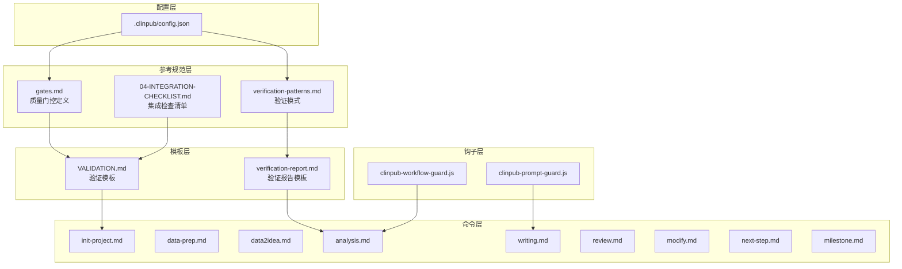
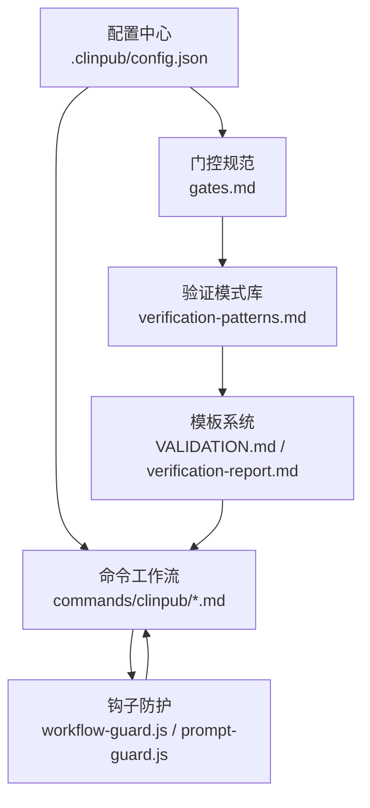
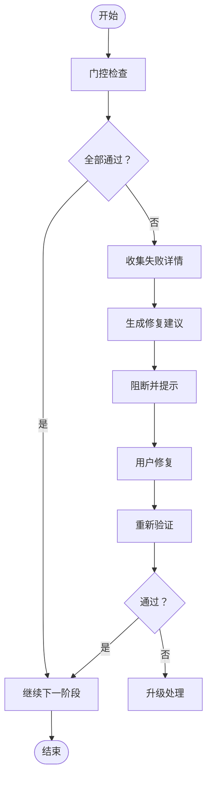
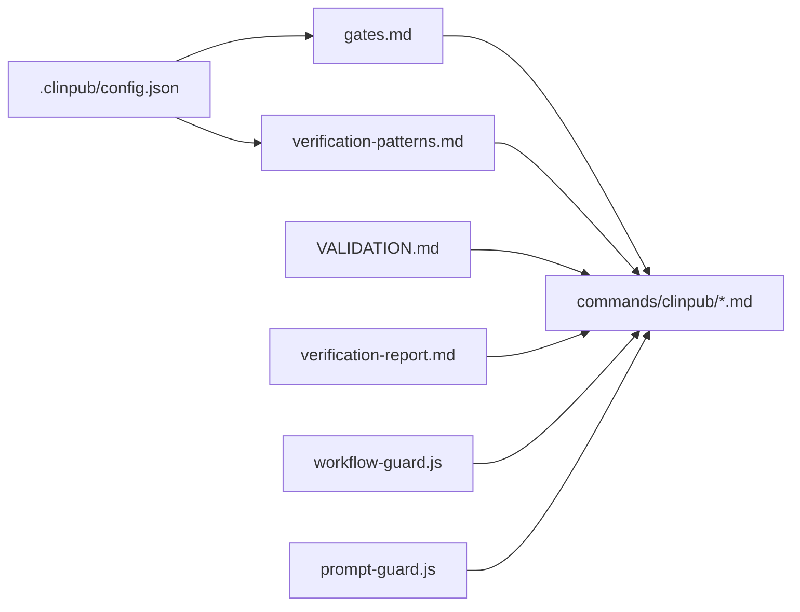

# 质量控制系统

<cite>
**本文档引用的文件**
- [.clinpub/config.json](file://.clinpub/config.json)
- [pipeline/references/gates.md](file://pipeline/references/gates.md)
- [pipeline/references/verification-patterns.md](file://pipeline/references/verification-patterns.md)
- [pipeline/templates/VALIDATION.md](file://pipeline/templates/VALIDATION.md)
- [pipeline/templates/verification-report.md](file://pipeline/templates/verification-report.md)
- [examples/04-INTEGRATION-CHECKLIST.md](file://examples/04-INTEGRATION-CHECKLIST.md)
- [hooks/clinpub-workflow-guard.js](file://hooks/clinpub-workflow-guard.js)
- [hooks/clinpub-prompt-guard.js](file://hooks/clinpub-prompt-guard.js)
- [commands/clinpub/analysis.md](file://commands/clinpub/analysis.md)
- [commands/clinpub/data-prep.md](file://commands/clinpub/data-prep.md)
- [commands/clinpub/data2idea.md](file://commands/clinpub/data2idea.md)
- [commands/clinpub/init-project.md](file://commands/clinpub/init-project.md)
- [commands/clinpub/milestone.md](file://commands/clinpub/milestone.md)
- [commands/clinpub/modify.md](file://commands/clinpub/modify.md)
- [commands/clinpub/next-step.md](file://commands/clinpub/next-step.md)
- [commands/clinpub/review.md](file://commands/clinpub/review.md)
- [commands/clinpub/writing.md](file://commands/clinpub/writing.md)
- [scripts/data_profiler.py](file://scripts/data_profiler.py)
</cite>

## 目录
1. [引言](#引言)
2. [项目结构](#项目结构)
3. [核心组件](#核心组件)
4. [架构总览](#架构总览)
5. [详细组件分析](#详细组件分析)
6. [依赖关系分析](#依赖关系分析)
7. [性能考虑](#性能考虑)
8. [故障排除指南](#故障排除指南)
9. [结论](#结论)
10. [附录](#附录)

## 引言
本文件系统化梳理clinpub项目的质量控制系统，围绕四道质量门控（IRB伦理审查门控、数据质量门控、分析有效性门控、提交门控）展开，解释其设计原理与执行机制；阐述15种验证模式的应用场景与执行策略；提供质量检查清单、风险评估模型与异常处理流程，并总结质量控制在整体工作流中的重要性与最佳实践。

## 项目结构
质量控制系统由配置层、参考规范层、模板层、命令层与钩子层组成，形成“配置驱动+流程约束+模板化输出”的质量保障体系。

**图表来源**
- [.clinpub/config.json](file://.clinpub/config.json)
- [pipeline/references/gates.md](file://pipeline/references/gates.md)
- [pipeline/references/verification-patterns.md](file://pipeline/references/verification-patterns.md)
- [pipeline/templates/VALIDATION.md](file://pipeline/templates/VALIDATION.md)
- [pipeline/templates/verification-report.md](file://pipeline/templates/verification-report.md)
- [examples/04-INTEGRATION-CHECKLIST.md](file://examples/04-INTEGRATION-CHECKLIST.md)
- [hooks/clinpub-workflow-guard.js](file://hooks/clinpub-workflow-guard.js)
- [hooks/clinpub-prompt-guard.js](file://hooks/clinpub-prompt-guard.js)
- [commands/clinpub/init-project.md](file://commands/clinpub/init-project.md)
- [commands/clinpub/analysis.md](file://commands/clinpub/analysis.md)
- [commands/clinpub/writing.md](file://commands/clinpub/writing.md)

**章节来源**
- [.clinpub/config.json](file://.clinpub/config.json)
- [pipeline/references/gates.md](file://pipeline/references/gates.md)
- [pipeline/references/verification-patterns.md](file://pipeline/references/verification-patterns.md)
- [examples/04-INTEGRATION-CHECKLIST.md](file://examples/04-INTEGRATION-CHECKLIST.md)

## 核心组件
- 配置中心：集中管理质量门控参数、验证模式开关与默认策略。
- 门控规范：定义四道门控的检查项、阈值与通过条件。
- 验证模式库：15种验证模式覆盖输入完整性、逻辑一致性、统计稳健性等。
- 模板系统：标准化验证报告与检查清单，确保可追溯与可复现。
- 命令工作流：各阶段命令串联质量门控，形成闭环。
- 钩子防护：在关键节点拦截不合规输入或流程，阻断风险传播。

**章节来源**
- [.clinpub/config.json](file://.clinpub/config.json)
- [pipeline/references/gates.md](file://pipeline/references/gates.md)
- [pipeline/references/verification-patterns.md](file://pipeline/references/verification-patterns.md)
- [pipeline/templates/VALIDATION.md](file://pipeline/templates/VALIDATION.md)
- [pipeline/templates/verification-report.md](file://pipeline/templates/verification-report.md)
- [hooks/clinpub-workflow-guard.js](file://hooks/clinpub-workflow-guard.js)
- [hooks/clinpub-prompt-guard.js](file://hooks/clinpub-prompt-guard.js)

## 架构总览
质量控制系统采用“配置驱动 + 流程约束 + 模板化输出”的分层架构。配置层决定门控强度与验证模式；参考规范层提供检查标准；模板层统一输出格式；命令层承载业务流程；钩子层在入口处进行前置拦截。

**图表来源**
- [.clinpub/config.json](file://.clinpub/config.json)
- [pipeline/references/gates.md](file://pipeline/references/gates.md)
- [pipeline/references/verification-patterns.md](file://pipeline/references/verification-patterns.md)
- [pipeline/templates/VALIDATION.md](file://pipeline/templates/VALIDATION.md)
- [pipeline/templates/verification-report.md](file://pipeline/templates/verification-report.md)
- [hooks/clinpub-workflow-guard.js](file://hooks/clinpub-workflow-guard.js)
- [hooks/clinpub-prompt-guard.js](file://hooks/clinpub-prompt-guard.js)

## 详细组件分析

### IRB伦理审查门控
- 设计目标：确保研究方案符合伦理要求，保护受试者权益。
- 关键检查点：
  - 研究目的与适应症声明清晰且可验证
  - 知情同意流程与记录完整
  - 风险最小化与受益最大化原则落实
  - 数据匿名化与隐私保护措施到位
- 执行机制：
  - 在项目初始化阶段强制校验伦理材料齐备性
  - 通过钩子对提示词进行伦理关键词过滤
  - 使用模板生成伦理审查清单与自检表
- 风险等级：高
- 通过标准：伦理委员会批准文件齐全、无高风险表述、知情同意流程可追溯

**章节来源**
- [hooks/clinpub-prompt-guard.js](file://hooks/clinpub-prompt-guard.js)
- [commands/clinpub/init-project.md](file://commands/clinpub/init-project.md)
- [pipeline/templates/VALIDATION.md](file://pipeline/templates/VALIDATION.md)

### 数据质量门控
- 设计目标：保证输入数据的完整性、一致性与准确性。
- 关键检查点：
  - 缺失值比例与分布合理性
  - 异常值检测与离群点识别
  - 变量类型与范围校验
  - 时间序列连续性与单调性
- 执行机制：
  - 数据准备阶段调用数据剖析脚本进行统计摘要
  - 基于配置设定阈值，超过阈值触发阻断或告警
  - 生成数据质量报告与修正建议
- 风险等级：高
- 通过标准：缺失率低于阈值、异常值占比可控、变量范围一致

**章节来源**
- [scripts/data_profiler.py](file://scripts/data_profiler.py)
- [commands/clinpub/data-prep.md](file://commands/clinpub/data-prep.md)
- [pipeline/templates/VALIDATION.md](file://pipeline/templates/VALIDATION.md)

### 分析有效性门控
- 设计目标：确保分析方法合理、统计推断稳健、结果可复现。
- 关键检查点：
  - 方法学适用性与假设检验
  - 统计模型选择与参数估计稳定性
  - 多重比较与校正策略
  - 敏感性分析与稳健性验证
- 执行机制：
  - 分析阶段引入验证模式进行方法学自检
  - 输出标准化验证报告，记录关键决策依据
  - 对异常结果进行二次核查与回溯
- 风险等级：中高
- 通过标准：方法学合理、P值与效应量稳定、敏感性分析稳健

**章节来源**
- [commands/clinpub/analysis.md](file://commands/clinpub/analysis.md)
- [pipeline/references/verification-patterns.md](file://pipeline/references/verification-patterns.md)
- [pipeline/templates/verification-report.md](file://pipeline/templates/verification-report.md)

### 提交门控
- 设计目标：确保最终产出满足发表或归档要求，具备可检索性与可重复性。
- 关键检查点：
  - 文献格式与引用规范
  - 图表标题与注释完整
  - 补充材料与原始代码可获取
  - 平台提交字段完整与一致
- 执行机制：
  - 写作与评审阶段进行自动化检查
  - 生成提交清单与合规性报告
  - 阻断未达标产物进入发布流程
- 风险等级：中
- 通过标准：格式规范、引用准确、补充材料完备

**章节来源**
- [commands/clinpub/writing.md](file://commands/clinpub/writing.md)
- [commands/clinpub/review.md](file://commands/clinpub/review.md)
- [examples/04-INTEGRATION-CHECKLIST.md](file://examples/04-INTEGRATION-CHECKLIST.md)

### 15种验证模式的应用场景与执行策略
- 模式分类与典型场景：
  - 输入完整性校验：用于数据准备与预处理，确保字段齐全、编码一致
  - 逻辑一致性校验：用于分析前数据清洗，剔除矛盾记录
  - 统计稳健性校验：用于分析阶段，验证估计稳定性与显著性
  - 假设检验校验：用于方法学自检，确认前提假设满足
  - 多重比较校正校验：用于多重分析场景，控制FDR或FWER
  - 时间序列连续性校验：用于纵向数据，检查缺失与异常波动
  - 异常值检测校验：用于探索性分析，识别离群样本
  - 敏感性分析校验：用于稳健性测试，验证结论稳定性
  - 可重复性校验：用于结果回测，验证代码与数据一致性
  - 引用规范校验：用于写作阶段，确保格式与链接有效
  - 图表完整性校验：用于可视化输出，检查标签与注释
  - 补充材料完整性校验：用于提交前检查，确保附件齐全
  - 平台兼容性校验：用于平台提交，确保元数据匹配
  - 伦理合规性校验：用于项目启动，确保材料合规
  - 审稿意见响应校验：用于修订阶段，确保逐条响应
- 执行策略：
  - 在对应命令阶段自动调用相应验证模式
  - 通过配置中心启用/禁用特定模式
  - 将失败项汇总到验证报告，指导修复

**章节来源**
- [pipeline/references/verification-patterns.md](file://pipeline/references/verification-patterns.md)
- [pipeline/templates/verification-report.md](file://pipeline/templates/verification-report.md)
- [.clinpub/config.json](file://.clinpub/config.json)

### 质量检查清单
- 项目启动阶段
  - IRB伦理材料是否齐全
  - 研究方案与知情同意书是否明确
- 数据准备阶段
  - 数据字典与变量说明是否完整
  - 缺失值与异常值是否在阈值内
- 分析阶段
  - 方法学描述是否充分
  - 统计模型与假设是否满足
  - 多重比较是否进行校正
- 写作与提交阶段
  - 引文格式与链接是否正确
  - 图表标题与注释是否完整
  - 补充材料是否可获取
  - 平台提交字段是否一致

**章节来源**
- [examples/04-INTEGRATION-CHECKLIST.md](file://examples/04-INTEGRATION-CHECKLIST.md)
- [pipeline/templates/VALIDATION.md](file://pipeline/templates/VALIDATION.md)

### 风险评估模型
- 风险维度
  - 伦理风险：知情同意缺陷、隐私泄露
  - 数据风险：缺失、污染、异常值
  - 方法风险：假设不满足、多重比较未校正
  - 提交风险：格式错误、材料缺失
- 评估方法
  - 基于验证模式的量化指标
  - 基于历史问题的权重调整
  - 基于阶段的动态阈值
- 决策规则
  - 低风险：自动放行
  - 中风险：警告并要求说明
  - 高风险：阻断并要求修正

**章节来源**
- [pipeline/references/gates.md](file://pipeline/references/gates.md)
- [pipeline/references/verification-patterns.md](file://pipeline/references/verification-patterns.md)

### 异常处理流程
- 触发条件
  - 任一门控未通过
  - 验证模式返回失败
  - 钩子拦截到不合规输入
- 处理步骤
  - 记录失败原因与定位信息
  - 生成修复建议与回滚路径
  - 阻断当前命令并提示用户
  - 支持人工复核与重新执行
- 回归验证
  - 修复后自动重跑相关验证
  - 通过后方可进入下一阶段

**图表来源**
- [pipeline/references/gates.md](file://pipeline/references/gates.md)
- [pipeline/references/verification-patterns.md](file://pipeline/references/verification-patterns.md)
- [hooks/clinpub-workflow-guard.js](file://hooks/clinpub-workflow-guard.js)

## 依赖关系分析
- 配置依赖：所有门控与验证模式均受配置中心控制
- 规范依赖：命令工作流依赖门控与验证模式规范
- 模板依赖：命令输出依赖模板系统生成标准化报告
- 钩子依赖：命令执行前依赖钩子进行前置拦截

**图表来源**
- [.clinpub/config.json](file://.clinpub/config.json)
- [pipeline/references/gates.md](file://pipeline/references/gates.md)
- [pipeline/references/verification-patterns.md](file://pipeline/references/verification-patterns.md)
- [pipeline/templates/VALIDATION.md](file://pipeline/templates/VALIDATION.md)
- [pipeline/templates/verification-report.md](file://pipeline/templates/verification-report.md)
- [hooks/clinpub-workflow-guard.js](file://hooks/clinpub-workflow-guard.js)
- [hooks/clinpub-prompt-guard.js](file://hooks/clinpub-prompt-guard.js)

**章节来源**
- [.clinpub/config.json](file://.clinpub/config.json)
- [pipeline/references/gates.md](file://pipeline/references/gates.md)
- [pipeline/references/verification-patterns.md](file://pipeline/references/verification-patterns.md)
- [pipeline/templates/VALIDATION.md](file://pipeline/templates/VALIDATION.md)
- [pipeline/templates/verification-report.md](file://pipeline/templates/verification-report.md)
- [hooks/clinpub-workflow-guard.js](file://hooks/clinpub-workflow-guard.js)
- [hooks/clinpub-prompt-guard.js](file://hooks/clinpub-prompt-guard.js)

## 性能考虑
- 验证模式的计算复杂度应与数据规模匹配，避免全量扫描导致延迟
- 合理设置阈值与缓存策略，减少重复计算
- 在命令层按需启用验证模式，避免过度验证影响效率
- 利用模板系统批量生成报告，提升输出效率

## 故障排除指南
- 门控未通过
  - 检查配置中心参数是否过严
  - 查看验证报告定位具体失败项
  - 根据建议修复后重试
- 验证模式异常
  - 确认模式开关状态
  - 检查输入数据格式是否符合预期
  - 回退到上一版本命令或模板
- 钩子拦截
  - 检查提示词是否包含敏感内容
  - 参考伦理合规性校验清单修正
- 报告生成失败
  - 确认模板文件存在且格式正确
  - 检查命令输出是否为空或异常

**章节来源**
- [pipeline/templates/verification-report.md](file://pipeline/templates/verification-report.md)
- [hooks/clinpub-workflow-guard.js](file://hooks/clinpub-workflow-guard.js)
- [hooks/clinpub-prompt-guard.js](file://hooks/clinpub-prompt-guard.js)

## 结论
clinpub的质量控制系统通过“配置驱动 + 流程约束 + 模板化输出”的架构，将四道门控与15种验证模式有机整合，形成从伦理合规、数据质量、分析有效性到提交合规的全链路质量保障。配合标准化检查清单、风险评估模型与异常处理流程，确保项目在每个阶段都具备可追溯、可复现与可审计的能力。建议在实际使用中结合项目特点动态调整配置与阈值，持续优化验证模式组合，以获得更高的质量与效率平衡。

## 附录
- 最佳实践
  - 在项目启动时即启用伦理合规性校验
  - 在数据准备阶段严格控制缺失与异常值
  - 在分析阶段优先运行稳健性与假设检验校验
  - 在提交阶段使用模板生成标准化清单
- 常见问题
  - 阈值设置过严导致频繁阻断：适当放宽阈值并增加人工复核
  - 验证模式过多导致效率下降：按阶段启用必要模式
  - 模板缺失导致报告失败：确保模板文件与命令一一对应