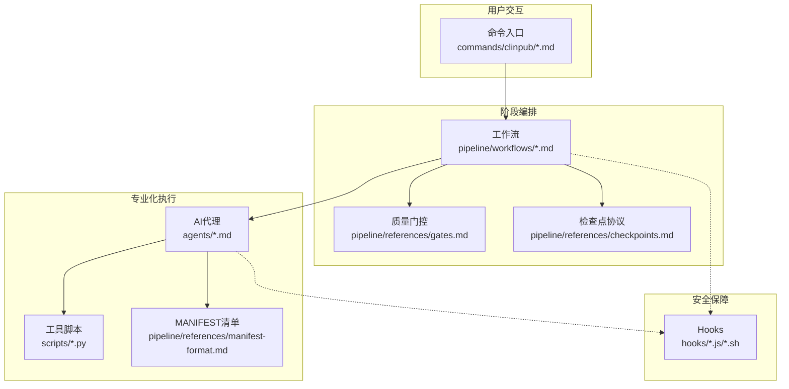
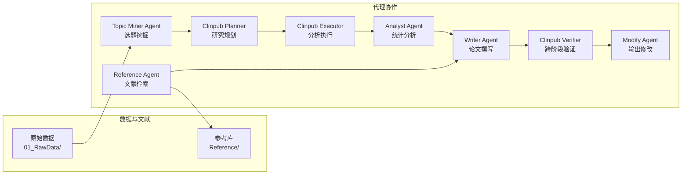
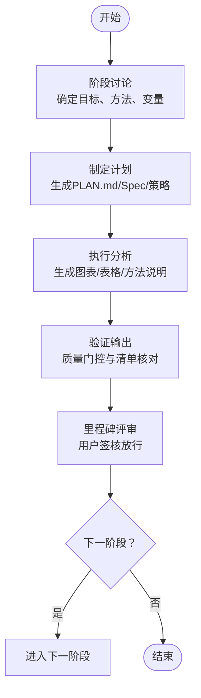
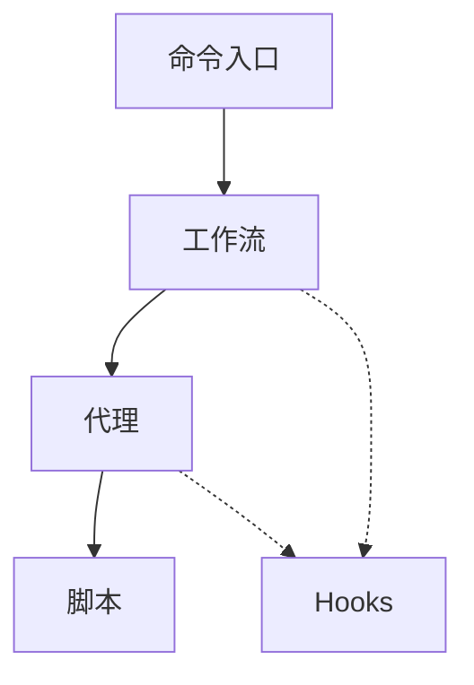

# 项目概述

<cite>
**本文档引用的文件**
- [README.md](file://README.md)
- [ARCHITECTURE.md](file://docs/ARCHITECTURE.md)
- [CLAUDE.md](file://CLAUDE.md)
- [AGENTS.md](file://AGENTS.md)
- [package.json](file://package.json)
- [commands/clinpub/clinpub.md](file://commands/clinpub/clinpub.md)
- [pipeline/workflows/init-project.md](file://pipeline/workflows/init-project.md)
- [pipeline/workflows/data-prep.md](file://pipeline/workflows/data-prep.md)
- [pipeline/workflows/analysis.md](file://pipeline/workflows/analysis.md)
- [pipeline/workflows/writing.md](file://pipeline/workflows/writing.md)
- [agents/analyst-agent.md](file://agents/analyst-agent.md)
- [agents/reference-agent.md](file://agents/reference-agent.md)
- [agents/writer-agent.md](file://agents/writer-agent.md)
- [agents/topic-miner-agent.md](file://agents/topic-miner-agent.md)
- [agents/clinpub-planner.md](file://agents/clinpub-planner.md)
</cite>

## 目录
1. [引言](#引言)
2. [项目结构](#项目结构)
3. [核心组件](#核心组件)
4. [架构总览](#架构总览)
5. [详细组件分析](#详细组件分析)
6. [依赖关系分析](#依赖关系分析)
7. [性能考虑](#性能考虑)
8. [故障排除指南](#故障排除指南)
9. [结论](#结论)
10. [附录](#附录)

## 引言
clinpub 是面向SCI Q1/Q2期刊发表的端到端临床数据分析与发表加速器。项目以“资深医学统计学家 + 学术写作顾问”的双重角色定位，处理已整理的患者级数据（每行一个患者，每列一个变量），输出统计结果、出版级图表和可投稿论文。目标是帮助研究团队系统化地完成从数据准备到论文发表的全流程，确保质量门控与出版级标准。

- 核心价值主张
  - 体系化：五阶段工作流（init → data-prep → analysis → writing → review），每个阶段四步法（DISCUSS → PLAN → EXECUTE → VERIFY），阶段间通过里程碑评审（Milestone）强制质量把关。
  - 自动化：结合Claude Code平台，通过命令入口、工作流编排与AI代理协作，实现从数据准备到论文撰写的自动化与半自动化流程。
  - 可靠性：严格的Hook机制（工作流保护、阶段边界、提示注入防护）保障流程安全；MANIFEST清单与独立可复现实验确保产物可追踪。
  - 发表导向：支持多种研究类型（RCT、队列、病例对照、横断面、描述性），遵循STROBE/CONSORT等报告规范，提供出版级图表标准与引用策略。

- 设计理念
  - 三层架构：Commands（用户命令）→ Workflows（阶段编排）→ Agents（专业化AI代理），每层职责清晰、边界明确。
  - 代理协作：7个专业化AI代理各司其职，通过标准化输入输出与共享资源（模板、参考库、模式）协同工作。
  - 质量门控：四道门控贯穿阶段间，确保伦理合规、数据质量、分析有效性和投稿准备质量。

- 目标用户
  - 临床研究人员：需要系统化完成数据分析与论文写作的团队。
  - 统计师与数据科学家：负责数据清洗、统计建模与图表生成。
  - 学术写作者：负责IMRAD结构撰写、文献整合与审稿模拟。
  - 项目管理者：负责里程碑评审、质量把关与流程推进。

**章节来源**
- [README.md:1-172](file://README.md#L1-L172)
- [CLAUDE.md:1-91](file://CLAUDE.md#L1-L91)

## 项目结构
项目采用模块化组织，围绕“三层架构 + 五阶段工作流 + 专业化代理”展开，配合Hooks与参考库确保流程安全与质量。

```mermaid
graph TB
subgraph "用户层"
U["用户"]
end
subgraph "命令层"
CMD["commands/clinpub/*.md<br/>薄入口用户可见"]
end
subgraph "工作流层"
WF_INIT["pipeline/workflows/init-project.md"]
WF_DP["pipeline/workflows/data-prep.md"]
WF_ANA["pipeline/workflows/analysis.md"]
WF_WR["pipeline/workflows/writing.md"]
WF_REV["pipeline/workflows/review.md"]
WF_MILE["pipeline/workflows/milestone.md"]
WF_DATA2IDEA["pipeline/workflows/data2idea.md"]
WF_MODIFY["pipeline/workflows/modify.md"]
end
subgraph "代理层"
AG_TMA["topic-miner-agent.md"]
AG_A["analyst-agent.md"]
AG_RA["reference-agent.md"]
AG_WA["writer-agent.md"]
AG_CP["clinpub-planner.md"]
AG_CE["clinpub-executor.md"]
AG_CV["clinpub-verifier.md"]
AG_MA["modify-agent.md"]
end
subgraph "管道配置"
REF["pipeline/references/*"]
TMP["pipeline/templates/*"]
CTX["pipeline/contexts/*"]
end
subgraph "工具脚本"
SCR["scripts/*.py"]
end
subgraph "Hooks"
HK1["hooks/clinpub-workflow-guard.js"]
HK2["hooks/clinpub-phase-boundary.sh"]
HK3["hooks/clinpub-prompt-guard.js"]
end
U --> CMD
CMD --> WF_INIT
CMD --> WF_DP
CMD --> WF_ANA
CMD --> WF_WR
CMD --> WF_REV
CMD --> WF_MILE
CMD --> WF_DATA2IDEA
CMD --> WF_MODIFY
WF_INIT --> AG_CP
WF_DP --> AG_A
WF_ANA --> AG_A
WF_WR --> AG_RA
WF_WR --> AG_WA
WF_REV --> AG_WA
AG_A --> SCR
AG_RA --> SCR
AG_WA --> SCR
WF_INIT --> REF
WF_DP --> REF
WF_ANA --> REF
WF_WR --> REF
WF_REV --> REF
WF_INIT --> TMP
WF_DP --> TMP
WF_ANA --> TMP
WF_WR --> TMP
WF_REV --> TMP
WF_INIT --> CTX
WF_DP --> CTX
WF_ANA --> CTX
WF_WR --> CTX
WF_REV --> CTX
WF_INIT -.-> HK1
WF_DP -.-> HK1
WF_ANA -.-> HK1
WF_WR -.-> HK1
WF_REV -.-> HK1
WF_MILE -.-> HK2
WF_INIT -.-> HK3
WF_DP -.-> HK3
WF_ANA -.-> HK3
WF_WR -.-> HK3
WF_REV -.-> HK3
```

**图表来源**
- [ARCHITECTURE.md:1-160](file://docs/ARCHITECTURE.md#L1-L160)
- [CLAUDE.md:25-71](file://CLAUDE.md#L25-L71)

**章节来源**
- [ARCHITECTURE.md:7-43](file://docs/ARCHITECTURE.md#L7-L43)
- [CLAUDE.md:25-71](file://CLAUDE.md#L25-L71)

## 核心组件
- 命令入口（Commands）
  - 通过Slash命令触发，每个命令对应一个阶段或辅助功能，强调“阶段独立、逐阶段推进”。主入口提供命令参考与使用流程说明。
  - 关键命令：`/clinpub`（命令参考）、`/clinpub-init-project`（项目初始化）、`/clinpub-data-prep`（数据准备）、`/clinpub-analysis`（统计分析）、`/clinpub-writing`（论文撰写）、`/clinpub-review`（审稿修稿）、`/clinpub-milestone`（里程碑评审）、`/clinpub-data2idea`（选题挖掘）。

- 工作流（Workflows）
  - 每个阶段的工作流定义了执行顺序、依赖关系与质量门控。包含阶段边界检查、里程碑评审与阶段性验证。
  - 关键工作流：init-project、data-prep、analysis、writing、review、milestone、data2idea、modify。

- 代理（Agents）
  - 七个专业化AI代理分别承担数据清洗、统计分析、文献检索、论文撰写、研究规划、分析执行与验证等职责。每个代理具备独立上下文与标准化输出。
  - 关键代理：analyst-agent、reference-agent、writer-agent、topic-miner-agent、clinpub-planner、clinpub-executor、clinpub-verifier、modify-agent。

- 参考与模板（References/Templates/Contexts）
  - 提供方法规范、可视化模式、引用策略、质量门控、检查点协议、验证模式、研究类型模板等，确保分析与写作的标准化与可复现。

- Hooks
  - 三个Claude Code Hooks用于工作流保护、阶段边界检查与提示注入防护，保障流程安全与数据安全。

**章节来源**
- [commands/clinpub/clinpub.md:1-61](file://commands/clinpub/clinpub.md#L1-L61)
- [AGENTS.md:58-84](file://AGENTS.md#L58-L84)
- [ARCHITECTURE.md:47-87](file://docs/ARCHITECTURE.md#L47-L87)

## 架构总览
三层架构设计清晰分离用户交互、阶段编排与专业化执行，配合Hooks与参考库形成闭环的质量保障体系。

**图表来源**
- [ARCHITECTURE.md:45-160](file://docs/ARCHITECTURE.md#L45-L160)
- [AGENTS.md:24-56](file://AGENTS.md#L24-L56)

**章节来源**
- [ARCHITECTURE.md:45-160](file://docs/ARCHITECTURE.md#L45-L160)
- [AGENTS.md:24-56](file://AGENTS.md#L24-L56)

## 详细组件分析

### 代理协作机制
七个专业化AI代理围绕“数据驱动 + 文献支撑 + 写作规范”的主线协作，形成从数据准备到论文发表的闭环。

- Topic Miner Agent：从数据中生成变量画像、预测研究类型、扫描文献缺口，输出候选选题与项目配置草稿。
- Analyst Agent：执行数据清洗与统计分析，生成出版级图表与方法说明，遵循R/Python实现模式与主题规范。
- Reference Agent：统一使用外部技能进行PubMed检索，构建引用库与文献摘要，支持方法搜索与阶段前调研。
- Writer Agent：基于研究类型模板与分析输出撰写IMRAD论文，执行反AI模板（Humanizer）规则，支持审稿模拟与修订。
- Clinpub Planner/Executor/Verifier：规划阶段任务、原子化执行分析并生成清单、跨阶段验证确保质量。
- Modify Agent：在分析输出基础上进行图表样式、方法描述或变量选择的微调。

**图表来源**
- [agents/topic-miner-agent.md:19-183](file://agents/topic-miner-agent.md#L19-L183)
- [agents/analyst-agent.md:17-141](file://agents/analyst-agent.md#L17-L141)
- [agents/reference-agent.md:14-321](file://agents/reference-agent.md#L14-L321)
- [agents/writer-agent.md:15-166](file://agents/writer-agent.md#L15-L166)
- [agents/clinpub-planner.md:22-131](file://agents/clinpub-planner.md#L22-L131)

**章节来源**
- [agents/topic-miner-agent.md:19-183](file://agents/topic-miner-agent.md#L19-L183)
- [agents/analyst-agent.md:17-141](file://agents/analyst-agent.md#L17-L141)
- [agents/reference-agent.md:14-321](file://agents/reference-agent.md#L14-L321)
- [agents/writer-agent.md:15-166](file://agents/writer-agent.md#L15-L166)
- [agents/clinpub-planner.md:22-131](file://agents/clinpub-planner.md#L22-L131)

### 五阶段工作流程生命周期
每个阶段四步：DISCUSS → PLAN → EXECUTE → VERIFY；阶段间通过Milestone评审与质量门控强制把关。

- 阶段0（init）：研究框架讨论、目录结构与配置生成，形成项目蓝图。
- 阶段1（data-prep）：数据清洗、缺失处理、异常值处理、衍生变量与质量报告，形成cleaned.csv。
- 阶段2（analysis）：基于数据诊断提出动态分析方案，按波次（wave）执行，生成出版级图表与方法说明。
- 阶段3（writing）：IMRAD分段撰写，文献预搜索与交叉引用，终稿拼接与引用统一编号。
- 阶段4（review）：模拟审稿、修订与回复信，形成最终稿件。

**图表来源**
- [pipeline/workflows/init-project.md:18-124](file://pipeline/workflows/init-project.md#L18-L124)
- [pipeline/workflows/data-prep.md:17-184](file://pipeline/workflows/data-prep.md#L17-L184)
- [pipeline/workflows/analysis.md:17-289](file://pipeline/workflows/analysis.md#L17-L289)
- [pipeline/workflows/writing.md:23-330](file://pipeline/workflows/writing.md#L23-L330)

**章节来源**
- [pipeline/workflows/init-project.md:18-124](file://pipeline/workflows/init-project.md#L18-L124)
- [pipeline/workflows/data-prep.md:17-184](file://pipeline/workflows/data-prep.md#L17-L184)
- [pipeline/workflows/analysis.md:17-289](file://pipeline/workflows/analysis.md#L17-L289)
- [pipeline/workflows/writing.md:23-330](file://pipeline/workflows/writing.md#L23-L330)

### 质量门控体系
四道质量门控确保阶段间质量与合规性：

- IRB/Ethics Gate（阶段0→1）：伦理审批、数据去标识化、知情同意。
- Data Quality Gate（阶段1→2）：cleaned.csv完整性、缺失率受控、样本量充足。
- Analysis Validity Gate（阶段2→3）：方法已执行、效应量报告、假设检验完整。
- Submission Gate（阶段4→投稿）：IMRAD完整、图表≥300 DPI、引用全有DOI。

**图表来源**
- [README.md:112-122](file://README.md#L112-L122)
- [ARCHITECTURE.md:106-129](file://docs/ARCHITECTURE.md#L106-L129)

**章节来源**
- [README.md:112-122](file://README.md#L112-L122)
- [ARCHITECTURE.md:106-129](file://docs/ARCHITECTURE.md#L106-L129)

### 技术栈概览
- 运行时：Claude Code（Node.js ≥ 22.0.0）
- 统计分析：R（≥4.2），Python（≥3.9）
- 包管理：npm
- 依赖技能：ncbi-search（PubMed检索）、pdf-reader（PDF全文读取）、tavily（补充检索）
- 环境变量：NCBI_API_KEY（可选，提升PubMed速率）

**章节来源**
- [CLAUDE.md:85-91](file://CLAUDE.md#L85-L91)
- [package.json:15-17](file://package.json#L15-L17)

### 支持的研究类型
- 随机对照试验（RCT）— CONSORT
- 队列研究（Cohort）— STROBE
- 病例对照研究（Case-Control）— STROBE
- 横断面研究（Cross-Sectional）— STROBE
- 描述性研究（Descriptive）— STROBE

**章节来源**
- [README.md:123-130](file://README.md#L123-L130)

### 出版级标准
- 图表分辨率：≥300 DPI
- 格式：PNG / PDF / TIFF（LZW压缩）
- 字体：Arial ≥8pt
- 配色：Nature双色（#0072B5 / #BC3C29，色盲友好）
- 尺寸：单栏89mm，双栏183mm（Nature系列）
- 主题：统一theme_pub()风格

**章节来源**
- [README.md:158-167](file://README.md#L158-L167)

## 依赖关系分析
- 命令到工作流：命令入口负责路由到具体工作流，工作流定义阶段逻辑与质量门控。
- 工作流到代理：工作流根据阶段需求调度相应代理，代理通过标准化输出与清单参与协作。
- 代理到脚本：代理调用Python/R工具脚本完成数据处理与可视化。
- Hooks到工作流：Hooks在写入、边界与读取阶段进行安全校验，防止越阶写文件与提示注入。

**图表来源**
- [AGENTS.md:24-56](file://AGENTS.md#L24-L56)
- [ARCHITECTURE.md:130-139](file://docs/ARCHITECTURE.md#L130-L139)

**章节来源**
- [AGENTS.md:24-56](file://AGENTS.md#L24-L56)
- [ARCHITECTURE.md:130-139](file://docs/ARCHITECTURE.md#L130-L139)

## 性能考虑
- 代理隔离与独立性：每个代理独立上下文，避免全局状态与隐式依赖，提升可维护性与可复现性。
- 波次执行与并行优化：分析阶段按波次执行，波内任务拆分为输入准备、核心分析与文档生成，便于并行与增量验证。
- 脚本自包含：R/Python脚本本地变量、无跨文件隐式依赖，减少耦合与错误传播。
- Hooks保护：工作流保护与阶段边界检查降低无效写入与错误执行，提高整体稳定性。

**章节来源**
- [AGENTS.md:26-44](file://AGENTS.md#L26-L44)
- [pipeline/workflows/analysis.md:187-222](file://pipeline/workflows/analysis.md#L187-L222)

## 故障排除指南
- Hooks相关问题
  - 工作流保护阻止越阶写文件：检查STATE.md中的当前阶段与目录权限，确保按阶段顺序执行。
  - 阶段边界检查失败：确认前置里程碑评审通过，更新ROADMAP与STATE状态。
  - 提示注入防护：读取阶段扫描数据文件中的潜在注入风险，必要时清理或重命名文件。

- 代理协作问题
  - MANIFEST清单缺失：确保每个代理输出目录包含MANIFEST.yaml，并声明下游消费者（如writer-agent）。
  - 代理上下文不一致：确认代理读取的是cleaned.csv而非中间文件，避免跨阶段隐式依赖。
  - 文献检索失败：确认ncbi-search技能已安装并可用，必要时设置NCBI_API_KEY。

- 质量门控失败
  - 数据质量门控：检查cleaned.csv完整性、缺失率与样本量阈值，必要时回退到data-prep阶段。
  - 分析有效性门控：确保所有方法已执行、效应量与p值完整、代码可独立复现。
  - 投稿门控：检查IMRAD结构、图表分辨率与引用DOI，确保引用库统一编号。

**章节来源**
- [AGENTS.md:37-56](file://AGENTS.md#L37-L56)
- [ARCHITECTURE.md:130-139](file://docs/ARCHITECTURE.md#L130-L139)
- [pipeline/workflows/data-prep.md:132-145](file://pipeline/workflows/data-prep.md#L132-L145)
- [pipeline/workflows/analysis.md:224-235](file://pipeline/workflows/analysis.md#L224-L235)
- [pipeline/workflows/writing.md:180-196](file://pipeline/workflows/writing.md#L180-L196)

## 结论
clinpub通过“三层架构 + 五阶段工作流 + 专业化代理”的组合，为临床研究提供了从数据准备到论文发表的系统化自动化解决方案。其严格的质量门控、Hooks安全保障与出版级标准，确保研究过程可追溯、可复现且符合SCI期刊要求。对于初学者，项目提供了清晰的阶段流程与模板；对于有经验的开发者，项目展示了可扩展的代理协作与工作流编排模式。

## 附录
- 快速开始
  - 安装与启动：使用npx一键安装并启动主命令入口。
  - 阶段化执行：每个阶段必须独立调用，阶段间需用户审阅与里程碑签核。
- 命令参考
  - 主命令：/clinpub（命令参考）
  - 选题挖掘：/clinpub-data2idea
  - 项目初始化：/clinpub-init-project
  - 数据准备：/clinpub-data-prep
  - 统计分析：/clinpub-analysis
  - 论文撰写：/clinpub-writing
  - 审稿修稿：/clinpub-review
  - 里程碑评审：/clinpub-milestone

**章节来源**
- [README.md:11-111](file://README.md#L11-L111)
- [commands/clinpub/clinpub.md:20-60](file://commands/clinpub/clinpub.md#L20-L60)